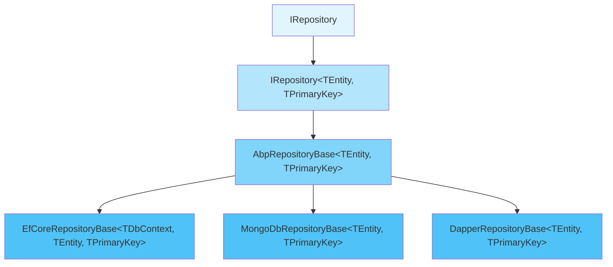
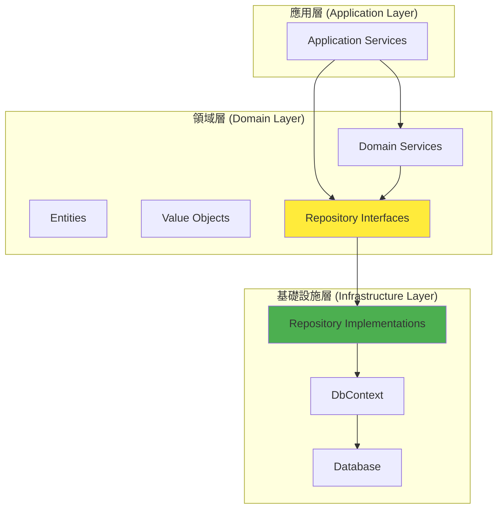
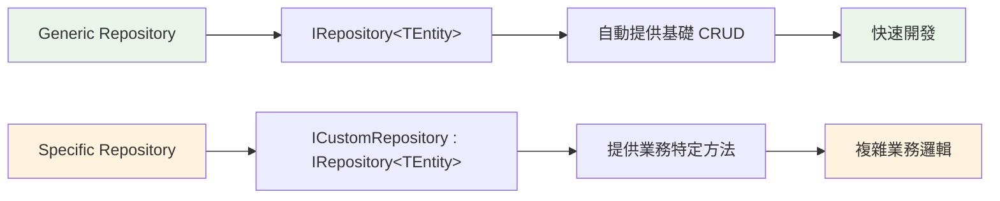
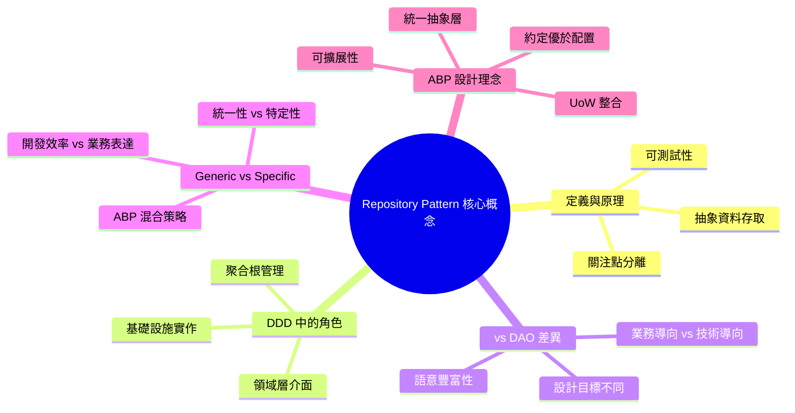

# 第一章：Repository Pattern 理論基礎

## 1.1 Repository Pattern 的定義與核心概念

Repository Pattern 是一種設計模式，Martin Fowler 在其著作中將其定義為「*使用類似集合的介面來存取領域物件，在領域層和資料映射層之間進行中介*」。這個模式的核心思想是將資料存取邏輯從業務邏輯中分離出來，提供一個更清潔、更易於測試的架構。

### 1.1.1 Repository Pattern 的基本原理

Repository Pattern 扮演著資料存取層的抽象角色，它隱藏了底層資料存儲的實作細節，讓上層的業務邏輯能夠以一種統一且直觀的方式操作資料。這種抽象的好處在於：

- **關注點分離**：業務邏輯不需要知道資料是如何存儲和檢索的
- **可測試性**：可以輕易地為 Repository 建立 Mock 物件進行單元測試
- **技術無關性**：可以在不影響業務邏輯的情況下更換底層的資料存取技術

### 1.1.2 ASP.NET Boilerplate 中的 Repository Pattern 實作

在 ASP.NET Boilerplate 框架中，Repository Pattern 的核心是透過一系列介面和抽象類別來實現的。讓我們從最基本的介面開始了解：

```csharp
/// <summary>
/// This interface must be implemented by all repositories to identify them by convention.
/// Implement generic version instead of this one.
/// </summary>
public interface IRepository : ITransientDependency
{
    
}
```

這個基礎介面 `IRepository` 繼承自 `ITransientDependency`，這表明所有的 Repository 實例在依賴注入容器中都是 Transient 生命週期，每次請求都會建立新的實例。

更重要的是泛型版本的介面：

```csharp
/// <summary>
/// This interface is implemented by all repositories to ensure implementation of fixed methods.
/// </summary>
/// <typeparam name="TEntity">Main Entity type this repository works on</typeparam>
/// <typeparam name="TPrimaryKey">Primary key type of the entity</typeparam>
public interface IRepository<TEntity, TPrimaryKey> : IRepository 
    where TEntity : class, IEntity<TPrimaryKey>
{
    // 查詢方法
    IQueryable<TEntity> GetAll();
    IQueryable<TEntity> GetAllReadonly();
    
    // 基礎 CRUD 操作
    TEntity Get(TPrimaryKey id);
    TEntity Insert(TEntity entity);
    TEntity Update(TEntity entity);
    void Delete(TEntity entity);
    
    // 統計方法
    int Count();
    // ... 更多方法
}
```

### 1.1.3 核心設計原則的體現

ABP 的 Repository 設計體現了幾個重要的設計原則：

**1. 單一職責原則 (SRP)**
每個 Repository 只負責一個實體類型的資料存取操作，職責明確且專一。

**2. 開放封閉原則 (OCP)**
透過抽象基類 `AbpRepositoryBase<TEntity, TPrimaryKey>` 提供預設實作，同時允許具體實作類別擴展自定義方法。

**3. 里氏替換原則 (LSP)**
所有的 Repository 實作都可以透過其介面進行替換，不會破壞程式的正確性。



## 1.2 領域驅動設計中的 Repository 角色

在領域驅動設計（Domain-Driven Design, DDD）的架構中，Repository 扮演著至關重要的角色。它位於領域層（Domain Layer）與基礎設施層（Infrastructure Layer）之間，為領域物件提供持久化服務。

### 1.2.1 Repository 在 DDD 分層架構中的位置



在這個架構中：
- **Repository 介面**定義在領域層，表達業務需求
- **Repository 實作**位於基礎設施層，處理技術細節
- **應用層**透過 Repository 介面操作領域物件

### 1.2.2 Repository 與聚合根的關係

在 DDD 中，Repository 通常為聚合根（Aggregate Root）提供服務。ASP.NET Boilerplate 支援這種設計模式：

```csharp
public interface IAggregateRoot : IAggregateRoot<int>, IEntity
{

}

public interface IAggregateRoot<TPrimaryKey> : IEntity<TPrimaryKey>, IGeneratesDomainEvents
{

}

public interface IGeneratesDomainEvents
{
    ICollection<IEventData> DomainEvents { get; }
}
```

聚合根的基礎實作：

```csharp
public class AggregateRoot<TPrimaryKey> : Entity<TPrimaryKey>, IAggregateRoot<TPrimaryKey>
{
    [NotMapped]
    public virtual ICollection<IEventData> DomainEvents { get; }

    public AggregateRoot()
    {
        DomainEvents = new Collection<IEventData>();
    }
}
```

### 1.2.3 Repository 在管理聚合邊界中的作用

Repository 的一個重要職責是維護聚合的完整性和一致性。在 ABP 的設計中，每個聚合根都應該有其對應的 Repository：

```csharp
// 領域層定義介面
public interface IOrderRepository : IRepository<Order, Guid>
{
    Task<Order> GetOrderWithItemsAsync(Guid orderId);
    Task<List<Order>> GetOrdersByCustomerAsync(Guid customerId);
}

// 基礎設施層實作
public class OrderRepository : EfCoreRepositoryBase<YourDbContext, Order, Guid>, IOrderRepository
{
    public OrderRepository(IDbContextProvider<YourDbContext> dbContextProvider) 
        : base(dbContextProvider)
    {
    }

    public async Task<Order> GetOrderWithItemsAsync(Guid orderId)
    {
        return await GetAll()
            .Include(o => o.OrderItems)
            .FirstOrDefaultAsync(o => o.Id == orderId);
    }

    public async Task<List<Order>> GetOrdersByCustomerAsync(Guid customerId)
    {
        return await GetAll()
            .Where(o => o.CustomerId == customerId)
            .ToListAsync();
    }
}
```

## 1.3 Repository vs Data Access Object (DAO) 的差異

理解 Repository Pattern 與 Data Access Object (DAO) Pattern 的差異對於正確使用 Repository 至關重要。

### 1.3.1 概念層次的差異

| 特性 | Repository Pattern | DAO Pattern |
|------|-------------------|-------------|
| **抽象層次** | 領域概念，模擬記憶體中的集合 | 資料存取概念，專注於 CRUD 操作 |
| **設計目標** | 封裝複雜的查詢邏輯，支援領域模型 | 提供資料存取的統一介面 |
| **方法命名** | 業務導向（如 `FindActiveOrders`） | 技術導向（如 `SelectById`） |
| **領域知識** | 包含業務邏輯和規則 | 純粹的資料存取操作 |

### 1.3.2 在 ABP 中的體現

ABP 的 Repository 設計更傾向於 Repository Pattern 而非 DAO Pattern：

```csharp
// Repository 風格 - 業務導向
public interface IUserRepository : IRepository<User, long>
{
    Task<User> FindByEmailAsync(string email);
    Task<List<User>> GetActiveUsersAsync();
    Task<bool> IsEmailUniqueAsync(string email, long? excludeUserId = null);
}

// DAO 風格 - 技術導向（ABP 不推薦）
public interface IUserDao
{
    Task<User> SelectByEmailAsync(string email);
    Task<List<User>> SelectAllWhereActiveAsync();
    Task<int> CountByEmailAsync(string email);
}
```

### 1.3.3 Repository 的業務語意

ABP 的 Repository 實作體現了豐富的業務語意：

```csharp
public abstract class AbpRepositoryBase<TEntity, TPrimaryKey> : IRepository<TEntity, TPrimaryKey>
    where TEntity : class, IEntity<TPrimaryKey>
{
    // 業務導向的方法命名
    public virtual TEntity Get(TPrimaryKey id)
    {
        var entity = FirstOrDefault(id);
        if (entity == null)
        {
            throw new EntityNotFoundException(typeof(TEntity), id);
        }
        return entity;
    }

    public virtual TEntity Load(TPrimaryKey id)
    {
        return Get(id); // Load 暗示必須存在
    }

    public virtual TEntity InsertOrUpdate(TEntity entity)
    {
        return entity.IsTransient() ? Insert(entity) : Update(entity);
    }
}
```

## 1.4 Generic Repository vs Specific Repository 的權衡

在設計 Repository 時，一個重要的決策是選擇泛型 Repository 還是特定 Repository。ABP 同時支援這兩種方式，並提供了清晰的指導原則。

### 1.4.1 Generic Repository 的優勢

**1. 程式碼重用性**
```csharp
// 所有實體都可以使用相同的基礎操作
IRepository<User> userRepository;
IRepository<Order> orderRepository;
IRepository<Product> productRepository;

// 統一的 API
var user = await userRepository.GetAsync(userId);
var order = await orderRepository.GetAsync(orderId);
```

**2. 一致性**
所有的 Repository 都提供相同的基礎方法，降低學習成本：

```csharp
public interface IRepository<TEntity, TPrimaryKey> : IRepository 
    where TEntity : class, IEntity<TPrimaryKey>
{
    IQueryable<TEntity> GetAll();
    Task<List<TEntity>> GetAllListAsync();
    TEntity Get(TPrimaryKey id);
    Task<TEntity> GetAsync(TPrimaryKey id);
    TEntity Insert(TEntity entity);
    Task<TEntity> InsertAsync(TEntity entity);
    // ... 標準化的方法集合
}
```

**3. 自動註冊機制**
ABP 提供自動 Repository 註冊，減少手動配置：

```csharp
public class EfGenericRepositoryRegistrar : IEfGenericRepositoryRegistrar
{
    public void RegisterForDbContext(
        Type dbContextType, 
        IIocManager iocManager, 
        AutoRepositoryTypesAttribute defaultAutoRepositoryTypesAttribute)
    {
        var autoRepositoryAttr = dbContextType.GetSingleAttributeOrNull<AutoRepositoryTypesAttribute>() 
                                ?? defaultAutoRepositoryTypesAttribute;

        RegisterForDbContext(
            dbContextType,
            iocManager,
            autoRepositoryAttr.RepositoryInterface,
            autoRepositoryAttr.RepositoryInterfaceWithPrimaryKey,
            autoRepositoryAttr.RepositoryImplementation,
            autoRepositoryAttr.RepositoryImplementationWithPrimaryKey
        );
    }
}
```

### 1.4.2 Specific Repository 的優勢

**1. 業務特定操作**
```csharp
public interface IOrderRepository : IRepository<Order, Guid>
{
    Task<List<Order>> GetOrdersWithPendingPaymentAsync();
    Task<Order> GetOrderWithFullDetailsAsync(Guid orderId);
    Task<decimal> GetTotalRevenueAsync(DateTime startDate, DateTime endDate);
    Task<List<Order>> GetOrdersRequiringShippingAsync();
}
```

**2. 複雜查詢封裝**
```csharp
public class OrderRepository : EfCoreRepositoryBase<DemoDbContext, Order, Guid>, IOrderRepository
{
    public async Task<List<Order>> GetOrdersWithPendingPaymentAsync()
    {
        return await GetAll()
            .Include(o => o.Customer)
            .Include(o => o.OrderItems)
                .ThenInclude(oi => oi.Product)
            .Where(o => o.PaymentStatus == PaymentStatus.Pending)
            .Where(o => o.CreationTime > DateTime.Now.AddDays(-30))
            .OrderByDescending(o => o.CreationTime)
            .ToListAsync();
    }
}
```

**3. 性能優化**
特定 Repository 可以針對業務場景進行性能優化：

```csharp
public async Task<PagedResultDto<Order>> GetPagedOrdersAsync(GetOrdersInput input)
{
    var query = GetAll()
        .WhereIf(!string.IsNullOrEmpty(input.CustomerName), 
                 o => o.Customer.Name.Contains(input.CustomerName))
        .WhereIf(input.StartDate.HasValue, 
                 o => o.CreationTime >= input.StartDate.Value)
        .WhereIf(input.EndDate.HasValue, 
                 o => o.CreationTime <= input.EndDate.Value);

    var totalCount = await query.CountAsync();
    
    var orders = await query
        .OrderBy(input.Sorting ?? "CreationTime DESC")
        .PageBy(input)
        .ToListAsync();

    return new PagedResultDto<Order>(totalCount, orders);
}
```

### 1.4.3 ABP 的混合策略

ABP 採用了一種平衡的方法，同時支援兩種模式：



**建議的使用策略：**

1. **預設使用 Generic Repository** - 適用於簡單的 CRUD 操作
2. **需要時擴展為 Specific Repository** - 當出現複雜業務邏輯時
3. **繼承而非替換** - Specific Repository 繼承 Generic Repository

## 1.5 ABP 框架中 Repository Pattern 的設計理念

### 1.5.1 統一的抽象層

ABP 的 Repository 設計理念是提供一個統一的抽象層，隱藏底層 ORM 的差異：

```csharp
// 相同的介面，不同的實作
IRepository<User> efRepository;     // Entity Framework Core
IRepository<User> mongoRepository;  // MongoDB
IRepository<User> dapperRepository; // Dapper
IRepository<User> memoryRepository; // In-Memory
```

### 1.5.2 約定優於配置

ABP 遵循「約定優於配置」的原則，提供合理的預設行為：

```csharp
// 自動多租戶支援
static AbpRepositoryBase()
{
    var attr = typeof(TEntity).GetSingleAttributeOfTypeOrBaseTypesOrNull<MultiTenancySideAttribute>();
    if (attr != null)
    {
        MultiTenancySide = attr.Side;
    }
}

// 自動軟刪除支援
public virtual IQueryable<TEntity> GetAll()
{
    // ABP 會自動過濾已軟刪除的實體
    return GetQueryable();
}
```

### 1.5.3 可擴展性設計

所有的核心方法都是虛擬的，允許開發者根據需要進行擴展：

```csharp
public abstract class AbpRepositoryBase<TEntity, TPrimaryKey>
{
    public virtual IQueryable<TEntity> GetAll() { ... }
    public virtual TEntity Get(TPrimaryKey id) { ... }
    public virtual TEntity Insert(TEntity entity) { ... }
    public virtual TEntity Update(TEntity entity) { ... }
    public virtual void Delete(TEntity entity) { ... }
}
```

### 1.5.4 整合 Unit of Work

Repository 與 Unit of Work 模式緊密整合，確保資料一致性：

```csharp
public abstract class AbpRepositoryBase<TEntity, TPrimaryKey> : IUnitOfWorkManagerAccessor
{
    public IUnitOfWorkManager UnitOfWorkManager { get; set; }
    
    // Repository 操作會自動參與當前的 Unit of Work
}
```

## 1.6 本章總結

Repository Pattern 在 ASP.NET Boilerplate 框架中不僅僅是一個簡單的資料存取抽象，而是一個完整的領域驅動設計的重要組成部分。透過本章的學習，我們了解到：

### 核心概念
- Repository Pattern 提供了領域層與資料層之間的清潔抽象
- ABP 的 Repository 設計體現了 DDD 的核心原則
- Repository 與聚合根的關係確保了領域完整性

### 設計權衡
- Generic Repository 提供了一致性和開發效率
- Specific Repository 支援複雜的業務邏輯
- ABP 的混合策略提供了最佳的靈活性

### 架構優勢
- 統一的抽象層隱藏了 ORM 差異
- 約定優於配置減少了配置負擔
- 可擴展性設計支援客製化需求

在下一章中，我們將深入探討 ABP 框架中 Repository 的具體架構實作，包括介面設計、自動註冊機制和生命週期管理等技術細節。

---



---

## 📖 章節導覽

### ⬅️ 上一章
**起始章節** - 本章是指南的開始

### ➡️ 下一章
**[第二章：ABP 框架中的 Repository 架構](./02-ABP%20框架中的%20Repository%20架構.md)**
- 深入 ABP Repository 架構設計
- Repository 介面族譜全覽
- 泛型 Repository 自動註冊機制

### 🏠 返回目錄
**[EF Core Repository 權威指南 - 目錄](./README.md)**

### 🎯 相關章節
- **[第六章：自訂 Repository 設計與實作](./06-自訂%20Repository%20設計與實作.md)** - 實際應用 Repository Pattern 理論
- **[第八章：測試策略與最佳實踐](./08-測試策略與最佳實踐.md)** - Repository 可測試性的實踐

### 💡 學習建議
1. **理論基礎**：確實理解 Repository Pattern 的核心概念後再繼續
2. **實務對照**：可搭配第二章的實作分析，理論與實務並重
3. **延伸閱讀**：建議深入了解 Domain-Driven Design 相關概念

---

*完成本章學習後，您將具備紮實的 Repository Pattern 理論基礎，為深入學習 ABP 框架的具體實作做好準備。*
