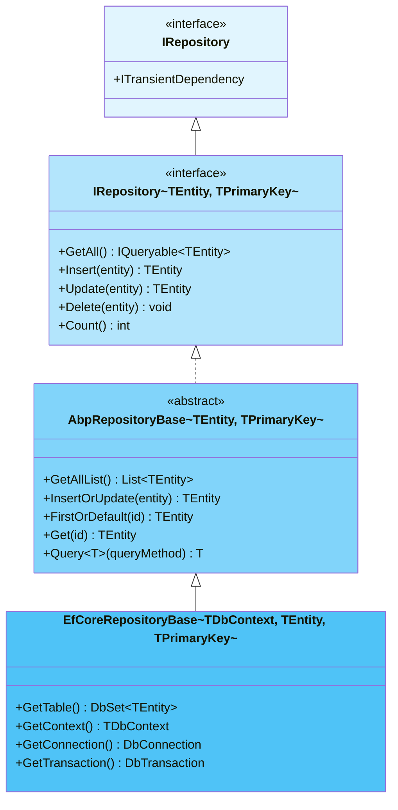
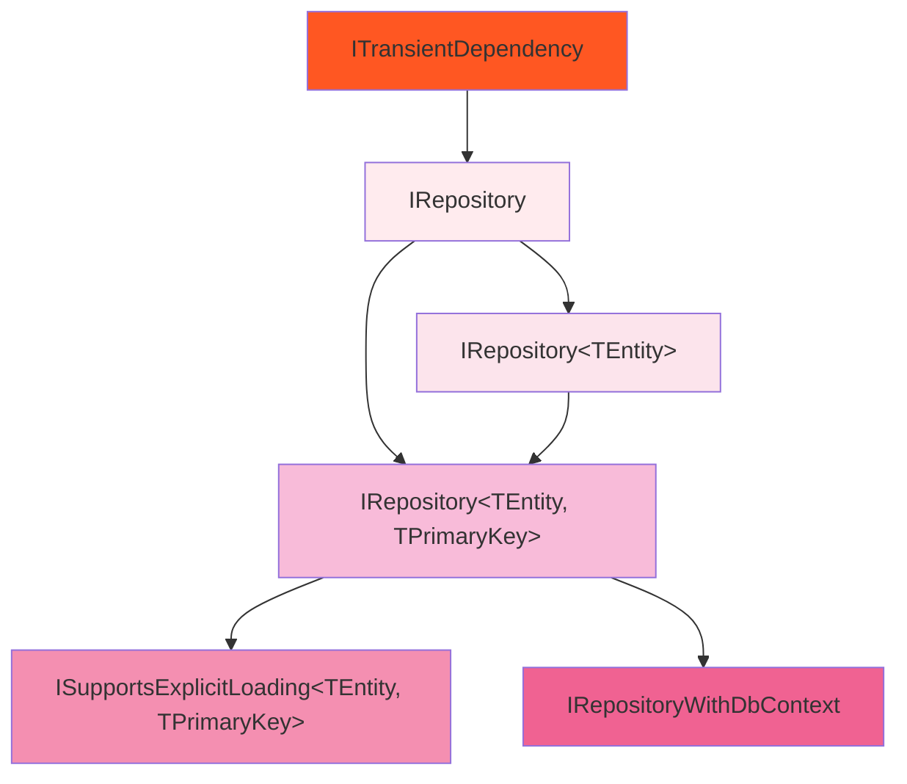
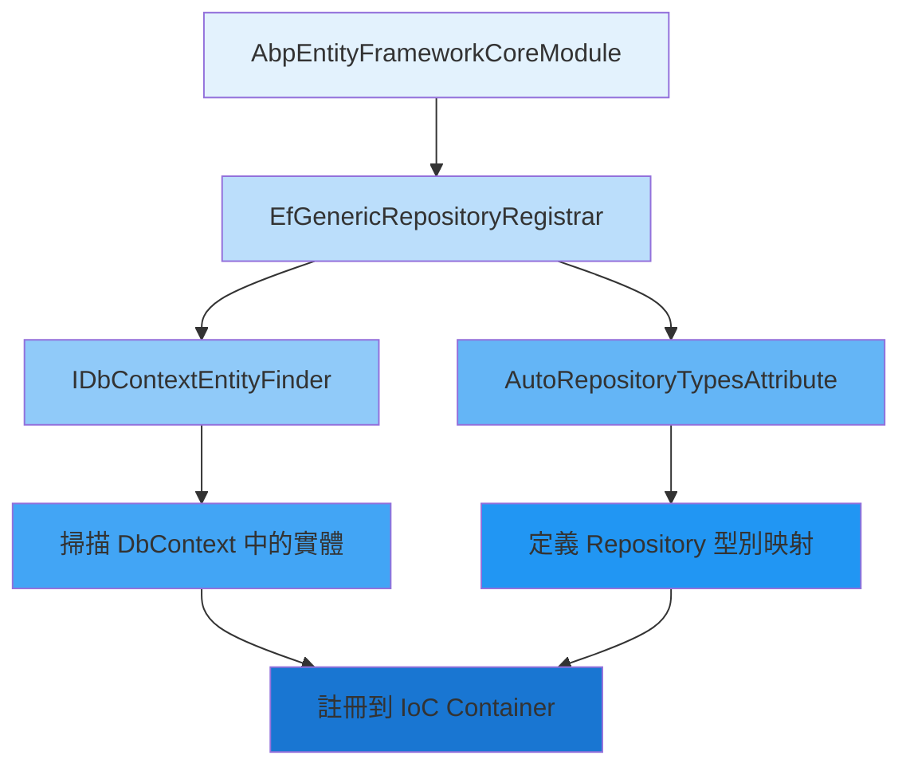
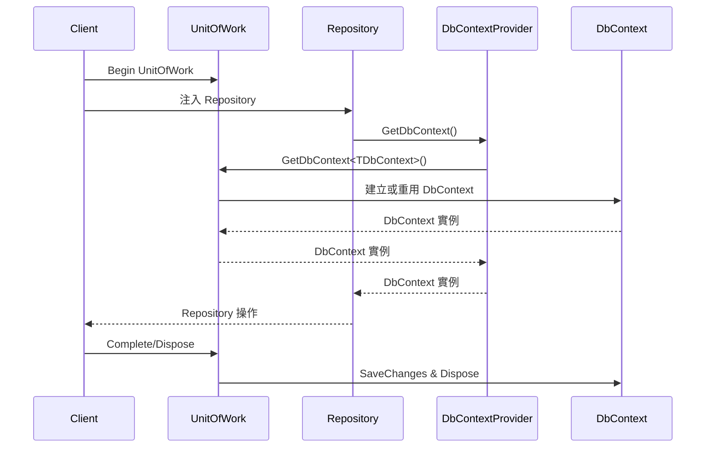
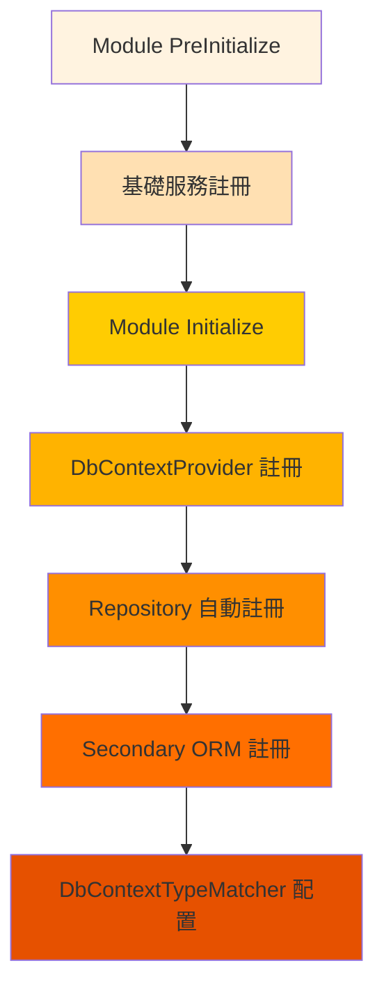
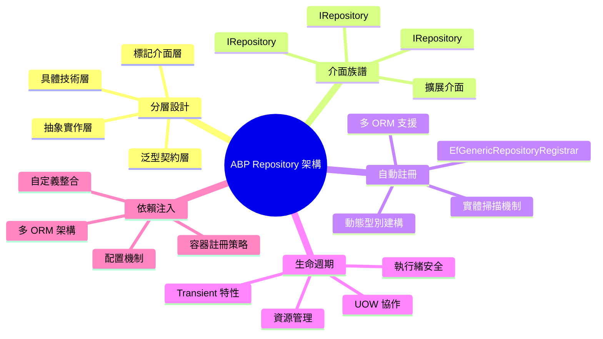

# 第二章：ABP 框架中的 Repository 架構

## 2.1 ABP Repository 的分層架構設計

ASP.NET Boilerplate 框架中的 Repository 架構遵循清晰的分層設計原則，形成了一個完整的抽象層次結構。這種設計不僅確保了各層職責的分離，更提供了極大的靈活性和可擴展性。

### 2.1.1 核心分層結構

ABP Repository 架構由以下主要層次構成：



### 2.1.2 各層職責分析

**1. 基礎標記介面層 (`IRepository`)**
```csharp
/// <summary>
/// This interface must be implemented by all repositories to identify them by convention.
/// Implement generic version instead of this one.
/// </summary>
public interface IRepository : ITransientDependency
{
    
}
```

此介面的設計精妙之處在於：
- **約定標記**：透過繼承 `ITransientDependency` 標記所有 Repository 的生命週期
- **識別機制**：為依賴注入容器提供統一的識別標準
- **擴展基礎**：為框架內部的 Repository 自動註冊機制提供基礎

**2. 泛型契約介面層 (`IRepository<TEntity, TPrimaryKey>`)**

這一層定義了所有 Repository 必須實作的核心操作：

```csharp
/// <summary>
/// This interface is implemented by all repositories to ensure implementation of fixed methods.
/// </summary>
/// <typeparam name="TEntity">Main Entity type this repository works on</typeparam>
/// <typeparam name="TPrimaryKey">Primary key type of the entity</typeparam>
public interface IRepository<TEntity, TPrimaryKey> : IRepository 
    where TEntity : class, IEntity<TPrimaryKey>
{
    #region Select/Get/Query
    IQueryable<TEntity> GetAll();
    IQueryable<TEntity> GetAllReadonly();
    Task<IQueryable<TEntity>> GetAllAsync();
    List<TEntity> GetAllList();
    T Query<T>(Func<IQueryable<TEntity>, T> queryMethod);
    #endregion

    #region Insert
    TEntity Insert(TEntity entity);
    Task<TEntity> InsertAsync(TEntity entity);
    TPrimaryKey InsertAndGetId(TEntity entity);
    TEntity InsertOrUpdate(TEntity entity);
    #endregion

    #region Update/Delete
    TEntity Update(TEntity entity);
    void Delete(TEntity entity);
    void Delete(TPrimaryKey id);
    #endregion

    #region Aggregates
    int Count();
    Task<int> CountAsync();
    long LongCount();
    #endregion
}
```

**3. 抽象實作基礎層 (`AbpRepositoryBase<TEntity, TPrimaryKey>`)**

此層提供了大部分方法的預設實作，體現了 Template Method 設計模式：

```csharp
/// <summary>
/// Base class to implement IRepository{TEntity,TPrimaryKey}.
/// It implements some methods in most simple way.
/// </summary>
public abstract class AbpRepositoryBase<TEntity, TPrimaryKey> : 
    IRepository<TEntity, TPrimaryKey>, IUnitOfWorkManagerAccessor
    where TEntity : class, IEntity<TPrimaryKey>
{
    /// <summary>
    /// The multi tenancy side
    /// </summary>
    public static MultiTenancySides? MultiTenancySide { get; private set; }

    public IUnitOfWorkManager UnitOfWorkManager { get; set; }
    public IIocResolver IocResolver { get; set; }
    public ICancellationTokenProvider CancellationTokenProvider { get; set; }

    static AbpRepositoryBase()
    {
        var attr = typeof(TEntity).GetSingleAttributeOfTypeOrBaseTypesOrNull<MultiTenancySideAttribute>();
        if (attr != null)
        {
            MultiTenancySide = attr.Side;
        }
    }

    // 具體方法實作
    public virtual TEntity Get(TPrimaryKey id)
    {
        var entity = FirstOrDefault(id);
        if (entity == null)
        {
            throw new EntityNotFoundException(typeof(TEntity), id);
        }
        return entity;
    }

    public virtual TEntity InsertOrUpdate(TEntity entity)
    {
        return entity.IsTransient() ? Insert(entity) : Update(entity);
    }

    // 抽象方法 - 留給具體實作
    public abstract IQueryable<TEntity> GetAll();
    public abstract TEntity Insert(TEntity entity);
    public abstract TEntity Update(TEntity entity);
    public abstract void Delete(TEntity entity);
}
```

**4. 具體技術實作層 (`EfCoreRepositoryBase<TDbContext, TEntity, TPrimaryKey>`)**

這一層提供了 Entity Framework Core 的具體實作：

```csharp
/// <summary>
/// Implements IRepository for Entity Framework.
/// </summary>
public class EfCoreRepositoryBase<TDbContext, TEntity, TPrimaryKey> :
    AbpRepositoryBase<TEntity, TPrimaryKey>,
    ISupportsExplicitLoading<TEntity, TPrimaryKey>,
    IRepositoryWithDbContext
    where TEntity : class, IEntity<TPrimaryKey>
    where TDbContext : DbContext
{
    private readonly IDbContextProvider<TDbContext> _dbContextProvider;

    /// <summary>
    /// Gets EF DbContext object.
    /// </summary>
    public virtual TDbContext GetContext()
    {
        return _dbContextProvider.GetDbContext(MultiTenancySide);
    }

    /// <summary>
    /// Gets DbSet for given entity.
    /// </summary>
    public virtual DbSet<TEntity> GetTable()
    {
        return GetContext().Set<TEntity>();
    }

    public override IQueryable<TEntity> GetAll()
    {
        return GetQueryable();
    }

    public override IQueryable<TEntity> GetAllReadonly()
    {
        return GetQueryable().AsNoTracking();
    }

    public override TEntity Insert(TEntity entity)
    {
        return GetTable().Add(entity).Entity;
    }

    public override TEntity Update(TEntity entity)
    {
        AttachIfNot(entity);
        GetContext().Entry(entity).State = EntityState.Modified;
        return entity;
    }

    public override void Delete(TEntity entity)
    {
        AttachIfNot(entity);
        GetTable().Remove(entity);
    }
}
```

### 2.1.3 分層設計的優勢

**1. 職責分離**
- 介面層定義契約
- 抽象層提供通用邏輯
- 具體層處理技術細節

**2. 技術無關性**
- 可以輕易替換不同的 ORM 技術
- 支援多種資料存取策略並存

**3. 擴展性**
- 每一層都可以獨立擴展
- 支援自定義 Repository 實作

## 2.2 IRepository 介面族譜全覽

ABP 框架的 Repository 介面設計展現了完整而靈活的類型系統，涵蓋了各種使用場景和需求。

### 2.2.1 核心介面繼承關係



### 2.2.2 基礎介面設計

**1. 標記介面 (`IRepository`)**
```csharp
/// <summary>
/// This interface must be implemented by all repositories to identify them by convention.
/// Implement generic version instead of this one.
/// </summary>
public interface IRepository : ITransientDependency
{
    
}
```

**2. 簡化泛型介面 (`IRepository<TEntity>`)**
```csharp
/// <summary>
/// A shortcut of IRepository{TEntity,TPrimaryKey} for most used primary key type (int).
/// </summary>
/// <typeparam name="TEntity">Entity type</typeparam>
public interface IRepository<TEntity> : IRepository<TEntity, int> 
    where TEntity : class, IEntity<int>
{

}
```

此介面的設計體現了框架的實用性考量：
- **簡化使用**：大多數實體使用 `int` 作為主鍵
- **向下兼容**：繼承完整的泛型介面
- **約定優於配置**：減少重複的型別指定

**3. 完整泛型介面 (`IRepository<TEntity, TPrimaryKey>`)**

這是 Repository 模式的核心介面，定義了完整的 CRUD 操作和查詢方法。其設計充分考慮了：

- **同步和異步支援**：每個操作都提供對應的異步版本
- **查詢靈活性**：提供 `IQueryable` 和 `List` 兩種返回類型
- **性能考量**：提供唯讀查詢方法避免變更追蹤
- **豐富的查詢方法**：包含 `Get`、`Single`、`FirstOrDefault` 等

### 2.2.3 擴展介面設計

**1. 明確載入支援 (`ISupportsExplicitLoading<TEntity, TPrimaryKey>`)**

```csharp
/// <summary>
/// Interface for repositories those support explicit loading.
/// </summary>
public interface ISupportsExplicitLoading<TEntity, TPrimaryKey>
    where TEntity : class, IEntity<TPrimaryKey>
{
    /// <summary>
    /// Gets a reference to the entity associated with the given primary key
    /// or loads the entity from the database.
    /// </summary>
    TEntity GetFromChangeTrackerOrNull(TPrimaryKey id);

    /// <summary>
    /// Loads a property for given entity.
    /// </summary>
    void EnsureCollectionLoaded<TProperty>(
        TEntity entity,
        Expression<Func<TEntity, IEnumerable<TProperty>>> collectionExpression,
        CancellationToken cancellationToken
    )
        where TProperty : class;

    /// <summary>
    /// Loads a property for given entity.
    /// </summary>
    void EnsurePropertyLoaded<TProperty>(
        TEntity entity,
        Expression<Func<TEntity, TProperty>> propertyExpression,
        CancellationToken cancellationToken
    )
        where TProperty : class;
}
```

**2. DbContext 存取支援 (`IRepositoryWithDbContext`)**

```csharp
/// <summary>
/// This interface is implemented by repositories those uses DbContext.
/// </summary>
public interface IRepositoryWithDbContext
{
    /// <summary>
    /// Gets the DbContext related to this repository.
    /// </summary>
    DbContext GetDbContext();
}
```

### 2.2.4 介面設計模式分析

**1. 介面隔離原則 (ISP)**
- 基礎標記介面只定義必要的依賴標記
- 功能性介面分別定義不同的能力
- 避免強迫實作者依賴不需要的方法

**2. 開放封閉原則 (OCP)**
- 透過介面繼承擴展功能
- 新增功能不影響既有介面
- 支援多重繼承組合不同能力

**3. 依賴反轉原則 (DIP)**
- 高層模組依賴抽象介面
- 具體實作依賴抽象介面
- 透過依賴注入容器管理依賴關係

## 2.3 泛型 Repository 的自動註冊機制

ABP 框架最強大的特性之一是其自動 Repository 註冊機制。這個機制大大簡化了開發者的工作，無需手動註冊每個實體的 Repository，框架會自動掃描並註冊所有需要的 Repository。

### 2.3.1 自動註冊機制核心組件



### 2.3.2 EfGenericRepositoryRegistrar 核心實作

這是自動註冊機制的核心組件，負責掃描 DbContext 並註冊對應的 Repository：

```csharp
public class EfGenericRepositoryRegistrar : IEfGenericRepositoryRegistrar, ITransientDependency
{
    public ILogger Logger { get; set; }
    private readonly IDbContextEntityFinder _dbContextEntityFinder;

    public EfGenericRepositoryRegistrar(IDbContextEntityFinder dbContextEntityFinder)
    {
        _dbContextEntityFinder = dbContextEntityFinder;
        Logger = NullLogger.Instance;
    }

    public void RegisterForDbContext(
        Type dbContextType, 
        IIocManager iocManager, 
        AutoRepositoryTypesAttribute defaultAutoRepositoryTypesAttribute)
    {
        var autoRepositoryAttr = dbContextType.GetTypeInfo()
            .GetSingleAttributeOrNull<AutoRepositoryTypesAttribute>() 
            ?? defaultAutoRepositoryTypesAttribute;

        RegisterForDbContext(
            dbContextType,
            iocManager,
            autoRepositoryAttr.RepositoryInterface,
            autoRepositoryAttr.RepositoryInterfaceWithPrimaryKey,
            autoRepositoryAttr.RepositoryImplementation,
            autoRepositoryAttr.RepositoryImplementationWithPrimaryKey
        );

        if (autoRepositoryAttr.WithDefaultRepositoryInterfaces)
        {
            RegisterForDbContext(
                dbContextType,
                iocManager,
                defaultAutoRepositoryTypesAttribute.RepositoryInterface,
                defaultAutoRepositoryTypesAttribute.RepositoryInterfaceWithPrimaryKey,
                autoRepositoryAttr.RepositoryImplementation,
                autoRepositoryAttr.RepositoryImplementationWithPrimaryKey
            );
        }
    }
}
```

### 2.3.3 實體掃描與註冊邏輯

核心的註冊邏輯展現了框架的智能化設計：

```csharp
private void RegisterForDbContext(
    Type dbContextType, 
    IIocManager iocManager,
    Type repositoryInterface,
    Type repositoryInterfaceWithPrimaryKey,
    Type repositoryImplementation,
    Type repositoryImplementationWithPrimaryKey)
{
    foreach (var entityTypeInfo in _dbContextEntityFinder.GetEntityTypeInfos(dbContextType))
    {
        var primaryKeyType = EntityHelper.GetPrimaryKeyType(entityTypeInfo.EntityType);
        
        // 註冊簡化版本 (針對 int 主鍵)
        if (primaryKeyType == typeof(int))
        {
            var genericRepositoryType = repositoryInterface.MakeGenericType(entityTypeInfo.EntityType);
            if (!iocManager.IsRegistered(genericRepositoryType))
            {
                var implType = repositoryImplementation.GetGenericArguments().Length == 1
                    ? repositoryImplementation.MakeGenericType(entityTypeInfo.EntityType)
                    : repositoryImplementation.MakeGenericType(entityTypeInfo.DeclaringType,
                        entityTypeInfo.EntityType);

                iocManager.IocContainer.Register(
                    Component
                        .For(genericRepositoryType)
                        .ImplementedBy(implType)
                        .Named(Guid.NewGuid().ToString("N"))
                        .LifestyleTransient()
                );
            }
        }

        // 註冊完整版本 (包含主鍵型別)
        var genericRepositoryTypeWithPrimaryKey = repositoryInterfaceWithPrimaryKey
            .MakeGenericType(entityTypeInfo.EntityType, primaryKeyType);
            
        if (!iocManager.IsRegistered(genericRepositoryTypeWithPrimaryKey))
        {
            var implType = repositoryImplementationWithPrimaryKey.GetGenericArguments().Length == 2
                ? repositoryImplementationWithPrimaryKey.MakeGenericType(entityTypeInfo.EntityType, primaryKeyType)
                : repositoryImplementationWithPrimaryKey.MakeGenericType(entityTypeInfo.DeclaringType, 
                    entityTypeInfo.EntityType, primaryKeyType);

            iocManager.IocContainer.Register(
                Component
                    .For(genericRepositoryTypeWithPrimaryKey)
                    .ImplementedBy(implType)
                    .Named(Guid.NewGuid().ToString("N"))
                    .LifestyleTransient()
            );
        }
    }
}
```

### 2.3.4 AutoRepositoryTypesAttribute 配置

這個屬性定義了 Repository 的型別映射關係：

```csharp
/// <summary>
/// Used to define auto-repository types for entities.
/// This can be used for DbContext types.
/// </summary>
[AttributeUsage(AttributeTargets.Class)]
public class AutoRepositoryTypesAttribute : Attribute
{
    public Type RepositoryInterface { get; }
    public Type RepositoryInterfaceWithPrimaryKey { get; }
    public Type RepositoryImplementation { get; }
    public Type RepositoryImplementationWithPrimaryKey { get; }
    public bool WithDefaultRepositoryInterfaces { get; set; }

    public AutoRepositoryTypesAttribute(
        Type repositoryInterface,
        Type repositoryInterfaceWithPrimaryKey,
        Type repositoryImplementation,
        Type repositoryImplementationWithPrimaryKey)
    {
        RepositoryInterface = repositoryInterface;
        RepositoryInterfaceWithPrimaryKey = repositoryInterfaceWithPrimaryKey;
        RepositoryImplementation = repositoryImplementation;
        RepositoryImplementationWithPrimaryKey = repositoryImplementationWithPrimaryKey;
    }
}
```

### 2.3.5 EF Core 的預設配置

ABP 為 EF Core 提供了預設的 Repository 型別配置：

```csharp
public static class EfCoreAutoRepositoryTypes
{
    public static AutoRepositoryTypesAttribute Default { get; }

    static EfCoreAutoRepositoryTypes()
    {
        Default = new AutoRepositoryTypesAttribute(
            typeof(IRepository<>),                    // 簡化介面
            typeof(IRepository<,>),                   // 完整介面
            typeof(EfCoreRepositoryBase<,>),          // 簡化實作
            typeof(EfCoreRepositoryBase<,,>)          // 完整實作
        );
    }
}
```

### 2.3.6 模組初始化中的註冊流程

在 `AbpEntityFrameworkCoreModule` 的初始化過程中，自動註冊機制被啟動：

```csharp
public class AbpEntityFrameworkCoreModule : AbpModule
{
    private readonly ITypeFinder _typeFinder;

    public override void Initialize()
    {
        IocManager.RegisterAssemblyByConvention(typeof(AbpEntityFrameworkCoreModule).GetAssembly());

        IocManager.IocContainer.Register(
            Component.For(typeof(IDbContextProvider<>))
                .ImplementedBy(typeof(UnitOfWorkDbContextProvider<>))
                .LifestyleTransient()
        );

        RegisterGenericRepositoriesAndMatchDbContexes();
    }

    private void RegisterGenericRepositoriesAndMatchDbContexes()
    {
        var dbContextTypes = _typeFinder.Find(type =>
        {
            var typeInfo = type.GetTypeInfo();
            return typeInfo.IsPublic &&
                   !typeInfo.IsAbstract &&
                   typeInfo.IsClass &&
                   typeof(AbpDbContext).IsAssignableFrom(type);
        });

        if (dbContextTypes.IsNullOrEmpty())
        {
            Logger.Warn("No class found derived from AbpDbContext.");
            return;
        }

        using (IScopedIocResolver scope = IocManager.CreateScope())
        {
            foreach (var dbContextType in dbContextTypes)
            {
                Logger.Debug("Registering DbContext: " + dbContextType.AssemblyQualifiedName);
                
                scope.Resolve<IEfGenericRepositoryRegistrar>()
                    .RegisterForDbContext(dbContextType, IocManager, EfCoreAutoRepositoryTypes.Default);

                // 註冊 Secondary ORM 支援
                IocManager.IocContainer.Register(
                    Component.For<ISecondaryOrmRegistrar>()
                        .Named(Guid.NewGuid().ToString("N"))
                        .Instance(new EfCoreBasedSecondaryOrmRegistrar(dbContextType, 
                            scope.Resolve<IDbContextEntityFinder>()))
                        .LifestyleTransient()
                );
            }

            scope.Resolve<IDbContextTypeMatcher>().Populate(dbContextTypes);
        }
    }
}
```

## 2.4 Repository 的生命週期管理

Repository 在 ABP 框架中的生命週期管理是一個精心設計的過程，確保了資源的有效利用和正確釋放。

### 2.4.1 生命週期特性

**1. Transient 生命週期**

所有的 Repository 都標記為 `ITransientDependency`，這意味著：

```csharp
public interface IRepository : ITransientDependency
{
    
}
```

- **每次注入都建立新實例**：確保執行緒安全
- **無狀態設計**：Repository 不保存任何狀態資訊
- **自動垃圾回收**：實例使用完畢後自動回收

**2. 與 Unit of Work 的協作**

Repository 的實際生命週期與 Unit of Work 密切相關：



### 2.4.2 資源管理策略

**1. DbContext 的共享機制**

Repository 本身是 Transient，但其使用的 DbContext 在同一個 Unit of Work 中是共享的：

```csharp
public class UnitOfWorkDbContextProvider<TDbContext> : IDbContextProvider<TDbContext>
    where TDbContext : DbContext
{
    private readonly ICurrentUnitOfWorkProvider _currentUnitOfWorkProvider;

    public TDbContext GetDbContext(MultiTenancySides? multiTenancySide)
    {
        return _currentUnitOfWorkProvider.Current.GetDbContext<TDbContext>(multiTenancySide);
    }

    public Task<TDbContext> GetDbContextAsync(MultiTenancySides? multiTenancySide)
    {
        return _currentUnitOfWorkProvider.Current.GetDbContextAsync<TDbContext>(multiTenancySide);
    }
}
```

**2. 記憶體最佳化**

透過共享 DbContext 實現記憶體使用的最佳化：
- **相同 UOW 中的多個 Repository 共享 DbContext**
- **變更追蹤器統一管理**
- **連線池重用**

### 2.4.3 多執行緒安全考量

**1. Repository 的執行緒安全性**

```csharp
public abstract class AbpRepositoryBase<TEntity, TPrimaryKey> : 
    IRepository<TEntity, TPrimaryKey>, IUnitOfWorkManagerAccessor
{
    // 無狀態設計確保執行緒安全
    public IUnitOfWorkManager UnitOfWorkManager { get; set; }
    public IIocResolver IocResolver { get; set; }
    public ICancellationTokenProvider CancellationTokenProvider { get; set; }

    // 所有操作都透過 UnitOfWork 存取 DbContext
    public virtual TEntity Get(TPrimaryKey id)
    {
        var entity = FirstOrDefault(id);
        if (entity == null)
        {
            throw new EntityNotFoundException(typeof(TEntity), id);
        }
        return entity;
    }
}
```

**2. AsyncLocal 模式的 UOW 管理**

ABP 使用 `AsyncLocal` 確保異步操作中的 UOW 一致性：

```csharp
public class AsyncLocalCurrentUnitOfWorkProvider : ICurrentUnitOfWorkProvider, ITransientDependency
{
    private static readonly AsyncLocal<LocalUowWrapper> AsyncLocalUow = new AsyncLocal<LocalUowWrapper>();

    public IUnitOfWork Current
    {
        get { return GetCurrentUow(); }
        set { SetCurrentUow(value); }
    }

    private static IUnitOfWork GetCurrentUow()
    {
        var uow = AsyncLocalUow.Value?.UnitOfWork;
        if (uow == null)
        {
            return null;
        }

        if (uow.IsDisposed)
        {
            AsyncLocalUow.Value = null;
            return null;
        }

        return uow;
    }
}
```

## 2.5 依賴注入容器中的 Repository 配置

ABP 框架使用 Castle Windsor 作為預設的 IoC 容器，Repository 的註冊和配置過程展現了框架的智能化和靈活性。

### 2.5.1 容器註冊策略

**1. 分層註冊機制**



**2. DbContextProvider 的註冊**

在模組初始化時，框架註冊了關鍵的 DbContextProvider：

```csharp
public override void Initialize()
{
    IocManager.RegisterAssemblyByConvention(typeof(AbpEntityFrameworkCoreModule).GetAssembly());

    IocManager.IocContainer.Register(
        Component.For(typeof(IDbContextProvider<>))
            .ImplementedBy(typeof(UnitOfWorkDbContextProvider<>))
            .LifestyleTransient()
    );

    RegisterGenericRepositoriesAndMatchDbContexes();
}
```

### 2.5.2 動態型別建立

**1. 泛型型別的動態建構**

Repository 註冊過程中大量使用了反射和泛型型別的動態建構：

```csharp
private static void RegisterForEntity(
    Type dbContextType,
    Type entityType,
    IIocManager iocManager, 
    Type repositoryInterface,
    Type repositoryInterfaceWithPrimaryKey, 
    Type repositoryImplementation,
    Type repositoryImplementationWithPrimaryKey)
{
    var primaryKeyType = EntityHelper.GetPrimaryKeyType(entityType);
    
    if (primaryKeyType == typeof(int))
    {
        // 建構 IRepository<TEntity>
        var genericRepositoryType = repositoryInterface.MakeGenericType(entityType);
        
        if (!iocManager.IsRegistered(genericRepositoryType))
        {
            // 決定實作型別的泛型參數數量
            var implType = repositoryImplementation.GetGenericArguments().Length == 1
                ? repositoryImplementation.MakeGenericType(entityType)
                : repositoryImplementation.MakeGenericType(dbContextType, entityType);

            iocManager.IocContainer.Register(
                Component
                    .For(genericRepositoryType)
                    .ImplementedBy(implType)
                    .Named(Guid.NewGuid().ToString("N"))  // 唯一命名避免衝突
                    .LifestyleTransient()
            );
        }
    }

    // 建構 IRepository<TEntity, TPrimaryKey>
    var genericRepositoryTypeWithPrimaryKey = repositoryInterfaceWithPrimaryKey
        .MakeGenericType(entityType, primaryKeyType);
        
    if (!iocManager.IsRegistered(genericRepositoryTypeWithPrimaryKey))
    {
        var implType = repositoryImplementationWithPrimaryKey.GetGenericArguments().Length == 2
            ? repositoryImplementationWithPrimaryKey.MakeGenericType(entityType, primaryKeyType)
            : repositoryImplementationWithPrimaryKey.MakeGenericType(dbContextType, entityType, primaryKeyType);

        iocManager.IocContainer.Register(
            Component
                .For(genericRepositoryTypeWithPrimaryKey)
                .ImplementedBy(implType)
                .Named(Guid.NewGuid().ToString("N"))
                .LifestyleTransient()
        );
    }
}
```

### 2.5.3 自定義 Repository 的整合

**1. 應用層面的 Repository 基類**

Demo 專案展示了如何建立應用特定的 Repository 基類：

```csharp
/// <summary>
/// Base class for custom repositories of the application.
/// </summary>
/// <typeparam name="TEntity">Entity type</typeparam>
/// <typeparam name="TPrimaryKey">Primary key type of the entity</typeparam>
public abstract class DemoRepositoryBase<TEntity, TPrimaryKey> : 
    EfCoreRepositoryBase<DemoDbContext, TEntity, TPrimaryKey>
    where TEntity : class, IEntity<TPrimaryKey>
{
    protected DemoRepositoryBase(IDbContextProvider<DemoDbContext> dbContextProvider)
        : base(dbContextProvider)
    {
    }

    // Add your common methods for all repositories
}

/// <summary>
/// Base class for custom repositories of the application.
/// This is a shortcut of DemoRepositoryBase{TEntity,TPrimaryKey} for int primary key.
/// </summary>
/// <typeparam name="TEntity">Entity type</typeparam>
public abstract class DemoRepositoryBase<TEntity> : DemoRepositoryBase<TEntity, int>, IRepository<TEntity>
    where TEntity : class, IEntity<int>
{
    protected DemoRepositoryBase(IDbContextProvider<DemoDbContext> dbContextProvider)
        : base(dbContextProvider)
    {
    }

    // Do not add any method here, add to the class above (since this inherits it)!!!
}
```

**2. 自定義 Repository 的註冊**

對於特定的業務需求，可以覆蓋預設的 Repository 註冊：

```csharp
public override void PreInitialize()
{
    // 替換特定 Repository 的實作
    Configuration.ReplaceService<IRepository<Post, Guid>>(() =>
    {
        IocManager.IocContainer.Register(
            Component.For<IRepository<Post, Guid>, IPostRepository, PostRepository>()
                .ImplementedBy<PostRepository>()
                .LifestyleTransient()
        );
    });
}
```

### 2.5.4 多 ORM 支援架構

**1. Secondary ORM Registrar 機制**

ABP 支援多種 ORM 同時使用，透過 Secondary ORM Registrar 機制：

```csharp
public interface ISecondaryOrmRegistrar
{
    string OrmContextKey { get; }
    void RegisterRepositories(IIocManager iocManager, AutoRepositoryTypesAttribute defaultRepositoryTypes);
}
```

**2. EF Core 的 Secondary ORM 實作**

```csharp
public class EfCoreBasedSecondaryOrmRegistrar : SecondaryOrmRegistrarBase
{
    public override string OrmContextKey => AbpConsts.Orms.EntityFrameworkCore;

    protected EfCoreBasedSecondaryOrmRegistrar(Type dbContextType, IDbContextEntityFinder dbContextEntityFinder) 
        : base(dbContextType, dbContextEntityFinder)
    {
    }
}
```

這種設計允許在同一個應用中同時使用 EF Core、Dapper、MongoDB 等不同的資料存取技術。

## 2.6 本章總結

透過本章的深入分析，我們全面了解了 ABP 框架中 Repository 架構的設計精髓：

### 核心架構優勢

**1. 清晰的分層設計**
- 介面層定義契約和標準
- 抽象層提供通用實作邏輯
- 具體層處理技術特定細節
- 應用層支援業務特定擴展

**2. 智能化的自動註冊**
- 自動掃描 DbContext 中的實體
- 動態建構泛型 Repository 型別
- 靈活的配置機制支援客製化
- 多 ORM 並存的架構支援

**3. 完善的生命週期管理**
- Transient 生命週期確保執行緒安全
- 與 Unit of Work 緊密整合
- DbContext 共享最佳化資源使用
- AsyncLocal 支援異步操作一致性

**4. 靈活的依賴注入配置**
- 基於約定的自動配置
- 支援覆蓋和客製化
- 動態型別建立機制
- 多 ORM 技術整合支援

### 設計模式應用

- **Template Method Pattern**：抽象基類定義骨架
- **Factory Pattern**：DbContextProvider 工廠模式
- **Strategy Pattern**：多 ORM 策略支援
- **Decorator Pattern**：Repository 擴展機制

在下一章中，我們將深入探討 DbContext 與 Repository 的協作機制，包括 `AbpDbContext` 的設計、`IDbContextProvider` 的工廠模式實作，以及多租戶環境下的複雜管理機制。

---



---

## 📖 章節導覽

### ⬅️ 上一章
**[第一章：Repository Pattern 理論基礎](./01-Repository%20Pattern%20理論基礎.md)**
- Repository Pattern 的定義與核心概念
- DDD 中的 Repository 角色
- ABP 框架設計理念

### ➡️ 下一章
**[第三章：DbContext 與 Repository 的協作機制](./03-DbContext%20與%20Repository%20的協作機制.md)**
- DbContext 與 Repository 深度整合
- IDbContextProvider 工廠模式
- 多租戶環境支援

### 🏠 返回目錄
**[EF Core Repository 權威指南 - 目錄](./README.md)**

### 🎯 相關章節
- **[第四章：Unit of Work 與交易管理](./04-Unit%20of%20Work%20與交易管理.md)** - Repository 的 UoW 整合詳解
- **[第六章：自訂 Repository 設計與實作](./06-自訂%20Repository%20設計與實作.md)** - 基於此架構設計自訂 Repository

### 💡 學習建議
1. **程式碼追蹤**：建議實際查看 ABP 原始碼，對照本章的分析
2. **介面理解**：重點理解各層介面的職責劃分
3. **註冊機制**：深入理解自動註冊如何簡化開發流程

### 🔍 關鍵概念
- **分層架構**：理解每一層的職責與抽象程度
- **泛型設計**：掌握泛型 Repository 的設計優勢
- **自動註冊**：了解約定優於配置的實際應用

---

*完成本章學習後，您將深入理解 ABP Repository 的完整架構設計，為後續章節的深度學習奠定基礎。*
