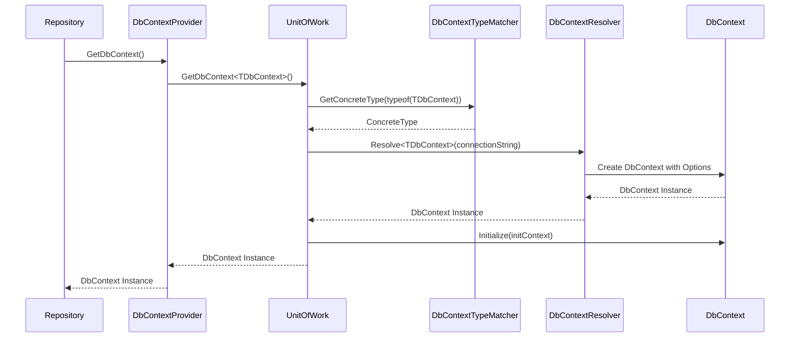
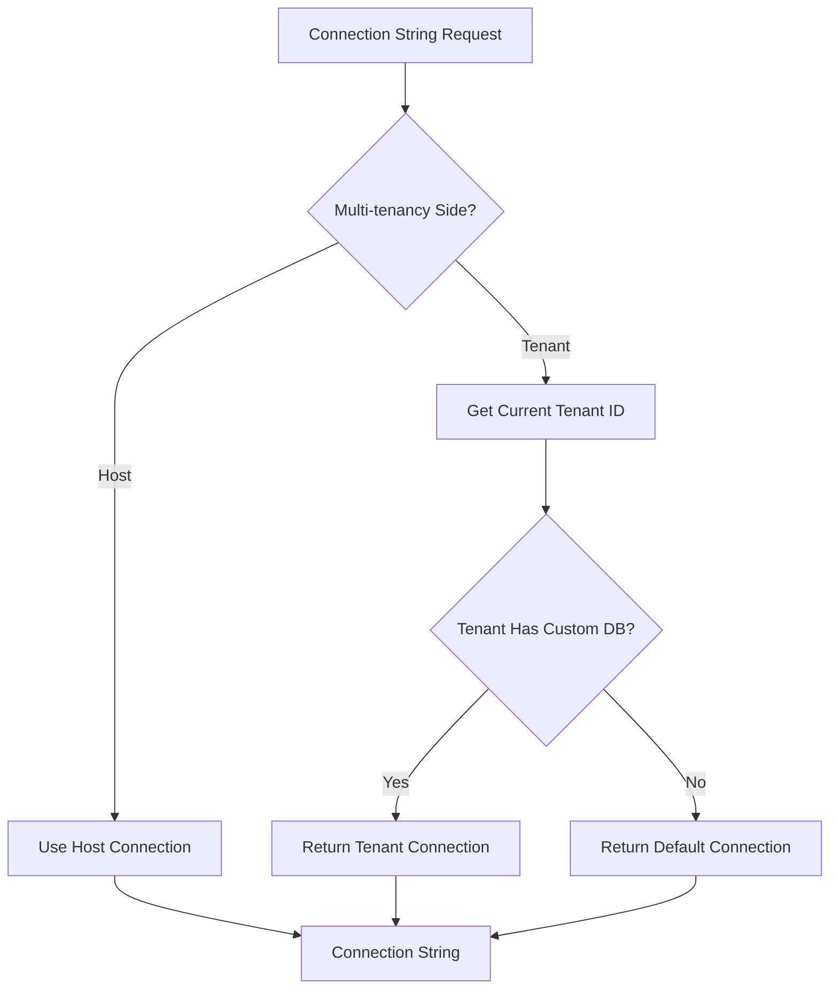

# 第三章：DbContext 與 Repository 的協作機制

## 章節概述

DbContext 是 Entity Framework Core 的核心元件，負責實體追蹤、變更偵測和資料庫連線管理。在 ABP 框架中，DbContext 與 Repository 透過精心設計的協作機制，提供了強大的資料存取功能。本章將深入探討這種協作關係的實作細節，包括 AbpDbContext 的擴展機制、IDbContextProvider 的工廠模式實作，以及多租戶環境下的複雜管理策略。

## 3.1 AbpDbContext 的設計與擴展機制

### 3.1.1 AbpDbContext 的核心架構

ABP 框架提供的 `AbpDbContext` 是對 EF Core `DbContext` 的強大擴展，集成了審計、多租戶、軟刪除等企業級功能。

```csharp
/// <summary>
/// Base class for all DbContext classes in the application.
/// </summary>
public abstract class AbpDbContext : DbContext, ITransientDependency, IShouldInitializeDcontext
{
    /// <summary>
    /// Used to get current session values.
    /// </summary>
    public IAbpSession AbpSession { get; set; }

    /// <summary>
    /// Used to trigger entity change events.
    /// </summary>
    public IEntityChangeEventHelper EntityChangeEventHelper { get; set; }

    /// <summary>
    /// Reference to the logger.
    /// </summary>
    public ILogger Logger { get; set; }

    /// <summary>
    /// Reference to the event bus.
    /// </summary>
    public IEventBus EventBus { get; set; }

    /// <summary>
    /// Reference to GUID generator.
    /// </summary>
    public IGuidGenerator GuidGenerator { get; set; }

    /// <summary>
    /// Reference to the current UOW provider.
    /// </summary>
    public ICurrentUnitOfWorkProvider CurrentUnitOfWorkProvider { get; set; }

    /// <summary>
    /// Reference to multi tenancy configuration.
    /// </summary>
    public IMultiTenancyConfig MultiTenancyConfig { get; set; }

    /// <summary>
    /// Reference to the ABP entity configuration.
    /// </summary>
    public IAbpEfCoreConfiguration AbpEfCoreConfiguration { get; set; }
}
```

**設計理念分析：**

1. **依賴注入集成**：AbpDbContext 實作 `ITransientDependency`，自動註冊為瞬態依賴
2. **服務整合**：透過屬性注入方式整合 ABP 核心服務
3. **生命週期管理**：實作 `IShouldInitializeDcontext` 支援初始化回調

### 3.1.2 屬性注入機制

AbpDbContext 使用屬性注入而非建構函數注入，這種設計避免了 DbContext 建構函數的複雜性：

```csharp
private void SetNullsForInjectedProperties()
{
    Logger = NullLogger.Instance;
    AbpSession = NullAbpSession.Instance;
    EntityChangeEventHelper = NullEntityChangeEventHelper.Instance;
    GuidGenerator = SequentialGuidGenerator.Instance;
    EventBus = NullEventBus.Instance;
    AbpEfCoreConfiguration = NullAbpEfCoreConfiguration.Instance;
}
```

這種初始化策略確保即使在依賴注入容器尚未完全初始化時，DbContext 也能正常運作。

### 3.1.3 Global Filters 配置機制

AbpDbContext 透過反射機制動態配置全域過濾器：

```csharp
protected override void OnModelCreating(ModelBuilder modelBuilder)
{
    base.OnModelCreating(modelBuilder);

    foreach (var entityType in modelBuilder.Model.GetEntityTypes())
    {
        ConfigureGlobalFiltersMethodInfo
            .MakeGenericMethod(entityType.ClrType)
            .Invoke(this, new object[] { modelBuilder, entityType });

        ConfigureGlobalValueConverterMethodInfo
            .MakeGenericMethod(entityType.ClrType)
            .Invoke(this, new object[] { modelBuilder, entityType });
    }
}

protected void ConfigureGlobalFilters<TEntity>(ModelBuilder modelBuilder, IMutableEntityType entityType)
    where TEntity : class
{
    if (entityType.BaseType == null && ShouldFilterEntity<TEntity>(entityType))
    {
        var filterExpression = CreateFilterExpression<TEntity>(modelBuilder);
        if (filterExpression != null)
        {
            modelBuilder.Entity<TEntity>().HasQueryFilter(filterExpression);
        }
    }
}
```

**動態過濾器生成：**

```csharp
protected virtual Expression<Func<TEntity, bool>> CreateFilterExpression<TEntity>(ModelBuilder modelBuilder)
    where TEntity : class
{
    Expression<Func<TEntity, bool>> expression = null;

    if (typeof(ISoftDelete).IsAssignableFrom(typeof(TEntity)))
    {
        expression = e => !IsSoftDeleteFilterEnabled || !((ISoftDelete)e).IsDeleted;
    }

    if (typeof(IMayHaveTenant).IsAssignableFrom(typeof(TEntity)))
    {
        Expression<Func<TEntity, bool>> mayHaveTenantFilter = 
            e => !IsMayHaveTenantFilterEnabled || ((IMayHaveTenant)e).TenantId == CurrentTenantId;
        expression = expression == null ? mayHaveTenantFilter : 
            CombineExpressions(expression, mayHaveTenantFilter);
    }

    if (typeof(IMustHaveTenant).IsAssignableFrom(typeof(TEntity)))
    {
        Expression<Func<TEntity, bool>> mustHaveTenantFilter = 
            e => !IsMustHaveTenantFilterEnabled || ((IMustHaveTenant)e).TenantId == CurrentTenantId;
        expression = expression == null ? mustHaveTenantFilter : 
            CombineExpressions(expression, mustHaveTenantFilter);
    }

    return expression;
}
```

### 3.1.4 SaveChanges 擴展機制

AbpDbContext 重寫 SaveChanges 方法，自動應用 ABP 概念：

```csharp
public override int SaveChanges()
{
    try
    {
        var changeReport = ApplyAbpConcepts();
        var result = base.SaveChanges();
        EntityChangeEventHelper.TriggerEvents(changeReport);
        return result;
    }
    catch (DbUpdateConcurrencyException ex)
    {
        throw new AbpDbConcurrencyException(ex.Message, ex);
    }
}

protected virtual EntityChangeReport ApplyAbpConcepts()
{
    var changeReport = new EntityChangeReport();
    var userId = GetAuditUserId();

    foreach (var entry in ChangeTracker.Entries().ToList())
    {
        ApplyAbpConcepts(entry, userId, changeReport);
    }

    return changeReport;
}
```

**審計與實體事件處理：**

```csharp
protected virtual void ApplyAbpConcepts(EntityEntry entry, long? userId, EntityChangeReport changeReport)
{
    switch (entry.State)
    {
        case EntityState.Added:
            ApplyAbpConceptsForAddedEntity(entry, userId, changeReport);
            break;
        case EntityState.Modified:
            ApplyAbpConceptsForModifiedEntity(entry, userId, changeReport);
            break;
        case EntityState.Deleted:
            ApplyAbpConceptsForDeletedEntity(entry, userId, changeReport);
            break;
    }

    AddDomainEvents(changeReport.DomainEvents, entry.Entity);
}
```

## 3.2 IDbContextProvider 的工廠模式實作

### 3.2.1 IDbContextProvider 介面設計

`IDbContextProvider<TDbContext>` 是 DbContext 獲取的標準介面：

```csharp
public interface IDbContextProvider<TDbContext>
    where TDbContext : DbContext
{
    Task<TDbContext> GetDbContextAsync();
    Task<TDbContext> GetDbContextAsync(MultiTenancySides? multiTenancySide);
    TDbContext GetDbContext();
    TDbContext GetDbContext(MultiTenancySides? multiTenancySide);
}
```

### 3.2.2 UnitOfWorkDbContextProvider 實作

最重要的實作是 `UnitOfWorkDbContextProvider<TDbContext>`，它從活動的 Unit of Work 中獲取 DbContext：

```csharp
/// <summary>
/// Implements <see cref="IDbContextProvider{TDbContext}"/> that gets DbContext from
/// active unit of work.
/// </summary>
/// <typeparam name="TDbContext">Type of the DbContext</typeparam>
public class UnitOfWorkDbContextProvider<TDbContext> : IDbContextProvider<TDbContext>
    where TDbContext : DbContext
{
    private readonly ICurrentUnitOfWorkProvider _currentUnitOfWorkProvider;

    public UnitOfWorkDbContextProvider(ICurrentUnitOfWorkProvider currentUnitOfWorkProvider)
    {
        _currentUnitOfWorkProvider = currentUnitOfWorkProvider;
    }

    public TDbContext GetDbContext()
    {
        return GetDbContext(null);
    }

    public TDbContext GetDbContext(MultiTenancySides? multiTenancySide)
    {
        return _currentUnitOfWorkProvider.Current.GetDbContext<TDbContext>(multiTenancySide);
    }

    public Task<TDbContext> GetDbContextAsync()
    {
        return GetDbContextAsync(null);
    }

    public Task<TDbContext> GetDbContextAsync(MultiTenancySides? multiTenancySide)
    {
        return _currentUnitOfWorkProvider.Current.GetDbContextAsync<TDbContext>(multiTenancySide);
    }
}
```

### 3.2.3 SimpleDbContextProvider 實作

用於簡單場景的直接 DbContext 提供者：

```csharp
public sealed class SimpleDbContextProvider<TDbContext> : IDbContextProvider<TDbContext>
    where TDbContext : DbContext
{
    public TDbContext DbContext { get; }

    public SimpleDbContextProvider(TDbContext dbContext)
    {
        DbContext = dbContext;
    }

    public Task<TDbContext> GetDbContextAsync()
    {
        return Task.FromResult(DbContext);
    }

    public Task<TDbContext> GetDbContextAsync(MultiTenancySides? multiTenancySide)
    {
        return Task.FromResult(DbContext);
    }

    public TDbContext GetDbContext()
    {
        return DbContext;
    }

    public TDbContext GetDbContext(MultiTenancySides? multiTenancySide)
    {
        return DbContext;
    }
}
```

### 3.2.4 DbContextResolver 工廠實作

`DefaultDbContextResolver` 實作複雜的 DbContext 創建邏輯：

```csharp
public class DefaultDbContextResolver : IDbContextResolver, ITransientDependency
{
    private static readonly MethodInfo CreateOptionsMethod = 
        typeof(DefaultDbContextResolver).GetMethod("CreateOptions", BindingFlags.NonPublic | BindingFlags.Instance);

    private readonly IIocResolver _iocResolver;
    private readonly IDbContextTypeMatcher _dbContextTypeMatcher;

    public TDbContext Resolve<TDbContext>(string connectionString, DbConnection existingConnection)
        where TDbContext : DbContext
    {
        var concreteType = _dbContextTypeMatcher.GetConcreteType(typeof(TDbContext));
        var options = CreateOptionsForType(concreteType, connectionString, existingConnection);
        
        return (TDbContext)_iocResolver.Resolve(concreteType, new { options });
    }

    protected virtual DbContextOptions<TDbContext> CreateOptions<TDbContext>(
        [NotNull] string connectionString, 
        [CanBeNull] DbConnection existingConnection) 
        where TDbContext : DbContext
    {
        if (_iocResolver.IsRegistered<IAbpDbContextConfigurer<TDbContext>>())
        {
            var configuration = new AbpDbContextConfiguration<TDbContext>(connectionString, existingConnection);
            configuration.DbContextOptions.UseApplicationServiceProvider(_iocResolver.Resolve<IServiceProvider>());

            using (var configurer = _iocResolver.ResolveAsDisposable<IAbpDbContextConfigurer<TDbContext>>())
            {
                configurer.Object.Configure(configuration);
            }

            return configuration.DbContextOptions.AddAbpDbContextOptionsExtension().Options;
        }

        if (_iocResolver.IsRegistered<DbContextOptions<TDbContext>>())
        {
            return _iocResolver.Resolve<DbContextOptions<TDbContext>>()
                .WithExtension(new AbpDbContextOptionsExtension())
                .As<DbContextOptions<TDbContext>>();
        }

        throw new AbpException($"Could not resolve DbContextOptions for {typeof(TDbContext).AssemblyQualifiedName}.");
    }
}
```

## 3.3 DbContext 的生命週期管理

### 3.3.1 初始化流程

DbContext 的初始化透過 `IShouldInitializeDcontext` 介面進行：

```csharp
public virtual void Initialize(AbpEfDbContextInitializationContext initializationContext)
{
    var uowOptions = initializationContext.UnitOfWork.Options;
    if (uowOptions.Timeout.HasValue &&
        Database.IsRelational() &&
        !Database.GetCommandTimeout().HasValue)
    {
        Database.SetCommandTimeout(uowOptions.Timeout.Value.TotalSeconds.To<int>());
    }

    ChangeTracker.CascadeDeleteTiming = CascadeTiming.OnSaveChanges;
}
```

### 3.3.2 生命週期與 Unit of Work 的關聯



### 3.3.3 連線字串解析與快取

EfCoreUnitOfWork 管理 DbContext 的生命週期：

```csharp
public virtual TDbContext GetOrCreateDbContext<TDbContext>(
    MultiTenancySides? multiTenancySide = null, string name = null)
    where TDbContext : DbContext
{
    var concreteDbContextType = _dbContextTypeMatcher.GetConcreteType(typeof(TDbContext));

    var connectionStringResolveArgs = new ConnectionStringResolveArgs(multiTenancySide)
    {
        ["DbContextType"] = typeof(TDbContext),
        ["DbContextConcreteType"] = concreteDbContextType
    };

    var connectionString = ResolveConnectionString(connectionStringResolveArgs);

    var dbContextKey = concreteDbContextType.FullName + "#" + connectionString;
    if (name != null)
    {
        dbContextKey += "#" + name;
    }

    if (ActiveDbContexts.TryGetValue(dbContextKey, out var dbContext))
    {
        return (TDbContext)dbContext;
    }

    if (Options.IsTransactional == true)
    {
        dbContext = _transactionStrategy
            .CreateDbContext<TDbContext>(connectionString, _dbContextResolver);
    }
    else
    {
        dbContext = _dbContextResolver.Resolve<TDbContext>(connectionString, null);
    }

    if (dbContext is IShouldInitializeDcontext abpDbContext)
    {
        abpDbContext.Initialize(new AbpEfDbContextInitializationContext(this));
    }

    ActiveDbContexts[dbContextKey] = dbContext;

    return (TDbContext)dbContext;
}
```

## 3.4 多 DbContext 環境下的 Repository 管理

### 3.4.1 DbContextTypeMatcher 的類型匹配邏輯

`DbContextTypeMatcher` 負責在多 DbContext 環境中選擇正確的實作類型：

```csharp
public virtual Type GetConcreteType(Type sourceDbContextType)
{
    if (!sourceDbContextType.GetTypeInfo().IsAbstract)
    {
        return sourceDbContextType;
    }
    
    //Get possible concrete types for given DbContext type
    var allTargetTypes = _dbContextTypes.GetOrDefault(sourceDbContextType);

    if (allTargetTypes.IsNullOrEmpty())
    {
        throw new AbpException("Could not find a concrete implementation of given DbContext type: " + 
            sourceDbContextType.AssemblyQualifiedName);
    }

    if (allTargetTypes.Count == 1)
    {
        //Only one type does exists, return it
        return allTargetTypes[0];
    }

    CheckCurrentUow();

    var currentTenancySide = GetCurrentTenancySide();
    var multiTenancySideContexts = GetMultiTenancySideContextTypes(allTargetTypes, currentTenancySide);

    if (multiTenancySideContexts.Count == 1)
    {
        return multiTenancySideContexts[0];
    }

    if (multiTenancySideContexts.Count > 1)
    {
        return GetDefaultDbContextType(multiTenancySideContexts, sourceDbContextType, currentTenancySide);
    }

    return GetDefaultDbContextType(allTargetTypes, sourceDbContextType, currentTenancySide);
}
```

### 3.4.2 多租戶環境下的類型選擇

```csharp
private MultiTenancySides GetCurrentTenancySide()
{
    return _currentUnitOfWorkProvider.Current.GetTenantId() == null
               ? MultiTenancySides.Host
               : MultiTenancySides.Tenant;
}

private static List<Type> GetMultiTenancySideContextTypes(List<Type> dbContextTypes, MultiTenancySides tenancySide)
{
    return dbContextTypes.Where(type =>
    {
        var attrs = type.GetTypeInfo().GetCustomAttributes(typeof(MultiTenancySideAttribute), true).ToArray();
        if (attrs.IsNullOrEmpty())
        {
            return false;
        }

        return ((MultiTenancySideAttribute)attrs[0]).Side.HasFlag(tenancySide);
    }).ToList();
}
```

### 3.4.3 DbContext 註冊與發現機制

```csharp
public void Populate(Type[] dbContextTypes)
{
    foreach (var dbContextType in dbContextTypes)
    {
        var interfaces = dbContextType.GetTypeInfo().GetInterfaces();
        foreach (var @interface in interfaces)
        {
            AddWithBaseTypes(@interface, dbContextType);
        }

        AddWithBaseTypes(dbContextType, dbContextType);
    }
}

private void AddWithBaseTypes(Type sourceDbContextType, Type targetDbContextType)
{
    Add(sourceDbContextType, targetDbContextType);

    if (sourceDbContextType.GetTypeInfo().BaseType != null)
    {
        AddWithBaseTypes(sourceDbContextType.GetTypeInfo().BaseType, targetDbContextType);
    }
}
```

## 3.5 Connection String 解析與多租戶支援

### 3.5.1 多租戶連線字串解析器

ABP 提供 `DbPerTenantConnectionStringResolver` 支援每租戶獨立資料庫：

```csharp
public class DbPerTenantConnectionStringResolver : DefaultConnectionStringResolver, IDbPerTenantConnectionStringResolver
{
    private readonly IAbpSession _abpSession;
    private readonly ICurrentUnitOfWorkProvider _currentUnitOfWorkProvider;
    private readonly ITenantCache _tenantCache;

    public override string GetNameOrConnectionString(ConnectionStringResolveArgs args)
    {
        if (args.MultiTenancySide == MultiTenancySides.Host)
        {
            return GetNameOrConnectionString(new DbPerTenantConnectionStringResolveArgs(null, args));
        }

        return GetNameOrConnectionString(new DbPerTenantConnectionStringResolveArgs(GetCurrentTenantId(), args));
    }

    public virtual string GetNameOrConnectionString(DbPerTenantConnectionStringResolveArgs args)
    {
        if (args.TenantId == null)
        {
            //Requested for host
            return base.GetNameOrConnectionString(args);
        }

        var tenantCacheItem = _tenantCache.Get(args.TenantId.Value);
        if (tenantCacheItem.ConnectionString.IsNullOrEmpty())
        {
            //Tenant has not dedicated database
            return base.GetNameOrConnectionString(args);
        }

        return tenantCacheItem.ConnectionString;
    }

    protected virtual int? GetCurrentTenantId()
    {
        return _currentUnitOfWorkProvider.Current != null
            ? _currentUnitOfWorkProvider.Current.GetTenantId()
            : _abpSession.TenantId;
    }
}
```

### 3.5.2 連線字串解析流程



### 3.5.3 連線字串快取與性能最佳化

連線字串解析包含快取機制以提升性能：

```csharp
public virtual async Task<string> GetNameOrConnectionStringAsync(DbPerTenantConnectionStringResolveArgs args)
{
    if (args.TenantId == null)
    {
        return await base.GetNameOrConnectionStringAsync(args);
    }

    var tenantCacheItem = await _tenantCache.GetAsync(args.TenantId.Value);
    if (tenantCacheItem.ConnectionString.IsNullOrEmpty())
    {
        return await base.GetNameOrConnectionStringAsync(args);
    }

    return tenantCacheItem.ConnectionString;
}
```

## 3.6 實際應用範例

### 3.6.1 自訂 DbContext 實作

```csharp
[MultiTenancySide(MultiTenancySides.Host)]
public class HostDbContext : AbpDbContext
{
    public HostDbContext(DbContextOptions<HostDbContext> options) : base(options)
    {
    }

    protected override void OnModelCreating(ModelBuilder modelBuilder)
    {
        base.OnModelCreating(modelBuilder);
        
        // Host-specific entity configurations
        modelBuilder.Entity<Tenant>().ToTable("Tenants");
    }
}

[MultiTenancySide(MultiTenancySides.Tenant)]
public class TenantDbContext : AbpDbContext
{
    public TenantDbContext(DbContextOptions<TenantDbContext> options) : base(options)
    {
    }

    protected override void OnModelCreating(ModelBuilder modelBuilder)
    {
        base.OnModelCreating(modelBuilder);
        
        // Tenant-specific entity configurations
        modelBuilder.Entity<Product>().ToTable("Products");
    }
}
```

### 3.6.2 Repository 中的 DbContext 使用

```csharp
public class ProductRepository : EfCoreRepositoryBase<TenantDbContext, Product, int>
{
    public ProductRepository(IDbContextProvider<TenantDbContext> dbContextProvider) 
        : base(dbContextProvider)
    {
    }

    public async Task<List<Product>> GetProductsByCategory(string category)
    {
        var dbContext = await GetDbContextAsync();
        return await dbContext.Set<Product>()
            .Where(p => p.Category == category)
            .ToListAsync();
    }
}
```

## 3.7 效能考量與最佳實踐

### 3.7.1 DbContext 快取策略

Unit of Work 使用字串鍵值快取 DbContext 實例：

```csharp
var dbContextKey = concreteDbContextType.FullName + "#" + connectionString;
if (name != null)
{
    dbContextKey += "#" + name;
}

if (ActiveDbContexts.TryGetValue(dbContextKey, out var dbContext))
{
    return (TDbContext)dbContext;
}
```

### 3.7.2 連線池最佳化

ABP 建議的 DbContext 配置：

```csharp
public class DemoDbContextConfigurer
{
    public static void Configure(DbContextOptionsBuilder<DemoDbContext> builder, string connectionString)
    {
        builder.UseSqlServer(connectionString, options =>
        {
            options.EnableRetryOnFailure(
                maxRetryCount: 3,
                maxRetryDelay: TimeSpan.FromSeconds(30),
                errorNumbersToAdd: null);
        });
    }
}
```

### 3.7.3 記憶體管理建議

1. **避免長時間持有 DbContext**：Repository 應透過 IDbContextProvider 獲取 DbContext
2. **正確處理非同步操作**：使用 `GetDbContextAsync()` 處理非同步場景
3. **利用 Unit of Work 管理生命週期**：讓 UnitOfWork 自動管理 DbContext 的建立與銷毀

## 本章總結

本章深入探討了 ABP 框架中 DbContext 與 Repository 的協作機制。我們分析了：

1. **AbpDbContext 的強大擴展機制**：包括全域過濾器、審計功能和實體事件處理
2. **IDbContextProvider 的工廠模式**：提供靈活的 DbContext 獲取策略
3. **複雜的生命週期管理**：透過 Unit of Work 統一管理 DbContext 實例
4. **多 DbContext 環境支援**：透過 DbContextTypeMatcher 實現智慧型選擇
5. **多租戶連線字串解析**：支援每租戶獨立資料庫的企業級架構

這些機制共同構成了 ABP 框架強大的資料存取基礎設施，為開發者提供了既靈活又強大的資料庫操作能力。下一章我們將深入探討 Unit of Work 與交易管理的核心實作機制。

---

## 📖 章節導覽

### ⬅️ 上一章
**[第二章：ABP 框架中的 Repository 架構](./02-ABP%20框架中的%20Repository%20架構.md)**
- ABP Repository 分層架構設計
- Repository 介面族譜分析
- 泛型 Repository 自動註冊機制

### ➡️ 下一章
**[第四章：Unit of Work 與交易管理](./04-Unit%20of%20Work%20與交易管理.md)**
- Unit of Work 模式深度解析
- EfCoreUnitOfWork 核心實作
- 交易管理與回滾機制

### 🏠 返回目錄
**[EF Core Repository 權威指南 - 目錄](./README.md)**

### 🎯 相關章節
- **[第五章：Repository CRUD 操作深度解析](./05-Repository%20CRUD%20操作深度解析.md)** - DbContext 在 CRUD 操作中的應用
- **[第七章：效能最佳化與進階特性](./07-效能最佳化與進階特性.md)** - DbContext 效能最佳化技巧

### 💡 學習建議
1. **實務驗證**：建議在實際專案中測試多 DbContext 的配置
2. **連線管理**：重點理解連線字串解析的多租戶應用
3. **生命週期**：深入理解 DbContext 與 UoW 的協作機制

### 🔍 關鍵概念
- **工廠模式**：IDbContextProvider 的設計精髓
- **類型匹配**：DbContextTypeMatcher 的智慧選擇邏輯
- **多租戶架構**：連線字串解析的企業級應用

---

*完成本章學習後，您將完全掌握 DbContext 與 Repository 的協作機制，為理解更高階的交易管理做好準備。*
