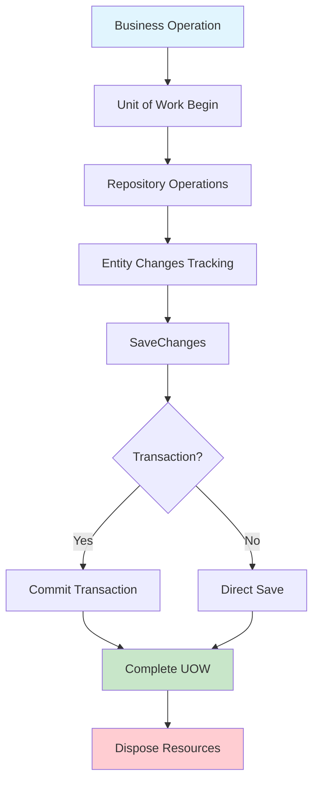
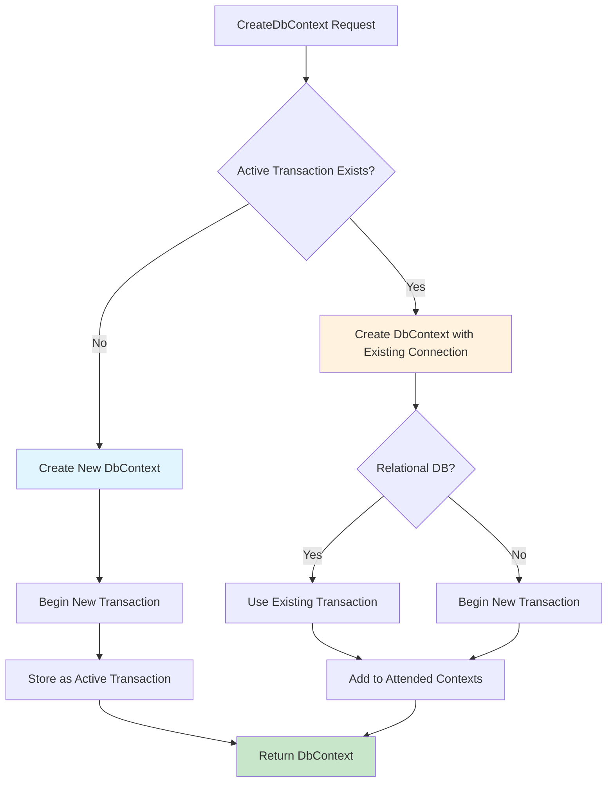
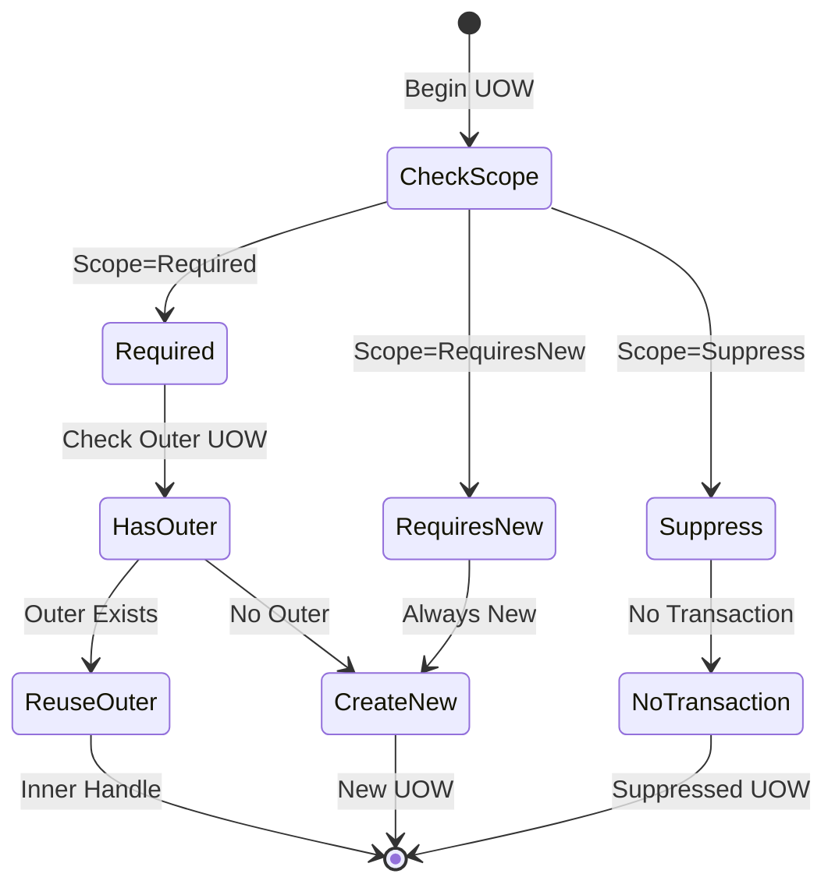

# 第四章：Unit of Work 與交易管理

## 章節概述

Unit of Work (UOW) 是企業應用程式中實現資料一致性的核心模式。在 ABP 框架中，Unit of Work 不僅管理交易邊界，還整合了多租戶、審計、事件處理等複雜功能。本章將深入探討 EfCoreUnitOfWork 的實作機制、交易管理策略、嵌套 UOW 處理，以及連線池最佳化等關鍵技術。

## 4.1 Unit of Work 的理論基礎與實作策略

### 4.1.1 Unit of Work 模式的核心概念

Unit of Work 維護一個受商業交易影響的物件清單，並協調寫入變更和解決並行問題。在 ABP 中，UOW 模式的實作具有以下特點：



### 4.1.2 UnitOfWorkBase 抽象基類

ABP 的 UOW 實作基於 `UnitOfWorkBase` 抽象類別：

```csharp
public abstract class UnitOfWorkBase : IUnitOfWork
{
    protected IConnectionStringResolver ConnectionStringResolver { get; }
    protected IUnitOfWorkDefaultOptions DefaultOptions { get; }
    protected IUnitOfWorkFilterExecuter FilterExecuter { get; }

    public UnitOfWorkOptions Options { get; private set; }
    public IReadOnlyList<DataFilterConfiguration> Filters => _filters;
    
    protected readonly List<DataFilterConfiguration> _filters;
    protected readonly List<Func<Task>> _completedHandlers;

    protected UnitOfWorkBase(
        IConnectionStringResolver connectionStringResolver,
        IUnitOfWorkDefaultOptions defaultOptions,
        IUnitOfWorkFilterExecuter filterExecuter)
    {
        ConnectionStringResolver = connectionStringResolver;
        DefaultOptions = defaultOptions;
        FilterExecuter = filterExecuter;
        
        _filters = new List<DataFilterConfiguration>();
        _completedHandlers = new List<Func<Task>>();
    }

    public virtual void Begin(UnitOfWorkOptions options)
    {
        PreventMultipleBegin();
        Options = options ?? new UnitOfWorkOptions();
        SetFilters(Options.FilterOverrides);
        BeginUow();
    }

    public abstract void SaveChanges();
    public abstract Task SaveChangesAsync();
    
    protected abstract void BeginUow();
    protected abstract void CompleteUow();
    protected abstract Task CompleteUowAsync();
    protected abstract void DisposeUow();
}
```

### 4.1.3 EfCoreUnitOfWork 的核心架構

`EfCoreUnitOfWork` 是針對 Entity Framework Core 的具體實作：

```csharp
/// <summary>
/// Implements Unit of work for Entity Framework.
/// </summary>
public class EfCoreUnitOfWork : UnitOfWorkBase, ITransientDependency
{
    protected IDictionary<string, DbContext> ActiveDbContexts { get; }
    protected IIocResolver IocResolver { get; }

    private readonly IDbContextResolver _dbContextResolver;
    private readonly IDbContextTypeMatcher _dbContextTypeMatcher;
    private readonly IEfCoreTransactionStrategy _transactionStrategy;

    public EfCoreUnitOfWork(
        IIocResolver iocResolver,
        IConnectionStringResolver connectionStringResolver,
        IUnitOfWorkFilterExecuter filterExecuter,
        IDbContextResolver dbContextResolver,
        IUnitOfWorkDefaultOptions defaultOptions,
        IDbContextTypeMatcher dbContextTypeMatcher,
        IEfCoreTransactionStrategy transactionStrategy)
        : base(connectionStringResolver, defaultOptions, filterExecuter)
    {
        IocResolver = iocResolver;
        _dbContextResolver = dbContextResolver;
        _dbContextTypeMatcher = dbContextTypeMatcher;
        _transactionStrategy = transactionStrategy;

        ActiveDbContexts = new Dictionary<string, DbContext>(StringComparer.OrdinalIgnoreCase);
    }
}
```

**設計原則分析：**

1. **單一職責**：每個 UOW 實例管理一個邏輯交易邊界
2. **資源管理**：集中管理所有相關的 DbContext 實例
3. **策略模式**：透過 IEfCoreTransactionStrategy 支援不同的交易策略
4. **依賴注入**：完全支援 IoC 容器的生命週期管理

## 4.2 EfCoreUnitOfWork 的核心實作機制

### 4.2.1 UOW 的生命週期管理

```csharp
protected override void BeginUow()
{
    if (Options.IsTransactional == true)
    {
        _transactionStrategy.InitOptions(Options);
    }
}

public override void SaveChanges()
{
    foreach (var dbContext in GetAllActiveDbContexts())
    {
        SaveChangesInDbContext(dbContext);
    }
}

public override async Task SaveChangesAsync()
{
    foreach (var dbContext in GetAllActiveDbContexts())
    {
        await SaveChangesInDbContextAsync(dbContext);
    }
}

protected override void CompleteUow()
{
    SaveChanges();
    CommitTransaction();
}

protected override async Task CompleteUowAsync()
{
    await SaveChangesAsync();
    CommitTransaction();
}

private void CommitTransaction()
{
    if (Options.IsTransactional == true)
    {
        _transactionStrategy.Commit();
    }
}
```

### 4.2.2 DbContext 的建立與管理

UOW 採用延遲載入策略建立 DbContext：

```csharp
public virtual TDbContext GetOrCreateDbContext<TDbContext>(
    MultiTenancySides? multiTenancySide = null, string name = null)
    where TDbContext : DbContext
{
    var concreteDbContextType = _dbContextTypeMatcher.GetConcreteType(typeof(TDbContext));

    var connectionStringResolveArgs = new ConnectionStringResolveArgs(multiTenancySide)
    {
        ["DbContextType"] = typeof(TDbContext),
        ["DbContextConcreteType"] = concreteDbContextType
    };

    var connectionString = ResolveConnectionString(connectionStringResolveArgs);

    var dbContextKey = concreteDbContextType.FullName + "#" + connectionString;
    if (name != null)
    {
        dbContextKey += "#" + name;
    }

    if (ActiveDbContexts.TryGetValue(dbContextKey, out var dbContext))
    {
        return (TDbContext)dbContext;
    }

    if (Options.IsTransactional == true)
    {
        dbContext = _transactionStrategy
            .CreateDbContext<TDbContext>(connectionString, _dbContextResolver);
    }
    else
    {
        dbContext = _dbContextResolver.Resolve<TDbContext>(connectionString, null);
    }

    if (dbContext is IShouldInitializeDcontext abpDbContext)
    {
        abpDbContext.Initialize(new AbpEfDbContextInitializationContext(this));
    }

    ActiveDbContexts[dbContextKey] = dbContext;

    return (TDbContext)dbContext;
}
```

**DbContext 鍵值生成策略：**

```csharp
var dbContextKey = concreteDbContextType.FullName + "#" + connectionString;
if (name != null)
{
    dbContextKey += "#" + name;
}
```

這種鍵值策略確保：
- 不同類型的 DbContext 不會衝突
- 不同連線字串的 DbContext 分別管理
- 支援命名的 DbContext 實例

### 4.2.3 非同步操作支援

```csharp
public virtual async Task<TDbContext> GetOrCreateDbContextAsync<TDbContext>(
    MultiTenancySides? multiTenancySide = null, string name = null)
    where TDbContext : DbContext
{
    var concreteDbContextType = _dbContextTypeMatcher.GetConcreteType(typeof(TDbContext));

    var connectionStringResolveArgs = new ConnectionStringResolveArgs(multiTenancySide)
    {
        ["DbContextType"] = typeof(TDbContext),
        ["DbContextConcreteType"] = concreteDbContextType
    };

    var connectionString = await ResolveConnectionStringAsync(connectionStringResolveArgs);

    var dbContextKey = concreteDbContextType.FullName + "#" + connectionString;
    if (name != null)
    {
        dbContextKey += "#" + name;
    }

    if (ActiveDbContexts.TryGetValue(dbContextKey, out var dbContext))
    {
        return (TDbContext)dbContext;
    }

    if (Options.IsTransactional == true)
    {
        dbContext = await _transactionStrategy
            .CreateDbContextAsync<TDbContext>(connectionString, _dbContextResolver);
    }
    else
    {
        dbContext = _dbContextResolver.Resolve<TDbContext>(connectionString, null);
    }

    if (dbContext is IShouldInitializeDcontext abpDbContext)
    {
        abpDbContext.Initialize(new AbpEfDbContextInitializationContext(this));
    }

    ActiveDbContexts[dbContextKey] = dbContext;

    return (TDbContext)dbContext;
}
```

### 4.2.4 資源清理機制

```csharp
protected override void DisposeUow()
{
    if (Options.IsTransactional == true)
    {
        _transactionStrategy.Dispose(IocResolver);
    }
    else
    {
        foreach (var context in GetAllActiveDbContexts())
        {
            Release(context);
        }
    }

    ActiveDbContexts.Clear();
}

protected virtual void Release(DbContext dbContext)
{
    dbContext.Dispose();
    IocResolver.Release(dbContext);
}
```

## 4.3 交易管理與回滾機制

### 4.3.1 IEfCoreTransactionStrategy 介面

交易策略介面定義了統一的交易管理contract：

```csharp
public interface IEfCoreTransactionStrategy
{
    void InitOptions(UnitOfWorkOptions options);
    
    DbContext CreateDbContext<TDbContext>(string connectionString, IDbContextResolver dbContextResolver) 
        where TDbContext : DbContext;
        
    Task<DbContext> CreateDbContextAsync<TDbContext>(string connectionString, IDbContextResolver dbContextResolver) 
        where TDbContext : DbContext;
        
    void Commit();
    void Dispose(IIocResolver iocResolver);
}
```

### 4.3.2 DbContextEfCoreTransactionStrategy 實作

這是預設的交易策略實作：

```csharp
public class DbContextEfCoreTransactionStrategy : IEfCoreTransactionStrategy, ITransientDependency
{
    protected UnitOfWorkOptions Options { get; private set; }
    protected IDictionary<string, ActiveTransactionInfo> ActiveTransactions { get; }

    public DbContextEfCoreTransactionStrategy()
    {
        ActiveTransactions = new Dictionary<string, ActiveTransactionInfo>(StringComparer.OrdinalIgnoreCase);
    }

    public void InitOptions(UnitOfWorkOptions options)
    {
        Options = options;
    }
}
```

**ActiveTransactionInfo 資料結構：**

```csharp
public class ActiveTransactionInfo
{
    public IDbContextTransaction DbContextTransaction { get; }
    public DbContext StarterDbContext { get; }
    public List<DbContext> AttendedDbContexts { get; }

    public ActiveTransactionInfo(IDbContextTransaction dbContextTransaction, DbContext starterDbContext)
    {
        DbContextTransaction = dbContextTransaction;
        StarterDbContext = starterDbContext;
        AttendedDbContexts = new List<DbContext>();
    }
}
```

### 4.3.3 交易建立與共享機制

```csharp
public DbContext CreateDbContext<TDbContext>(string connectionString, IDbContextResolver dbContextResolver) 
    where TDbContext : DbContext
{
    DbContext dbContext;

    var activeTransaction = ActiveTransactions.GetOrDefault(connectionString);
    if (activeTransaction == null)
    {
        dbContext = dbContextResolver.Resolve<TDbContext>(connectionString, null);

        var dbTransaction = dbContext.Database.BeginTransaction(
                (Options.IsolationLevel ?? IsolationLevel.ReadUncommitted).ToSystemDataIsolationLevel());

        activeTransaction = new ActiveTransactionInfo(dbTransaction, dbContext);
        ActiveTransactions[connectionString] = activeTransaction;
    }
    else
    {
        dbContext = dbContextResolver.Resolve<TDbContext>(
            connectionString,
            activeTransaction.DbContextTransaction.GetDbTransaction().Connection
        );

        if (dbContext.HasRelationalTransactionManager())
        {
            dbContext.Database.UseTransaction(activeTransaction.DbContextTransaction.GetDbTransaction());
        }
        else
        {
            dbContext.Database.BeginTransaction();
        }

        activeTransaction.AttendedDbContexts.Add(dbContext);
    }

    return dbContext;
}
```

**交易共享流程分析：**



### 4.3.4 交易提交機制

```csharp
public void Commit()
{
    foreach (var activeTransaction in ActiveTransactions.Values)
    {
        activeTransaction.DbContextTransaction.Commit();

        foreach (var dbContext in activeTransaction.AttendedDbContexts)
        {
            if (dbContext.HasRelationalTransactionManager())
            {
                continue; //Relational databases use the shared transaction
            }

            dbContext.Database.CommitTransaction();
        }
    }
}
```

### 4.3.5 交易回滾與異常處理

```csharp
public void Dispose(IIocResolver iocResolver)
{
    foreach (var activeTransaction in ActiveTransactions.Values)
    {
        try
        {
            activeTransaction.DbContextTransaction.Dispose();
        }
        catch (Exception ex)
        {
            // Log but don't throw during disposal
            Logger.Warn("Exception occurred while disposing transaction", ex);
        }

        foreach (var attendedDbContext in activeTransaction.AttendedDbContexts)
        {
            iocResolver.Release(attendedDbContext);
        }

        iocResolver.Release(activeTransaction.StarterDbContext);
    }

    ActiveTransactions.Clear();
}
```

### 4.3.6 隔離等級管理

```csharp
var dbTransaction = dbContext.Database.BeginTransaction(
    (Options.IsolationLevel ?? IsolationLevel.ReadUncommitted).ToSystemDataIsolationLevel());
```

支援的隔離等級：
- **ReadUncommitted**：最低隔離等級，允許髒讀
- **ReadCommitted**：防止髒讀，但允許不可重複讀
- **RepeatableRead**：防止髒讀和不可重複讀
- **Serializable**：最高隔離等級，完全序列化存取

## 4.4 嵌套 Unit of Work 的處理策略

### 4.4.1 嵌套 UOW 的實作原理

ABP 支援嵌套的 Unit of Work，透過 `UnitOfWorkManager` 管理嵌套關係：

```csharp
public class UnitOfWorkManager : IUnitOfWorkManager, ISingletonDependency
{
    private readonly IIocResolver _iocResolver;
    private readonly ICurrentUnitOfWorkProvider _currentUnitOfWorkProvider;
    
    public IUnitOfWork Begin()
    {
        return Begin(new UnitOfWorkOptions());
    }

    public IUnitOfWork Begin(UnitOfWorkOptions options)
    {
        var outerUow = _currentUnitOfWorkProvider.Current;
        if (options.Scope == TransactionScopeOption.Required && outerUow != null)
        {
            return new InnerUnitOfWorkCompleteHandle(outerUow, options);
        }

        var uow = _iocResolver.Resolve<IUnitOfWork>();
        uow.Completed += (sender, args) =>
        {
            _currentUnitOfWorkProvider.Current = outerUow;
        };

        _currentUnitOfWorkProvider.Current = uow;
        uow.Begin(options);

        return uow;
    }
}
```

### 4.4.2 InnerUnitOfWorkCompleteHandle 實作

```csharp
internal class InnerUnitOfWorkCompleteHandle : IUnitOfWork
{
    private readonly IUnitOfWork _outerUow;
    private readonly UnitOfWorkOptions _options;
    private volatile bool _isCompleted;
    private volatile bool _isDisposed;

    public InnerUnitOfWorkCompleteHandle(IUnitOfWork outerUow, UnitOfWorkOptions options)
    {
        _outerUow = outerUow;
        _options = options;

        _outerUow.SetOptions(options);
    }

    public void Complete()
    {
        _isCompleted = true;
    }

    public Task CompleteAsync()
    {
        _isCompleted = true;
        return Task.CompletedTask;
    }

    public void Dispose()
    {
        if (!_isDisposed)
        {
            _isDisposed = true;

            if (!_isCompleted)
            {
                _outerUow.Rollback();
            }
        }
    }
}
```

### 4.4.3 嵌套 UOW 的交易範圍管理

```csharp
public enum TransactionScopeOption
{
    Required,        // 加入現有交易或建立新交易
    RequiresNew,     // 總是建立新交易
    Suppress         // 禁用交易
}
```

**嵌套 UOW 決策流程：**



### 4.4.4 實際應用範例

```csharp
public class OrderService : ApplicationService
{
    private readonly IRepository<Order> _orderRepository;
    private readonly IRepository<OrderItem> _orderItemRepository;
    private readonly IInventoryService _inventoryService;

    [UnitOfWork] // 外層 UOW
    public virtual async Task<Order> CreateOrderAsync(CreateOrderInput input)
    {
        var order = new Order
        {
            CustomerId = input.CustomerId,
            OrderDate = Clock.Now
        };

        await _orderRepository.InsertAsync(order);

        foreach (var item in input.Items)
        {
            await CreateOrderItemAsync(order.Id, item); // 內層 UOW
        }

        return order;
    }

    [UnitOfWork(TransactionScopeOption.Required)] // 內層 UOW，加入外層交易
    protected virtual async Task CreateOrderItemAsync(long orderId, CreateOrderItemInput input)
    {
        // 檢查庫存（可能涉及其他 UOW）
        await _inventoryService.ReserveInventoryAsync(input.ProductId, input.Quantity);

        var orderItem = new OrderItem
        {
            OrderId = orderId,
            ProductId = input.ProductId,
            Quantity = input.Quantity,
            UnitPrice = input.UnitPrice
        };

        await _orderItemRepository.InsertAsync(orderItem);
    }
}
```

## 4.5 效能最佳化與連線池管理

### 4.5.1 連線池配置最佳化

```csharp
public class DemoDbContextConfigurer
{
    public static void Configure(DbContextOptionsBuilder<DemoDbContext> builder, string connectionString)
    {
        builder.UseSqlServer(connectionString, options =>
        {
            // 連線重試機制
            options.EnableRetryOnFailure(
                maxRetryCount: 3,
                maxRetryDelay: TimeSpan.FromSeconds(30),
                errorNumbersToAdd: null);

            // 命令逾時設定
            options.CommandTimeout(30);
        });

        // 連線池設定
        builder.EnableServiceProviderCaching();
        builder.EnableSensitiveDataLogging(false);
        
        // 查詢追蹤最佳化
        builder.UseQueryTrackingBehavior(QueryTrackingBehavior.TrackAll);
    }
}
```

### 4.5.2 DbContext 生命週期最佳化

```csharp
// Application Service 層面的最佳化
[UnitOfWork(IsDisabled = false, Timeout = 300000)] // 5分鐘逾時
public class LargeDataProcessingService : ApplicationService
{
    [UnitOfWork(TransactionScopeOption.Suppress)] // 禁用交易提升性能
    public virtual async Task ProcessLargeDatasetAsync()
    {
        // 大量資料處理邏輯
        await ProcessInBatchesAsync();
    }

    private async Task ProcessInBatchesAsync()
    {
        const int batchSize = 1000;
        int skip = 0;

        while (true)
        {
            using (var uow = UnitOfWorkManager.Begin(new UnitOfWorkOptions
            {
                Scope = TransactionScopeOption.RequiresNew, // 每批次獨立交易
                Timeout = TimeSpan.FromMinutes(2)
            }))
            {
                var batch = await GetDataBatchAsync(skip, batchSize);
                if (!batch.Any()) break;

                await ProcessBatchAsync(batch);
                await uow.CompleteAsync();

                skip += batchSize;
            }
        }
    }
}
```

### 4.5.3 記憶體使用最佳化

```csharp
public class OptimizedRepository<TEntity, TPrimaryKey> : EfCoreRepositoryBase<DemoDbContext, TEntity, TPrimaryKey>
    where TEntity : class, IEntity<TPrimaryKey>
{
    public OptimizedRepository(IDbContextProvider<DemoDbContext> dbContextProvider) 
        : base(dbContextProvider)
    {
    }

    // 唯讀查詢最佳化
    public virtual async Task<List<TEntity>> GetAllReadOnlyAsync()
    {
        var context = await GetDbContextAsync();
        return await context.Set<TEntity>()
            .AsNoTracking() // 不追蹤變更，減少記憶體使用
            .ToListAsync();
    }

    // 大量更新最佳化
    public virtual async Task BulkUpdateAsync(Expression<Func<TEntity, bool>> predicate, 
        Expression<Func<TEntity, TEntity>> updateExpression)
    {
        var context = await GetDbContextAsync();
        
        // 使用原始 SQL 或第三方函式庫進行大量更新
        await context.Set<TEntity>()
            .Where(predicate)
            .ExecuteUpdateAsync(updateExpression);
    }
}
```

### 4.5.4 連線字串與連線池監控

```csharp
public class DbConnectionMonitor : ITransientDependency
{
    private readonly ILogger _logger;

    public DbConnectionMonitor(ILogger logger)
    {
        _logger = logger;
    }

    public void LogConnectionPoolStats(string connectionString)
    {
        // 使用 .NET Core 的 DiagnosticSource 監控連線池
        var connectionStringBuilder = new SqlConnectionStringBuilder(connectionString);
        
        _logger.Info($"Connection Pool Stats for {connectionStringBuilder.DataSource}:");
        _logger.Info($"Max Pool Size: {connectionStringBuilder.MaxPoolSize}");
        _logger.Info($"Min Pool Size: {connectionStringBuilder.MinPoolSize}");
        _logger.Info($"Connection Timeout: {connectionStringBuilder.ConnectTimeout}");
    }
}
```

### 4.5.5 UOW 效能監控

```csharp
public class UnitOfWorkPerformanceInterceptor : IInterceptor
{
    private readonly ILogger _logger;

    public UnitOfWorkPerformanceInterceptor(ILogger logger)
    {
        _logger = logger;
    }

    public void Intercept(IInvocation invocation)
    {
        if (invocation.Method.IsDefined(typeof(UnitOfWorkAttribute), true))
        {
            var stopwatch = Stopwatch.StartNew();
            
            try
            {
                invocation.Proceed();
            }
            finally
            {
                stopwatch.Stop();
                
                if (stopwatch.ElapsedMilliseconds > 5000) // 超過5秒記錄警告
                {
                    _logger.Warn($"Slow UOW detected: {invocation.Method.Name} took {stopwatch.ElapsedMilliseconds}ms");
                }
            }
        }
        else
        {
            invocation.Proceed();
        }
    }
}
```

## 4.6 進階交易處理場景

### 4.6.1 分散式交易支援

雖然 EF Core 本身不直接支援分散式交易，但 ABP 提供了一些策略：

```csharp
public class DistributedTransactionService : ApplicationService
{
    private readonly IRepository<Order> _orderRepository;
    private readonly IPaymentService _paymentService;
    private readonly IInventoryService _inventoryService;

    [UnitOfWork]
    public virtual async Task ProcessOrderAsync(ProcessOrderInput input)
    {
        var compensatingActions = new List<Func<Task>>();

        try
        {
            // 步驟 1: 建立訂單
            var order = await _orderRepository.InsertAsync(new Order(input));
            compensatingActions.Add(() => _orderRepository.DeleteAsync(order));

            // 步驟 2: 處理付款
            var paymentResult = await _paymentService.ProcessPaymentAsync(input.Payment);
            if (!paymentResult.IsSuccess)
            {
                throw new BusinessException("Payment failed");
            }
            compensatingActions.Add(() => _paymentService.RefundAsync(paymentResult.TransactionId));

            // 步驟 3: 更新庫存
            await _inventoryService.UpdateInventoryAsync(input.Items);
            compensatingActions.Add(() => _inventoryService.RestoreInventoryAsync(input.Items));

            // 所有步驟成功，清除補償動作
            compensatingActions.Clear();
        }
        catch (Exception)
        {
            // 執行補償動作
            foreach (var compensatingAction in compensatingActions.AsEnumerable().Reverse())
            {
                try
                {
                    await compensatingAction();
                }
                catch (Exception ex)
                {
                    _logger.Error("Compensating action failed", ex);
                }
            }
            throw;
        }
    }
}
```

### 4.6.2 Saga 模式實作

```csharp
public abstract class SagaBase<TData> : ITransientDependency
    where TData : class
{
    protected IUnitOfWorkManager UnitOfWorkManager { get; set; }
    protected ILogger Logger { get; set; }

    public abstract Task ExecuteAsync(TData data);
    protected abstract Task CompensateAsync(TData data, Exception exception);

    public async Task RunAsync(TData data)
    {
        using (var uow = UnitOfWorkManager.Begin())
        {
            try
            {
                await ExecuteAsync(data);
                await uow.CompleteAsync();
            }
            catch (Exception ex)
            {
                Logger.Error("Saga execution failed, starting compensation", ex);
                await CompensateAsync(data, ex);
                throw;
            }
        }
    }
}

public class OrderProcessingSaga : SagaBase<OrderProcessingData>
{
    private readonly IOrderService _orderService;
    private readonly IPaymentService _paymentService;
    private readonly IShippingService _shippingService;

    public override async Task ExecuteAsync(OrderProcessingData data)
    {
        // Saga 步驟執行
        data.Order = await _orderService.CreateOrderAsync(data.OrderRequest);
        data.Payment = await _paymentService.ProcessPaymentAsync(data.PaymentRequest);
        data.Shipment = await _shippingService.CreateShipmentAsync(data.ShippingRequest);
    }

    protected override async Task CompensateAsync(OrderProcessingData data, Exception exception)
    {
        // 逆向補償
        if (data.Shipment != null)
            await _shippingService.CancelShipmentAsync(data.Shipment.Id);
            
        if (data.Payment != null)
            await _paymentService.RefundAsync(data.Payment.TransactionId);
            
        if (data.Order != null)
            await _orderService.CancelOrderAsync(data.Order.Id);
    }
}
```

## 4.7 錯誤處理與診斷

### 4.7.1 UOW 異常處理策略

```csharp
public class UnitOfWorkExceptionHandler : IExceptionHandler, ITransientDependency
{
    private readonly ILogger _logger;

    public UnitOfWorkExceptionHandler(ILogger logger)
    {
        _logger = logger;
    }

    public async Task HandleAsync(ExceptionHandlerContext context)
    {
        if (context.Exception is DbUpdateConcurrencyException concurrencyEx)
        {
            _logger.Warn("Concurrency conflict detected", concurrencyEx);
            
            // 轉換為業務異常
            context.Result = new HandledExceptionResult(
                new UserFriendlyException("Data has been modified by another user. Please refresh and try again.")
            );
        }
        else if (context.Exception is DbUpdateException dbUpdateEx)
        {
            _logger.Error("Database update failed", dbUpdateEx);
            
            // 分析內部異常並提供更友善的錯誤訊息
            var friendlyMessage = AnalyzeDatabaseException(dbUpdateEx);
            context.Result = new HandledExceptionResult(
                new UserFriendlyException(friendlyMessage)
            );
        }
        else if (context.Exception is InvalidOperationException invalidOpEx 
                 && invalidOpEx.Message.Contains("disposed"))
        {
            _logger.Error("DbContext disposed prematurely", invalidOpEx);
            
            context.Result = new HandledExceptionResult(
                new AbpException("Database context error. Please try again.")
            );
        }
    }

    private string AnalyzeDatabaseException(DbUpdateException exception)
    {
        // 分析具體的資料庫錯誤
        var innerException = exception.GetBaseException();
        
        if (innerException.Message.Contains("UNIQUE constraint"))
        {
            return "The data you're trying to save conflicts with existing data.";
        }
        
        if (innerException.Message.Contains("FOREIGN KEY constraint"))
        {
            return "Cannot delete this item because it's referenced by other data.";
        }
        
        return "An error occurred while saving data to the database.";
    }
}
```

### 4.7.2 UOW 診斷與監控

```csharp
public class UnitOfWorkDiagnostics : ITransientDependency
{
    private readonly ILogger _logger;
    private readonly DiagnosticSource _diagnosticSource;

    public UnitOfWorkDiagnostics(ILogger logger)
    {
        _logger = logger;
        _diagnosticSource = new DiagnosticListener("Abp.UnitOfWork");
    }

    public void LogUowStart(IUnitOfWork unitOfWork)
    {
        _diagnosticSource.StartActivity(new Activity("UnitOfWork.Begin"), unitOfWork);
        _logger.Debug($"UOW Started: {unitOfWork.GetType().Name}");
    }

    public void LogUowComplete(IUnitOfWork unitOfWork, TimeSpan duration)
    {
        _diagnosticSource.StopActivity(new Activity("UnitOfWork.Complete"), unitOfWork);
        _logger.Debug($"UOW Completed: {unitOfWork.GetType().Name}, Duration: {duration.TotalMilliseconds}ms");
        
        if (duration.TotalSeconds > 10)
        {
            _logger.Warn($"Long running UOW detected: {duration.TotalSeconds} seconds");
        }
    }

    public void LogUowException(IUnitOfWork unitOfWork, Exception exception)
    {
        _diagnosticSource.Write("UnitOfWork.Exception", new { UnitOfWork = unitOfWork, Exception = exception });
        _logger.Error($"UOW Exception in {unitOfWork.GetType().Name}", exception);
    }

    public void LogDbContextStats(IUnitOfWork unitOfWork)
    {
        if (unitOfWork is EfCoreUnitOfWork efUow)
        {
            var activeContexts = efUow.GetAllActiveDbContexts();
            _logger.Debug($"Active DbContexts: {activeContexts.Count}");
            
            foreach (var context in activeContexts)
            {
                var trackedEntities = context.ChangeTracker.Entries().Count();
                _logger.Debug($"DbContext {context.GetType().Name}: {trackedEntities} tracked entities");
            }
        }
    }
}
```

## 4.8 最佳實踐與效能指南

### 4.8.1 UOW 使用最佳實踐

1. **適當的交易範圍**：
```csharp
// ✅ 正確：將相關的操作放在同一個 UOW 中
[UnitOfWork]
public virtual async Task TransferFundsAsync(TransferRequest request)
{
    await _accountService.DebitAsync(request.FromAccount, request.Amount);
    await _accountService.CreditAsync(request.ToAccount, request.Amount);
    await _auditService.LogTransferAsync(request);
}

// ❌ 錯誤：不必要的 UOW 嵌套
[UnitOfWork]
public virtual async Task ProcessOrderAsync(Order order)
{
    using (var uow = UnitOfWorkManager.Begin()) // 不必要的嵌套
    {
        await _orderRepository.UpdateAsync(order);
        await uow.CompleteAsync();
    }
}
```

2. **合理的隔離等級選擇**：
```csharp
// 讀取為主的操作使用較低隔離等級
[UnitOfWork(IsolationLevel = IsolationLevel.ReadCommitted)]
public virtual async Task<List<Order>> GetOrdersAsync()
{
    return await _orderRepository.GetAllListAsync();
}

// 關鍵業務操作使用較高隔離等級
[UnitOfWork(IsolationLevel = IsolationLevel.Serializable)]
public virtual async Task ProcessFinancialTransactionAsync(Transaction transaction)
{
    // 關鍵金融交易邏輯
}
```

3. **避免長時間運行的 UOW**：
```csharp
// ✅ 正確：分批處理大量資料
public virtual async Task ProcessLargeDatasetAsync(List<DataItem> items)
{
    const int batchSize = 100;
    
    for (int i = 0; i < items.Count; i += batchSize)
    {
        using (var uow = UnitOfWorkManager.Begin())
        {
            var batch = items.Skip(i).Take(batchSize);
            await ProcessBatchAsync(batch);
            await uow.CompleteAsync();
        }
    }
}
```

### 4.8.2 效能監控與調優

```csharp
public class UnitOfWorkPerformanceMonitor
{
    private readonly IMetricsCollector _metricsCollector;
    
    public void MonitorUowPerformance(IUnitOfWork unitOfWork, Action uowAction)
    {
        var stopwatch = Stopwatch.StartNew();
        var memoryBefore = GC.GetTotalMemory(false);
        
        try
        {
            uowAction();
        }
        finally
        {
            stopwatch.Stop();
            var memoryAfter = GC.GetTotalMemory(false);
            
            _metricsCollector.Record("uow.duration", stopwatch.ElapsedMilliseconds);
            _metricsCollector.Record("uow.memory_usage", memoryAfter - memoryBefore);
            
            if (unitOfWork is EfCoreUnitOfWork efUow)
            {
                var dbContextCount = efUow.GetAllActiveDbContexts().Count;
                _metricsCollector.Record("uow.dbcontext_count", dbContextCount);
            }
        }
    }
}
```

## 本章總結

本章深入探討了 ABP 框架中 Unit of Work 與交易管理的核心機制。我們分析了：

1. **UOW 的理論基礎**：從抽象基類到具體實作的完整架構
2. **EfCoreUnitOfWork 實作**：包括生命週期管理、DbContext 創建和資源清理
3. **交易管理策略**：透過 IEfCoreTransactionStrategy 實現靈活的交易處理
4. **嵌套 UOW 處理**：支援複雜業務場景的嵌套交易需求
5. **效能最佳化**：從連線池管理到記憶體使用的全面最佳化策略
6. **進階場景**：分散式交易、Saga 模式等企業級應用模式
7. **錯誤處理與診斷**：完整的異常處理和效能監控機制

這些機制共同構成了 ABP 框架強大的資料一致性保證基礎，為企業級應用提供了可靠的交易管理能力。下一章我們將探討 Repository CRUD 操作的深度解析與最佳化實踐。

---

## 📖 章節導覽

### ⬅️ 上一章
**[第三章：DbContext 與 Repository 的協作機制](./03-DbContext%20與%20Repository%20的協作機制.md)**
- DbContext 與 Repository 深度整合
- IDbContextProvider 工廠模式
- 多租戶環境支援

### ➡️ 下一章
**[第五章：Repository CRUD 操作深度解析](./05-Repository%20CRUD%20操作深度解析.md)**
- Repository CRUD 操作全面解析
- Query 操作最佳化策略
- 變更追蹤與批次操作

### 🏠 返回目錄
**[EF Core Repository 權威指南 - 目錄](./README.md)**

### 🎯 相關章節
- **[第二章：ABP 框架中的 Repository 架構](./02-ABP%20框架中的%20Repository%20架構.md)** - UoW 在 Repository 架構中的角色
- **[第七章：效能最佳化與進階特性](./07-效能最佳化與進階特性.md)** - UoW 效能調優技巧

### 💡 學習建議
1. **交易理解**：深入理解資料庫交易的 ACID 特性
2. **實務應用**：在實際專案中測試嵌套 UoW 的應用場景
3. **效能監控**：學會使用相關工具監控 UoW 效能

### 🔍 關鍵概念
- **工作單元模式**：理解 UoW 模式的核心價值
- **交易策略**：掌握不同交易策略的適用場景
- **資源管理**：理解連線與記憶體的最佳化管理

### ⚠️ 注意事項
- **嵌套交易**：小心處理嵌套 UoW 的複雜場景
- **長交易**：避免長時間持有交易造成的資源競爭
- **異常處理**：確保交易異常時的正確回滾

---

*完成本章學習後，您將深入掌握 ABP 框架的交易管理精髓，為高效實作 Repository 操作奠定基礎。*
