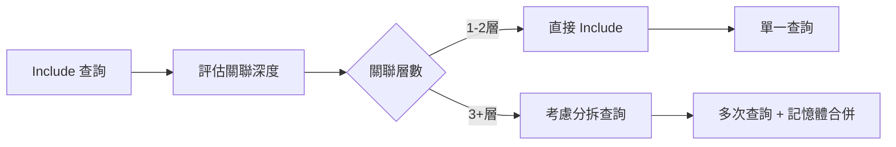
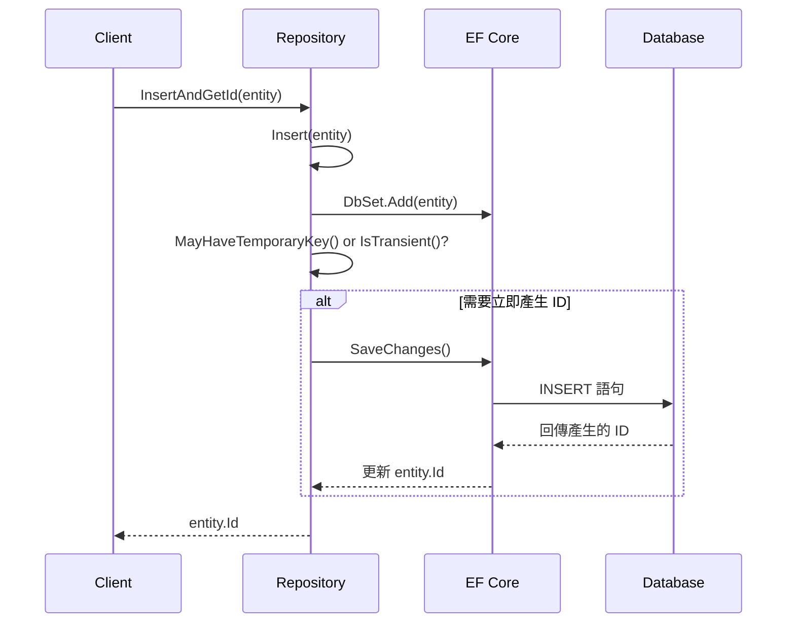
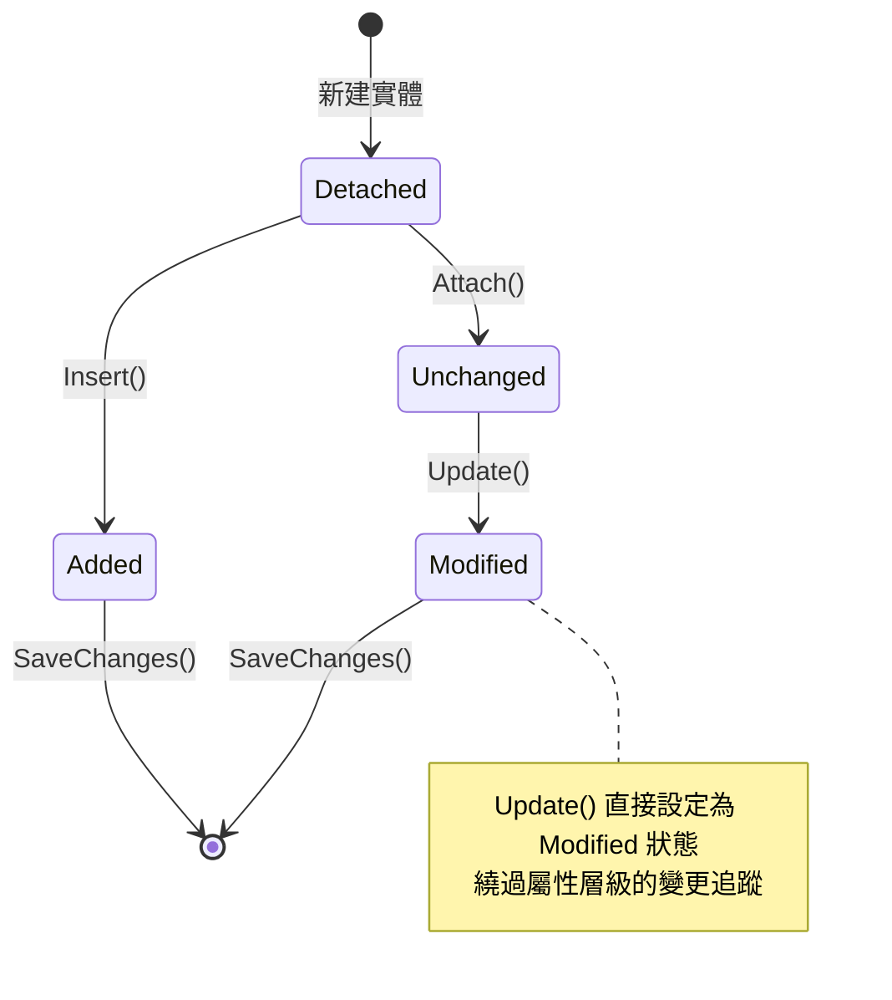
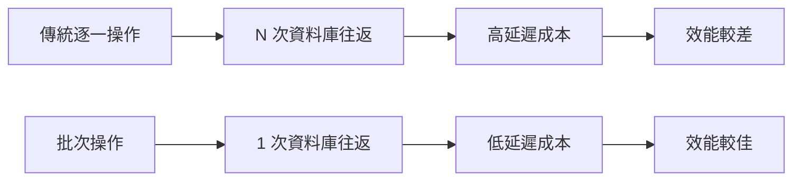
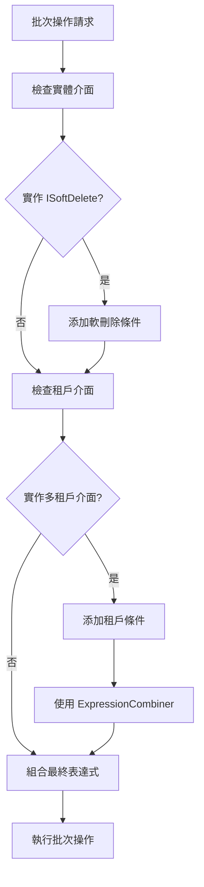

# 第五章：Repository CRUD 操作深度解析

## 概述

本章將深入解析 ASP.NET Boilerplate 框架中 EF Core Repository 的 CRUD（Create、Read、Update、Delete）操作實作。我們將從程式碼層次分析每個操作的核心機制，包括查詢最佳化、ID 產生策略、變更追蹤、軟刪除機制以及批次操作的效能最佳化。

## 5.1 Query 操作的深度分析

### 5.1.1 GetAll() vs GetAllReadonly() 的核心差異

在 `EfCoreRepositoryBase` 中，查詢操作提供了兩種不同的模式：

```csharp
public override IQueryable<TEntity> GetAll()
{
    return GetQueryable();
}

public override IQueryable<TEntity> GetAllReadonly()
{
    return GetQueryable().AsNoTracking();
}
```

**核心差異分析：**

1. **變更追蹤機制**
   - `GetAll()`: 傳回的實體會被 Entity Framework 的 ChangeTracker 追蹤
   - `GetAllReadonly()`: 使用 `AsNoTracking()` 停用變更追蹤

2. **記憶體使用**
   - 追蹤模式會消耗額外記憶體來維持實體狀態
   - 只讀模式避免了狀態追蹤的記憶體開銷

3. **效能考量**
   - 只讀查詢在大量資料讀取時效能更佳
   - 追蹤查詢適合需要後續修改的實體

**使用時機選擇：**

```mermaid
flowchart TD
    A[需要查詢實體] --> B{是否需要修改實體?}
    B -->|是| C[使用 GetAll()]
    B -->|否| D{資料量大小?}
    D -->|大量資料| E[使用 GetAllReadonly()]
    D -->|少量資料| F[兩者皆可]
    
    C --> G[啟用變更追蹤<br/>消耗較多記憶體]
    E --> H[停用變更追蹤<br/>最佳化效能]
    F --> I[根據團隊規範選擇]
```

### 5.1.2 非同步查詢的實作機制

非同步查詢方法提供了非阻塞的資料存取：

```csharp
public override async Task<IQueryable<TEntity>> GetAllAsync()
{
    return await GetQueryableAsync();
}

public override async Task<IQueryable<TEntity>> GetAllReadonlyAsync()
{
    return (await GetQueryableAsync()).AsNoTracking();
}
```

**實作原理：**
- 透過 `GetQueryableAsync()` 方法非同步取得 DbContext
- 保持與同步方法相同的查詢邏輯
- 避免阻塞執行緒，提升應用程式的併發性

### 5.1.3 Include 操作的最佳化實作

Framework 提供了多種 Include 方法來處理關聯資料的載入：

```csharp
public override IQueryable<TEntity> GetAllIncluding(
    params Expression<Func<TEntity, object>>[] propertySelectors)
{
    var query = GetAll();

    if (propertySelectors.IsNullOrEmpty())
    {
        return query;
    }

    foreach (var propertySelector in propertySelectors)
    {
        query = query.Include(propertySelector);
    }

    return query;
}
```

**設計亮點：**
1. **空值檢查**: 透過 `IsNullOrEmpty()` 避免不必要的處理
2. **鏈式呼叫**: 支援多個關聯屬性的同時載入
3. **表達式樹**: 使用強型別的屬性選擇器，避免魔術字串

**效能最佳化技巧：**



## 5.2 Insert 操作的深度解析

### 5.2.1 基本 Insert 實作

```csharp
public override TEntity Insert(TEntity entity)
{
    return GetTable().Add(entity).Entity;
}

public override async Task<TEntity> InsertAsync(TEntity entity)
{
    var table = await GetTableAsync();
    return (await table.AddAsync(entity)).Entity;
}
```

**關鍵實作細節：**
1. 透過 `GetTable()` 取得對應的 `DbSet<TEntity>`
2. 使用 EF Core 的 `Add()` 或 `AddAsync()` 方法
3. 回傳 `EntityEntry<TEntity>.Entity` 屬性

### 5.2.2 InsertAndGetId() 的 ID 產生策略

這是 Repository 模式中的重要方法，特別處理 ID 產生的時機：

```csharp
public override TPrimaryKey InsertAndGetId(TEntity entity)
{
    entity = Insert(entity);

    if (MayHaveTemporaryKey(entity) || entity.IsTransient())
    {
        GetContext().SaveChanges();
    }

    return entity.Id;
}
```

**ID 產生策略分析：**

1. **MayHaveTemporaryKey() 檢查邏輯**：
```csharp
private static bool MayHaveTemporaryKey(TEntity entity)
{
    if (typeof(TPrimaryKey) == typeof(byte))
    {
        return true;
    }

    if (typeof(TPrimaryKey) == typeof(int))
    {
        return Convert.ToInt32(entity.Id) <= 0;
    }

    if (typeof(TPrimaryKey) == typeof(long))
    {
        return Convert.ToInt64(entity.Id) <= 0;
    }

    return false;
}
```

2. **IsTransient() 檢查**：
```csharp
public virtual bool IsTransient()
{
    if (EqualityComparer<TPrimaryKey>.Default.Equals(Id, default(TPrimaryKey)))
    {
        return true;
    }

    // EF Core 的 int/long 特殊處理
    if (typeof(TPrimaryKey) == typeof(int))
    {
        return Convert.ToInt32(Id) <= 0;
    }

    if (typeof(TPrimaryKey) == typeof(long))
    {
        return Convert.ToInt64(Id) <= 0;
    }

    return false;
}
```

**ID 產生策略流程：**



### 5.2.3 InsertOrUpdate() 的 Transient 檢查邏輯

這個方法實作了 "Upsert" 模式的核心邏輯：

```csharp
public virtual TEntity InsertOrUpdate(TEntity entity)
{
    return entity.IsTransient()
        ? Insert(entity)
        : Update(entity);
}
```

**設計理念：**
- **簡潔性**: 透過一個方法處理兩種操作
- **自動判斷**: 基於 `IsTransient()` 的結果自動選擇操作
- **一致性**: 在框架層面統一處理新增和更新的邏輯

## 5.3 Update 操作的變更追蹤原理

### 5.3.1 基本 Update 實作

```csharp
public override TEntity Update(TEntity entity)
{
    AttachIfNot(entity);
    GetContext().Entry(entity).State = EntityState.Modified;
    return entity;
}
```

### 5.3.2 AttachIfNot() 的智慧附加機制

```csharp
protected virtual void AttachIfNot(TEntity entity)
{
    var entry = GetContext().ChangeTracker.Entries()
        .FirstOrDefault(ent => ent.Entity == entity);
    if (entry != null)
    {
        return;
    }

    GetTable().Attach(entity);
}
```

**附加策略分析：**

1. **重複附加檢查**: 檢查實體是否已在 ChangeTracker 中
2. **避免例外**: 防止重複附加導致的 `InvalidOperationException`
3. **效能最佳化**: 只在必要時進行附加操作

**變更追蹤狀態轉換：**



## 5.4 Delete 操作的軟刪除與硬刪除實作

### 5.4.1 基本 Delete 實作

```csharp
public override void Delete(TEntity entity)
{
    AttachIfNot(entity);
    GetTable().Remove(entity);
}

public override void Delete(TPrimaryKey id)
{
    var entity = GetFromChangeTrackerOrNull(id);
    if (entity != null)
    {
        Delete(entity);
        return;
    }

    entity = FirstOrDefault(id);
    if (entity != null)
    {
        Delete(entity);
        return;
    }

    // 找不到實體時不執行任何操作
}
```

### 5.4.2 智慧實體搜尋機制

```csharp
private TEntity GetFromChangeTrackerOrNull(TPrimaryKey id)
{
    var entry = GetContext().ChangeTracker.Entries()
        .FirstOrDefault(
            ent =>
                ent.Entity is TEntity &&
                EqualityComparer<TPrimaryKey>.Default.Equals(id, (ent.Entity as TEntity).Id)
        );

    return entry?.Entity as TEntity;
}
```

**搜尋策略優先順序：**

```mermaid
graph TD
    A[Delete by ID] --> B[搜尋 ChangeTracker]
    B --> C{找到實體?}
    C -->|是| D[直接刪除]
    C -->|否| E[查詢資料庫]
    E --> F{找到實體?}
    F -->|是| G[附加後刪除]
    F -->|否| H[無操作]
    
    D --> I[呼叫 Delete(entity)]
    G --> I
    H --> J[記錄可能的問題]
```

**效能最佳化分析：**
1. **優先使用記憶體**: 先檢查 ChangeTracker 避免資料庫查詢
2. **容錯處理**: 實體不存在時不拋出例外
3. **一致性**: 統一透過 `Delete(TEntity)` 方法處理刪除邏輯

### 5.4.3 軟刪除的自動處理

ABP 框架透過 Global Filters 自動處理軟刪除：

```csharp
// ISoftDelete 介面的實體自動被過濾
public interface ISoftDelete
{
    bool IsDeleted { get; set; }
}
```

**軟刪除的實作機制：**
- EF Core 的 Global Query Filters 自動過濾 `IsDeleted = true` 的記錄
- Repository 層面不需要額外的軟刪除邏輯
- 透過 `IgnoreQueryFilters()` 可以查詢已刪除的資料

## 5.5 Batch 操作的效能最佳化

### 5.5.1 InsertRange 批次新增

```csharp
public static void InsertRange<TEntity, TPrimaryKey>(
    this IRepository<TEntity, TPrimaryKey> repository,
    IEnumerable<TEntity> entities)
    where TEntity : class, IEntity<TPrimaryKey>
{
    repository.GetDbContext().AddRange(entities);
}

public static async Task InsertRangeAsync<TEntity, TPrimaryKey>(
    this IRepository<TEntity, TPrimaryKey> repository, 
    IEnumerable<TEntity> entities)
    where TEntity : class, IEntity<TPrimaryKey>
{
    await repository.GetDbContext().AddRangeAsync(entities);
}
```

### 5.5.2 EF 7.0 批次操作擴展

```csharp
public static async Task<int> BatchDeleteAsync<TEntity, TPrimaryKey>(
    [NotNull] this IRepository<TEntity, TPrimaryKey> repository,
    [NotNull] Expression<Func<TEntity, bool>> predicate)
    where TEntity : Entity<TPrimaryKey>
{
    Check.NotNull(repository, nameof(repository));
    Check.NotNull(predicate, nameof(predicate));

    var query = (await repository.GetAllAsync()).IgnoreQueryFilters();

    var abpFilterExpression = GetFilterExpressionOrNull<TEntity, TPrimaryKey>(
        repository.GetIocResolver());
    var filterExpression = ExpressionCombiner.Combine(predicate, abpFilterExpression);

    query = query.Where(filterExpression);

    return await query.ExecuteDeleteAsync();
}
```

**批次操作的優勢：**



**效能對比分析：**

| 操作類型 | 資料庫往返次數 | 記憶體使用 | 適用場景 |
|---------|-------------|----------|---------|
| 逐一操作 | N 次 | 低 | 少量資料（< 100 筆）|
| 批次操作 | 1 次 | 較高 | 大量資料（> 100 筆）|
| EF 7.0 批次 | 1 次 | 低 | 大量刪除/更新 |

### 5.5.3 Filter Expression 的動態組合

批次操作中的 Filter Expression 組合展現了框架的智慧設計：

```csharp
private static Expression<Func<TEntity, bool>> GetFilterExpressionOrNull<TEntity, TPrimaryKey>(
    IIocResolver iocResolver)
    where TEntity : Entity<TPrimaryKey>
{
    Expression<Func<TEntity, bool>> expression = null;

    using (var scope = iocResolver.CreateScope())
    {
        var currentUnitOfWorkProvider = scope.Resolve<ICurrentUnitOfWorkProvider>();

        // 軟刪除過濾器
        if (typeof(ISoftDelete).IsAssignableFrom(typeof(TEntity)))
        {
            var isSoftDeleteFilterEnabled =
                currentUnitOfWorkProvider.Current?.IsFilterEnabled(AbpDataFilters.SoftDelete) == true;
            if (isSoftDeleteFilterEnabled)
            {
                Expression<Func<TEntity, bool>> softDeleteFilter = e => !((ISoftDelete)e).IsDeleted;
                expression = softDeleteFilter;
            }
        }

        // 多租戶過濾器組合
        // ...
    }

    return expression;
}
```

**表達式組合策略：**



## 5.6 CRUD 操作的效能最佳化實踐

### 5.6.1 查詢最佳化建議

1. **適當使用 ReadOnly 查詢**
```csharp
// 好的做法：報表查詢
var statistics = await repository.GetAllReadonly()
    .Where(x => x.CreationTime >= startDate)
    .GroupBy(x => x.Category)
    .Select(g => new StatisticsDto 
    { 
        Category = g.Key, 
        Count = g.Count() 
    })
    .ToListAsync();

// 避免：不必要的追蹤
var entities = await repository.GetAll() // 會啟用變更追蹤
    .Where(x => x.IsActive)
    .ToListAsync(); // 僅用於顯示，不會修改
```

2. **合理使用 Include**
```csharp
// 好的做法：明確指定需要的關聯
var orders = await repository.GetAllIncluding(
    o => o.Customer,
    o => o.OrderItems.Select(oi => oi.Product)
).ToListAsync();

// 避免：過度載入
var orders = await repository.GetAllIncluding(
    o => o.Customer.Address.City.Country, // 過深的關聯
    o => o.OrderItems.Select(oi => oi.Product.Category.Department)
).ToListAsync();
```

### 5.6.2 Insert/Update 最佳化

1. **批次操作的使用時機**
```csharp
// 大量新增時使用批次操作
if (entities.Count > 100)
{
    repository.InsertRange(entities);
    await unitOfWork.SaveChangesAsync();
}
else
{
    foreach (var entity in entities)
    {
        await repository.InsertAsync(entity);
    }
}
```

2. **適當的 SaveChanges 時機**
```csharp
// 好的做法：批次提交
foreach (var batch in entities.Batch(1000))
{
    repository.InsertRange(batch);
    await unitOfWork.SaveChangesAsync(); // 每 1000 筆提交一次
}

// 避免：頻繁提交
foreach (var entity in entities)
{
    await repository.InsertAndGetIdAsync(entity); // 每次都會 SaveChanges
}
```

## 5.7 本章總結

本章深入分析了 EF Core Repository 中 CRUD 操作的核心實作機制：

### 關鍵概念回顧

1. **查詢策略**
   - `GetAll()` vs `GetAllReadonly()` 的適用場景
   - Include 操作的效能考量
   - 非同步查詢的正確使用

2. **Insert 機制**
   - ID 產生策略的智慧判斷
   - `InsertOrUpdate()` 的 Transient 檢查
   - 批次新增的效能優勢

3. **Update 邏輯**
   - `AttachIfNot()` 的智慧附加機制
   - 變更追蹤狀態的管理
   - 實體狀態轉換的最佳化

4. **Delete 操作**
   - 智慧實體搜尋策略
   - 軟刪除的自動處理
   - 批次刪除的實作原理

### 效能最佳化要點

- 根據使用場景選擇適當的查詢模式
- 合理使用批次操作處理大量資料
- 避免不必要的變更追蹤和關聯載入
- 善用 EF 7.0 的新批次操作功能

這些深入的理解將有助於開發者在實際專案中做出正確的技術決策，充分發揮 Repository 模式的效能優勢。

---

## 📖 章節導覽

### ⬅️ 上一章
**[第四章：Unit of Work 與交易管理](./04-Unit%20of%20Work%20與交易管理.md)**
- Unit of Work 模式深度解析
- EfCoreUnitOfWork 核心實作
- 交易管理與回滾機制

### ➡️ 下一章
**[第六章：自訂 Repository 設計與實作](./06-自訂%20Repository%20設計與實作.md)**
- 自訂 Repository 設計原則
- Application-Specific Repository 建立
- 複雜查詢封裝技巧

### 🏠 返回目錄
**[EF Core Repository 權威指南 - 目錄](./README.md)**

### 🎯 相關章節
- **[第七章：效能最佳化與進階特性](./07-效能最佳化與進階特性.md)** - CRUD 操作的進階效能優化
- **[第八章：測試策略與最佳實踐](./08-測試策略與最佳實踐.md)** - CRUD 操作的測試策略

### 💡 學習建議
1. **實務練習**：建議實際測試各種 CRUD 操作的效能差異
2. **記憶體監控**：學會使用工具監控 EF Core 的記憶體使用
3. **查詢分析**：掌握 SQL 查詢分析工具的使用

### 🔍 關鍵概念
- **變更追蹤**：理解 EF Core 變更追蹤的運作機制
- **批次操作**：掌握批次操作的效能優勢與使用時機
- **生命週期**：理解實體在 DbContext 中的生命週期管理

### ⚡ 效能要點
- **只讀查詢**：適時使用 `AsNoTracking()` 提升查詢效能
- **批次處理**：大量資料操作時優先考慮批次 API
- **查詢優化**：避免 N+1 查詢問題，善用 Include 預載入

---

*完成本章學習後，您將具備深度操作 Repository CRUD 的能力，能夠在實際專案中做出最佳的技術選擇。*
