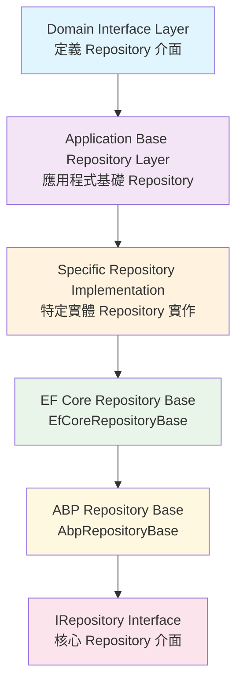
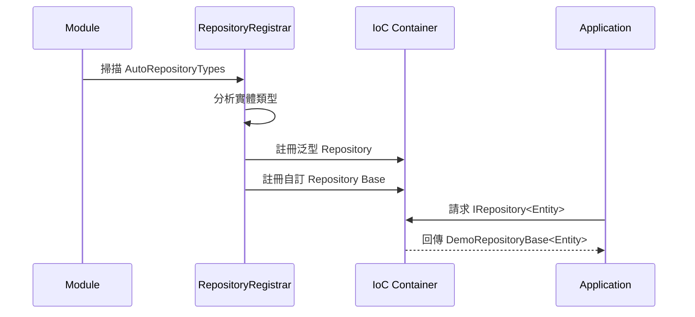

# 第六章：自訂 Repository 設計與實作

## 概述

雖然 ASP.NET Boilerplate 提供了強大的泛型 Repository 實作，但在實際的企業級應用開發中，我們經常需要建立自訂的 Repository 來處理特定的業務邏輯和複雜查詢。本章將深入探討如何設計和實作高品質的自訂 Repository，包括架構設計原則、實作策略、註冊機制以及最佳實踐。

## 6.1 自訂 Repository 的設計原則

### 6.1.1 分層設計原則

在 ABP 框架中，自訂 Repository 應該遵循清晰的分層設計：



### 6.1.2 介面隔離原則

每個自訂 Repository 應該定義專門的介面，避免介面污染：

```csharp
// 好的設計：專門的介面
public interface IUserRepository : IRepository<User, long>
{
    Task<User> FindByEmailAsync(string email);
    Task<List<User>> GetActiveUsersAsync();
    Task<bool> IsEmailExistsAsync(string email);
}

// 避免：在泛型介面中添加特定方法
public interface IRepository<TEntity, TPrimaryKey>
{
    // ... 基本方法
    Task<User> FindByEmailAsync(string email); // ❌ 不應該在泛型介面中
}
```

### 6.1.3 單一職責原則

每個自訂 Repository 應該專注於單一實體的資料存取邏輯：

```csharp
// 好的設計：專注於 User 實體
public interface IUserRepository : IRepository<User, long>
{
    Task<User> FindByEmailAsync(string email);
    Task<List<User>> GetUsersInRoleAsync(string roleName);
}

// 避免：混合多個實體的操作
public interface IUserRepository : IRepository<User, long>
{
    Task<User> FindByEmailAsync(string email);
    Task<List<Role>> GetRolesAsync(); // ❌ 應該由 IRoleRepository 處理
}
```

## 6.2 Application-Specific Base Repository 的建立

### 6.2.1 Demo 專案中的實作範例

讓我們深入分析 Demo 專案中的 `DemoRepositoryBase` 實作：

```csharp
/// <summary>
/// Base class for custom repositories of the application.
/// </summary>
/// <typeparam name="TEntity">Entity type</typeparam>
/// <typeparam name="TPrimaryKey">Primary key type of the entity</typeparam>
public abstract class DemoRepositoryBase<TEntity, TPrimaryKey> : EfCoreRepositoryBase<DemoDbContext, TEntity, TPrimaryKey>
    where TEntity : class, IEntity<TPrimaryKey>
{
    protected DemoRepositoryBase(IDbContextProvider<DemoDbContext> dbContextProvider)
        : base(dbContextProvider)
    {
    }

    // Add your common methods for all repositories
}

/// <summary>
/// Base class for custom repositories of the application.
/// This is a shortcut of <see cref="DemoRepositoryBase{TEntity,TPrimaryKey}"/> for <see cref="int"/> primary key.
/// </summary>
/// <typeparam name="TEntity">Entity type</typeparam>
public abstract class DemoRepositoryBase<TEntity> : DemoRepositoryBase<TEntity, int>, IRepository<TEntity>
    where TEntity : class, IEntity<int>
{
    protected DemoRepositoryBase(IDbContextProvider<DemoDbContext> dbContextProvider)
        : base(dbContextProvider)
    {
    }

    // Do not add any method here, add to the class above (since this inherits it)!!!
}
```

### 6.2.2 設計亮點分析

**1. 泛型參數的層次設計**
- `DemoRepositoryBase<TEntity, TPrimaryKey>`: 支援任意主鍵類型
- `DemoRepositoryBase<TEntity>`: 為常見的 `int` 主鍵提供簡化版本

**2. DbContext 的強型別綁定**
- 明確指定 `DemoDbContext` 作為 DbContext 類型
- 確保所有自訂 Repository 使用相同的 DbContext

**3. 構造函數的依賴注入**
- 透過 `IDbContextProvider<DemoDbContext>` 注入 DbContext 提供者
- 遵循 ABP 的依賴注入模式

### 6.2.3 擴展 Application Base Repository

在實際專案中，我們可以在 Application Base Repository 中添加通用方法：

```csharp
public abstract class DemoRepositoryBase<TEntity, TPrimaryKey> : EfCoreRepositoryBase<DemoDbContext, TEntity, TPrimaryKey>
    where TEntity : class, IEntity<TPrimaryKey>
{
    protected DemoRepositoryBase(IDbContextProvider<DemoDbContext> dbContextProvider)
        : base(dbContextProvider)
    {
    }

    /// <summary>
    /// 軟刪除實體（如果實作 ISoftDelete）
    /// </summary>
    public virtual async Task SoftDeleteAsync(TEntity entity)
    {
        if (entity is ISoftDelete softDeleteEntity)
        {
            softDeleteEntity.IsDeleted = true;
            await UpdateAsync(entity);
        }
        else
        {
            await DeleteAsync(entity);
        }
    }

    /// <summary>
    /// 批次軟刪除
    /// </summary>
    public virtual async Task SoftDeleteAsync(Expression<Func<TEntity, bool>> predicate)
    {
        if (typeof(ISoftDelete).IsAssignableFrom(typeof(TEntity)))
        {
            var entities = await GetAllListAsync(predicate);
            foreach (var entity in entities)
            {
                ((ISoftDelete)entity).IsDeleted = true;
            }
        }
        else
        {
            await DeleteAsync(predicate);
        }
    }

    /// <summary>
    /// 取得分頁資料（包含總數）
    /// </summary>
    public virtual async Task<(List<TEntity> Items, int TotalCount)> GetPagedListAsync(
        int skipCount, 
        int maxResultCount, 
        Expression<Func<TEntity, bool>> predicate = null)
    {
        var query = await GetAllAsync();
        
        if (predicate != null)
        {
            query = query.Where(predicate);
        }

        var totalCount = await query.CountAsync();
        var items = await query
            .Skip(skipCount)
            .Take(maxResultCount)
            .ToListAsync();

        return (items, totalCount);
    }

    /// <summary>
    /// 檢查實體是否存在
    /// </summary>
    public virtual async Task<bool> ExistsAsync(Expression<Func<TEntity, bool>> predicate)
    {
        return await (await GetAllAsync()).AnyAsync(predicate);
    }

    /// <summary>
    /// 取得實體數量
    /// </summary>
    public virtual async Task<int> GetCountAsync(Expression<Func<TEntity, bool>> predicate = null)
    {
        var query = await GetAllAsync();
        return predicate == null 
            ? await query.CountAsync() 
            : await query.CountAsync(predicate);
    }
}
```

## 6.3 Domain-Specific Repository 的實作策略

### 6.3.1 複雜查詢的封裝

對於業務相關的複雜查詢，應該在 Domain-Specific Repository 中進行封裝：

```csharp
public interface IUserRepository : IRepository<User, long>
{
    Task<User> FindByEmailAsync(string email);
    Task<List<User>> GetActiveUsersInOrganizationAsync(int organizationId);
    Task<PagedResultDto<User>> GetUsersWithRolesAsync(GetUsersInput input);
    Task<bool> IsEmailUniqueAsync(string email, long? excludeUserId = null);
    Task<List<User>> GetUsersCreatedInDateRangeAsync(DateTime startDate, DateTime endDate);
}

public class UserRepository : DemoRepositoryBase<User, long>, IUserRepository
{
    public UserRepository(IDbContextProvider<DemoDbContext> dbContextProvider)
        : base(dbContextProvider)
    {
    }

    public async Task<User> FindByEmailAsync(string email)
    {
        return await FirstOrDefaultAsync(u => u.EmailAddress == email.ToLowerInvariant());
    }

    public async Task<List<User>> GetActiveUsersInOrganizationAsync(int organizationId)
    {
        return await GetAllListAsync(u => 
            u.IsActive && 
            u.OrganizationUnits.Any(ou => ou.OrganizationUnitId == organizationId));
    }

    public async Task<PagedResultDto<User>> GetUsersWithRolesAsync(GetUsersInput input)
    {
        var query = GetAllIncluding(u => u.Roles)
            .WhereIf(!string.IsNullOrEmpty(input.Filter), 
                u => u.Name.Contains(input.Filter) || u.EmailAddress.Contains(input.Filter))
            .WhereIf(input.IsActive.HasValue, u => u.IsActive == input.IsActive.Value);

        var totalCount = await query.CountAsync();
        var users = await query
            .OrderBy(input.Sorting ?? "Name")
            .Skip(input.SkipCount)
            .Take(input.MaxResultCount)
            .ToListAsync();

        return new PagedResultDto<User>(totalCount, users);
    }

    public async Task<bool> IsEmailUniqueAsync(string email, long? excludeUserId = null)
    {
        var query = GetAll().Where(u => u.EmailAddress == email.ToLowerInvariant());
        
        if (excludeUserId.HasValue)
        {
            query = query.Where(u => u.Id != excludeUserId.Value);
        }

        return !await query.AnyAsync();
    }

    public async Task<List<User>> GetUsersCreatedInDateRangeAsync(DateTime startDate, DateTime endDate)
    {
        return await GetAllListAsync(u => 
            u.CreationTime >= startDate && 
            u.CreationTime < endDate.AddDays(1));
    }
}
```

### 6.3.2 查詢方法的命名約定

建立清晰的命名約定有助於程式碼可讀性：

```csharp
public interface IOrderRepository : IRepository<Order, int>
{
    // Find - 查找單一實體，可能為 null
    Task<Order> FindByOrderNumberAsync(string orderNumber);
    
    // Get - 查找單一實體，不存在時拋出異常
    Task<Order> GetByOrderNumberAsync(string orderNumber);
    
    // GetList/GetAll - 查找多個實體
    Task<List<Order>> GetOrdersByCustomerAsync(int customerId);
    Task<List<Order>> GetOrdersByDateRangeAsync(DateTime start, DateTime end);
    
    // GetPaged - 分頁查詢
    Task<PagedResultDto<Order>> GetPagedOrdersAsync(GetOrdersInput input);
    
    // Count - 計數查詢
    Task<int> GetOrderCountByStatusAsync(OrderStatus status);
    
    // Exists/Is - 存在性檢查
    Task<bool> ExistsOrderWithNumberAsync(string orderNumber);
    Task<bool> IsOrderEditableAsync(int orderId);
}
```

### 6.3.3 複雜關聯查詢的最佳化

對於涉及多個實體的複雜查詢，需要仔細最佳化：

```csharp
public class OrderRepository : DemoRepositoryBase<Order, int>, IOrderRepository
{
    public async Task<List<OrderSummaryDto>> GetOrderSummariesWithDetailsAsync(GetOrderSummariesInput input)
    {
        // 使用 LINQ 構建複雜查詢
        var query = from order in GetAll()
                    join customer in GetContext().Set<Customer>() on order.CustomerId equals customer.Id
                    join orderItem in GetContext().Set<OrderItem>() on order.Id equals orderItem.OrderId into orderItems
                    where order.CreationTime >= input.StartDate && order.CreationTime <= input.EndDate
                    select new OrderSummaryDto
                    {
                        OrderId = order.Id,
                        OrderNumber = order.OrderNumber,
                        CustomerName = customer.Name,
                        TotalAmount = orderItems.Sum(oi => oi.Quantity * oi.UnitPrice),
                        ItemCount = orderItems.Count(),
                        Status = order.Status,
                        OrderDate = order.CreationTime
                    };

        return await query.ToListAsync();
    }

    public async Task<OrderDetailDto> GetOrderWithFullDetailsAsync(int orderId)
    {
        // 分步載入以避免笛卡爾積問題
        var order = await GetAllIncluding(o => o.Customer)
            .FirstOrDefaultAsync(o => o.Id == orderId);

        if (order == null)
        {
            throw new EntityNotFoundException(typeof(Order), orderId);
        }

        // 分別載入相關資料
        var orderItems = await GetContext().Set<OrderItem>()
            .Include(oi => oi.Product)
            .Where(oi => oi.OrderId == orderId)
            .ToListAsync();

        var orderHistory = await GetContext().Set<OrderStatusHistory>()
            .Where(osh => osh.OrderId == orderId)
            .OrderBy(osh => osh.CreationTime)
            .ToListAsync();

        return new OrderDetailDto
        {
            Order = order,
            OrderItems = orderItems,
            StatusHistory = orderHistory
        };
    }
}
```

## 6.4 Repository 介面的設計最佳實踐

### 6.4.1 介面職責劃分

```csharp
// 基礎查詢介面
public interface IUserRepositoryQueries : IRepository<User, long>
{
    Task<User> FindByEmailAsync(string email);
    Task<User> FindByUsernameAsync(string username);
    Task<List<User>> GetActiveUsersAsync();
    Task<bool> IsEmailExistsAsync(string email);
}

// 複雜業務邏輯介面
public interface IUserRepositoryOperations
{
    Task<bool> CanUserAccessOrganizationAsync(long userId, int organizationId);
    Task<List<User>> GetUsersWithPermissionAsync(string permissionName);
    Task UpdateLastLoginTimeAsync(long userId);
}

// 統合介面
public interface IUserRepository : IUserRepositoryQueries, IUserRepositoryOperations
{
}
```

### 6.4.2 DTO 投影的最佳化

使用 DTO 投影來最佳化查詢效能：

```csharp
public interface IUserRepository : IRepository<User, long>
{
    // 直接投影到 DTO，避免載入完整實體
    Task<List<UserListDto>> GetUserListAsync(GetUsersInput input);
    Task<UserDetailDto> GetUserDetailAsync(long userId);
}

public class UserRepository : DemoRepositoryBase<User, long>, IUserRepository
{
    public async Task<List<UserListDto>> GetUserListAsync(GetUsersInput input)
    {
        var query = GetAll()
            .Where(u => u.IsActive)
            .WhereIf(!string.IsNullOrEmpty(input.Filter), 
                u => u.Name.Contains(input.Filter))
            .Select(u => new UserListDto
            {
                Id = u.Id,
                Name = u.Name,
                EmailAddress = u.EmailAddress,
                IsActive = u.IsActive,
                CreationTime = u.CreationTime,
                RoleNames = u.Roles.Select(r => r.RoleName).ToList()
            });

        return await query
            .Skip(input.SkipCount)
            .Take(input.MaxResultCount)
            .ToListAsync();
    }
}
```

## 6.5 自訂 Repository 的註冊與解析機制

### 6.5.1 自動註冊機制

ABP 框架透過 `AutoRepositoryTypes` 屬性支援自動註冊：

```csharp
[AutoRepositoryTypes(
    typeof(IRepository<>),
    typeof(IRepository<,>),
    typeof(DemoRepositoryBase<>),
    typeof(DemoRepositoryBase<,>)
)]
public class DemoDbContext : AbpDbContext<DemoDbContext>
{
    // DbSet 定義
    public DbSet<User> Users { get; set; }
    public DbSet<Role> Roles { get; set; }
    
    // ...
}
```

**註冊機制的工作原理：**



### 6.5.2 手動註冊特定 Repository

對於需要特殊處理的 Repository，可以手動註冊：

```csharp
public class DemoEntityFrameworkCoreModule : AbpModule
{
    public override void PreInitialize()
    {
        // 自動註冊配置
        Configuration.Modules.AbpEfCore().AddDbContext<DemoDbContext>(options =>
        {
            if (options.ExistingConnection != null)
            {
                DemoDbContextConfigurer.Configure(options.DbContextOptions, options.ExistingConnection);
            }
            else
            {
                DemoDbContextConfigurer.Configure(options.DbContextOptions, options.ConnectionString);
            }
        });
    }

    public override void Initialize()
    {
        IocManager.RegisterAssemblyByConvention(typeof(DemoEntityFrameworkCoreModule).GetAssembly());
        
        // 手動註冊特定 Repository
        IocManager.Register<IUserRepository, UserRepository>(DependencyLifeStyle.Transient);
        IocManager.Register<IOrderRepository, OrderRepository>(DependencyLifeStyle.Transient);
    }
}
```

### 6.5.3 Repository 的生命週期管理

```csharp
// 預設：Transient（每次請求建立新實例）
IocManager.Register<IUserRepository, UserRepository>(DependencyLifeStyle.Transient);

// 單例：Singleton（應用程式生命週期內共用）
IocManager.Register<ICacheRepository, CacheRepository>(DependencyLifeStyle.Singleton);

// 範圍：Scoped（相同請求內共用，適用於 Web 應用）
// 注意：ABP 預設使用 UnitOfWork 管理 Repository 生命週期
```

## 6.6 複雜查詢的封裝技巧

### 6.6.1 查詢規格模式（Specification Pattern）

```csharp
public interface ISpecification<T>
{
    Expression<Func<T, bool>> Criteria { get; }
    List<Expression<Func<T, object>>> Includes { get; }
    List<string> IncludeStrings { get; }
}

public abstract class BaseSpecification<T> : ISpecification<T>
{
    public Expression<Func<T, bool>> Criteria { get; private set; }
    public List<Expression<Func<T, object>>> Includes { get; } = new List<Expression<Func<T, object>>>();
    public List<string> IncludeStrings { get; } = new List<string>();

    protected BaseSpecification(Expression<Func<T, bool>> criteria)
    {
        Criteria = criteria;
    }

    protected virtual void AddInclude(Expression<Func<T, object>> includeExpression)
    {
        Includes.Add(includeExpression);
    }

    protected virtual void AddInclude(string includeString)
    {
        IncludeStrings.Add(includeString);
    }
}

public class ActiveUsersInOrganizationSpecification : BaseSpecification<User>
{
    public ActiveUsersInOrganizationSpecification(int organizationId)
        : base(u => u.IsActive && u.OrganizationUnits.Any(ou => ou.OrganizationUnitId == organizationId))
    {
        AddInclude(u => u.OrganizationUnits);
        AddInclude(u => u.Roles);
    }
}

// Repository 中使用規格
public class UserRepository : DemoRepositoryBase<User, long>, IUserRepository
{
    public async Task<List<User>> GetUsersAsync(ISpecification<User> spec)
    {
        var query = GetAll();
        
        if (spec.Criteria != null)
        {
            query = query.Where(spec.Criteria);
        }

        query = spec.Includes.Aggregate(query, (current, include) => current.Include(include));
        query = spec.IncludeStrings.Aggregate(query, (current, include) => current.Include(include));

        return await query.ToListAsync();
    }
}
```

### 6.6.2 查詢構建器模式

```csharp
public class UserQueryBuilder
{
    private IQueryable<User> _query;

    public UserQueryBuilder(IQueryable<User> baseQuery)
    {
        _query = baseQuery;
    }

    public UserQueryBuilder FilterByName(string name)
    {
        if (!string.IsNullOrEmpty(name))
        {
            _query = _query.Where(u => u.Name.Contains(name));
        }
        return this;
    }

    public UserQueryBuilder FilterByEmail(string email)
    {
        if (!string.IsNullOrEmpty(email))
        {
            _query = _query.Where(u => u.EmailAddress.Contains(email));
        }
        return this;
    }

    public UserQueryBuilder FilterByActiveStatus(bool? isActive)
    {
        if (isActive.HasValue)
        {
            _query = _query.Where(u => u.IsActive == isActive.Value);
        }
        return this;
    }

    public UserQueryBuilder FilterByRole(string roleName)
    {
        if (!string.IsNullOrEmpty(roleName))
        {
            _query = _query.Where(u => u.Roles.Any(r => r.RoleName == roleName));
        }
        return this;
    }

    public UserQueryBuilder IncludeRoles()
    {
        _query = _query.Include(u => u.Roles);
        return this;
    }

    public UserQueryBuilder OrderBy(string sorting)
    {
        if (!string.IsNullOrEmpty(sorting))
        {
            _query = _query.OrderBy(sorting);
        }
        return this;
    }

    public IQueryable<User> Build()
    {
        return _query;
    }
}

// Repository 中使用查詢構建器
public class UserRepository : DemoRepositoryBase<User, long>, IUserRepository
{
    public async Task<PagedResultDto<User>> GetUsersAsync(GetUsersInput input)
    {
        var queryBuilder = new UserQueryBuilder(GetAll())
            .FilterByName(input.Name)
            .FilterByEmail(input.Email)
            .FilterByActiveStatus(input.IsActive)
            .FilterByRole(input.RoleName)
            .IncludeRoles()
            .OrderBy(input.Sorting ?? "Name");

        var query = queryBuilder.Build();
        
        var totalCount = await query.CountAsync();
        var users = await query
            .Skip(input.SkipCount)
            .Take(input.MaxResultCount)
            .ToListAsync();

        return new PagedResultDto<User>(totalCount, users);
    }
}
```

### 6.6.3 原始 SQL 查詢的封裝

對於極其複雜的查詢，有時需要使用原始 SQL：

```csharp
public class UserRepository : DemoRepositoryBase<User, long>, IUserRepository
{
    public async Task<List<UserStatisticsDto>> GetUserStatisticsAsync(DateTime startDate, DateTime endDate)
    {
        var sql = @"
            SELECT 
                u.Id,
                u.Name,
                u.EmailAddress,
                COUNT(DISTINCT o.Id) as OrderCount,
                COALESCE(SUM(o.TotalAmount), 0) as TotalOrderValue,
                MAX(o.CreationTime) as LastOrderDate
            FROM Users u
            LEFT JOIN Orders o ON u.Id = o.CustomerId 
                AND o.CreationTime BETWEEN @StartDate AND @EndDate
            WHERE u.IsActive = 1
            GROUP BY u.Id, u.Name, u.EmailAddress
            ORDER BY TotalOrderValue DESC";

        var parameters = new[]
        {
            new SqlParameter("@StartDate", startDate),
            new SqlParameter("@EndDate", endDate)
        };

        return await GetContext().Database
            .SqlQueryRaw<UserStatisticsDto>(sql, parameters)
            .ToListAsync();
    }

    public async Task<int> BulkUpdateUserStatusAsync(List<long> userIds, bool isActive)
    {
        var userIdList = string.Join(",", userIds);
        var sql = $@"
            UPDATE Users 
            SET IsActive = @IsActive, LastModificationTime = @Now
            WHERE Id IN ({userIdList})";

        var parameters = new[]
        {
            new SqlParameter("@IsActive", isActive),
            new SqlParameter("@Now", Clock.Now)
        };

        return await GetContext().Database.ExecuteSqlRawAsync(sql, parameters);
    }
}
```

## 6.7 Repository 的單元測試策略

### 6.7.1 測試基礎設施設定

```csharp
public abstract class DemoRepositoryTestBase : DemoTestBase
{
    protected readonly IUserRepository UserRepository;
    protected readonly IOrderRepository OrderRepository;

    protected DemoRepositoryTestBase()
    {
        UserRepository = Resolve<IUserRepository>();
        OrderRepository = Resolve<IOrderRepository>();
    }

    protected async Task<User> CreateTestUserAsync(string email = "test@example.com")
    {
        var user = new User
        {
            Name = "Test User",
            EmailAddress = email,
            IsActive = true
        };

        await UserRepository.InsertAsync(user);
        await CurrentUnitOfWork.SaveChangesAsync();
        return user;
    }
}
```

### 6.7.2 Repository 方法的測試

```csharp
public class UserRepository_Tests : DemoRepositoryTestBase
{
    [Fact]
    public async Task FindByEmailAsync_Should_Return_User_When_Email_Exists()
    {
        // Arrange
        const string testEmail = "test@example.com";
        await CreateTestUserAsync(testEmail);

        // Act
        var user = await UserRepository.FindByEmailAsync(testEmail);

        // Assert
        user.ShouldNotBeNull();
        user.EmailAddress.ShouldBe(testEmail);
    }

    [Fact]
    public async Task FindByEmailAsync_Should_Return_Null_When_Email_Not_Exists()
    {
        // Act
        var user = await UserRepository.FindByEmailAsync("nonexistent@example.com");

        // Assert
        user.ShouldBeNull();
    }

    [Fact]
    public async Task IsEmailUniqueAsync_Should_Return_True_When_Email_Not_Exists()
    {
        // Act
        var isUnique = await UserRepository.IsEmailUniqueAsync("unique@example.com");

        // Assert
        isUnique.ShouldBeTrue();
    }

    [Fact]
    public async Task IsEmailUniqueAsync_Should_Return_False_When_Email_Exists()
    {
        // Arrange
        const string testEmail = "test@example.com";
        await CreateTestUserAsync(testEmail);

        // Act
        var isUnique = await UserRepository.IsEmailUniqueAsync(testEmail);

        // Assert
        isUnique.ShouldBeFalse();
    }

    [Fact]
    public async Task GetActiveUsersInOrganizationAsync_Should_Return_Only_Active_Users()
    {
        // Arrange
        var activeUser = await CreateTestUserAsync("active@example.com");
        var inactiveUser = await CreateTestUserAsync("inactive@example.com");
        inactiveUser.IsActive = false;
        await UserRepository.UpdateAsync(inactiveUser);

        const int organizationId = 1;
        // 假設有設定組織關聯

        // Act
        var users = await UserRepository.GetActiveUsersInOrganizationAsync(organizationId);

        // Assert
        users.ShouldContain(u => u.Id == activeUser.Id);
        users.ShouldNotContain(u => u.Id == inactiveUser.Id);
    }
}
```

## 6.8 本章總結

本章深入探討了自訂 Repository 的設計與實作策略：

### 關鍵設計原則

1. **分層設計**
   - 清晰的介面定義
   - Application Base Repository 的建立
   - Domain-Specific Repository 的實作

2. **設計模式應用**
   - 查詢規格模式（Specification Pattern）
   - 查詢構建器模式（Builder Pattern）
   - 依賴注入模式（DI Pattern）

3. **效能最佳化**
   - DTO 投影避免過度載入
   - 複雜查詢的分步處理
   - 原始 SQL 的適當使用

### 實作要點

- **介面設計**: 遵循單一職責原則，避免介面污染
- **查詢封裝**: 將複雜的業務查詢邏輯封裝在 Repository 中
- **註冊機制**: 理解並善用 ABP 的自動註冊機制
- **測試策略**: 建立完整的單元測試覆蓋

### 最佳實踐建議

1. **命名約定**: 建立清晰的方法命名規範
2. **職責劃分**: 每個 Repository 專注於單一實體
3. **效能考量**: 根據查詢複雜度選擇適當的實作策略
4. **可測試性**: 設計時考慮單元測試的需求

透過本章的學習，開發者將能夠設計出高品質、可維護且效能優良的自訂 Repository，充分發揮 ABP 框架的架構優勢。

---

## 📖 章節導覽

### ⬅️ 上一章
**[第五章：Repository CRUD 操作深度解析](./05-Repository%20CRUD%20操作深度解析.md)**
- Repository CRUD 操作全面解析
- Query 操作最佳化策略
- 變更追蹤與批次操作

### ➡️ 下一章
**[第七章：效能最佳化與進階特性](./07-效能最佳化與進階特性.md)**
- Repository 效能最佳化技巧
- Query Compilation 與快取
- 進階特性應用

### 🏠 返回目錄
**[EF Core Repository 權威指南 - 目錄](./README.md)**

### 🎯 相關章節
- **[第一章：Repository Pattern 理論基礎](./01-Repository%20Pattern%20理論基礎.md)** - Repository 設計理論基礎
- **[第八章：測試策略與最佳實踐](./08-測試策略與最佳實踐.md)** - 自訂 Repository 的測試策略

### 💡 學習建議
1. **實作練習**：建議實際建立一個自訂 Repository 專案
2. **設計模式**：深入學習 Specification Pattern 和 Builder Pattern
3. **程式碼審查**：參考開源專案中的 Repository 實作

### 🔍 關鍵概念
- **介面設計**：學會設計清晰且可維護的 Repository 介面
- **查詢封裝**：掌握複雜查詢邏輯的封裝技巧
- **依賴注入**：理解自訂 Repository 的註冊與解析機制

### 🛠️ 實作技巧
- **分層架構**：建立清晰的 Repository 分層結構
- **命名規範**：建立一致的方法命名約定
- **效能優化**：在設計階段就考慮效能問題

### 🎯 實際應用
- **專案結構**：學會組織大型專案的 Repository 結構
- **團隊協作**：建立團隊共識的 Repository 設計標準
- **維護策略**：設計易於擴展和維護的 Repository

---

*完成本章學習後，您將具備設計和實作高品質自訂 Repository 的能力，能夠根據專案需求建立最適合的資料存取層架構。*
