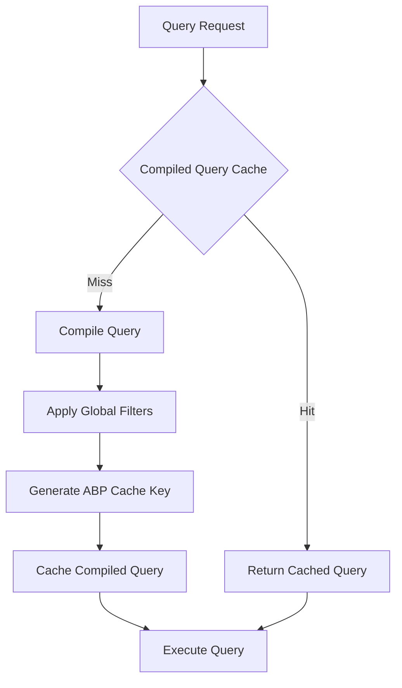
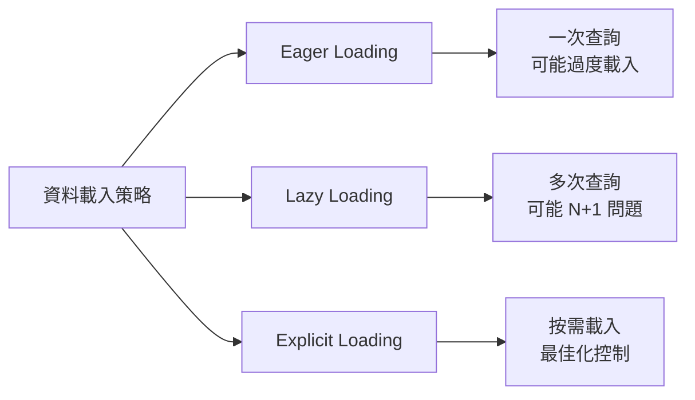
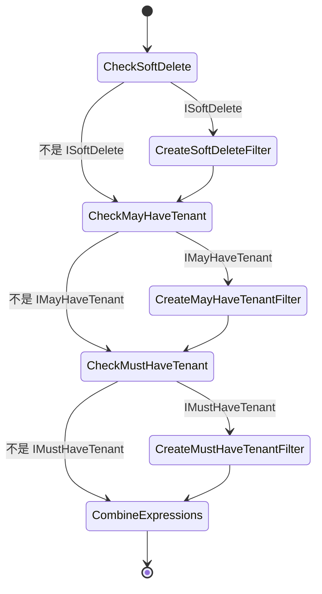
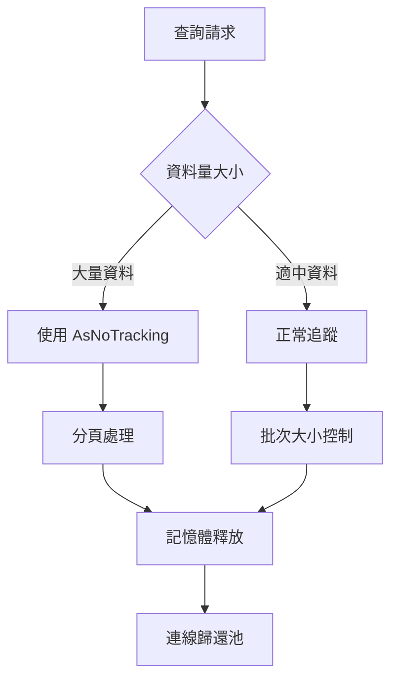

# 第七章：效能最佳化與進階特性

## 概述

本章將深入探討 ASP.NET Boilerplate 框架中 EF Core Repository 的效能最佳化技術與進階特性。我們將分析查詢編譯與快取策略、Explicit Loading 的實作原理、Global Filters 的動態配置、Value Converters 的應用場景，以及連線池與資源管理的最佳實踐。

## 7.1 Query Compilation 與快取策略

### 7.1.1 AbpCompiledQueryCacheKeyGenerator 的核心機制

ABP 框架提供了自訂的查詢快取鍵產生器，用於最佳化查詢編譯的效能：

```csharp
public class AbpCompiledQueryCacheKeyGenerator : ICompiledQueryCacheKeyGenerator
{
    protected ICompiledQueryCacheKeyGenerator InnerCompiledQueryCacheKeyGenerator { get; }
    protected ICurrentDbContext CurrentContext { get; }

    public AbpCompiledQueryCacheKeyGenerator(
        ICompiledQueryCacheKeyGenerator innerCompiledQueryCacheKeyGenerator,
        ICurrentDbContext currentContext)
    {
        InnerCompiledQueryCacheKeyGenerator = innerCompiledQueryCacheKeyGenerator;
        CurrentContext = currentContext;
    }

    public virtual object GenerateCacheKey(Expression query, bool async)
    {
        var cacheKey = InnerCompiledQueryCacheKeyGenerator.GenerateCacheKey(query, async);
        if (CurrentContext.Context is AbpDbContext abpDbContext)
        {
            return new AbpCompiledQueryCacheKey(cacheKey, abpDbContext.GetCompiledQueryCacheKey());
        }

        return cacheKey;
    }
}
```

**快取鍵的組成要素：**

```csharp
public virtual string GetCompiledQueryCacheKey()
{
    return $"{CurrentTenantId?.ToString() ?? "Null"}:{IsSoftDeleteFilterEnabled}:{IsMayHaveTenantFilterEnabled}:{IsMustHaveTenantFilterEnabled}";
}
```

**快取策略的設計理念：**

1. **上下文相關的快取**
   - 根據當前租戶 ID 區分快取
   - 依據不同過濾器狀態建立不同的快取項目

2. **多維度快取鍵**
   - 租戶 ID (`CurrentTenantId`)
   - 軟刪除過濾器狀態 (`IsSoftDeleteFilterEnabled`)
   - 多租戶過濾器狀態 (`IsMayHaveTenantFilterEnabled`, `IsMustHaveTenantFilterEnabled`)

### 7.1.2 AbpCompiledQueryCacheKey 的實作結構

```csharp
private readonly struct AbpCompiledQueryCacheKey : IEquatable<AbpCompiledQueryCacheKey>
{
    private readonly object _cacheKey;
    private readonly string _abpCacheKey;

    public AbpCompiledQueryCacheKey(object cacheKey, string abpCacheKey)
    {
        _cacheKey = cacheKey;
        _abpCacheKey = abpCacheKey;
    }

    public bool Equals(AbpCompiledQueryCacheKey other)
    {
        return Equals(_cacheKey, other._cacheKey) && 
               string.Equals(_abpCacheKey, other._abpCacheKey, StringComparison.Ordinal);
    }

    public override bool Equals(object obj)
    {
        return obj is AbpCompiledQueryCacheKey other && Equals(other);
    }

    public override int GetHashCode()
    {
        unchecked
        {
            return ((_cacheKey?.GetHashCode() ?? 0) * 397) ^ 
                   (_abpCacheKey?.GetHashCode() ?? 0);
        }
    }
}
```

**快取最佳化的流程圖：**



### 7.1.3 DbContextOptionsExtension 的快取設定

```csharp
public class AbpDbContextOptionsExtension : IDbContextOptionsExtension
{
    public void ApplyServices(IServiceCollection services)
    {
        var serviceDescriptor = services.FirstOrDefault(x => x.ServiceType == typeof(ICompiledQueryCacheKeyGenerator));
        if (serviceDescriptor != null && serviceDescriptor.ImplementationType != null)
        {
            services.Remove(serviceDescriptor);
            services.AddScoped(serviceDescriptor.ImplementationType);
            services.Add(ServiceDescriptor.Scoped<ICompiledQueryCacheKeyGenerator>(provider =>
                ActivatorUtilities.CreateInstance<AbpCompiledQueryCacheKeyGenerator>(provider,
                    provider.GetRequiredService(serviceDescriptor.ImplementationType)
                        .As<ICompiledQueryCacheKeyGenerator>())));
        }

        services.Replace(ServiceDescriptor.Scoped<IAsyncQueryProvider, AbpEntityQueryProvider>());
        services.AddSingleton<AbpEfCoreCurrentDbContext>();
    }

    public void Validate(IDbContextOptions options)
    {
    }

    public DbContextOptionsExtensionInfo Info => new AbpOptionsExtensionInfo(this);
}
```

**擴展配置的關鍵特性：**

1. **服務替換機制**
   - 保留原始實作作為內部服務
   - 使用裝飾者模式包裝 ABP 的實作

2. **生命週期管理**
   - `AbpEfCoreCurrentDbContext` 註冊為 Singleton
   - 查詢提供者註冊為 Scoped

## 7.2 Explicit Loading 的實作與應用

### 7.2.1 ISupportsExplicitLoading 介面的設計

`EfCoreRepositoryBase` 實作了 `ISupportsExplicitLoading` 介面，提供明確載入功能：

```csharp
public async Task EnsureCollectionLoadedAsync<TProperty>(
    TEntity entity,
    Expression<Func<TEntity, IEnumerable<TProperty>>> collectionExpression,
    CancellationToken cancellationToken)
    where TProperty : class
{
    var context = await GetContextAsync();
    await context.Entry(entity).Collection(collectionExpression).LoadAsync(cancellationToken);
}

public void EnsureCollectionLoaded<TProperty>(
    TEntity entity,
    Expression<Func<TEntity, IEnumerable<TProperty>>> collectionExpression,
    CancellationToken cancellationToken)
    where TProperty : class
{
    GetContext().Entry(entity).Collection(collectionExpression).Load();
}

public async Task EnsurePropertyLoadedAsync<TProperty>(
    TEntity entity,
    Expression<Func<TEntity, TProperty>> propertyExpression,
    CancellationToken cancellationToken)
    where TProperty : class
{
    var context = await GetContextAsync();
    await context.Entry(entity).Reference(propertyExpression).LoadAsync(cancellationToken);
}

public void EnsurePropertyLoaded<TProperty>(
    TEntity entity,
    Expression<Func<TEntity, TProperty>> propertyExpression,
    CancellationToken cancellationToken)
    where TProperty : class
{
    GetContext().Entry(entity).Reference(propertyExpression).Load();
}
```

### 7.2.2 Explicit Loading 的應用場景

**1. 條件式資料載入**
```csharp
public async Task<User> GetUserWithConditionalDataAsync(long userId, bool includeRoles, bool includeProfile)
{
    var user = await repository.GetAsync(userId);

    if (includeRoles)
    {
        await repository.EnsureCollectionLoadedAsync(user, u => u.Roles, CancellationToken.None);
    }

    if (includeProfile)
    {
        await repository.EnsurePropertyLoadedAsync(user, u => u.Profile, CancellationToken.None);
    }

    return user;
}
```

**2. 懶載入的最佳化**
```csharp
public async Task<List<Order>> GetOrdersWithDetailsByStatusAsync(OrderStatus status)
{
    var orders = await repository.GetAllListAsync(o => o.Status == status);

    // 批次載入關聯資料，避免 N+1 查詢
    foreach (var order in orders)
    {
        await repository.EnsureCollectionLoadedAsync(order, o => o.OrderItems, CancellationToken.None);
    }

    return orders;
}
```

**3. 動態關聯載入**
```csharp
public async Task LoadUserAssociationsAsync(User user, string[] associations)
{
    foreach (var association in associations)
    {
        switch (association.ToLower())
        {
            case "roles":
                await repository.EnsureCollectionLoadedAsync(user, u => u.Roles, CancellationToken.None);
                break;
            case "profile":
                await repository.EnsurePropertyLoadedAsync(user, u => u.Profile, CancellationToken.None);
                break;
            case "organizationunits":
                await repository.EnsureCollectionLoadedAsync(user, u => u.OrganizationUnits, CancellationToken.None);
                break;
        }
    }
}
```

### 7.2.3 Explicit Loading 的效能最佳化

**載入策略的比較：**



**批次載入的最佳化技巧：**

```csharp
public async Task<List<User>> GetUsersWithRolesAsync(List<long> userIds)
{
    var users = await repository.GetAllListAsync(u => userIds.Contains(u.Id));

    // 批次載入所有使用者的角色，避免 N+1 查詢
    var userRoleQuery = dbContext.Set<UserRole>()
        .Include(ur => ur.Role)
        .Where(ur => userIds.Contains(ur.UserId));
    
    var userRoles = await userRoleQuery.ToListAsync();
    
    // 建立 UserRole 的索引，提升查詢效能
    var userRoleGroups = userRoles.GroupBy(ur => ur.UserId).ToDictionary(g => g.Key, g => g.ToList());
    
    foreach (var user in users)
    {
        if (userRoleGroups.TryGetValue(user.Id, out var roles))
        {
            // 手動設定導航屬性
            user.Roles = roles.Select(ur => ur.Role).ToList();
        }
    }

    return users;
}
```

## 7.3 Global Filters 的配置與最佳化

### 7.3.1 Global Filters 的動態配置機制

ABP 框架在 `OnModelCreating` 中動態配置 Global Filters：

```csharp
protected override void OnModelCreating(ModelBuilder modelBuilder)
{
    base.OnModelCreating(modelBuilder);

    foreach (var entityType in modelBuilder.Model.GetEntityTypes())
    {
        ConfigureGlobalFiltersMethodInfo
            .MakeGenericMethod(entityType.ClrType)
            .Invoke(this, new object[] { modelBuilder, entityType });

        ConfigureGlobalValueConverterMethodInfo
            .MakeGenericMethod(entityType.ClrType)
            .Invoke(this, new object[] { modelBuilder, entityType });
    }
}
```

**ConfigureGlobalFilters 的實作細節：**

```csharp
protected void ConfigureGlobalFilters<TEntity>(ModelBuilder modelBuilder, IMutableEntityType entityType)
    where TEntity : class
{
    if (entityType.BaseType == null && ShouldFilterEntity<TEntity>(entityType))
    {
        var filterExpression = CreateFilterExpression<TEntity>(modelBuilder);
        if (filterExpression != null)
        {
            modelBuilder.Entity<TEntity>().HasQueryFilter(filterExpression);
        }
    }
}

protected virtual bool ShouldFilterEntity<TEntity>(IMutableEntityType entityType) where TEntity : class
{
    if (typeof(ISoftDelete).IsAssignableFrom(typeof(TEntity)))
    {
        return true;
    }

    if (typeof(IMayHaveTenant).IsAssignableFrom(typeof(TEntity)))
    {
        return true;
    }

    if (typeof(IMustHaveTenant).IsAssignableFrom(typeof(TEntity)))
    {
        return true;
    }

    return false;
}
```

### 7.3.2 CreateFilterExpression 的表達式組合

```csharp
protected virtual Expression<Func<TEntity, bool>> CreateFilterExpression<TEntity>(ModelBuilder modelBuilder)
    where TEntity : class
{
    Expression<Func<TEntity, bool>> expression = null;

    if (typeof(ISoftDelete).IsAssignableFrom(typeof(TEntity)))
    {
        Expression<Func<TEntity, bool>> softDeleteFilter = e => !IsSoftDeleteFilterEnabled || !((ISoftDelete)e).IsDeleted;
        if (UseAbpQueryCompiler())
        {
            softDeleteFilter = e => SoftDeleteFilter(((ISoftDelete)e).IsDeleted, true);
            modelBuilder.ConfigureSoftDeleteDbFunction(typeof(AbpDbContext).GetMethod(nameof(SoftDeleteFilter), new[] { typeof(bool), typeof(bool) })!, this.GetService<AbpEfCoreCurrentDbContext>());
        }
        expression = expression == null ? softDeleteFilter : CombineExpressions(expression, softDeleteFilter);
    }

    if (typeof(IMayHaveTenant).IsAssignableFrom(typeof(TEntity)))
    {
        Expression<Func<TEntity, bool>> mayHaveTenantFilter = e => !IsMayHaveTenantFilterEnabled || ((IMayHaveTenant)e).TenantId == CurrentTenantId;
        if (UseAbpQueryCompiler())
        {
            mayHaveTenantFilter = e => MayHaveTenantFilter(((IMayHaveTenant)e).TenantId, CurrentTenantId, true);
            modelBuilder.ConfigureMayHaveTenantDbFunction(typeof(AbpDbContext).GetMethod(nameof(MayHaveTenantFilter), new[] { typeof(int?), typeof(int?), typeof(bool) })!, this.GetService<AbpEfCoreCurrentDbContext>());
        }
        expression = expression == null ? mayHaveTenantFilter : CombineExpressions(expression, mayHaveTenantFilter);
    }

    if (typeof(IMustHaveTenant).IsAssignableFrom(typeof(TEntity)))
    {
        Expression<Func<TEntity, bool>> mustHaveTenantFilter = e => !IsMustHaveTenantFilterEnabled || ((IMustHaveTenant)e).TenantId == CurrentTenantId;
        if (UseAbpQueryCompiler())
        {
            mustHaveTenantFilter = e => MustHaveTenantFilter(((IMustHaveTenant)e).TenantId, CurrentTenantId, true);
            modelBuilder.ConfigureMustHaveTenantDbFunction(typeof(AbpDbContext).GetMethod(nameof(MustHaveTenantFilter), new[] { typeof(int), typeof(int?), typeof(bool) })!, this.GetService<AbpEfCoreCurrentDbContext>());
        }
        expression = expression == null ? mustHaveTenantFilter : CombineExpressions(expression, mustHaveTenantFilter);
    }

    return expression;
}
```

### 7.3.3 User-Defined Function Mapping 的最佳化

**ABP Query Compiler 的啟用條件：**

```csharp
protected virtual bool UseAbpQueryCompiler()
{
    return DbContextOptions?.FindExtension<AbpDbContextOptionsExtension>() != null && AbpEfCoreConfiguration.UseAbpQueryCompiler;
}
```

**User-Defined Function 的配置：**

```csharp
public static bool SoftDeleteFilter(bool isDeleted, bool boolParam)
{
    throw new NotSupportedException(DbFunctionNotSupportedExceptionMessage);
}

public static bool MustHaveTenantFilter(int tenantId, int? currentTenantId, bool boolParam)
{
    throw new NotSupportedException(DbFunctionNotSupportedExceptionMessage);
}

public static bool MayHaveTenantFilter(int? tenantId, int? currentTenantId, bool boolParam)
{
    throw new NotSupportedException(DbFunctionNotSupportedExceptionMessage);
}
```

**Filter Expression 的組合策略：**



## 7.4 Value Converters 的應用場景

### 7.4.1 AbpDateTimeValueConverter 的全域配置

```csharp
protected void ConfigureGlobalValueConverter<TEntity>(ModelBuilder modelBuilder, IMutableEntityType entityType)
    where TEntity : class
{
    if (entityType.BaseType == null &&
        !typeof(TEntity).IsDefined(typeof(DisableDateTimeNormalizationAttribute), true) &&
        !typeof(TEntity).IsDefined(typeof(OwnedAttribute), true) &&
        !entityType.IsOwned())
    {
        var dateTimeValueConverter = new AbpDateTimeValueConverter();
        var dateTimePropertyInfos = DateTimePropertyInfoHelper.GetDatePropertyInfos(typeof(TEntity));
        dateTimePropertyInfos.DateTimePropertyInfos.ForEach(property =>
        {
            modelBuilder
                .Entity<TEntity>()
                .Property(property.Name)
                .HasConversion(dateTimeValueConverter);
        });
    }
}
```

**AbpDateTimeValueConverter 的實作原理：**

```csharp
public class AbpDateTimeValueConverter : ValueConverter<DateTime, DateTime>
{
    public AbpDateTimeValueConverter()
        : base(
            v => Clock.Normalize(v),
            v => Clock.Normalize(v))
    {
    }
}
```

### 7.4.2 自訂 Value Converter 的實作策略

**Enum 到字串的轉換：**

```csharp
public class EnumToStringConverter<TEnum> : ValueConverter<TEnum, string>
    where TEnum : struct, Enum
{
    public EnumToStringConverter()
        : base(
            v => v.ToString(),
            v => Enum.Parse<TEnum>(v))
    {
    }
}

// 在 DbContext 中使用
protected override void OnModelCreating(ModelBuilder modelBuilder)
{
    modelBuilder.Entity<Order>()
        .Property(o => o.Status)
        .HasConversion(new EnumToStringConverter<OrderStatus>());
}
```

**JSON 序列化轉換：**

```csharp
public class JsonValueConverter<T> : ValueConverter<T, string>
{
    public JsonValueConverter()
        : base(
            v => JsonConvert.SerializeObject(v),
            v => JsonConvert.DeserializeObject<T>(v))
    {
    }
}

// 複雜物件的儲存
modelBuilder.Entity<User>()
    .Property(u => u.Settings)
    .HasConversion(new JsonValueConverter<UserSettings>());
```

### 7.4.3 Value Converter 的效能考量

**轉換器的效能最佳化：**

1. **避免不必要的轉換**
   ```csharp
   public class OptimizedDateTimeConverter : ValueConverter<DateTime?, DateTime?>
   {
       public OptimizedDateTimeConverter()
           : base(
               v => v.HasValue ? Clock.Normalize(v.Value) : (DateTime?)null,
               v => v.HasValue ? Clock.Normalize(v.Value) : (DateTime?)null)
       {
       }
   }
   ```

2. **批次轉換最佳化**
   ```csharp
   public class BatchJsonConverter<T> : ValueConverter<List<T>, string>
   {
       private static readonly JsonSerializerSettings Settings = new JsonSerializerSettings
       {
           DateTimeZoneHandling = DateTimeZoneHandling.Utc,
           NullValueHandling = NullValueHandling.Ignore
       };

       public BatchJsonConverter()
           : base(
               v => JsonConvert.SerializeObject(v, Settings),
               v => JsonConvert.DeserializeObject<List<T>>(v, Settings) ?? new List<T>())
       {
       }
   }
   ```

## 7.5 Connection Pooling 與資源管理

### 7.5.1 連線池的最佳化配置

**DbContext 的服務配置：**

```csharp
public void ConfigureServices(IServiceCollection services)
{
    services.AddDbContext<DemoDbContext>(options =>
    {
        options.UseSqlServer(connectionString, sqlOptions =>
        {
            // 連線重試機制
            sqlOptions.EnableRetryOnFailure(
                maxRetryCount: 3,
                maxRetryDelay: TimeSpan.FromSeconds(5),
                errorNumbersToAdd: null);
            
            // 命令逾時設定
            sqlOptions.CommandTimeout(30);
            
            // 連線池大小
            sqlOptions.MaxBatchSize(100);
        });
        
        // 啟用敏感資料記錄（僅開發環境）
        if (hostEnvironment.IsDevelopment())
        {
            options.EnableSensitiveDataLogging();
        }
        
        // 查詢分析
        options.EnableDetailedErrors();
        
    }, ServiceLifetime.Scoped);
}
```

**連線池監控與診斷：**

```csharp
public class ConnectionPoolDiagnosticService
{
    private readonly ILogger<ConnectionPoolDiagnosticService> _logger;
    private readonly IServiceScopeFactory _serviceScopeFactory;

    public ConnectionPoolDiagnosticService(
        ILogger<ConnectionPoolDiagnosticService> logger,
        IServiceScopeFactory serviceScopeFactory)
    {
        _logger = logger;
        _serviceScopeFactory = serviceScopeFactory;
    }

    public async Task LogConnectionPoolStatsAsync()
    {
        using var scope = _serviceScopeFactory.CreateScope();
        var dbContext = scope.ServiceProvider.GetRequiredService<DemoDbContext>();
        
        var connection = dbContext.Database.GetDbConnection();
        if (connection is SqlConnection sqlConnection)
        {
            _logger.LogInformation($"Connection State: {connection.State}");
            _logger.LogInformation($"Connection String: {connection.ConnectionString}");
            _logger.LogInformation($"Server Version: {connection.ServerVersion}");
        }
    }
}
```

### 7.5.2 資源管理的最佳實踐

**UnitOfWork 中的連線管理：**

```csharp
public class EfCoreUnitOfWork : UnitOfWorkBase
{
    protected readonly ConcurrentDictionary<string, DbContext> _activeDbContexts;

    protected override async Task CompleteUowAsync()
    {
        foreach (var dbContext in _activeDbContexts.Values)
        {
            try
            {
                if (dbContext.ChangeTracker.HasChanges())
                {
                    await dbContext.SaveChangesAsync(CancellationToken);
                }
            }
            catch (Exception ex)
            {
                Logger.Error("Could not save changes in DbContext", ex);
                throw;
            }
        }
    }

    protected override void DisposeUow()
    {
        foreach (var dbContext in _activeDbContexts.Values)
        {
            try
            {
                dbContext.Dispose();
            }
            catch (Exception ex)
            {
                Logger.Error("Could not dispose DbContext", ex);
            }
        }

        _activeDbContexts.Clear();
    }
}
```

**連線洩漏的預防機制：**

```csharp
public class ConnectionLeakDetectionInterceptor : DbConnectionInterceptor
{
    private readonly ILogger<ConnectionLeakDetectionInterceptor> _logger;
    private readonly ConcurrentDictionary<DbConnection, DateTime> _openConnections;

    public ConnectionLeakDetectionInterceptor(ILogger<ConnectionLeakDetectionInterceptor> logger)
    {
        _logger = logger;
        _openConnections = new ConcurrentDictionary<DbConnection, DateTime>();
    }

    public override void ConnectionOpened(DbConnection connection, ConnectionEndEventData eventData)
    {
        _openConnections.TryAdd(connection, DateTime.UtcNow);
        base.ConnectionOpened(connection, eventData);
    }

    public override void ConnectionClosed(DbConnection connection, ConnectionEndEventData eventData)
    {
        _openConnections.TryRemove(connection, out _);
        base.ConnectionClosed(connection, eventData);
    }

    public async Task CheckForLeaksAsync()
    {
        var threshold = DateTime.UtcNow.AddMinutes(-5); // 5分鐘閾值
        var leakedConnections = _openConnections
            .Where(kvp => kvp.Value < threshold)
            .ToList();

        if (leakedConnections.Any())
        {
            _logger.LogWarning($"Detected {leakedConnections.Count} potentially leaked connections");
            
            foreach (var leaked in leakedConnections)
            {
                _logger.LogWarning($"Connection opened at {leaked.Value} may be leaked");
            }
        }
    }
}
```

### 7.5.3 效能監控與最佳化

**查詢效能的追蹤：**

```csharp
public class QueryPerformanceInterceptor : DbCommandInterceptor
{
    private readonly ILogger<QueryPerformanceInterceptor> _logger;
    private readonly TimeSpan _slowQueryThreshold;

    public QueryPerformanceInterceptor(ILogger<QueryPerformanceInterceptor> logger)
    {
        _logger = logger;
        _slowQueryThreshold = TimeSpan.FromMilliseconds(1000); // 1秒閾值
    }

    public override async ValueTask<InterceptionResult<DbDataReader>> ReaderExecutingAsync(
        DbCommand command,
        CommandEventData eventData,
        InterceptionResult<DbDataReader> result,
        CancellationToken cancellationToken = default)
    {
        var stopwatch = Stopwatch.StartNew();
        var result = await base.ReaderExecutingAsync(command, eventData, result, cancellationToken);
        stopwatch.Stop();

        if (stopwatch.Elapsed > _slowQueryThreshold)
        {
            _logger.LogWarning($"Slow query detected: {stopwatch.Elapsed.TotalMilliseconds}ms");
            _logger.LogWarning($"SQL: {command.CommandText}");
        }

        return result;
    }
}
```

**記憶體使用的最佳化：**



## 7.6 本章總結

本章深入探討了 ABP Framework EF Core Repository 的效能最佳化技術與進階特性，涵蓋了查詢編譯、載入策略、過濾器配置、資料轉換和資源管理等關鍵領域。

### 核心技術回顧

1. **查詢編譯最佳化**
   - `AbpCompiledQueryCacheKeyGenerator` 的多維度快取策略
   - 上下文相關的快取鍵產生機制
   - User-Defined Function Mapping 的效能提升

2. **Explicit Loading 策略**
   - `ISupportsExplicitLoading` 介面的實作機制
   - 條件式資料載入的最佳化技巧
   - 批次載入避免 N+1 查詢問題

3. **Global Filters 配置**
   - 動態過濾器表達式的組合策略
   - 軟刪除與多租戶過濾器的整合
   - Filter Expression 的效能最佳化

4. **Value Converters 應用**
   - `AbpDateTimeValueConverter` 的全域時間正規化
   - 自訂轉換器的實作模式
   - JSON 序列化與 Enum 轉換的最佳實踐

5. **連線池與資源管理**
   - 連線池的配置與監控機制
   - 資源洩漏的預防與檢測
   - 效能追蹤與最佳化策略

### 最佳實踐指南

1. **效能最佳化**
   - 合理使用查詢快取機制
   - 根據資料存取模式選擇載入策略
   - 適當配置連線池參數

2. **資源管理**
   - 實作連線洩漏檢測機制
   - 監控查詢效能與資源使用
   - 建立資源釋放的標準流程

3. **擴展性考量**
   - 設計可配置的過濾器機制
   - 建立可重用的 Value Converter
   - 實作可擴展的效能監控體系

4. **維護性策略**
   - 建立清晰的效能基準線
   - 實作自動化的效能測試
   - 維護詳細的效能最佳化文件

透過這些進階特性與最佳化技術，開發者能夠構建高效能、可擴展的企業級應用程式，充分發揮 ABP Framework EF Core Repository 的強大功能。

---

## 📖 章節導覽

### ⬅️ 上一章
**[第六章：自訂 Repository 設計與實作](./06-自訂%20Repository%20設計與實作.md)**
- 自訂 Repository 設計原則
- Application-Specific Repository 建立
- 複雜查詢封裝技巧

### ➡️ 下一章
**[第八章：測試策略與最佳實踐](./08-測試策略與最佳實踐.md)**
- Repository 測試策略
- In-Memory Database 應用
- 測試環境隔離與清理

### 🏠 返回目錄
**[EF Core Repository 權威指南 - 目錄](./README.md)**

### 🎯 相關章節
- **[第五章：Repository CRUD 操作深度解析](./05-Repository%20CRUD%20操作深度解析.md)** - CRUD 操作的基礎效能技巧
- **[第四章：Unit of Work 與交易管理](./04-Unit%20of%20Work%20與交易管理.md)** - UoW 層級的效能最佳化

### 💡 學習建議
1. **效能測試**：建議在實際專案中測試各種最佳化技術的效果
2. **監控工具**：學會使用 .NET 效能分析工具和資料庫監控工具
3. **基準測試**：建立專案的效能基準線，持續追蹤效能變化

### 🔍 關鍵概念
- **查詢快取**：理解編譯查詢快取的運作機制
- **載入策略**：掌握不同載入策略的適用場景
- **資源管理**：建立完善的資源管理與監控機制

### ⚡ 效能要點
- **查詢最佳化**：善用編譯查詢和適當的載入策略
- **資源監控**：建立連線池和記憶體使用的監控機制
- **快取策略**：根據應用特性選擇適當的快取策略

### 🛠️ 實務技巧
- **效能測試**：建立自動化的效能測試流程
- **監控指標**：定義關鍵的效能指標和閾值
- **最佳化流程**：建立持續效能最佳化的工作流程

### 📊 監控建議
- **關鍵指標**：監控查詢執行時間、連線使用率、記憶體消耗
- **預警機制**：設置效能下降的自動預警
- **分析工具**：善用 Application Insights 等監控工具

---

*完成本章學習後，您將掌握 Repository 效能最佳化的精髓，能夠建構高效能的企業級資料存取層。*
