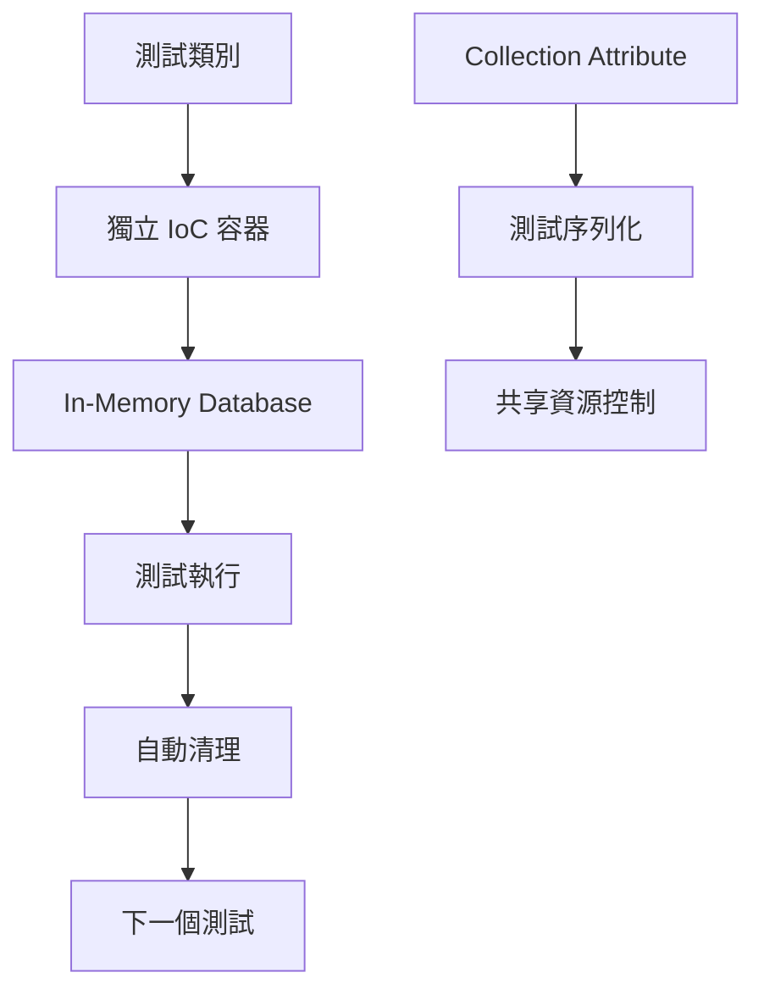
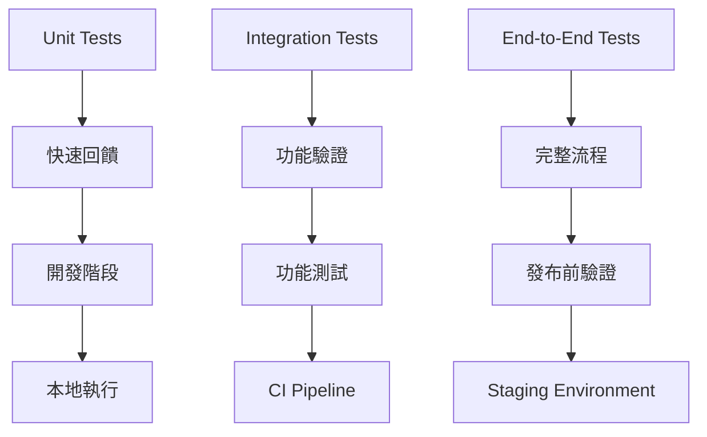

# 第八章：測試策略與最佳實踐

## 概述

Repository 的測試是確保資料存取層品質與可靠性的關鍵環節。ASP.NET Boilerplate 框架提供了完整的測試基礎設施，支援從單元測試到整合測試的完整測試金字塔。本章將深入探討 Repository 測試的各種策略、工具選擇與最佳實踐，幫助開發者建立健壯且可維護的測試體系。

測試策略的核心在於平衡測試覆蓋率、執行速度與維護成本。通過深入分析 ABP 框架的測試基礎設施，我們將學習如何有效地測試 Repository 的各種操作，包括 CRUD 操作、查詢邏輯、交易處理以及多租戶支援。

## 8.1 Repository 單元測試策略

### 8.1.1 測試基礎設施概覽

ABP 框架的測試基礎設施以 `AbpIntegratedTestBase<TStartupModule>` 為核心，提供了完整的 IoC 容器支援和測試環境隔離機制。

```csharp
/// <summary>
/// Repository 測試基礎類別
/// </summary>
public abstract class RepositoryTestBase : EntityFrameworkCoreModuleTestBase
{
    protected readonly IRepository<Blog> _blogRepository;
    protected readonly IRepository<Post, Guid> _postRepository;
    protected readonly IUnitOfWorkManager _uowManager;

    protected RepositoryTestBase()
    {
        _uowManager = Resolve<IUnitOfWorkManager>();
        _blogRepository = Resolve<IRepository<Blog>>();
        _postRepository = Resolve<IRepository<Post, Guid>>();
    }
}
```

**測試基礎設施的核心特性**：

1. **依賴注入整合**：透過 `Resolve<T>()` 方法無縫解析 Repository 實例
2. **自動類型註冊**：未註冊的類型會自動以 Transient 生命週期註冊
3. **Unit of Work 支援**：內建 UoW 管理機制，支援手動和自動事務管理
4. **測試隔離**：每個測試類別擁有獨立的 IoC 容器實例

### 8.1.2 基本 CRUD 操作測試

**Insert 操作測試範例**：

```csharp
[Fact]
public async Task Should_Insert_New_Entity()
{
    // Arrange
    var blog = new Blog("test-blog", "http://test.com");
    blog.IsTransient().ShouldBeTrue();

    // Act & Assert
    using (var uow = _uowManager.Begin())
    {
        await _blogRepository.InsertAsync(blog);
        await uow.CompleteAsync();
        
        // 驗證實體狀態變化
        blog.IsTransient().ShouldBeFalse();
        blog.Id.ShouldBeGreaterThan(0);
    }

    // 驗證資料庫持久化
    UsingDbContext(context =>
    {
        var dbBlog = context.Blogs.FirstOrDefault(b => b.Name == "test-blog");
        dbBlog.ShouldNotBeNull();
        dbBlog.Url.ShouldBe("http://test.com");
    });
}
```

**Update 操作測試範例**：

```csharp
[Fact]
public async Task Should_Automatically_Save_Changes_On_Uow_Complete()
{
    int blogId;

    // Act - 修改實體
    using (var uow = _uowManager.Begin())
    {
        var blog = await _blogRepository.SingleAsync(b => b.Name == "test-blog-1");
        blogId = blog.Id;
        
        blog.Name = "test-blog-1-updated";
        // 注意：EF Core 自動追蹤變更，無需明確呼叫 Update
        
        await uow.CompleteAsync();
    }

    // Assert - 驗證變更持久化
    await UsingDbContextAsync(async context =>
    {
        var blog = await context.Blogs.SingleAsync(b => b.Id == blogId);
        blog.Name.ShouldBe("test-blog-1-updated");
    });
}
```

### 8.1.3 查詢操作測試

**基本查詢測試**：

```csharp
[Fact]
public void Should_Get_Initial_Test_Data()
{
    // Act
    var blogs = _blogRepository.GetAllList();

    // Assert
    blogs.Count.ShouldBeGreaterThan(0);
    blogs.ShouldContain(b => b.Name == "test-blog-1");
}
```

**Include 操作測試**：

```csharp
[Fact]
public async Task Should_Include_Navigation_Properties_When_Requested()
{
    using (var uow = _uowManager.Begin())
    {
        // 測試 Include 功能
        var post = await _postRepository
            .GetAllIncluding(p => p.Blog)
            .FirstAsync();

        post.Blog.ShouldNotBeNull();
        post.Blog.Name.ShouldBe("test-blog-1");

        await uow.CompleteAsync();
    }
}

[Fact]
public async Task Should_Not_Include_Navigation_Properties_By_Default()
{
    using (var uow = _uowManager.Begin())
    {
        // EF Core 預設不載入導航屬性
        var post = await _postRepository.GetAll().FirstAsync();

        post.Blog.ShouldBeNull(); // Lazy Loading 未啟用時

        await uow.CompleteAsync();
    }
}
```

### 8.1.4 複雜查詢邏輯測試

```csharp
[Fact]
public async Task Should_Apply_Complex_Query_Filters()
{
    using (var uow = _uowManager.Begin())
    {
        // 測試複雜查詢邏輯
        var activePosts = await _postRepository
            .GetAll()
            .Where(p => !p.IsDeleted && p.TenantId == AbpSession.TenantId)
            .OrderByDescending(p => p.CreationTime)
            .Take(10)
            .ToListAsync();

        activePosts.ShouldNotBeEmpty();
        activePosts.All(p => !p.IsDeleted).ShouldBeTrue();
        activePosts.All(p => p.TenantId == AbpSession.TenantId).ShouldBeTrue();

        await uow.CompleteAsync();
    }
}
```

## 8.2 Integration Testing 最佳實踐

### 8.2.1 EntityFrameworkCoreModuleTestBase 解析

`EntityFrameworkCoreModuleTestBase` 是 ABP EF Core 測試的核心基礎類別，提供了完整的測試環境設置：

```csharp
[Collection("Clock.Provider")]
public abstract class EntityFrameworkCoreModuleTestBase 
    : AbpIntegratedTestBase<EntityFrameworkCoreTestModule>
{
    protected EntityFrameworkCoreModuleTestBase()
    {
        Clock.Provider = ClockProviders.Utc;
        CreateInitialData();
    }

    private void CreateInitialData()
    {
        UsingDbContext(context =>
        {
            // 建立測試用的初始資料
            var blog1 = new Blog("test-blog-1", "http://testblog1.myblogs.com")
            {
                DeletionTime = DateTime.SpecifyKind(DateTime.Parse("2019-01-01"), DateTimeKind.Unspecified),
                BlogTime = new BlogTime()
                {
                    LastAccessTime = DateTime.SpecifyKind(DateTime.Parse("2019-02-01"), DateTimeKind.Unspecified),
                    LatestPosTime = DateTime.SpecifyKind(DateTime.Parse("2019-03-01"), DateTimeKind.Unspecified)
                }
            };

            context.Blogs.Add(blog1);
            context.SaveChanges();

            // 建立關聯的 Post 資料
            var posts = new[]
            {
                new Post { Blog = blog1, Title = "test-post-1-title", Body = "test-post-1-body" },
                new Post { Blog = blog1, Title = "test-post-2-title", Body = "test-post-2-body" },
                new Post { Blog = blog1, Title = "test-post-3-title", Body = "test-post-3-body-deleted", IsDeleted = true },
                new Post { Blog = blog1, Title = "test-post-4-title", Body = "test-post-4-body", TenantId = 42 }
            };

            context.Posts.AddRange(posts);
        });
    }
}
```

### 8.2.2 DbContext 輔助方法

測試基類提供了便利的 DbContext 操作方法：

```csharp
/// <summary>
/// 同步 DbContext 操作
/// </summary>
public void UsingDbContext(Action<BloggingDbContext> action)
{
    using (var context = LocalIocManager.Resolve<BloggingDbContext>())
    {
        action(context);
        context.SaveChanges();
    }
}

/// <summary>
/// 非同步 DbContext 操作
/// </summary>
public async Task UsingDbContextAsync(Func<BloggingDbContext, Task> action)
{
    await using (var context = LocalIocManager.Resolve<BloggingDbContext>())
    {
        await action(context);
        await context.SaveChangesAsync(true);
    }
}

/// <summary>
/// 帶回傳值的 DbContext 操作
/// </summary>
public async Task<T> UsingDbContextAsync<T>(Func<BloggingDbContext, Task<T>> func)
{
    T result;
    await using (var context = LocalIocManager.Resolve<BloggingDbContext>())
    {
        result = await func(context);
        await context.SaveChangesAsync();
    }
    return result;
}
```

**使用範例**：

```csharp
[Fact]
public async Task Should_Handle_Concurrent_Updates()
{
    var blogId = await UsingDbContextAsync(async context =>
    {
        var blog = new Blog("concurrent-test", "http://test.com");
        context.Blogs.Add(blog);
        await context.SaveChangesAsync();
        return blog.Id;
    });

    // 模擬並行更新
    var task1 = UsingDbContextAsync(async context =>
    {
        var blog = await context.Blogs.FindAsync(blogId);
        blog.Name = "updated-by-task1";
        await context.SaveChangesAsync();
    });

    var task2 = UsingDbContextAsync(async context =>
    {
        var blog = await context.Blogs.FindAsync(blogId);
        blog.Url = "http://updated-by-task2.com";
        await context.SaveChangesAsync();
    });

    await Task.WhenAll(task1, task2);

    // 驗證最終狀態
    await UsingDbContextAsync(async context =>
    {
        var blog = await context.Blogs.FindAsync(blogId);
        // 根據實際的並行控制策略進行驗證
        blog.ShouldNotBeNull();
    });
}
```

### 8.2.3 多 DbContext 環境測試

ABP 支援多個 DbContext 的測試環境：

```csharp
[Fact]
public void Should_Resolve_Different_DbContexts()
{
    using (var uow = Resolve<IUnitOfWorkManager>().Begin())
    {
        // 主要 DbContext
        var blogRepo = Resolve<IRepository<Blog>>();
        blogRepo.GetDbContext().ShouldBeOfType<BloggingDbContext>();

        // 第二個 DbContext
        var ticketRepo = Resolve<IRepository<Ticket>>();
        ticketRepo.GetDbContext().ShouldBeOfType<SupportDbContext>();

        uow.Complete();
    }
}
```

## 8.3 In-Memory Database 應用

### 8.3.1 SQLite In-Memory 配置

ABP 測試模組使用 SQLite In-Memory 資料庫提供快速且隔離的測試環境：

```csharp
private static void RegisterBloggingDbContextToSqliteInMemoryDb(IIocManager iocManager)
{
    var builder = new DbContextOptionsBuilder<BloggingDbContext>();

    // 建立 In-Memory SQLite 連線
    var inMemorySqlite = new SqliteConnection("Data Source=:memory:");
    builder.UseSqlite(inMemorySqlite).AddAbpDbContextOptionsExtension();

    // 註冊 DbContextOptions
    iocManager.IocContainer.Register(
        Component
            .For<DbContextOptions<BloggingDbContext>>()
            .Instance(builder.Options)
            .LifestyleSingleton()
    );

    // 開啟連線並建立資料庫結構
    inMemorySqlite.Open();
    new BloggingDbContext(builder.Options).Database.EnsureCreated();
}
```

### 8.3.2 In-Memory Database 優勢

**效能優勢**：
- 記憶體操作速度極快
- 無磁碟 I/O 開銷
- 適合大量測試案例

**隔離性**：
- 每個測試獲得全新的資料庫實例
- 測試間無資料污染
- 平行執行安全

**便利性**：
- 無需外部資料庫依賴
- 自動清理，無需手動維護
- 支援完整的 SQL 功能

### 8.3.3 In-Memory Database 限制與注意事項

```csharp
[Fact]
public void Should_Understand_InMemory_Limitations()
{
    // 注意：某些資料庫特定功能在 In-Memory 中可能不受支援
    UsingDbContext(context =>
    {
        // 1. 外鍵約束可能行為不同
        // 2. 觸發器 (Triggers) 不受支援
        // 3. 某些 SQL Server 特定功能無法使用
        
        var blog = new Blog("test", "http://test.com");
        context.Blogs.Add(blog);
        context.SaveChanges();
        
        blog.Id.ShouldBeGreaterThan(0);
    });
}
```

## 8.4 Test Data Builder Pattern 實作

### 8.4.1 Test Data Builder 設計原則

Test Data Builder Pattern 提供流暢且可維護的測試資料建立方式：

```csharp
/// <summary>
/// Blog 測試資料建構器
/// </summary>
public class BlogTestDataBuilder
{
    private string _name = "default-blog";
    private string _url = "http://default.com";
    private DateTime? _deletionTime = null;
    private List<Post> _posts = new List<Post>();

    public BlogTestDataBuilder WithName(string name)
    {
        _name = name;
        return this;
    }

    public BlogTestDataBuilder WithUrl(string url)
    {
        _url = url;
        return this;
    }

    public BlogTestDataBuilder AsDeleted(DateTime? deletionTime = null)
    {
        _deletionTime = deletionTime ?? DateTime.UtcNow;
        return this;
    }

    public BlogTestDataBuilder WithPost(string title, string body)
    {
        _posts.Add(new Post { Title = title, Body = body });
        return this;
    }

    public Blog Build()
    {
        var blog = new Blog(_name, _url)
        {
            DeletionTime = _deletionTime
        };

        foreach (var post in _posts)
        {
            post.Blog = blog;
            blog.Posts.Add(post);
        }

        return blog;
    }

    public async Task<Blog> BuildAndInsertAsync(IRepository<Blog> repository)
    {
        var blog = Build();
        return await repository.InsertAsync(blog);
    }
}
```

### 8.4.2 使用 Test Data Builder

```csharp
[Fact]
public async Task Should_Use_Test_Data_Builder()
{
    using (var uow = _uowManager.Begin())
    {
        // 使用 Builder 建立複雜測試資料
        var blog = await new BlogTestDataBuilder()
            .WithName("tech-blog")
            .WithUrl("http://tech.example.com")
            .WithPost("EF Core Tips", "Some useful tips...")
            .WithPost("ABP Guide", "Complete guide to ABP...")
            .BuildAndInsertAsync(_blogRepository);

        await uow.CompleteAsync();

        // 驗證
        blog.ShouldNotBeNull();
        blog.Posts.Count.ShouldBe(2);
    }

    // 驗證持久化
    UsingDbContext(context =>
    {
        var blog = context.Blogs
            .Include(b => b.Posts)
            .Single(b => b.Name == "tech-blog");
            
        blog.Posts.Count.ShouldBe(2);
        blog.Posts.ShouldContain(p => p.Title == "EF Core Tips");
    });
}
```

### 8.4.3 進階 Test Data Builder

```csharp
/// <summary>
/// 通用測試資料建構器
/// </summary>
public class TestDataBuilder
{
    private readonly IServiceProvider _serviceProvider;

    public TestDataBuilder(IServiceProvider serviceProvider)
    {
        _serviceProvider = serviceProvider;
    }

    public async Task<User> CreateUserAsync(string name = "Test User", string email = null)
    {
        var userRepository = _serviceProvider.GetRequiredService<IRepository<User, long>>();
        
        var user = new User
        {
            Name = name,
            EmailAddress = email ?? $"{name.Replace(" ", "").ToLower()}@example.com",
            IsActive = true,
            TenantId = AbpSession.TenantId
        };

        return await userRepository.InsertAsync(user);
    }

    public async Task<Role> CreateRoleAsync(string name = "TestRole", string displayName = null)
    {
        var roleRepository = _serviceProvider.GetRequiredService<IRepository<Role>>();
        
        var role = new Role
        {
            Name = name,
            DisplayName = displayName ?? name,
            TenantId = AbpSession.TenantId
        };

        return await roleRepository.InsertAsync(role);
    }

    public async Task<Blog> CreateBlogWithPostsAsync(int postCount = 3)
    {
        var blogRepository = _serviceProvider.GetRequiredService<IRepository<Blog>>();
        
        var blog = new Blog($"test-blog-{Guid.NewGuid()}", "http://test.com");
        
        for (int i = 1; i <= postCount; i++)
        {
            blog.Posts.Add(new Post
            {
                Title = $"Test Post {i}",
                Body = $"This is test post {i} content...",
                Blog = blog
            });
        }

        return await blogRepository.InsertAsync(blog);
    }
}
```

## 8.5 測試環境隔離與清理

### 8.5.1 ABP 測試隔離機制

ABP 的測試基礎設施提供了多層次的隔離機制：



**Collection 屬性的使用**：

```csharp
[Collection("Clock.Provider")]
public abstract class EntityFrameworkCoreModuleTestBase 
    : AbpIntegratedTestBase<EntityFrameworkCoreTestModule>
{
    // 確保使用相同 Collection 的測試不會並行執行
    // 避免共享資源（如時間提供者）的衝突
}
```

### 8.5.2 Unit of Work 隔離策略

```csharp
[Fact]
public async Task Should_Isolate_Unit_Of_Work_Properly()
{
    int blogId;

    // 第一個 UoW - 建立資料
    using (var uow = _uowManager.Begin())
    {
        var blog = new Blog("isolation-test", "http://test.com");
        await _blogRepository.InsertAsync(blog);
        blogId = blog.Id;
        await uow.CompleteAsync();
    }

    // 第二個 UoW - 修改資料
    using (var uow = _uowManager.Begin())
    {
        var blog = await _blogRepository.GetAsync(blogId);
        blog.Name = "modified-name";
        await uow.CompleteAsync();
    }

    // 第三個 UoW - 驗證變更
    using (var uow = _uowManager.Begin())
    {
        var blog = await _blogRepository.GetAsync(blogId);
        blog.Name.ShouldBe("modified-name");
        await uow.CompleteAsync();
    }
}
```

### 8.5.3 多租戶測試隔離

```csharp
[Fact]
public async Task Should_Isolate_Tenant_Data()
{
    // 建立 Tenant 1 資料
    using (AbpSession.Use(1, null))
    {
        using (var uow = _uowManager.Begin())
        {
            await _blogRepository.InsertAsync(new Blog("tenant1-blog", "http://tenant1.com"));
            await uow.CompleteAsync();
        }
    }

    // 建立 Tenant 2 資料
    using (AbpSession.Use(2, null))
    {
        using (var uow = _uowManager.Begin())
        {
            await _blogRepository.InsertAsync(new Blog("tenant2-blog", "http://tenant2.com"));
            await uow.CompleteAsync();
        }
    }

    // 驗證 Tenant 1 只能看到自己的資料
    using (AbpSession.Use(1, null))
    {
        using (var uow = _uowManager.Begin())
        {
            var blogs = await _blogRepository.GetAllListAsync();
            blogs.Count.ShouldBe(1);
            blogs[0].Name.ShouldBe("tenant1-blog");
            await uow.CompleteAsync();
        }
    }

    // 驗證 Tenant 2 只能看到自己的資料
    using (AbpSession.Use(2, null))
    {
        using (var uow = _uowManager.Begin())
        {
            var blogs = await _blogRepository.GetAllListAsync();
            blogs.Count.ShouldBe(1);
            blogs[0].Name.ShouldBe("tenant2-blog");
            await uow.CompleteAsync();
        }
    }
}
```

## 8.6 Mock 與 Stub 應用場景

### 8.6.1 Repository Mock 策略

當需要隔離外部依賴進行純單元測試時，可以使用 Mock Repository：

```csharp
public class BlogServiceTests
{
    private readonly IBlogService _blogService;
    private readonly IRepository<Blog> _mockBlogRepository;

    public BlogServiceTests()
    {
        _mockBlogRepository = Substitute.For<IRepository<Blog>>();
        _blogService = new BlogService(_mockBlogRepository);
    }

    [Fact]
    public async Task Should_Get_Blog_By_Name()
    {
        // Arrange
        var expectedBlog = new Blog("test-blog", "http://test.com") { Id = 1 };
        _mockBlogRepository
            .FirstOrDefaultAsync(Arg.Any<Expression<Func<Blog, bool>>>())
            .Returns(expectedBlog);

        // Act
        var result = await _blogService.GetBlogByNameAsync("test-blog");

        // Assert
        result.ShouldNotBeNull();
        result.Name.ShouldBe("test-blog");
        
        // 驗證 Repository 被正確呼叫
        await _mockBlogRepository
            .Received(1)
            .FirstOrDefaultAsync(Arg.Any<Expression<Func<Blog, bool>>>());
    }
}
```

### 8.6.2 部分 Mock 策略

對於複雜的測試場景，可以使用部分 Mock：

```csharp
[Fact]
public void Should_Use_Partial_Mock_For_Complex_Scenarios()
{
    // 注意：這是純單元測試方法，與 ABP 整合測試不同
    var mockRepository = Substitute.For<IRepository<Blog>>();
    
    // 模擬特定方法的行為
    mockRepository.GetAll().Returns(new[]
    {
        new Blog("blog1", "http://blog1.com"),
        new Blog("blog2", "http://blog2.com")
    }.AsQueryable());

    // 測試依賴 Repository 的服務邏輯
    var service = new BlogService(mockRepository);
    var blogs = service.GetActiveBlogs();
    
    blogs.Count().ShouldBe(2);
}
```

### 8.6.3 Test Double 選擇指南

| 場景 | 推薦方法 | 原因 |
|------|----------|------|
| Repository CRUD 測試 | 整合測試 + In-Memory DB | 測試真實的資料存取邏輯 |
| Service 層邏輯測試 | Mock Repository | 隔離業務邏輯，快速執行 |
| 複雜查詢測試 | 整合測試 | 驗證 LINQ 表達式的正確性 |
| 交易行為測試 | 整合測試 | 測試真實的交易語義 |
| 效能測試 | 真實資料庫 | 獲得準確的效能數據 |

## 8.7 進階測試技巧

### 8.7.1 批次操作測試

```csharp
[Fact]
public async Task Should_Handle_Batch_Operations()
{
    using (var uow = _uowManager.Begin())
    {
        // 測試批次插入
        var blogs = Enumerable.Range(1, 100)
            .Select(i => new Blog($"blog-{i}", $"http://blog{i}.com"))
            .ToList();

        await _blogRepository.InsertRangeAsync(blogs);
        await uow.CompleteAsync();

        // 驗證批次操作結果
        blogs.All(b => !b.IsTransient()).ShouldBeTrue();
    }

    // 測試批次查詢
    using (var uow = _uowManager.Begin())
    {
        var blogNames = Enumerable.Range(1, 50)
            .Select(i => $"blog-{i}")
            .ToList();

        var foundBlogs = await _blogRepository
            .GetAll()
            .Where(b => blogNames.Contains(b.Name))
            .ToListAsync();

        foundBlogs.Count.ShouldBe(50);
        await uow.CompleteAsync();
    }
}
```

### 8.7.2 並行安全性測試

```csharp
[Fact]
public async Task Should_Handle_Concurrent_Repository_Access()
{
    const int threadCount = 10;
    const int operationsPerThread = 5;
    var tasks = new List<Task>();

    // 建立多個並行任務
    for (int i = 0; i < threadCount; i++)
    {
        int threadId = i;
        tasks.Add(Task.Run(async () =>
        {
            for (int j = 0; j < operationsPerThread; j++)
            {
                using (var uow = _uowManager.Begin())
                {
                    var blog = new Blog($"thread-{threadId}-blog-{j}", $"http://test{threadId}{j}.com");
                    await _blogRepository.InsertAsync(blog);
                    await uow.CompleteAsync();
                }
            }
        }));
    }

    // 等待所有任務完成
    await Task.WhenAll(tasks);

    // 驗證並行操作結果
    using (var uow = _uowManager.Begin())
    {
        var totalBlogs = await _blogRepository.CountAsync();
        // 加上初始測試資料的數量
        totalBlogs.ShouldBeGreaterThanOrEqualTo(threadCount * operationsPerThread);
        await uow.CompleteAsync();
    }
}
```

### 8.7.3 異常情況測試

```csharp
[Fact]
public async Task Should_Handle_Database_Constraints_Properly()
{
    // 測試唯一約束違反
    using (var uow = _uowManager.Begin())
    {
        var blog1 = new Blog("unique-blog", "http://test1.com");
        await _blogRepository.InsertAsync(blog1);
        await uow.CompleteAsync();
    }

    // 嘗試插入重複資料
    await Should.ThrowAsync<DbUpdateException>(async () =>
    {
        using (var uow = _uowManager.Begin())
        {
            var blog2 = new Blog("unique-blog", "http://test2.com"); // 相同名稱
            await _blogRepository.InsertAsync(blog2);
            await uow.CompleteAsync();
        }
    });
}

[Fact]
public async Task Should_Rollback_On_Exception()
{
    var initialCount = await _blogRepository.CountAsync();

    // 測試異常回滾
    await Should.ThrowAsync<Exception>(async () =>
    {
        using (var uow = _uowManager.Begin())
        {
            await _blogRepository.InsertAsync(new Blog("test1", "http://test1.com"));
            await _blogRepository.InsertAsync(new Blog("test2", "http://test2.com"));
            
            // 模擬異常
            throw new Exception("Simulated error");
            
            await uow.CompleteAsync();
        }
    });

    // 驗證資料未被持久化
    var finalCount = await _blogRepository.CountAsync();
    finalCount.ShouldBe(initialCount);
}
```

## 8.8 測試效能最佳化

### 8.8.1 測試資料最佳化

```csharp
[Fact]
public async Task Should_Optimize_Test_Data_Creation()
{
    // 使用 SQL 批次插入代替逐一插入
    await UsingDbContextAsync(async context =>
    {
        var blogs = Enumerable.Range(1, 1000)
            .Select(i => new Blog($"perf-blog-{i}", $"http://perf{i}.com"))
            .ToList();

        // 批次操作比逐一插入快得多
        context.Blogs.AddRange(blogs);
        await context.SaveChangesAsync();
    });

    // 驗證資料創建
    var count = await _blogRepository.CountAsync(b => b.Name.StartsWith("perf-blog-"));
    count.ShouldBe(1000);
}
```

### 8.8.2 記憶體使用最佳化

```csharp
[Fact]
public async Task Should_Optimize_Memory_Usage_In_Large_Tests()
{
    // 分批處理大量資料，避免記憶體溢出
    const int batchSize = 100;
    const int totalRecords = 10000;

    for (int i = 0; i < totalRecords; i += batchSize)
    {
        using (var uow = _uowManager.Begin())
        {
            var batch = Enumerable.Range(i, Math.Min(batchSize, totalRecords - i))
                .Select(j => new Blog($"batch-blog-{j}", $"http://batch{j}.com"))
                .ToList();

            await _blogRepository.InsertRangeAsync(batch);
            await uow.CompleteAsync();
        }

        // 強制垃圾回收，釋放記憶體
        if (i % (batchSize * 10) == 0)
        {
            GC.Collect();
            GC.WaitForPendingFinalizers();
        }
    }

    var finalCount = await _blogRepository.CountAsync(b => b.Name.StartsWith("batch-blog-"));
    finalCount.ShouldBe(totalRecords);
}
```

### 8.8.3 查詢效能測試

```csharp
[Fact]
public async Task Should_Test_Query_Performance()
{
    // 建立測試資料
    await UsingDbContextAsync(async context =>
    {
        var blogs = Enumerable.Range(1, 1000)
            .Select(i => new Blog($"perf-test-{i}", $"http://test{i}.com"))
            .ToList();
        context.Blogs.AddRange(blogs);
        await context.SaveChangesAsync();
    });

    // 測試查詢效能
    var stopwatch = Stopwatch.StartNew();
    
    using (var uow = _uowManager.Begin())
    {
        var blogs = await _blogRepository
            .GetAll()
            .Where(b => b.Name.StartsWith("perf-test-"))
            .OrderBy(b => b.Name)
            .Take(100)
            .ToListAsync();

        blogs.Count.ShouldBe(100);
        await uow.CompleteAsync();
    }

    stopwatch.Stop();
    
    // 驗證查詢在合理時間內完成
    stopwatch.ElapsedMilliseconds.ShouldBeLessThan(1000); // 應在 1 秒內完成
}
```

## 8.9 持續整合中的測試策略

### 8.9.1 測試分層策略



### 8.9.2 測試標籤與分組

```csharp
[Fact]
[Trait("Category", "Unit")]
[Trait("Speed", "Fast")]
public void Should_Execute_Fast_Unit_Test()
{
    // 快速單元測試
    var blog = new Blog("test", "http://test.com");
    blog.Name.ShouldBe("test");
}

[Fact]
[Trait("Category", "Integration")]
[Trait("Speed", "Medium")]
public async Task Should_Execute_Integration_Test()
{
    // 整合測試
    using (var uow = _uowManager.Begin())
    {
        var blog = await _blogRepository.InsertAsync(new Blog("integration-test", "http://test.com"));
        await uow.CompleteAsync();
        blog.Id.ShouldBeGreaterThan(0);
    }
}

[Fact]
[Trait("Category", "Performance")]
[Trait("Speed", "Slow")]
public async Task Should_Execute_Performance_Test()
{
    // 效能測試（執行時間較長）
    await Should_Optimize_Memory_Usage_In_Large_Tests();
}
```

### 8.9.3 CI/CD 配置範例

```yaml
# Azure DevOps Pipeline 範例
trigger:
- main
- develop

pool:
  vmImage: 'ubuntu-latest'

steps:
- task: DotNetCoreCLI@2
  displayName: 'Run Fast Tests'
  inputs:
    command: 'test'
    projects: '**/*Tests.csproj'
    arguments: '--configuration Release --filter "Speed=Fast"'

- task: DotNetCoreCLI@2
  displayName: 'Run Integration Tests'
  inputs:
    command: 'test'
    projects: '**/*Tests.csproj'
    arguments: '--configuration Release --filter "Category=Integration"'
  condition: and(succeeded(), eq(variables['Build.SourceBranch'], 'refs/heads/main'))

- task: DotNetCoreCLI@2
  displayName: 'Run Performance Tests'
  inputs:
    command: 'test'
    projects: '**/*Tests.csproj'
    arguments: '--configuration Release --filter "Category=Performance"'
  condition: and(succeeded(), eq(variables['Build.Reason'], 'Schedule'))
```

## 8.10 測試文件化與維護

### 8.10.1 測試文件化最佳實踐

```csharp
/// <summary>
/// 測試 Blog Repository 的基本 CRUD 操作
/// 
/// 測試涵蓋範圍：
/// - Insert 操作與 ID 產生
/// - Update 操作與變更追蹤
/// - Delete 操作與軟刪除
/// - 查詢操作與過濾
/// - 併發安全性
/// 
/// 測試環境：SQLite In-Memory
/// 測試資料：通過 CreateInitialData() 建立
/// </summary>
public class BlogRepositoryTests : EntityFrameworkCoreModuleTestBase
{
    /// <summary>
    /// 測試目標：驗證新實體插入功能
    /// 
    /// 測試步驟：
    /// 1. 建立新的 Blog 實體
    /// 2. 驗證實體為 Transient 狀態
    /// 3. 透過 Repository 插入實體
    /// 4. 驗證 ID 已產生且實體不再為 Transient
    /// 5. 驗證資料已持久化到資料庫
    /// 
    /// 預期結果：
    /// - 實體成功插入
    /// - ID 自動產生
    /// - 資料正確持久化
    /// </summary>
    [Fact]
    public async Task Should_Insert_New_Entity()
    {
        // 測試實作...
    }
}
```

### 8.10.2 測試資料維護策略

```csharp
/// <summary>
/// 測試資料管理輔助類別
/// 提供標準化的測試資料建立與管理功能
/// </summary>
public static class TestDataHelper
{
    /// <summary>
    /// 建立標準 Blog 測試資料
    /// </summary>
    public static Blog CreateStandardBlog(string suffix = null)
    {
        var name = $"test-blog{(suffix != null ? $"-{suffix}" : "")}";
        return new Blog(name, $"http://{name}.com");
    }

    /// <summary>
    /// 建立包含指定數量 Post 的 Blog
    /// </summary>
    public static Blog CreateBlogWithPosts(int postCount, string suffix = null)
    {
        var blog = CreateStandardBlog(suffix);
        
        for (int i = 1; i <= postCount; i++)
        {
            blog.Posts.Add(new Post
            {
                Title = $"Post {i} for {blog.Name}",
                Body = $"Content for post {i}",
                Blog = blog
            });
        }

        return blog;
    }

    /// <summary>
    /// 建立多租戶測試資料
    /// </summary>
    public static Blog CreateTenantBlog(int tenantId, string suffix = null)
    {
        var blog = CreateStandardBlog($"tenant{tenantId}{(suffix != null ? $"-{suffix}" : "")}");
        blog.TenantId = tenantId;
        return blog;
    }
}
```

## 本章總結

本章深入探討了 ASP.NET Boilerplate 框架中 Repository 的測試策略與最佳實踐。通過分析框架提供的測試基礎設施，我們學習了如何建立健壯且可維護的測試體系。

**關鍵要點回顧**：

1. **測試基礎設施**：ABP 提供了完整的測試基礎設施，包括 `AbpIntegratedTestBase` 和專為 EF Core 設計的測試基類，支援依賴注入、Unit of Work 管理和測試隔離。

2. **In-Memory Database**：SQLite In-Memory 資料庫提供了快速、隔離且功能完整的測試環境，是 Repository 整合測試的理想選擇。

3. **Test Data Builder Pattern**：通過 Builder 模式建立測試資料，提供了流暢的 API 和良好的可維護性，特別適合複雜的測試場景。

4. **測試隔離**：框架提供了多層次的隔離機制，包括 IoC 容器隔離、Unit of Work 隔離和多租戶資料隔離。

5. **Mock 策略**：針對不同的測試需求選擇適當的測試策略，純單元測試使用 Mock，複雜邏輯使用整合測試。

6. **效能最佳化**：通過批次操作、記憶體管理和查詢最佳化技術，確保測試的執行效率。

7. **持續整合**：通過測試分層、標籤分組和適當的 CI/CD 配置，建立高效的自動化測試流水線。

掌握這些測試策略和技術，將幫助開發者建立可信賴的 Repository 測試體系，確保資料存取層的品質與穩定性，為整個應用程式的可靠性奠定堅實基礎。

測試不僅是品質保證的手段，更是設計改進的驅動力。通過編寫良好的 Repository 測試，我們不僅驗證了功能的正確性，也促進了更好的 API 設計和架構決策。

---

## 📖 章節導覽

### ⬅️ 上一章
**[第七章：效能最佳化與進階特性](./07-效能最佳化與進階特性.md)**
- Repository 效能最佳化技巧
- Query Compilation 與快取
- 進階特性應用

### ➡️ 下一章
**指南完結** - 恭喜您完成了整部 EF Core Repository 權威指南！

### 🏠 返回目錄
**[EF Core Repository 權威指南 - 目錄](./README.md)**

### 🎯 相關章節
- **[第六章：自訂 Repository 設計與實作](./06-自訂%20Repository%20設計與實作.md)** - 自訂 Repository 的測試設計
- **[第五章：Repository CRUD 操作深度解析](./05-Repository%20CRUD%20操作深度解析.md)** - CRUD 操作的測試覆蓋

### 💡 學習建議
1. **實務練習**：建議實際建立一套完整的 Repository 測試專案
2. **測試框架**：深入學習 xUnit、NUnit 等測試框架的進階功能
3. **持續整合**：將測試整合到 CI/CD 流程中

### 🔍 關鍵概念
- **測試金字塔**：理解單元測試、整合測試、端到端測試的平衡
- **測試隔離**：掌握測試環境隔離的各種技術
- **Mock 策略**：學會選擇適當的 Mock 和 Stub 策略

### 🧪 測試技巧
- **資料準備**：使用 Test Data Builder Pattern 建立測試資料
- **環境管理**：善用 In-Memory Database 和測試容器
- **斷言設計**：撰寫清晰且有意義的測試斷言

### 📊 測試指標
- **覆蓋率**：維持適當的程式碼覆蓋率（建議 80% 以上）
- **執行時間**：確保測試執行效率（單元測試毫秒級，整合測試秒級）
- **穩定性**：建立可靠且一致的測試結果

### 🎯 進階主題
- **效能測試**：建立 Repository 的效能基準測試
- **契約測試**：使用 Pact 等工具進行 API 契約測試
- **變異測試**：使用 Mutation Testing 驗證測試品質

---

## 🎉 學習完成

**恭喜您完成了 EF Core Repository 權威指南的完整學習！**

### 📈 您已經掌握的能力
- ✅ 深入理解 Repository Pattern 的理論基礎
- ✅ 熟練掌握 ABP 框架的 Repository 架構
- ✅ 精通 DbContext 與 Repository 的協作機制
- ✅ 熟悉 Unit of Work 與交易管理
- ✅ 深度掌握 Repository CRUD 操作
- ✅ 能夠設計與實作自訂 Repository
- ✅ 具備 Repository 效能最佳化能力
- ✅ 建立完整的 Repository 測試策略

### 🚀 下一步建議
1. **實際專案應用**：將所學知識應用到實際專案中
2. **社群貢獻**：考慮為 ABP 框架社群貢獻程式碼或文件
3. **持續學習**：關注 EF Core 和 ABP 框架的最新發展
4. **知識分享**：將學習心得分享給團隊或社群

### 📚 延伸學習資源
- **ABP 官方文件**：持續關注官方文件更新
- **EF Core 文件**：深入學習 EF Core 的最新特性
- **設計模式**：擴展學習其他企業級設計模式
- **效能調優**：深入學習 .NET 效能調優技術

---

*感謝您的學習與堅持！希望這份權威指南能夠為您的職業發展帶來幫助。*
