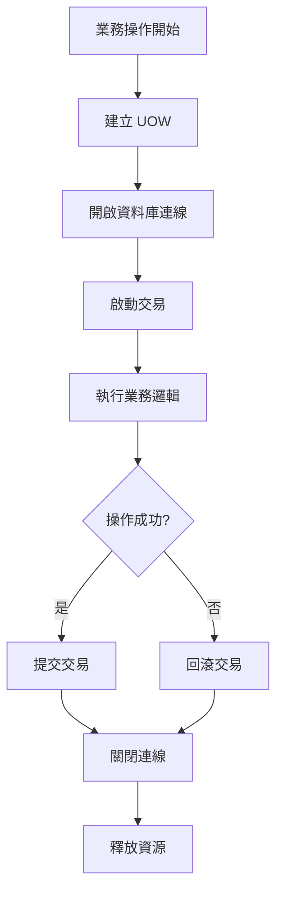
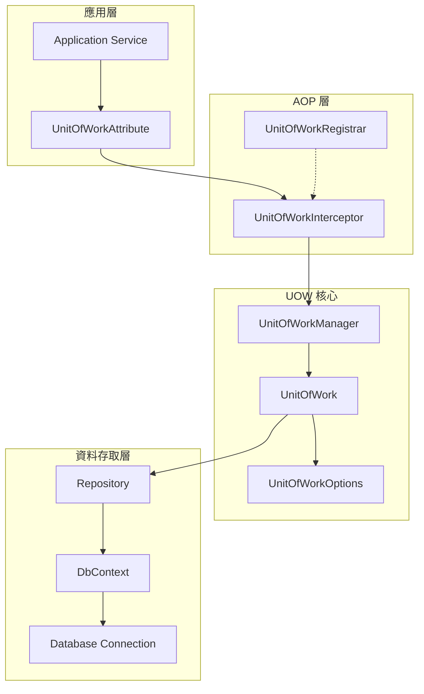
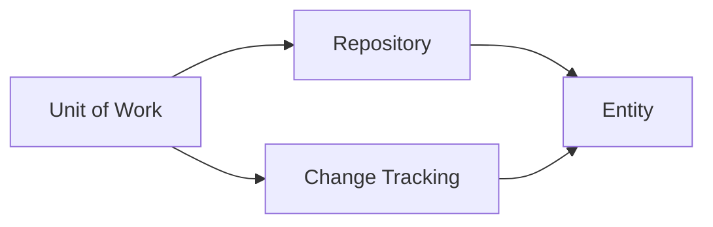
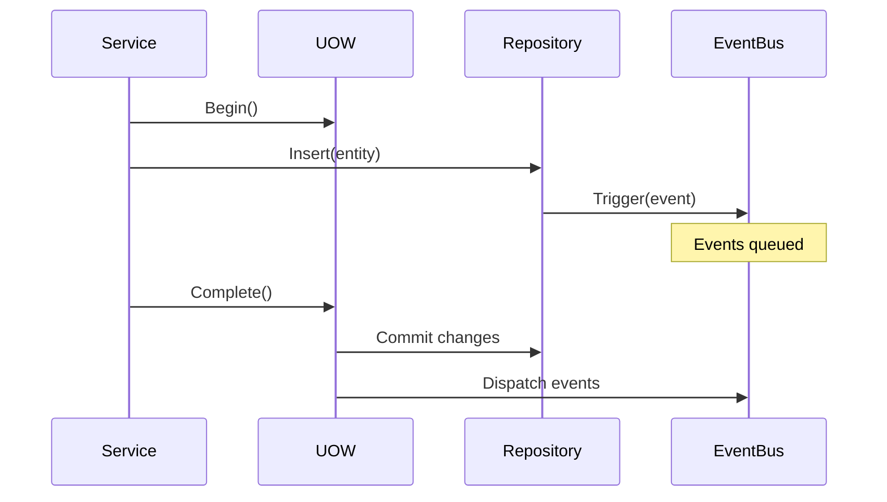

# 01 - UOW基礎概念與設計原理

## 📚 什麼是 Unit of Work 模式

Unit of Work (工作單元) 是企業應用架構中的核心設計模式，用於管理業務交易的完整性與一致性。在 ASP.NET Boilerplate 框架中，UOW 模式被實作為一個強大的基礎設施，自動處理資料庫連線、交易管理以及變更追蹤。

### 核心概念



## 🎯 設計原理與目標

### 1. 交易完整性 (ACID)
- **原子性 (Atomicity)**：確保所有操作要麼全部成功，要麼全部失敗
- **一致性 (Consistency)**：維護資料庫的完整性約束
- **隔離性 (Isolation)**：控制並發交易的互相影響程度
- **持久性 (Durability)**：已提交的變更永久保存

### 2. 關注點分離
將資料存取邏輯與業務邏輯分離，讓開發者專注於業務規則的實作：

```csharp
// 業務邏輯層不需要關心交易管理
[UnitOfWork]
public async Task CreateUserAsync(CreateUserDto input)
{
    var user = new User(input.Name, input.Email);
    await _userRepository.InsertAsync(user);
    
    var role = await _roleRepository.FirstOrDefaultAsync(r => r.Name == "Member");
    user.Roles.Add(role);
    
    // UOW 自動處理交易提交
}
```

### 3. 自動化管理
透過 AOP (Aspect-Oriented Programming) 攔截器，實現：
- 自動連線管理
- 自動交易控制
- 自動異常處理
- 自動資源釋放

## 🔧 ABP 中的 UOW 架構

### 架構組件圖



### 核心介面定義

```csharp
/// <summary>
/// 工作單元管理器 - 控制 UOW 的建立與管理
/// </summary>
public interface IUnitOfWorkManager
{
    IActiveUnitOfWork Current { get; }
    IUnitOfWorkCompleteHandle Begin();
    IUnitOfWorkCompleteHandle Begin(UnitOfWorkOptions options);
}

/// <summary>
/// 工作單元介面 - 代表一個具體的工作單元
/// </summary>
public interface IUnitOfWork : IActiveUnitOfWork, IUnitOfWorkCompleteHandle
{
    string Id { get; }
    IUnitOfWork Outer { get; set; }
    void Begin(UnitOfWorkOptions options);
}
```

## 💡 使用場景與優勢

### 典型使用場景

1. **多表操作的一致性**
```csharp
[UnitOfWork]
public async Task TransferMoneyAsync(int fromAccountId, int toAccountId, decimal amount)
{
    var fromAccount = await _accountRepository.GetAsync(fromAccountId);
    var toAccount = await _accountRepository.GetAsync(toAccountId);
    
    fromAccount.Withdraw(amount);  // 可能拋出異常
    toAccount.Deposit(amount);
    
    // 兩個操作必須同時成功或失敗
}
```

2. **領域事件的處理**
```csharp
[UnitOfWork]
public async Task ProcessOrderAsync(CreateOrderDto input)
{
    var order = new Order(input);
    await _orderRepository.InsertAsync(order);
    
    // 觸發領域事件
    await _domainEventBus.TriggerAsync(new OrderCreatedEvent(order));
    
    // 更新庫存
    await _inventoryService.ReserveItemsAsync(order.Items);
}
```

### 框架優勢

| 優勢 | 說明 | 實現方式 |
|------|------|----------|
| **宣告式** | 透過屬性標註，無需手動管理 | `[UnitOfWork]` 屬性 |
| **自動化** | 自動處理生命週期 | AOP 攔截器 |
| **可配置** | 靈活的選項配置 | `UnitOfWorkOptions` |
| **可巢套** | 支援巢狀 UOW | 內部 UOW 重用外部交易 |
| **多租戶** | 自動租戶隔離 | 自動繼承租戶資訊 |

## ⚠️ 設計原則與注意事項

### 1. 邊界清晰
- UOW 邊界應該與業務交易邊界一致
- 避免過大或過小的 UOW 範圍

### 2. 異常安全
- 所有異常都會觸發自動回滾
- 確保業務邏輯的異常處理正確

### 3. 效能考量
- 長時間運行的 UOW 會持有資料庫連線
- 適當使用非交易式 UOW 來優化讀取操作

```csharp
// 對於大量讀取操作，可以使用非交易式 UOW
[UnitOfWork(isTransactional: false)]
public async Task<List<UserDto>> GetAllUsersAsync()
{
    // 不需要交易保護的讀取操作
    return await _userRepository.GetAllListAsync();
}
```

## 🎯 與其他模式的關係

### Repository 模式


### Domain Events


---

**下一章節**: [02-核心介面與類別架構](02-核心介面與類別架構.md)

在下一章中，我們將深入探討 ABP UOW 的核心介面設計與類別架構，包括各個組件的職責與互動關係。
