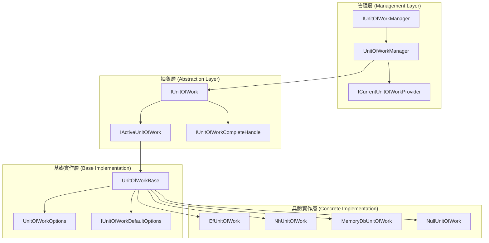
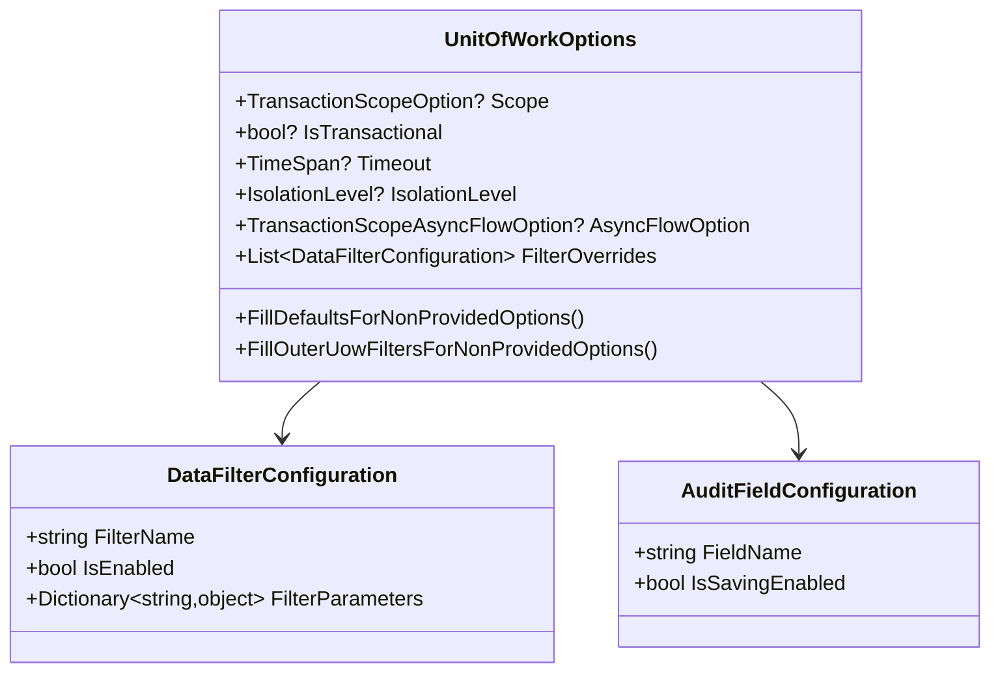
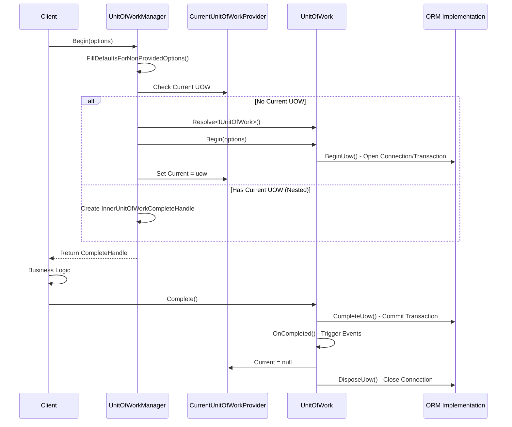

# 02 - 核心介面與類別架構

## 🏗️ 架構總覽

ASP.NET Boilerplate 的 UOW 系統採用分層架構設計，透過介面分離與職責明確劃分，實現高度的彈性與可測試性。

### 整體架構圖



## 🔍 核心介面定義

### 1. IUnitOfWorkManager - UOW 管理器

```csharp
/// <summary>
/// UOW 管理器 - 控制 UOW 的建立與生命週期
/// </summary>
public interface IUnitOfWorkManager
{
    /// <summary>
    /// 取得目前活躍的 UOW (如果不存在則為 null)
    /// </summary>
    IActiveUnitOfWork Current { get; }

    /// <summary>
    /// 開始新的 UOW，使用預設選項
    /// </summary>
    IUnitOfWorkCompleteHandle Begin();

    /// <summary>
    /// 開始新的 UOW，指定交易範圍
    /// </summary>
    IUnitOfWorkCompleteHandle Begin(TransactionScopeOption scope);

    /// <summary>
    /// 開始新的 UOW，使用完整選項配置
    /// </summary>
    IUnitOfWorkCompleteHandle Begin(UnitOfWorkOptions options);
}
```

**職責說明**：
- 🏭 **工廠角色**：負責建立新的 UOW 實例
- 📊 **狀態管理**：追蹤目前活躍的 UOW
- 🔗 **巢狀處理**：管理內外層 UOW 的關係
- ⚙️ **配置應用**：將選項套用到 UOW 實例

### 2. IActiveUnitOfWork - 活躍 UOW 介面

```csharp
/// <summary>
/// 活躍 UOW 介面 - 提供運行時操作
/// 注意：此介面不可直接注入，請使用 IUnitOfWorkManager
/// </summary>
public interface IActiveUnitOfWork
{
    // 生命週期事件
    event EventHandler Completed;
    event EventHandler<UnitOfWorkFailedEventArgs> Failed;
    event EventHandler Disposed;
    
    // 配置與狀態
    UnitOfWorkOptions Options { get; }
    IReadOnlyList<DataFilterConfiguration> Filters { get; }
    IReadOnlyList<AuditFieldConfiguration> AuditFieldConfiguration { get; }
    Dictionary<string, object> Items { get; set; }
    bool IsDisposed { get; }
    
    // 資料操作
    void SaveChanges();
    Task SaveChangesAsync();
    
    // 過濾器管理
    IDisposable DisableFilter(params string[] filterNames);
    IDisposable EnableFilter(params string[] filterNames);
    bool IsFilterEnabled(string filterName);
    IDisposable SetFilterParameter(string filterName, string parameterName, object value);
    
    // 稽核欄位管理
    IDisposable DisableAuditing(params string[] fieldNames);
    IDisposable EnableAuditing(params string[] fieldNames);
    
    // 多租戶支援
    IDisposable SetTenantId(int? tenantId);
    IDisposable SetTenantId(int? tenantId, bool switchMustHaveTenantEnableDisable);
    int? GetTenantId();
}
```

### 3. IUnitOfWork - 完整 UOW 介面

```csharp
/// <summary>
/// 完整的 UOW 介面 - 內部使用
/// 組合了活躍 UOW 與完成控制項的功能
/// </summary>
public interface IUnitOfWork : IActiveUnitOfWork, IUnitOfWorkCompleteHandle
{
    /// <summary>
    /// UOW 的唯一識別碼
    /// </summary>
    string Id { get; }

    /// <summary>
    /// 外層 UOW 的參考 (如果存在)
    /// </summary>
    IUnitOfWork Outer { get; set; }
    
    /// <summary>
    /// 使用指定選項開始 UOW
    /// </summary>
    void Begin(UnitOfWorkOptions options);
}
```

### 4. IUnitOfWorkCompleteHandle - 完成控制項

```csharp
/// <summary>
/// UOW 完成控制項 - 負責提交或回滾
/// </summary>
public interface IUnitOfWorkCompleteHandle : IDisposable
{
    /// <summary>
    /// 同步完成 UOW - 儲存變更並提交交易
    /// </summary>
    void Complete();

    /// <summary>
    /// 非同步完成 UOW - 儲存變更並提交交易
    /// </summary>
    Task CompleteAsync();
}
```

## 🛠️ 核心實作類別

### 1. UnitOfWorkManager - 管理器實作

```csharp
/// <summary>
/// UOW 管理器的具體實作
/// </summary>
internal class UnitOfWorkManager : IUnitOfWorkManager, ITransientDependency
{
    private readonly IIocResolver _iocResolver;
    private readonly ICurrentUnitOfWorkProvider _currentUnitOfWorkProvider;
    private readonly IUnitOfWorkDefaultOptions _defaultOptions;

    public IActiveUnitOfWork Current => _currentUnitOfWorkProvider.Current;
    
    public IUnitOfWorkCompleteHandle Begin(UnitOfWorkOptions options)
    {
        // 1. 填充預設選項
        options.FillDefaultsForNonProvidedOptions(_defaultOptions);

        var outerUow = _currentUnitOfWorkProvider.Current;

        // 2. 檢查是否需要建立內部 UOW
        if (options.Scope == TransactionScopeOption.Required && outerUow != null)
        {
            return outerUow.Options?.Scope == TransactionScopeOption.Suppress
                ? new InnerSuppressUnitOfWorkCompleteHandle(outerUow)
                : new InnerUnitOfWorkCompleteHandle();
        }

        // 3. 建立新的 UOW 實例
        var uow = _iocResolver.Resolve<IUnitOfWork>();
        
        // 4. 設定事件處理
        SetupEventHandlers(uow);
        
        // 5. 繼承外層設定
        InheritFromOuterUow(uow, outerUow, options);
        
        // 6. 開始 UOW
        uow.Begin(options);
        
        // 7. 設定為目前活躍的 UOW
        _currentUnitOfWorkProvider.Current = uow;

        return uow;
    }
}
```

### 2. UnitOfWorkBase - 基礎抽象類別

```csharp
/// <summary>
/// 所有 UOW 類別的基礎實作
/// </summary>
public abstract class UnitOfWorkBase : IUnitOfWork
{
    // 核心屬性
    public string Id { get; } = Guid.NewGuid().ToString("N");
    public IUnitOfWork Outer { get; set; }
    public UnitOfWorkOptions Options { get; private set; }
    
    // 配置清單
    private readonly List<DataFilterConfiguration> _filters;
    private readonly List<AuditFieldConfiguration> _auditFieldConfiguration;
    
    // 狀態管理
    private bool _isBeginCalledBefore;
    private bool _isCompleteCalledBefore;
    private bool _succeed;
    private Exception _exception;
    private int? _tenantId;

    /// <summary>
    /// UnitOfWorkBase 建構函式
    /// </summary>
    protected UnitOfWorkBase(
        IConnectionStringResolver connectionStringResolver,
        IUnitOfWorkDefaultOptions defaultOptions,
        IUnitOfWorkFilterExecuter filterExecuter)
    {
        FilterExecuter = filterExecuter;
        DefaultOptions = defaultOptions;
        ConnectionStringResolver = connectionStringResolver;

        Id = Guid.NewGuid().ToString("N");
        _filters = defaultOptions.Filters.ToList();
        _auditFieldConfiguration = defaultOptions.AuditFieldConfiguration.ToList();
        AbpSession = NullAbpSession.Instance;
        Items = new Dictionary<string, object>();
    }

    /// <summary>
    /// 開始 UOW - 模板方法
    /// </summary>
    public void Begin(UnitOfWorkOptions options)
    {
        Check.NotNull(options, nameof(options));
        PreventMultipleBegin();
        
        Options = options;
        SetFilters(options.FilterOverrides);
        SetTenantId(AbpSession.TenantId, false);
        
        BeginUow(); // 子類實作
    }

    /// <summary>
    /// 完成 UOW - 模板方法
    /// </summary>
    public void Complete()
    {
        PreventMultipleComplete();
        try
        {
            CompleteUow(); // 子類實作
            _succeed = true;
            OnCompleted();
        }
        catch (Exception ex)
        {
            _exception = ex;
            throw;
        }
    }

    // 抽象方法 - 子類必須實作
    protected abstract void BeginUow();
    protected abstract void CompleteUow();
    protected abstract Task CompleteUowAsync();
    protected abstract void DisposeUow();
    public abstract void SaveChanges();
    public abstract Task SaveChangesAsync();
}
```

### 3. UnitOfWorkOptions - 配置選項



## 🔗 介面關係與職責

### 職責分工表

| 介面/類別 | 主要職責 | 使用時機 |
|-----------|----------|----------|
| **IUnitOfWorkManager** | 🏭 建立與管理 UOW | 需要手動控制 UOW 時 |
| **IActiveUnitOfWork** | 🔧 運行時操作 | 在 UOW 內部操作資料 |
| **IUnitOfWork** | 📦 完整功能封裝 | 框架內部使用 |
| **IUnitOfWorkCompleteHandle** | ✅ 控制完成與回滾 | 確保資源正確釋放 |
| **UnitOfWorkBase** | 🏗️ 通用實作基礎 | 實作特定 ORM 的 UOW |
| **UnitOfWorkOptions** | ⚙️ 配置管理 | 自訂 UOW 行為 |

### 生命週期管理



## 🎛️ 配置與擴展點

### 預設選項配置

```csharp
public class UnitOfWorkDefaultOptions : IUnitOfWorkDefaultOptions
{
    // 預設選項
    public TransactionScopeOption Scope { get; set; } = TransactionScopeOption.Required;
    public bool IsTransactional { get; set; } = true;
    public TimeSpan? Timeout { get; set; }
    public IsolationLevel? IsolationLevel { get; set; }
    
    // 過濾器註冊
    public void RegisterFilter(string filterName, bool isEnabledByDefault)
    {
        _filters.Add(new DataFilterConfiguration(filterName, isEnabledByDefault));
    }
    
    // 稽核欄位註冊
    public void RegisterAuditFieldConfiguration(string fieldName, bool isSavingEnabledByDefault)
    {
        _auditFieldConfiguration.Add(new AuditFieldConfiguration(fieldName, isSavingEnabledByDefault));
    }
}
```

### 當前 UOW 提供者

```csharp
/// <summary>
/// 基於 AsyncLocal 的當前 UOW 提供者
/// 支援非同步上下文的 UOW 傳遞
/// </summary>
public class AsyncLocalCurrentUnitOfWorkProvider : ICurrentUnitOfWorkProvider
{
    private static readonly AsyncLocal<LocalUowWrapper> AsyncLocalUow = new();
    
    public IUnitOfWork Current
    {
        get => AsyncLocalUow.Value?.UnitOfWork;
        set => SetCurrentUow(value);
    }
    
    private static void SetCurrentUow(IUnitOfWork value)
    {
        // 處理巢狀 UOW 的設定與清理
        // 支援外層 UOW 的自動恢復
    }
}
```

## 💡 設計模式應用

### 1. 模板方法模式 (Template Method)
`UnitOfWorkBase` 定義了 UOW 的標準流程，子類實作具體細節：

```csharp
// 模板方法
public void Begin(UnitOfWorkOptions options)
{
    // 通用邏輯
    PreventMultipleBegin();
    Options = options;
    SetFilters(options.FilterOverrides);
    
    // 子類實作點
    BeginUow();
}
```

### 2. 策略模式 (Strategy)
不同的 ORM 實作提供不同的 UOW 策略：
- `EfUnitOfWork` - Entity Framework 策略
- `NhUnitOfWork` - NHibernate 策略
- `MemoryDbUnitOfWork` - 記憶體資料庫策略

### 3. 裝飾者模式 (Decorator)
`InnerUnitOfWorkCompleteHandle` 裝飾外層 UOW，提供巢狀行為。

### 4. 工廠模式 (Factory)
`UnitOfWorkManager` 作為工廠建立適當的 UOW 實例。

---

**下一章節**: [03-UOW生命週期管理](03-UOW生命週期管理.md)

在下一章中，我們將深入探討 UOW 的完整生命週期，包括建立、執行、完成和釋放的詳細過程。
