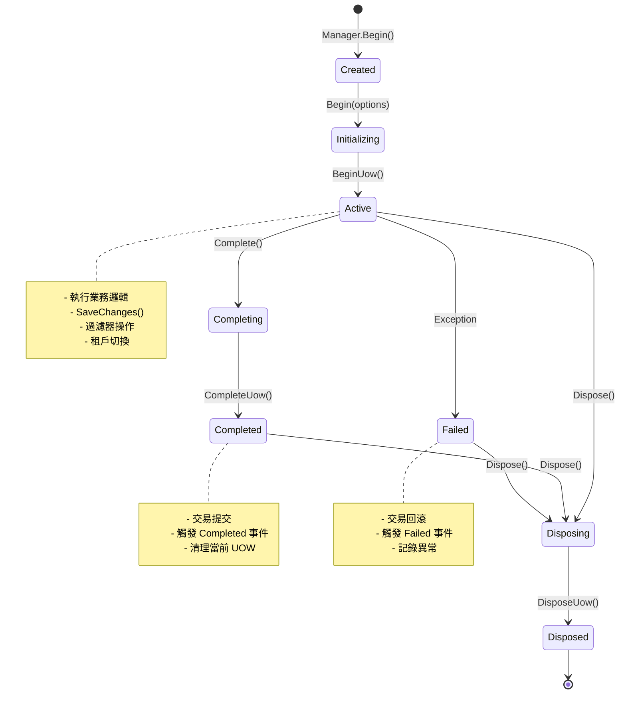
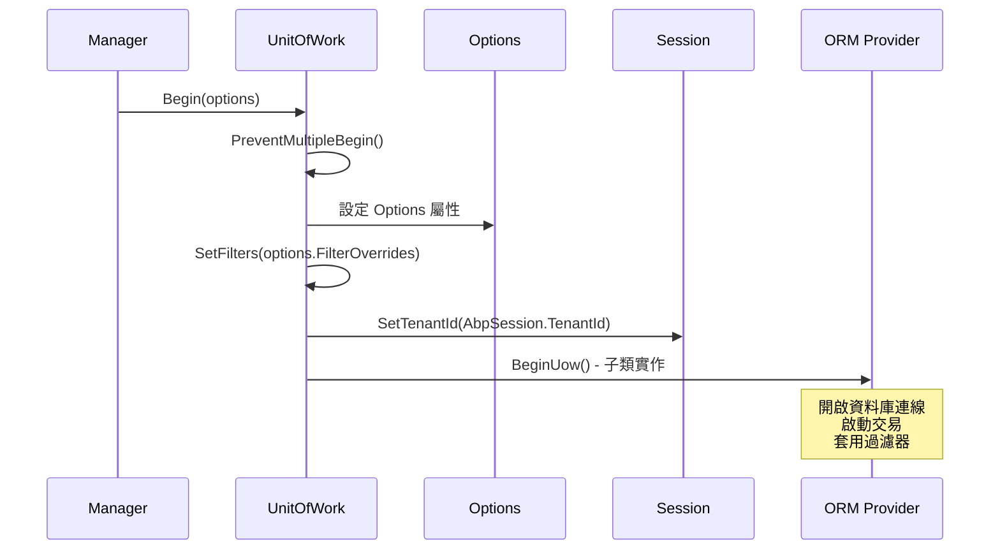
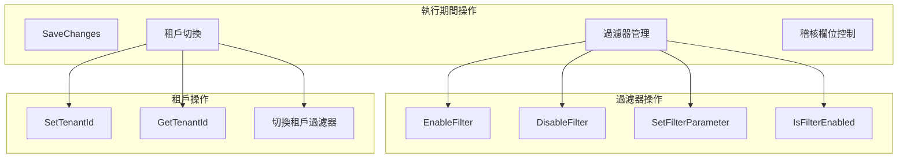
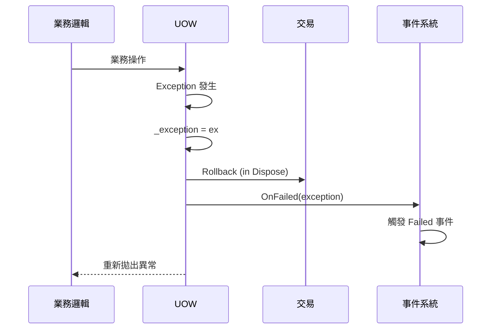
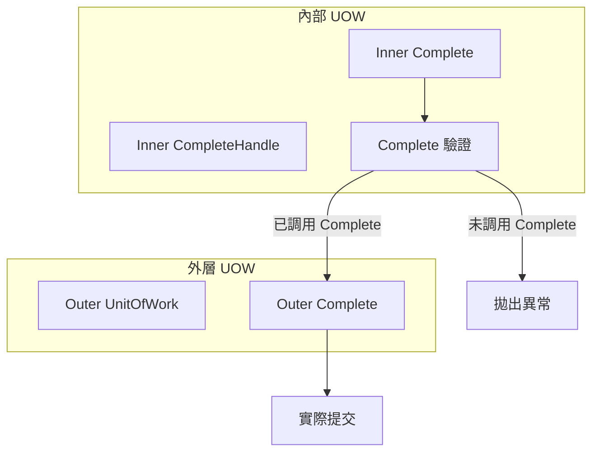

# 03 - UOW 生命週期管理

## 🔄 生命週期總覽

UOW 的生命週期是一個精心設計的狀態機，確保資料一致性與資源管理的正確性。從建立到釋放，每個階段都有明確的職責與狀態轉換。

### 完整生命週期流程



## 🚀 階段一：建立與初始化

### 1. Manager.Begin() - 工廠建立

```csharp
public IUnitOfWorkCompleteHandle Begin(UnitOfWorkOptions options)
{
    // Step 1: 填充預設選項
    options.FillDefaultsForNonProvidedOptions(_defaultOptions);

    var outerUow = _currentUnitOfWorkProvider.Current;

    // Step 2: 處理巢狀 UOW 情況
    if (options.Scope == TransactionScopeOption.Required && outerUow != null)
    {
        return outerUow.Options?.Scope == TransactionScopeOption.Suppress
            ? new InnerSuppressUnitOfWorkCompleteHandle(outerUow)
            : new InnerUnitOfWorkCompleteHandle();
    }

    // Step 3: 建立新的 UOW 實例
    var uow = _iocResolver.Resolve<IUnitOfWork>();
    
    // Step 4: 設定事件處理器
    SetupEventHandlers(uow);
    
    // Step 5: 繼承外層 UOW 設定
    InheritFromOuterUow(uow, outerUow, options);
    
    // Step 6: 開始 UOW
    uow.Begin(options);
    
    // Step 7: 設定為當前活躍的 UOW
    _currentUnitOfWorkProvider.Current = uow;

    return uow;
}
```

### 2. Begin(options) - 初始化配置



### 3. BeginUow() - ORM 特定初始化

不同 ORM 的實作範例：

#### Entity Framework Core
```csharp
protected override void BeginUow()
{
    if (Options.IsTransactional == true)
    {
        _transactionStrategy = CreateActiveTransactionStrategy();
        _transactionStrategy.InitializeOptions(Options);
        _transactionStrategy.Begin(IocResolver, Options);
    }
}
```

#### NHibernate
```csharp
protected override void BeginUow()
{
    Session = DbConnection != null
        ? _sessionFactory.WithOptions().Connection(DbConnection).OpenSession()
        : _sessionFactory.OpenSession();

    if (Options.IsTransactional == true)
    {
        _transaction = Options.IsolationLevel.HasValue
            ? Session.BeginTransaction(Options.IsolationLevel.Value.ToSystemDataIsolationLevel())
            : Session.BeginTransaction();
    }

    // 套用過濾器
    CheckAndSetSoftDelete();
    CheckAndSetMayHaveTenant();
    CheckAndSetMustHaveTenant();
}
```

## 🏃‍♂️ 階段二：執行期間

### 1. 狀態追蹤

```csharp
public abstract class UnitOfWorkBase : IUnitOfWork
{
    // 狀態標記
    private bool _isBeginCalledBefore;
    private bool _isCompleteCalledBefore;
    private bool _succeed;
    private Exception _exception;
    
    // 核心屬性
    public bool IsDisposed { get; private set; }
    public Dictionary<string, object> Items { get; set; } = new();
    
    // 事件
    public event EventHandler Completed;
    public event EventHandler<UnitOfWorkFailedEventArgs> Failed;
    public event EventHandler Disposed;
}
```

### 2. 運行時操作



### 3. 資料儲存機制

```csharp
/// <summary>
/// 儲存變更 - 可多次調用
/// </summary>
public abstract void SaveChanges();
public abstract Task SaveChangesAsync();

// Entity Framework 實作範例
public override void SaveChanges()
{
    foreach (var dbContext in GetAllActiveDbContexts())
    {
        SaveChangesInDbContext(dbContext);
    }
}

protected virtual void SaveChangesInDbContext(DbContext dbContext)
{
    dbContext.SaveChanges();
}
```

## ✅ 階段三：完成與提交

### 1. Complete() 方法流程

```csharp
public void Complete()
{
    PreventMultipleComplete();
    try
    {
        CompleteUow();        // 執行實際提交
        _succeed = true;      // 標記成功
        OnCompleted();        // 觸發 Completed 事件
    }
    catch (Exception ex)
    {
        _exception = ex;      // 記錄異常
        throw;               // 重新拋出異常
    }
}
```

### 2. CompleteUow() 實作

不同 ORM 的提交策略：

#### Entity Framework Core
```csharp
protected override void CompleteUow()
{
    SaveChanges();
    
    if (Options.IsTransactional == true)
    {
        _transactionStrategy.Commit();
    }
}
```

#### NHibernate
```csharp
protected override void CompleteUow()
{
    SaveChanges();
    if (_transaction != null)
    {
        _transaction.Commit();
    }
}
```

### 3. 非同步完成

```csharp
public async Task CompleteAsync()
{
    PreventMultipleComplete();
    try
    {
        await CompleteUowAsync();
        _succeed = true;
        OnCompleted();
    }
    catch (Exception ex)
    {
        _exception = ex;
        throw;
    }
}
```

## ❌ 階段四：失敗處理

### 1. 異常捕獲機制



### 2. 失敗事件處理

```csharp
/// <summary>
/// 觸發失敗事件
/// </summary>
protected virtual void OnFailed(Exception exception)
{
    Failed.InvokeSafely(this, new UnitOfWorkFailedEventArgs(exception));
}

// 使用範例
_unitOfWorkManager.Current.Failed += (sender, args) =>
{
    Logger.Error("UOW failed", args.Exception);
    // 執行失敗後的清理工作
};
```

### 3. UnitOfWorkFailedEventArgs

```csharp
public class UnitOfWorkFailedEventArgs : EventArgs
{
    /// <summary>
    /// 導致失敗的異常
    /// </summary>
    public Exception Exception { get; private set; }

    public UnitOfWorkFailedEventArgs(Exception exception)
    {
        Exception = exception;
    }
}
```

## 🗑️ 階段五：釋放與清理

### 1. Dispose() 方法

```csharp
public void Dispose()
{
    if (!_isBeginCalledBefore || IsDisposed)
    {
        return; // 防止重複釋放
    }

    IsDisposed = true;

    // 如果未成功完成，觸發失敗事件
    if (!_succeed)
    {
        OnFailed(_exception);
    }

    // 執行資源清理
    DisposeUow();
    
    // 觸發釋放事件
    OnDisposed();
}
```

### 2. DisposeUow() 實作

#### Entity Framework Core
```csharp
protected override void DisposeUow()
{
    if (Options.IsTransactional == true)
    {
        _transactionStrategy.Dispose(IocResolver);
    }
    else
    {
        foreach (var context in GetAllActiveDbContexts())
        {
            Release(context);
        }
    }

    ActiveDbContexts.Clear();
}

protected virtual void Release(DbContext dbContext)
{
    dbContext.Dispose();
    IocResolver.Release(dbContext);
}
```

#### NHibernate
```csharp
protected override void DisposeUow()
{
    if (_transaction != null)
    {
        _transaction.Dispose();
        _transaction = null;
    }

    Session.Dispose();
}
```

## 🎭 事件系統

### 1. 三大核心事件

| 事件 | 觸發時機 | 用途 |
|------|----------|------|
| **Completed** | UOW 成功完成後 | 執行後續處理、發送通知 |
| **Failed** | UOW 執行失敗時 | 錯誤處理、回滾操作 |
| **Disposed** | UOW 資源釋放時 | 清理資源、重置狀態 |

### 2. 事件使用範例

```csharp
public void CreateTask(CreateTaskInput input)
{
    var task = new Task { Description = input.Description };

    if (input.AssignedPersonId.HasValue)
    {
        task.AssignedPersonId = input.AssignedPersonId.Value;
        
        // 註冊完成事件
        _unitOfWorkManager.Current.Completed += (sender, args) => 
        {
            // 發送郵件給指派人員
            _emailService.SendTaskAssignmentEmail(input.AssignedPersonId.Value, task);
        };
    }

    _taskRepository.Insert(task);
}
```

### 3. 事件管理器設定

```csharp
private void SetupEventHandlers(IUnitOfWork uow)
{
    uow.Completed += (sender, args) =>
    {
        _currentUnitOfWorkProvider.Current = null;
    };

    uow.Failed += (sender, args) =>
    {
        _currentUnitOfWorkProvider.Current = null;
    };

    uow.Disposed += (sender, args) =>
    {
        _iocResolver.Release(uow);
    };
}
```

## 🔗 巢狀 UOW 生命週期

### 1. 內部 UOW 處理器



### 2. InnerUnitOfWorkCompleteHandle

```csharp
internal class InnerUnitOfWorkCompleteHandle : IUnitOfWorkCompleteHandle
{
    public const string DidNotCallCompleteMethodExceptionMessage = 
        "Did not call Complete method of a unit of work.";

    private volatile bool _isCompleteCalled;
    private volatile bool _isDisposed;

    public virtual void Complete()
    {
        _isCompleteCalled = true; // 僅標記，不執行實際提交
    }

    public void Dispose()
    {
        if (_isDisposed) return;
        _isDisposed = true;

        // 檢查是否調用了 Complete
        if (!_isCompleteCalled)
        {
            if (HasException()) return; // 如果已有異常，不拋出新異常
            
            throw new AbpException(DidNotCallCompleteMethodExceptionMessage);
        }
    }
}
```

### 3. Suppress 模式處理

```csharp
internal class InnerSuppressUnitOfWorkCompleteHandle : InnerUnitOfWorkCompleteHandle
{
    private readonly IUnitOfWork _parentUnitOfWork;

    public override void Complete()
    {
        _parentUnitOfWork.SaveChanges(); // 立即儲存變更
        base.Complete();
    }

    public override async Task CompleteAsync()
    {
        await _parentUnitOfWork.SaveChangesAsync();
        await base.CompleteAsync();
    }
}
```

## ⚠️ 生命週期最佳實務

### 1. 防護機制

```csharp
private void PreventMultipleBegin()
{
    if (_isBeginCalledBefore)
    {
        throw new AbpException(
            "This unit of work has started before. Can not call Start method more than once.");
    }
    _isBeginCalledBefore = true;
}

private void PreventMultipleComplete()
{
    if (_isCompleteCalledBefore)
    {
        throw new AbpException("Complete is called before!");
    }
    _isCompleteCalledBefore = true;
}
```

### 2. 使用模式

#### ✅ 正確使用
```csharp
using (var uow = _unitOfWorkManager.Begin())
{
    // 業務邏輯
    _repository.Insert(entity);
    
    // 明確完成
    await uow.CompleteAsync();
} // 自動釋放資源
```

#### ❌ 錯誤使用
```csharp
var uow = _unitOfWorkManager.Begin();
_repository.Insert(entity);
// 忘記調用 Complete() 和 Dispose()
// 會導致交易回滾和資源洩漏
```

### 3. 監控指標

| 指標 | 說明 | 監控重點 |
|------|------|----------|
| **UOW 持續時間** | 從 Begin 到 Dispose 的時間 | 檢測長時間運行的 UOW |
| **完成率** | Complete 調用比例 | 發現未正確完成的 UOW |
| **失敗率** | Failed 事件觸發頻率 | 監控異常情況 |
| **記憶體使用** | UOW 實例數量 | 檢測資源洩漏 |

---

**下一章節**: [04-UnitOfWorkAttribute詳解](04-UnitOfWorkAttribute詳解.md)

在下一章中，我們將探討 UnitOfWorkAttribute 的功能與配置選項，以及它如何實現宣告式的 UOW 管理。
