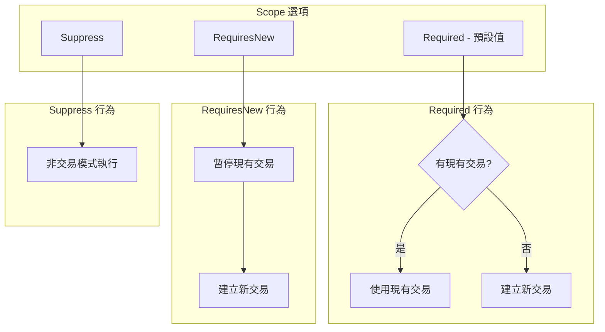
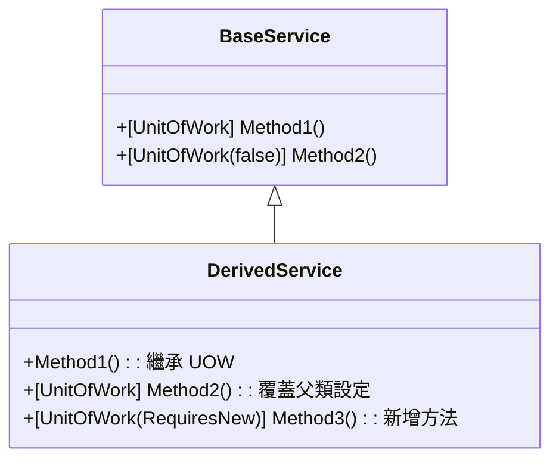

# 04 - UnitOfWorkAttribute 詳解

## 📝 屬性概述

`UnitOfWorkAttribute` 是 ASP.NET Boilerplate 框架中 UOW 系統的核心屬性，提供宣告式的交易管理方式。透過此屬性，開發者可以輕鬆地為方法或類別標註 UOW 語義，而無需手動管理複雜的交易邏輯。

### 屬性定義

```csharp
[AttributeUsage(AttributeTargets.Method | AttributeTargets.Class | AttributeTargets.Interface)]
public class UnitOfWorkAttribute : Attribute
{
    // 核心屬性
    public TransactionScopeOption? Scope { get; set; }
    public bool? IsTransactional { get; set; }
    public TimeSpan? Timeout { get; set; }
    public IsolationLevel? IsolationLevel { get; set; }
    public bool IsDisabled { get; set; }
    
    // 多種建構函式支援不同的配置組合
    // ...
}
```

## 🎯 核心屬性詳解

### 1. TransactionScopeOption Scope

控制交易的範圍行為，決定新 UOW 與現有交易的關係。



#### 實際應用範例

```csharp
public class OrderService : ITransientDependency
{
    // Required (預設) - 與外層共用交易
    [UnitOfWork]
    public async Task ProcessOrderAsync(CreateOrderDto input)
    {
        var order = new Order(input);
        await _orderRepository.InsertAsync(order);
        
        // 這個方法會參與同一個交易
        await _inventoryService.ReserveItemsAsync(order.Items);
    }
    
    // RequiresNew - 獨立的交易
    [UnitOfWork(TransactionScopeOption.RequiresNew)]
    public async Task LogOrderEventAsync(string message)
    {
        // 無論外層交易成功與否，此日誌都會保存
        var log = new OrderLog(message);
        await _logRepository.InsertAsync(log);
    }
    
    // Suppress - 非交易模式
    [UnitOfWork(TransactionScopeOption.Suppress)]
    public async Task<List<OrderDto>> GetOrdersAsync()
    {
        // 大量讀取，不需要交易保護
        return await _orderRepository.GetAllListAsync();
    }
}
```

### 2. bool IsTransactional

明確指定是否啟用交易支援。

```csharp
public class ReportService : ITransientDependency
{
    // 啟用交易 (預設行為)
    [UnitOfWork(isTransactional: true)]
    public async Task GenerateReportAsync(ReportRequest request)
    {
        // 需要交易保護的操作
        await _dataProcessor.ProcessAsync(request);
        await _reportRepository.SaveAsync(result);
    }
    
    // 停用交易 - 優化讀取效能
    [UnitOfWork(isTransactional: false)]
    public async Task<byte[]> ExportReportAsync(int reportId)
    {
        // 純讀取操作，不需要交易開銷
        var report = await _reportRepository.GetAsync(reportId);
        return _exporter.Export(report);
    }
}
```

### 3. IsolationLevel 隔離級別

控制交易的隔離級別，影響並發交易間的可見性。

| 隔離級別 | 髒讀 | 不可重複讀 | 幻讀 | 說明 |
|----------|------|------------|------|------|
| **ReadUncommitted** | ✓ | ✓ | ✓ | 最低隔離，最高效能 |
| **ReadCommitted** | ✗ | ✓ | ✓ | 預設級別，平衡效能與一致性 |
| **RepeatableRead** | ✗ | ✗ | ✓ | 保證重複讀取一致性 |
| **Serializable** | ✗ | ✗ | ✗ | 最高一致性，最低效能 |

```csharp
public class FinancialService : ITransientDependency
{
    // 金融交易需要最高隔離級別
    [UnitOfWork(IsolationLevel.Serializable)]
    public async Task TransferMoneyAsync(int fromAccount, int toAccount, decimal amount)
    {
        var from = await _accountRepository.GetAsync(fromAccount);
        var to = await _accountRepository.GetAsync(toAccount);
        
        from.Withdraw(amount);
        to.Deposit(amount);
        
        // 串行化隔離確保沒有並發干擾
    }
    
    // 一般查詢使用預設隔離級別
    [UnitOfWork(IsolationLevel.ReadCommitted)]
    public async Task<decimal> GetBalanceAsync(int accountId)
    {
        var account = await _accountRepository.GetAsync(accountId);
        return account.Balance;
    }
}
```

### 4. TimeSpan Timeout

設定交易的超時時間，防止長時間運行的交易鎖定資源。

```csharp
public class BatchProcessService : ITransientDependency
{
    // 短超時 - 快速操作
    [UnitOfWork(timeout: 30000)] // 30 秒
    public async Task QuickUpdateAsync(List<int> ids)
    {
        foreach (var id in ids.Take(100)) // 限制數量
        {
            await _repository.UpdateAsync(id);
        }
    }
    
    // 長超時 - 批次處理
    [UnitOfWork(timeout: 600000)] // 10 分鐘
    public async Task BatchProcessAsync(BatchRequest request)
    {
        // 大量資料處理，需要較長時間
        await _processor.ProcessLargeDatasetAsync(request);
    }
}
```

### 5. bool IsDisabled

用於停用 UOW，即使在預設啟用 UOW 的類別中也能選擇性關閉。

```csharp
[UnitOfWork] // 類別級別的 UOW
public class UserService : ApplicationService
{
    // 繼承類別的 UOW 設定
    public async Task CreateUserAsync(CreateUserDto input)
    {
        var user = new User(input);
        await _userRepository.InsertAsync(user);
    }
    
    // 明確停用 UOW
    [UnitOfWork(IsDisabled = true)]
    public async Task<bool> CheckUserExistsAsync(string email)
    {
        // 簡單查詢，不需要 UOW 開銷
        return await _userRepository.FirstOrDefaultAsync(u => u.Email == email) != null;
    }
}
```

## 🔧 建構函式重載

`UnitOfWorkAttribute` 提供了豐富的建構函式重載，支援不同的配置組合：

### 完整建構函式列表

`UnitOfWorkAttribute` 提供了11個建構函式重載，滿足各種配置需求：

```csharp
// 1. 預設建構函式
public UnitOfWorkAttribute()

// 2. 設定交易狀態
public UnitOfWorkAttribute(bool isTransactional)

// 3. 設定超時時間（毫秒）
public UnitOfWorkAttribute(int timeout)

// 4. 設定交易狀態 + 超時時間
public UnitOfWorkAttribute(bool isTransactional, int timeout)

// 5. 設定隔離級別（自動啟用交易）
public UnitOfWorkAttribute(IsolationLevel isolationLevel)

// 6. 設定隔離級別 + 超時時間（自動啟用交易）
public UnitOfWorkAttribute(IsolationLevel isolationLevel, int timeout)

// 7. 設定交易範圍（自動啟用交易）
public UnitOfWorkAttribute(TransactionScopeOption scope)

// 8. 設定交易範圍 + 交易狀態
public UnitOfWorkAttribute(TransactionScopeOption scope, bool isTransactional)

// 9. 設定交易範圍 + 超時時間（自動啟用交易）
public UnitOfWorkAttribute(TransactionScopeOption scope, int timeout)

// 10. 設定交易範圍 + 隔離級別（自動啟用交易）
public UnitOfWorkAttribute(TransactionScopeOption scope, IsolationLevel isolationLevel)

// 11. 設定交易範圍 + 隔離級別 + 超時時間（自動啟用交易）
public UnitOfWorkAttribute(TransactionScopeOption scope, IsolationLevel isolationLevel, int timeout)

// 12. 設定交易範圍 + 交易狀態 + 超時時間
public UnitOfWorkAttribute(TransactionScopeOption scope, bool isTransactional, int timeout)
```

### CreateOptions() 方法

每個 `UnitOfWorkAttribute` 實例都包含一個內部方法，用於建立 `UnitOfWorkOptions`：

```csharp
internal UnitOfWorkOptions CreateOptions()
{
    return new UnitOfWorkOptions
    {
        IsTransactional = IsTransactional,
        IsolationLevel = IsolationLevel,
        Timeout = Timeout,
        Scope = Scope
    };
}
```

### 常用建構函式組合

```csharp
// 基本用法
[UnitOfWork]                              // 使用預設設定
[UnitOfWork(false)]                       // 停用交易
[UnitOfWork(30000)]                       // 設定超時時間

// 組合用法
[UnitOfWork(IsolationLevel.ReadCommitted)]                    // 指定隔離級別
[UnitOfWork(true, 60000)]                                    // 交易 + 超時
[UnitOfWork(TransactionScopeOption.RequiresNew)]             // 指定範圍
[UnitOfWork(TransactionScopeOption.Required, IsolationLevel.Serializable, 120000)] // 完整配置
```

### 配置選擇指南

```mermaid
flowchart TD
    START[選擇 UOW 配置] --> NEED{需要交易?}
    
    NEED -->|否| NOTRANS[UnitOfWork(false)]
    NEED -->|是| SCOPE{交易範圍?}
    
    SCOPE -->|與外層共用| REQUIRED[TransactionScopeOption.Required]
    SCOPE -->|獨立交易| REQUIRESNEW[TransactionScopeOption.RequiresNew]
    SCOPE -->|非交易| SUPPRESS[TransactionScopeOption.Suppress]
    
    REQUIRED --> ISOLATION{需要特殊隔離?}
    REQUIRESNEW --> ISOLATION
    
    ISOLATION -->|否| TIMEOUT{有超時需求?}
    ISOLATION -->|是| SETISO[設定 IsolationLevel]
    
    SETISO --> TIMEOUT
    TIMEOUT -->|否| DONE[配置完成]
    TIMEOUT -->|是| SETTIMEOUT[設定 Timeout]
    
    SETTIMEOUT --> DONE
    NOTRANS --> DONE
    SUPPRESS --> DONE
```

## 📋 使用模式與最佳實務

### 1. 方法級別 vs 類別級別

```csharp
// 類別級別 - 所有方法都有 UOW
[UnitOfWork]
public class ProductService : ApplicationService
{
    // 自動套用 UOW
    public async Task CreateProductAsync(ProductDto input) { }
    
    // 覆蓋類別設定
    [UnitOfWork(isTransactional: false)]
    public async Task<List<ProductDto>> GetAllProductsAsync() { }
}

// 介面級別 - 所有實作都有 UOW
[UnitOfWork]
public interface IProductService
{
    Task CreateProductAsync(ProductDto input);
    Task UpdateProductAsync(ProductDto input);
}
```

### 2. 繼承與覆蓋



### 3. 條件式 UOW

```csharp
public class ConditionalService : ITransientDependency
{
    public async Task ProcessDataAsync(ProcessRequest request)
    {
        if (request.RequiresTransaction)
        {
            // 手動開始 UOW
            using (var uow = _unitOfWorkManager.Begin())
            {
                await ProcessWithTransactionAsync(request);
                await uow.CompleteAsync();
            }
        }
        else
        {
            // 無交易處理
            await ProcessWithoutTransactionAsync(request);
        }
    }
    
    [UnitOfWork(IsDisabled = true)]
    private async Task ProcessWithoutTransactionAsync(ProcessRequest request)
    {
        // 非交易處理邏輯
    }
    
    private async Task ProcessWithTransactionAsync(ProcessRequest request)
    {
        // 交易處理邏輯
    }
}
```

## ⚠️ 注意事項與陷阱

### 1. 非同步方法的處理

```csharp
public class AsyncService : ITransientDependency
{
    // ✅ 正確：非同步方法
    [UnitOfWork]
    public async Task ProcessAsync()
    {
        await _repository.InsertAsync(new Entity());
        // UOW 會等待 async 操作完成
    }
    
    // ❌ 錯誤：非同步但不等待
    [UnitOfWork]
    public Task ProcessIncorrectAsync()
    {
        var task = _repository.InsertAsync(new Entity());
        // UOW 可能在 task 完成前就結束
        return task;
    }
}
```

### 2. 例外處理影響

```csharp
public class ExceptionHandlingService : ITransientDependency
{
    [UnitOfWork]
    public async Task ProcessWithExceptionAsync()
    {
        try
        {
            await _repository.InsertAsync(new Entity());
            throw new BusinessException("業務錯誤");
        }
        catch (BusinessException)
        {
            // 即使捕獲例外，UOW 仍會回滾
            // 因為例外已經拋出過一次
        }
        // 需要重新拋出例外才能避免回滾
    }
    
    [UnitOfWork]
    public async Task ProcessWithProperHandlingAsync()
    {
        try
        {
            await _repository.InsertAsync(new Entity());
            // 正常完成，不拋出例外
        }
        catch (Exception ex)
        {
            // 記錄錯誤但不重新拋出
            _logger.Error("處理失敗", ex);
            // UOW 會正常提交
        }
    }
}
```

### 3. 巢狀 UOW 的行為

```csharp
public class NestedService : ITransientDependency
{
    [UnitOfWork]
    public async Task OuterMethodAsync()
    {
        await _repository.InsertAsync(new Entity("外層"));
        
        // 內層方法會參與同一個交易
        await InnerMethodAsync();
        
        // 如果內層拋出例外，整個交易回滾
    }
    
    [UnitOfWork(TransactionScopeOption.Required)]
    public async Task InnerMethodAsync()
    {
        await _repository.InsertAsync(new Entity("內層"));
        // 與外層共用同一個交易
    }
    
    [UnitOfWork(TransactionScopeOption.RequiresNew)]
    public async Task IndependentMethodAsync()
    {
        await _repository.InsertAsync(new Entity("獨立"));
        // 使用獨立的交易，不受外層影響
    }
}
```

## 🎯 CreateOptions() 內部機制

當攔截器讀取 `UnitOfWorkAttribute` 時，會呼叫 `CreateOptions()` 方法建立 `UnitOfWorkOptions` 實例：

```csharp
internal UnitOfWorkOptions CreateOptions()
{
    return new UnitOfWorkOptions
    {
        IsTransactional = IsTransactional,
        IsolationLevel = IsolationLevel,
        Timeout = Timeout,
        Scope = Scope
    };
}
```

這個機制確保屬性設定能夠正確轉換為運行時選項，並與預設選項進行合併。

---

**下一章節**: [05-AOP攔截器原理與實作](05-AOP攔截器原理與實作.md)

在下一章中，我們將深入探討 UOW 攔截器的實作原理，包括 Castle DynamicProxy 的運用與非同步方法的處理機制。
