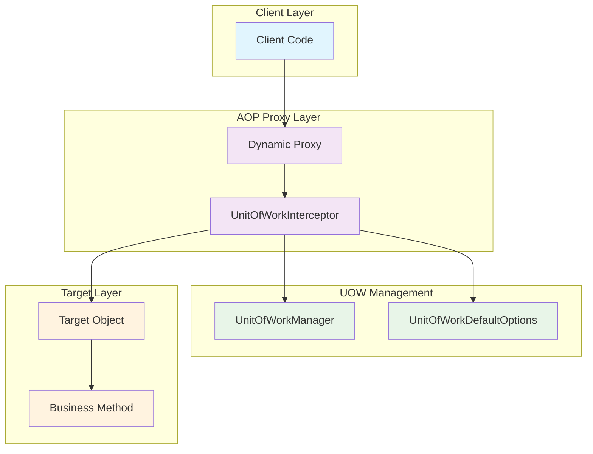
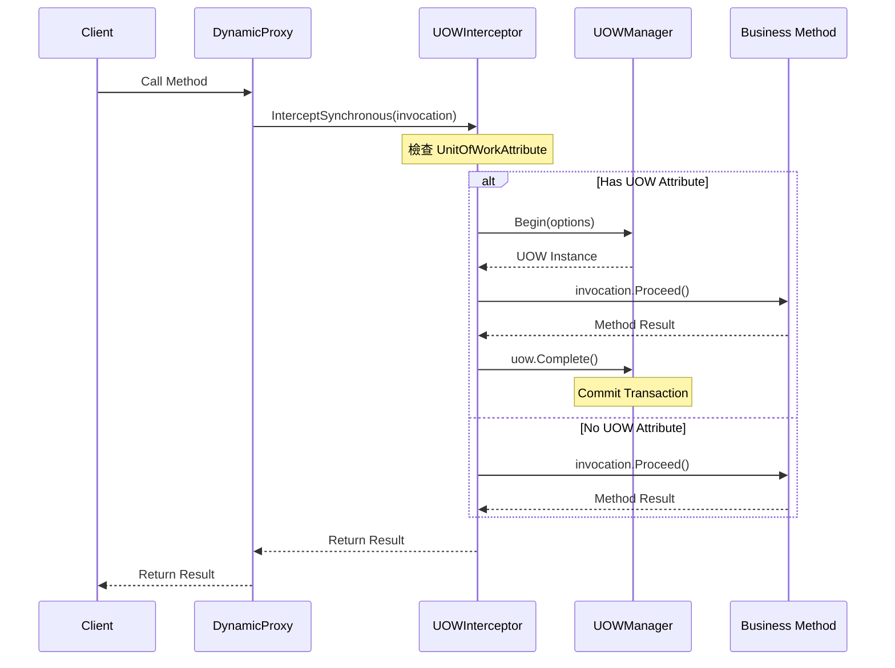
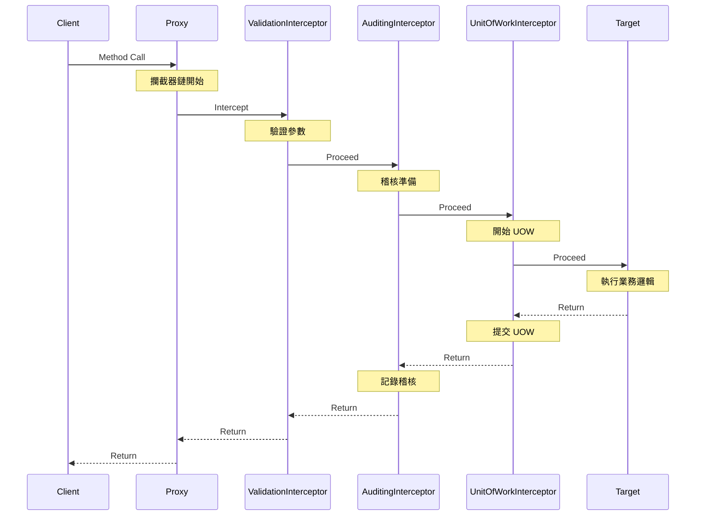

# 05 - AOP 攔截器原理與實作

## 🎭 攔截器架構概述

ASP.NET Boilerplate 的 UOW 系統基於 Castle DynamicProxy 實現 AOP (Aspect-Oriented Programming) 功能。攔截器作為橫切關注點的實現載體，在方法執行前後插入 UOW 管理邏輯。

### 攔截器架構圖



## 🔍 核心攔截器類別

### 1. UnitOfWorkInterceptor - 主要攔截器

```csharp
/// <summary>
/// UOW 攔截器 - 負責管理資料庫連線與交易
/// </summary>
internal class UnitOfWorkInterceptor : AbpInterceptorBase, ITransientDependency
{
    private readonly IUnitOfWorkManager _unitOfWorkManager;
    private readonly IUnitOfWorkDefaultOptions _unitOfWorkOptions;

    public UnitOfWorkInterceptor(
        IUnitOfWorkManager unitOfWorkManager, 
        IUnitOfWorkDefaultOptions unitOfWorkOptions)
    {
        _unitOfWorkManager = unitOfWorkManager;
        _unitOfWorkOptions = unitOfWorkOptions;
    }
}
```

### 攔截器職責分工

| 組件 | 職責 | 說明 |
|------|------|------|
| **UnitOfWorkInterceptor** | 🎯 核心邏輯 | 管理 UOW 生命週期與攔截邏輯 |
| **UnitOfWorkManager** | � 管理器 | 創建和管理 UOW 實例 |
| **UnitOfWorkRegistrar** | 📝 註冊管理 | 自動註冊需要攔截的類別 |

## 🚀 同步方法攔截

### InterceptSynchronous 實作

```csharp
public override void InterceptSynchronous(IInvocation invocation)
{
    // 1. 取得方法資訊
    var method = GetMethodInfo(invocation);
    
    // 2. 檢查是否有 UnitOfWorkAttribute
    var unitOfWorkAttr = _unitOfWorkOptions.GetUnitOfWorkAttributeOrNull(method);
    
    // 3. 如果沒有屬性或被停用，直接執行
    if (unitOfWorkAttr == null || unitOfWorkAttr.IsDisabled)
    {
        invocation.Proceed();
        return;
    }

    // 4. 建立 UOW 並執行業務邏輯
    using (var uow = _unitOfWorkManager.Begin(unitOfWorkAttr.CreateOptions()))
    {
        invocation.Proceed();
        uow.Complete();
    }
}
```

### 同步攔截流程



## 🔄 非同步方法攔截

### InternalInterceptAsynchronous 實作

```csharp
protected override async Task InternalInterceptAsynchronous(IInvocation invocation)
{
    var proceedInfo = invocation.CaptureProceedInfo();
    var method = GetMethodInfo(invocation);
    var unitOfWorkAttr = _unitOfWorkOptions.GetUnitOfWorkAttributeOrNull(method);

    if (unitOfWorkAttr == null || unitOfWorkAttr.IsDisabled)
    {
        proceedInfo.Invoke();
        var task = (Task)invocation.ReturnValue;
        await task;
        return;
    }

    using (var uow = _unitOfWorkManager.Begin(unitOfWorkAttr.CreateOptions()))
    {
        proceedInfo.Invoke();
        var task = (Task)invocation.ReturnValue;
        await task;
        await uow.CompleteAsync();
    }
}
```

### 帶返回值的非同步攔截

```csharp
protected override async Task<TResult> InternalInterceptAsynchronous<TResult>(IInvocation invocation)
{
    var proceedInfo = invocation.CaptureProceedInfo();
    var method = GetMethodInfo(invocation);
    var unitOfWorkAttr = _unitOfWorkOptions.GetUnitOfWorkAttributeOrNull(method);

    if (unitOfWorkAttr == null || unitOfWorkAttr.IsDisabled)
    {
        proceedInfo.Invoke();
        var taskResult = (Task<TResult>)invocation.ReturnValue;
        return await taskResult;
    }

    using (var uow = _unitOfWorkManager.Begin(unitOfWorkAttr.CreateOptions()))
    {
        proceedInfo.Invoke();
        
        var taskResult = (Task<TResult>)invocation.ReturnValue;
        var result = await taskResult;

        await uow.CompleteAsync();

        return result;
    }
}
```

### 非同步攔截的關鍵技術點

#### 1. CaptureProceedInfo() 模式

```csharp
// Castle DynamicProxy 的非同步處理模式
var proceedInfo = invocation.CaptureProceedInfo();

// 先觸發方法執行
proceedInfo.Invoke();

// 取得返回的 Task
var task = (Task)invocation.ReturnValue;

// 等待 Task 完成
await task;
```

💡 **為什麼不直接使用 invocation.Proceed()?**
- `invocation.Proceed()` 是同步呼叫
- `CaptureProceedInfo()` 允許非同步等待 Task 完成
- 確保 UOW 在真正的非同步操作完成後才提交

#### 2. 非同步上下文保持

```csharp
// 攔截器執行在正確的非同步上下文中
using (var uow = _unitOfWorkManager.Begin(options))
{
    // 業務邏輯在同一個非同步上下文
    proceedInfo.Invoke();
    var task = (Task)invocation.ReturnValue;
    
    // 等待時保持 UOW 的生命週期
    await task;
    
    // 在正確的上下文中提交
    await uow.CompleteAsync();
}
```

## 🎯 AbpAsyncDeterminationInterceptor

這是一個通用的非同步判斷攔截器，用於包裝其他攔截器並自動判斷方法是否為非同步。

### 工作原理

```mermaid
flowchart TD
    START[Method Invocation] --> CHECK{Return Type?}
    
    CHECK -->|void| SYNC[InterceptSynchronous]
    CHECK -->|Task| ASYNC_VOID[InternalInterceptAsynchronous]
    CHECK -->|Task&lt;T&gt;| ASYNC_RESULT[InternalInterceptAsynchronous&lt;T&gt;]
    CHECK -->|Others| SYNC
    
    SYNC --> PROCEED[invocation.Proceed()]
    ASYNC_VOID --> CAPTURE[CaptureProceedInfo]
    ASYNC_RESULT --> CAPTURE
    
    CAPTURE --> INVOKE[proceedInfo.Invoke()]
    INVOKE --> AWAIT[await task]
    
    PROCEED --> END[Return Result]
    AWAIT --> END
```

### 使用範例

```csharp
// 註冊時使用 AbpAsyncDeterminationInterceptor 包裝
handler.ComponentModel.Interceptors.Add(
    new InterceptorReference(
        typeof(AbpAsyncDeterminationInterceptor<UnitOfWorkInterceptor>)
    )
);
```

## 📝 自動註冊機制

### UnitOfWorkRegistrar 實作

```csharp
internal static class UnitOfWorkRegistrar
{
    public static void Initialize(IIocManager iocManager)
    {
        iocManager.IocContainer.Kernel.ComponentRegistered += (key, handler) =>
        {
            var implementationType = handler.ComponentModel.Implementation.GetTypeInfo();

            if (ShouldIntercept(iocManager, implementationType))
            {
                handler.ComponentModel.Interceptors.Add(
                    new InterceptorReference(
                        typeof(AbpAsyncDeterminationInterceptor<UnitOfWorkInterceptor>)
                    )
                );
            }
        };
    }
}
```

### 攔截條件判斷

```csharp
private static bool ShouldIntercept(IIocManager iocManager, TypeInfo implementationType)
{
    // 1. 直接標註 UnitOfWorkAttribute
    if (IsUnitOfWorkType(implementationType) || AnyMethodHasUnitOfWork(implementationType))
    {
        return true;
    }
    
    // 2. 檢查是否為慣例型別 (如 ApplicationService, Repository)
    if (!iocManager.IsRegistered<IUnitOfWorkDefaultOptions>())
    {
        return false;
    }

    var uowOptions = iocManager.Resolve<IUnitOfWorkDefaultOptions>();
    return uowOptions.IsConventionalUowClass(implementationType.AsType());
}
```

### 慣例型別判斷

```csharp
// 預設的慣例型別
public static List<Func<Type, bool>> ConventionalUowSelectorList = new List<Func<Type, bool>>
{
    type => typeof(IRepository).IsAssignableFrom(type) ||
            typeof(IApplicationService).IsAssignableFrom(type)
};
```

## 🔧 方法資訊解析

### GetMethodInfo 實作

```csharp
private static MethodInfo GetMethodInfo(IInvocation invocation)
{
    MethodInfo method;
    try
    {
        // 優先使用 MethodInvocationTarget (實際方法)
        method = invocation.MethodInvocationTarget;
    }
    catch
    {
        // 備用：使用 GetConcreteMethod (介面方法)
        method = invocation.GetConcreteMethod();
    }

    return method;
}
```

### 屬性解析邏輯

```csharp
public static UnitOfWorkAttribute GetUnitOfWorkAttributeOrNull(
    this IUnitOfWorkDefaultOptions options, 
    MethodInfo methodInfo)
{
    // 1. 檢查方法級別屬性
    var attrs = methodInfo.GetCustomAttributes(true).OfType<UnitOfWorkAttribute>().ToArray();
    if (attrs.Length > 0)
    {
        return attrs[0];
    }

    // 2. 檢查類別級別屬性
    attrs = methodInfo.DeclaringType.GetTypeInfo()
        .GetCustomAttributes(true).OfType<UnitOfWorkAttribute>().ToArray();
    if (attrs.Length > 0)
    {
        return attrs[0];
    }

    // 3. 檢查是否為慣例型別
    if (options.IsConventionalUowClass(methodInfo.DeclaringType))
    {
        return new UnitOfWorkAttribute(); // 使用預設屬性
    }

    return null;
}
```

## 🎪 攔截器鏈與執行順序

### 多重攔截器的執行順序



### 攔截器註冊順序的重要性

```csharp
// 正確的註冊順序
handler.ComponentModel.Interceptors.Add(new InterceptorReference(typeof(ValidationInterceptor)));
handler.ComponentModel.Interceptors.Add(new InterceptorReference(typeof(AuditingInterceptor)));
handler.ComponentModel.Interceptors.Add(new InterceptorReference(typeof(UnitOfWorkInterceptor)));

// 執行順序：Validation → Auditing → UOW → Target
// 返回順序：Target → UOW → Auditing → Validation
```

## ⚡ 效能考量與最佳化

### 1. 攔截器快取

```csharp
// Castle Windsor 自動快取代理類別
// 相同型別的多個實例共用同一個代理類別
var service1 = container.Resolve<IUserService>();
var service2 = container.Resolve<IUserService>();
// service1 和 service2 使用相同的代理類別
```

### 2. 屬性解析快取

```csharp
// ABP 內部快取 UnitOfWorkAttribute 解析結果
private static readonly ConcurrentDictionary<MethodInfo, UnitOfWorkAttribute> _cache 
    = new ConcurrentDictionary<MethodInfo, UnitOfWorkAttribute>();

public static UnitOfWorkAttribute GetUnitOfWorkAttributeOrNull(MethodInfo method)
{
    return _cache.GetOrAdd(method, m => /* 解析邏輯 */);
}
```

### 3. 避免不必要的攔截

```csharp
// ✅ 好的做法：明確標註需要 UOW 的方法
public class UserService : IUserService
{
    [UnitOfWork]
    public async Task CreateUserAsync(CreateUserDto input) { }
    
    [UnitOfWork(IsDisabled = true)]
    public async Task<bool> ExistsAsync(string email) { } // 純查詢，停用 UOW
}

// ❌ 避免：整個類別都開啟 UOW
[UnitOfWork]
public class UserService : IUserService
{
    // 所有方法都會被攔截，包括不需要的查詢方法
}
```

## 🐛 除錯與故障排解

### 1. 攔截器是否生效

```csharp
public class DiagnosticService : ITransientDependency
{
    [UnitOfWork]
    public void TestMethod()
    {
        // 在方法中設定中斷點
        // 檢查 this.GetType() 是否為代理類別
        // 代理類別名稱通常包含 "Proxy" 字樣
        
        var currentUow = _unitOfWorkManager.Current;
        if (currentUow == null)
        {
            throw new InvalidOperationException("UOW 攔截器未生效！");
        }
    }
}
```

### 2. 常見問題診斷

| 問題 | 可能原因 | 解決方案 |
|------|----------|----------|
| **攔截器未觸發** | 類別未註冊到 IoC | 確保實作介面並註冊 |
| **非同步方法未等待** | 未使用 `await` | 檢查非同步方法實作 |
| **巢狀 UOW 異常** | 交易範圍設定錯誤 | 檢查 `TransactionScopeOption` |
| **效能問題** | 過度攔截 | 使用 `IsDisabled = true` 停用不必要的攔截 |

---

**下一章節**: [06-自動註冊機制](06-自動註冊機制.md)

在下一章中，我們將深入探討 ABP 如何自動識別需要 UOW 的類別，以及慣例型註冊的運作機制。
