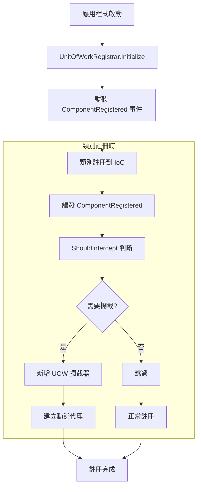
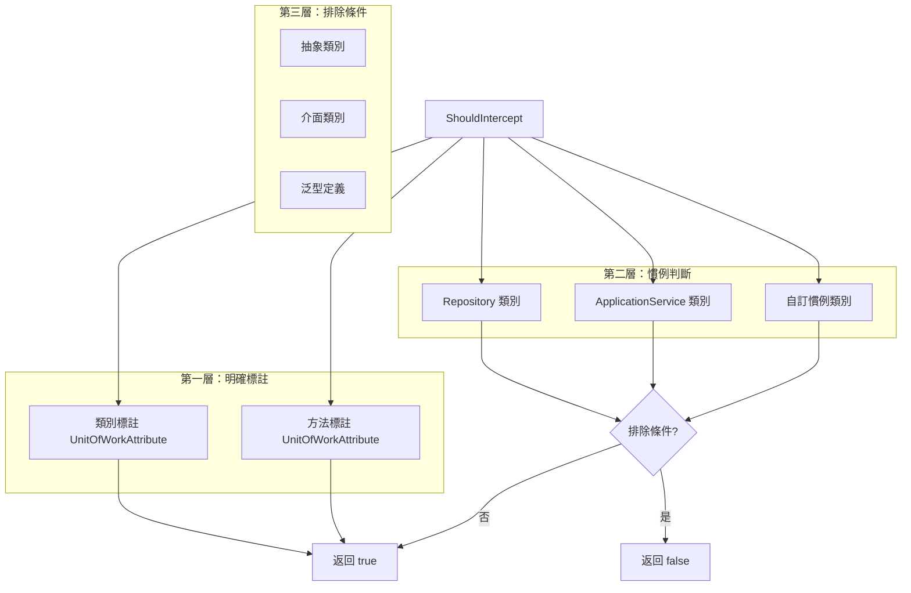

# 06 - 自動註冊機制

## 🎯 註冊機制概述

ASP.NET Boilerplate 的 UOW 自動註冊機制是一個智慧型系統，能夠自動識別需要 UOW 功能的類別並為其註冊攔截器。這個機制基於 Castle Windsor 的 `ComponentRegistered` 事件，在類別註冊到 IoC 容器時進行判斷與處理。

### 註冊流程概覽



## 🔍 UnitOfWorkRegistrar 核心實作

### 初始化與事件監聽

```csharp
internal static class UnitOfWorkRegistrar
{
    /// <summary>
    /// 初始化 UOW 註冊器
    /// </summary>
    /// <param name="iocManager">IoC 管理器</param>
    public static void Initialize(IIocManager iocManager)
    {
        // 監聽 Castle Windsor 的組件註冊事件
        iocManager.IocContainer.Kernel.ComponentRegistered += (key, handler) =>
        {
            var implementationType = handler.ComponentModel.Implementation.GetTypeInfo();

            // 判斷是否需要攔截
            if (ShouldIntercept(iocManager, implementationType))
            {
                // 新增 UOW 攔截器
                handler.ComponentModel.Interceptors.Add(
                    new InterceptorReference(
                        typeof(AbpAsyncDeterminationInterceptor<UnitOfWorkInterceptor>)
                    )
                );
            }
        };
    }
}
```

### 關鍵技術要點

#### 1. 事件驅動的註冊
- 🎪 **即時判斷**：每當類別註冊到 IoC 時立即進行判斷
- 🔄 **自動化**：無需手動配置，系統自動處理
- ⚡ **高效率**：只在註冊時執行一次，不影響運行時效能

#### 2. ComponentModel 操作
```csharp
// 直接操作 Castle Windsor 的組件模型
handler.ComponentModel.Interceptors.Add(interceptorReference);

// 這樣註冊的攔截器會在建立代理時自動套用
```

## 🎯 ShouldIntercept 判斷邏輯

### 完整判斷流程

```csharp
private static bool ShouldIntercept(IIocManager iocManager, TypeInfo implementationType)
{
    // 1. 明確標註 UOW 的類別或方法
    if (IsUnitOfWorkType(implementationType) || AnyMethodHasUnitOfWork(implementationType))
    {
        return true;
    }
    
    // 2. 檢查預設選項是否可用
    if (!iocManager.IsRegistered<IUnitOfWorkDefaultOptions>())
    {
        return false;
    }

    // 3. 慣例型別判斷
    var uowOptions = iocManager.Resolve<IUnitOfWorkDefaultOptions>();
    return uowOptions.IsConventionalUowClass(implementationType.AsType());
}

private static bool IsUnitOfWorkType(TypeInfo implementationType)
{
    return UnitOfWorkHelper.HasUnitOfWorkAttribute(implementationType);
}

private static bool AnyMethodHasUnitOfWork(TypeInfo implementationType)
{
    return implementationType
        .GetMethods(BindingFlags.Instance | BindingFlags.Public | BindingFlags.NonPublic)
        .Any(UnitOfWorkHelper.HasUnitOfWorkAttribute);
}
}
```

### 判斷層次架構



## 📝 明確標註檢查

### IsUnitOfWorkType 實作

```csharp
private static bool IsUnitOfWorkType(TypeInfo implementationType)
{
    // 檢查類別本身是否標註 UnitOfWorkAttribute
    return UnitOfWorkHelper.HasUnitOfWorkAttribute(implementationType);
}

// UnitOfWorkHelper 中的實作
public static bool HasUnitOfWorkAttribute(TypeInfo typeInfo)
{
    return typeInfo.GetCustomAttributes(typeof(UnitOfWorkAttribute), true).Any();
}
```

### AnyMethodHasUnitOfWork 實作

```csharp
private static bool AnyMethodHasUnitOfWork(TypeInfo implementationType)
{
    return implementationType
        .GetMethods(BindingFlags.Instance | BindingFlags.Public | BindingFlags.NonPublic)
        .Any(UnitOfWorkHelper.HasUnitOfWorkAttribute);
}

// 檢查方法是否標註 UnitOfWorkAttribute
public static bool HasUnitOfWorkAttribute(MethodInfo methodInfo)
{
    return methodInfo.GetCustomAttributes(typeof(UnitOfWorkAttribute), true).Any();
}
```

### 實際應用範例

```csharp
// ✅ 會被自動註冊 - 類別級別標註
[UnitOfWork]
public class OrderService : ITransientDependency
{
    public void ProcessOrder() { }
}

// ✅ 會被自動註冊 - 方法級別標註
public class PaymentService : ITransientDependency
{
    [UnitOfWork]
    public void ProcessPayment() { }
    
    public void ValidatePayment() { } // 此方法不會有 UOW
}

// ❌ 不會被註冊 - 沒有任何標註
public class UtilityService : ITransientDependency
{
    public string FormatCurrency(decimal amount) { return $"${amount}"; }
}
```

## 🎪 慣例型別註冊

### 預設慣例選擇器

```csharp
public static List<Func<Type, bool>> ConventionalUowSelectorList = new List<Func<Type, bool>>
{
    // Repository 類別
    type => typeof(IRepository).IsAssignableFrom(type),
    
    // Application Service 類別  
    type => typeof(IApplicationService).IsAssignableFrom(type)
};
```

### IsConventionalUowClass 實作

```csharp
public static bool IsConventionalUowClass(this IUnitOfWorkDefaultOptions options, Type type)
{
    return options.ConventionalUowSelectors.Any(selector => selector(type));
}
```

### 慣例型別的實際應用

```csharp
// ✅ Repository - 自動獲得 UOW
public class UserRepository : EfCoreRepositoryBase<User>, IUserRepository
{
    // 所有方法自動獲得 UOW 支援
    public async Task<User> FindByEmailAsync(string email)
    {
        return await FirstOrDefaultAsync(u => u.Email == email);
    }
}

// ✅ Application Service - 自動獲得 UOW  
public class UserAppService : ApplicationService, IUserAppService
{
    // 所有方法自動獲得 UOW 支援
    public async Task CreateUserAsync(CreateUserDto input)
    {
        var user = new User(input.Name, input.Email);
        await _userRepository.InsertAsync(user);
    }
}

// 🔧 Domain Service - 需要明確標註或自訂慣例
public class UserDomainService : DomainService
{
    [UnitOfWork] // 需要明確標註
    public async Task AssignRoleAsync(User user, Role role)
    {
        user.Roles.Add(role);
    }
}
```

## ⚙️ 自訂慣例選擇器

### 新增自訂慣例

```csharp
public class MyModule : AbpModule
{
    public override void PreInitialize()
    {
        // 新增自訂慣例：所有 Domain Service 都獲得 UOW
        Configuration.UnitOfWork.ConventionalUowSelectors.Add(
            type => typeof(DomainService).IsAssignableFrom(type)
        );
        
        // 新增自訂慣例：以 "Manager" 結尾的類別
        Configuration.UnitOfWork.ConventionalUowSelectors.Add(
            type => type.Name.EndsWith("Manager")
        );
        
        // 新增自訂慣例：標註特定介面的類別
        Configuration.UnitOfWork.ConventionalUowSelectors.Add(
            type => typeof(IBusinessService).IsAssignableFrom(type)
        );
    }
}
```

### 複雜慣例範例

```csharp
// 基於命名空間的慣例
Configuration.UnitOfWork.ConventionalUowSelectors.Add(type =>
    type.Namespace != null && 
    type.Namespace.Contains(".Services.") &&
    !type.Name.EndsWith("Helper")
);

// 基於屬性的慣例 (非 UnitOfWorkAttribute)
Configuration.UnitOfWork.ConventionalUowSelectors.Add(type =>
    type.GetCustomAttributes(typeof(TransactionalAttribute), true).Any()
);

// 基於介面繼承的慣例
Configuration.UnitOfWork.ConventionalUowSelectors.Add(type =>
    type.GetInterfaces().Any(i => 
        i.IsGenericType && 
        i.GetGenericTypeDefinition() == typeof(IBusinessLogic<>)
    )
);
```

## 🚫 排除機制

### 自動排除的類別型別

```csharp
// ABP 內建的排除邏輯 (簡化版)
private static bool ShouldExclude(Type type)
{
    return type.IsAbstract ||           // 抽象類別
           type.IsInterface ||          // 介面
           type.IsGenericTypeDefinition || // 泛型定義
           typeof(IInterceptor).IsAssignableFrom(type) || // 攔截器本身
           typeof(IUnitOfWork).IsAssignableFrom(type);    // UOW 實作類別
}
```

### 明確排除特定類別

```csharp
// 使用 IsDisabled 排除
[UnitOfWork(IsDisabled = true)]
public class CacheService : ApplicationService
{
    // 即使繼承 ApplicationService，也不會有 UOW
    public async Task<string> GetCachedDataAsync(string key)
    {
        return await _cache.GetAsync(key);
    }
}

// 自訂排除慣例
Configuration.UnitOfWork.ConventionalUowSelectors.Add(type =>
{
    // 只要不是 Cache 相關的 ApplicationService
    return typeof(IApplicationService).IsAssignableFrom(type) &&
           !type.Name.Contains("Cache");
});
```

## 🔧 進階註冊技巧

### 條件式註冊

```csharp
public class ConditionalModule : AbpModule
{
    public override void PreInitialize()
    {
        // 只在生產環境啟用特定 UOW 慣例
        if (DebugHelper.IsDebug == false)
        {
            Configuration.UnitOfWork.ConventionalUowSelectors.Add(
                type => typeof(IPerformanceCriticalService).IsAssignableFrom(type)
            );
        }
    }
}
```

### 基於配置的註冊

```csharp
public class ConfigurableModule : AbpModule
{
    public override void PreInitialize()
    {
        var enableAdvancedUow = ConfigurationManager.AppSettings["EnableAdvancedUOW"];
        
        if (bool.TryParse(enableAdvancedUow, out var isEnabled) && isEnabled)
        {
            Configuration.UnitOfWork.ConventionalUowSelectors.Add(
                type => type.GetCustomAttributes(typeof(AdvancedTransactionAttribute), true).Any()
            );
        }
    }
}
```

## 📊 註冊統計與監控

### 註冊過程監控

```csharp
public class UowRegistrationMonitor
{
    private static readonly List<Type> RegisteredTypes = new List<Type>();
    
    public static void MonitorRegistration(IIocManager iocManager)
    {
        iocManager.IocContainer.Kernel.ComponentRegistered += (key, handler) =>
        {
            var type = handler.ComponentModel.Implementation;
            
            if (UnitOfWorkRegistrar.ShouldIntercept(iocManager, type.GetTypeInfo()))
            {
                RegisteredTypes.Add(type);
                Logger.Debug($"UOW 攔截器已註冊：{type.FullName}");
            }
        };
    }
    
    public static void PrintRegistrationSummary()
    {
        Logger.Info($"總共註冊了 {RegisteredTypes.Count} 個 UOW 攔截器");
        foreach (var type in RegisteredTypes.OrderBy(t => t.Name))
        {
            Logger.Info($"  - {type.Name} ({type.Namespace})");
        }
    }
}
```

### 註冊診斷工具

```csharp
public class UowDiagnosticService : ITransientDependency
{
    private readonly IIocManager _iocManager;
    
    public UowDiagnosticService(IIocManager iocManager)
    {
        _iocManager = iocManager;
    }
    
    public DiagnosticResult CheckUowRegistration<T>()
    {
        var type = typeof(T);
        var handler = _iocManager.IocContainer.Kernel.GetHandler(type);
        
        var hasUowInterceptor = handler.ComponentModel.Interceptors
            .Any(i => i.ServiceType.Name.Contains("UnitOfWork"));
            
        return new DiagnosticResult
        {
            Type = type,
            HasUowInterceptor = hasUowInterceptor,
            Interceptors = handler.ComponentModel.Interceptors.Select(i => i.ServiceType).ToList()
        };
    }
}

public class DiagnosticResult
{
    public Type Type { get; set; }
    public bool HasUowInterceptor { get; set; }
    public List<Type> Interceptors { get; set; }
}
```

## ⚠️ 注意事項與最佳實務

### 1. 效能考量

```csharp
// ✅ 好的做法：精確的慣例選擇器
Configuration.UnitOfWork.ConventionalUowSelectors.Add(type =>
    typeof(IApplicationService).IsAssignableFrom(type) &&
    !type.Name.EndsWith("QueryService") // 排除查詢服務
);

// ❌ 避免：過於寬泛的選擇器
Configuration.UnitOfWork.ConventionalUowSelectors.Add(type =>
    type.Namespace.Contains("MyApp") // 太寬泛，會攔截很多不需要的類別
);
```

### 2. 註冊順序重要性

```csharp
// 攔截器的註冊順序會影響執行順序
// 先註冊的攔截器會先執行

public override void Initialize()
{
    // 1. 先註冊驗證攔截器
    IocManager.IocContainer.Kernel.ComponentRegistered += RegisterValidationInterceptor;
    
    // 2. 再註冊 UOW 攔截器  
    UnitOfWorkRegistrar.Initialize(IocManager);
    
    // 3. 最後註冊稽核攔截器
    IocManager.IocContainer.Kernel.ComponentRegistered += RegisterAuditingInterceptor;
}
```

### 3. 避免循環依賴

```csharp
// ❌ 錯誤：在 UOW 類別中注入會導致 UOW 的服務
public class MyUnitOfWork : UnitOfWorkBase
{
    private readonly IUserService _userService; // 可能導致循環依賴
    
    // ...
}

// ✅ 正確：使用延遲解析
public class MyUnitOfWork : UnitOfWorkBase
{
    private readonly Lazy<IUserService> _userService;
    
    public MyUnitOfWork(Lazy<IUserService> userService)
    {
        _userService = userService;
    }
}
```

---

**第二部分總結**

我們已經完成了第二部分「屬性驅動與攔截器機制」的所有章節：

1. **UnitOfWorkAttribute詳解** - 深入了解屬性的各種配置選項
2. **AOP攔截器原理與實作** - 理解攔截器的工作機制
3. **自動註冊機制** - 掌握 ABP 如何自動識別需要 UOW 的類別

**下一章節**: [07-交易範圍與隔離級別](07-交易範圍與隔離級別.md)

在下一部分中，我們將進入「交易管理與配置選項」，深入探討交易的各種配置與控制機制。
