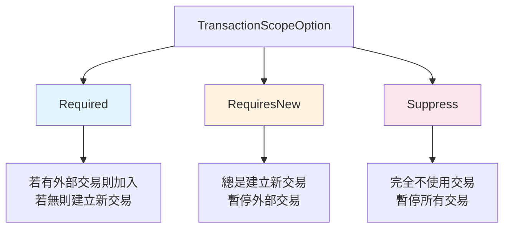
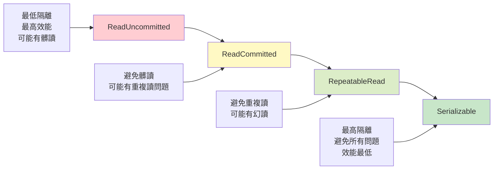
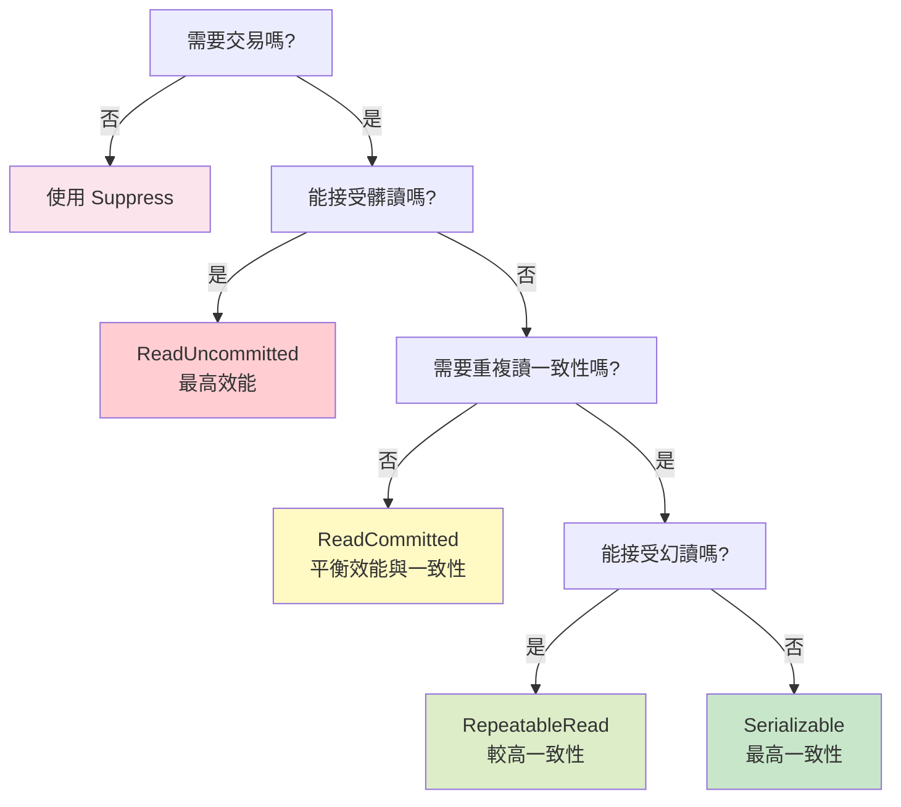

# 07 - 交易範圍與隔離級別

## 📚 交易範圍概念

在 ASP.NET Boilerplate 中，交易範圍 (Transaction Scope) 決定了 UOW 如何處理與現有交易的關係，這對於巢狀呼叫和跨服務交易協調至關重要。

### TransactionScopeOption 選項



## 🔧 交易範圍實作分析

### Required (預設行為)

這是最常用的交易範圍模式，確保操作在交易內執行：

```csharp
// UnitOfWorkManager.cs - Required 範圍處理邏輯
public IUnitOfWorkCompleteHandle Begin(UnitOfWorkOptions options)
{
    options.FillDefaultsForNonProvidedOptions(_defaultOptions);
    var outerUow = _currentUnitOfWorkProvider.Current;

    // 如果要求 Required 且已有外部 UOW
    if (options.Scope == TransactionScopeOption.Required && outerUow != null)
    {
        // 檢查外部 UOW 是否為 Suppress
        return outerUow.Options?.Scope == TransactionScopeOption.Suppress
            ? new InnerSuppressUnitOfWorkCompleteHandle(outerUow)
            : new InnerUnitOfWorkCompleteHandle();
    }

    // 建立新的 UOW
    var uow = _iocResolver.Resolve<IUnitOfWork>();
    // ... 初始化邏輯
}
```

**使用範例：**

```csharp
[UnitOfWork(TransactionScopeOption.Required)]
public async Task CreateUserWithProfileAsync(CreateUserDto input)
{
    // 這個方法會：
    // 1. 如果已在交易中，則加入現有交易
    // 2. 如果沒有交易，則建立新交易
    
    var user = new User(input.Name, input.Email);
    await _userRepository.InsertAsync(user);
    
    // 呼叫其他服務 - 會共享相同交易
    await _profileService.CreateDefaultProfileAsync(user.Id);
}
```

### RequiresNew (獨立交易)

強制建立新交易，即使已有外部交易：

```csharp
[UnitOfWork(TransactionScopeOption.RequiresNew)]
public async Task LogOperationAsync(string operation, string details)
{
    // 這個方法總是在獨立交易中執行
    // 即使外部交易失敗，日誌記錄仍會提交
    
    var log = new OperationLog
    {
        Operation = operation,
        Details = details,
        Timestamp = Clock.Now
    };
    
    await _logRepository.InsertAsync(log);
    // 這裡會自動提交，不受外部交易影響
}
```

### Suppress (非交易模式)

完全禁用交易，通常用於唯讀操作：

```csharp
[UnitOfWork(TransactionScopeOption.Suppress)]
public async Task<List<UserDto>> GetUsersForReportAsync()
{
    // 這個方法在非交易模式下執行
    // 適合長時間執行的唯讀查詢
    
    return await _userRepository
        .GetAll()
        .Include(u => u.Roles)
        .ToListAsync();
}
```

## 📊 隔離級別詳解

隔離級別控制交易間的互相影響程度，在 ASP.NET Boilerplate 中透過 `IsolationLevel` 枚舉設定。

### 隔離級別比較



### 預設隔離級別

```csharp
// UnitOfWorkDefaultOptions.cs
public class UnitOfWorkDefaultOptions : IUnitOfWorkDefaultOptions
{
    public IsolationLevel? IsolationLevel { get; set; }
    
    // 預設值在框架文件中提到是 ReadUncommitted
    // 實際預設值會在 FillDefaultsForNonProvidedOptions 中設定
}
```

### TransactionScope 隔離級別實作

在 Entity Framework 的交易策略中可以看到隔離級別如何應用：

```csharp
// TransactionScopeEfTransactionStrategy.cs
private void StartTransaction()
{
    if (CurrentTransaction != null)
    {
        return;
    }

    var transactionOptions = new TransactionOptions
    {
        // 使用指定的隔離級別，否則使用預設的 ReadUncommitted
        IsolationLevel = Options.IsolationLevel.GetValueOrDefault(IsolationLevel.ReadUncommitted),
    };

    if (Options.Timeout.HasValue)
    {
        transactionOptions.Timeout = Options.Timeout.Value;
    }

    CurrentTransaction = new TransactionScope(
        Options.Scope.GetValueOrDefault(TransactionScopeOption.Required),
        transactionOptions,
        Options.AsyncFlowOption.GetValueOrDefault(TransactionScopeAsyncFlowOption.Enabled)
    );
}
```

### 各隔離級別的使用場景

#### ReadUncommitted
```csharp
[UnitOfWork(IsolationLevel.ReadUncommitted)]
public async Task<DashboardDataDto> GetDashboardDataAsync()
{
    // 適用於統計報表，允許讀取未提交資料
    // 效能最佳，但可能讀到不一致的資料
    
    var stats = new DashboardDataDto
    {
        TotalUsers = await _userRepository.CountAsync(),
        TotalOrders = await _orderRepository.CountAsync(),
        // ... 其他統計資料
    };
    
    return stats;
}
```

#### ReadCommitted
```csharp
[UnitOfWork(IsolationLevel.ReadCommitted)]
public async Task<decimal> CalculateAccountBalanceAsync(int userId)
{
    // 適用於需要準確性但允許重複讀不同結果的場景
    // 避免髒讀，但同一交易中多次讀取可能得到不同結果
    
    var transactions = await _transactionRepository
        .GetAll()
        .Where(t => t.UserId == userId)
        .ToListAsync();
        
    return transactions.Sum(t => t.Amount);
}
```

#### RepeatableRead
```csharp
[UnitOfWork(IsolationLevel.RepeatableRead)]
public async Task ProcessOrderAsync(int orderId)
{
    // 適用於需要在整個交易過程中保持讀取一致性
    // 避免髒讀和不可重複讀
    
    var order = await _orderRepository.GetAsync(orderId);
    
    // 在交易過程中，再次讀取 order 會得到相同結果
    await ProcessPaymentAsync(order);
    await UpdateInventoryAsync(order.Items);
    
    // 重新讀取確認狀態
    var updatedOrder = await _orderRepository.GetAsync(orderId);
    // updatedOrder 會與最初的 order 狀態一致
}
```

#### Serializable
```csharp
[UnitOfWork(IsolationLevel.Serializable)]
public async Task AllocateSequentialNumberAsync()
{
    // 適用於需要最高一致性的場景
    // 避免所有並發問題，但效能最低
    
    var lastNumber = await _sequenceRepository
        .GetAll()
        .OrderByDescending(s => s.Number)
        .Select(s => s.Number)
        .FirstOrDefaultAsync();
        
    var newSequence = new Sequence
    {
        Number = lastNumber + 1,
        CreatedTime = Clock.Now
    };
    
    await _sequenceRepository.InsertAsync(newSequence);
}
```

## 🎯 最佳實務建議

### 1. 選擇適當的交易範圍

```csharp
public class OrderService : ApplicationService
{
    [UnitOfWork(TransactionScopeOption.Required)]
    public async Task CreateOrderAsync(CreateOrderDto input)
    {
        // 主要業務邏輯使用 Required
        var order = await CreateOrderEntityAsync(input);
        
        // 需要獨立提交的操作使用 RequiresNew
        await _notificationService.SendOrderConfirmationAsync(order.Id);
    }
    
    [UnitOfWork(TransactionScopeOption.RequiresNew)]
    public async Task SendOrderConfirmationAsync(int orderId)
    {
        // 通知發送失敗不應影響訂單建立
        var notification = new Notification
        {
            OrderId = orderId,
            Type = NotificationType.OrderConfirmation
        };
        
        await _notificationRepository.InsertAsync(notification);
    }
}
```

### 2. 隔離級別的選擇原則



### 3. 交易超時設定

```csharp
public class ReportService : ApplicationService
{
    [UnitOfWork(
        isolationLevel: IsolationLevel.ReadUncommitted,
        timeout: 300000)] // 5 分鐘超時
    public async Task<byte[]> GenerateLargeReportAsync()
    {
        // 長時間執行的報表生成
        // 使用較低隔離級別提高效能
        // 設定較長超時時間
        
        return await ProcessLargeDataSetAsync();
    }
}
```

## ⚠️ 常見陷阱與注意事項

### 1. 交易範圍的巢狀行為
```csharp
[UnitOfWork(TransactionScopeOption.Required)]
public async Task OuterMethodAsync()
{
    // 這裡建立了交易 A
    
    await InnerMethodAsync(); // 會加入交易 A
    await IndependentMethodAsync(); // 會建立新交易 B
}

[UnitOfWork(TransactionScopeOption.Required)]
public async Task InnerMethodAsync()
{
    // 加入外部交易 A
}

[UnitOfWork(TransactionScopeOption.RequiresNew)]
public async Task IndependentMethodAsync()
{
    // 建立獨立交易 B，暫停交易 A
}
```

### 2. Suppress 模式的限制
```csharp
[UnitOfWork(TransactionScopeOption.Required)]
public async Task TransactionalMethodAsync()
{
    // 在交易中
    
    await NonTransactionalMethodAsync(); // 仍會在交易中執行！
}

[UnitOfWork(TransactionScopeOption.Suppress)]
public async Task NonTransactionalMethodAsync()
{
    // ⚠️ 注意：在巢狀呼叫中，Suppress 可能被忽略
    // 實際是否在交易中取決於實作細節
}
```

### 3. 隔離級別與死鎖
```csharp
// ⚠️ 容易造成死鎖的情況
[UnitOfWork(IsolationLevel.Serializable)]
public async Task MethodA()
{
    var user = await _userRepository.GetAsync(1);
    var order = await _orderRepository.GetAsync(1);
    // 更新操作...
}

[UnitOfWork(IsolationLevel.Serializable)]
public async Task MethodB()
{
    var order = await _orderRepository.GetAsync(1); // 不同順序
    var user = await _userRepository.GetAsync(1);   // 可能死鎖
    // 更新操作...
}
```

## 🔧 進階配置範例

### 動態交易配置
```csharp
public class DynamicTransactionService : ApplicationService
{
    public async Task ProcessDataAsync(bool requiresHighConsistency)
    {
        var options = new UnitOfWorkOptions
        {
            Scope = TransactionScopeOption.Required,
            IsolationLevel = requiresHighConsistency 
                ? IsolationLevel.Serializable 
                : IsolationLevel.ReadCommitted,
            Timeout = TimeSpan.FromMinutes(requiresHighConsistency ? 1 : 5)
        };
        
        using (var uow = UnitOfWorkManager.Begin(options))
        {
            await ProcessDataInternalAsync();
            await uow.CompleteAsync();
        }
    }
}
```

### 多資料庫交易協調
```csharp
[UnitOfWork(TransactionScopeOption.Required)]
public async Task SyncDataBetweenDatabasesAsync()
{
    // TransactionScope 會自動協調多個資料庫的交易
    
    using (var context1 = GetDbContext<MainDbContext>())
    using (var context2 = GetDbContext<LogDbContext>())
    {
        // 兩個資料庫會在同一個分散式交易中
        context1.Users.Add(user);
        context2.Logs.Add(log);
        
        await context1.SaveChangesAsync();
        await context2.SaveChangesAsync();
        
        // 如果任一失敗，兩者都會回滾
    }
}
```

---

*下一章將探討 [08-UOW選項配置](08-UOW選項配置.md) 中的詳細配置選項。*
