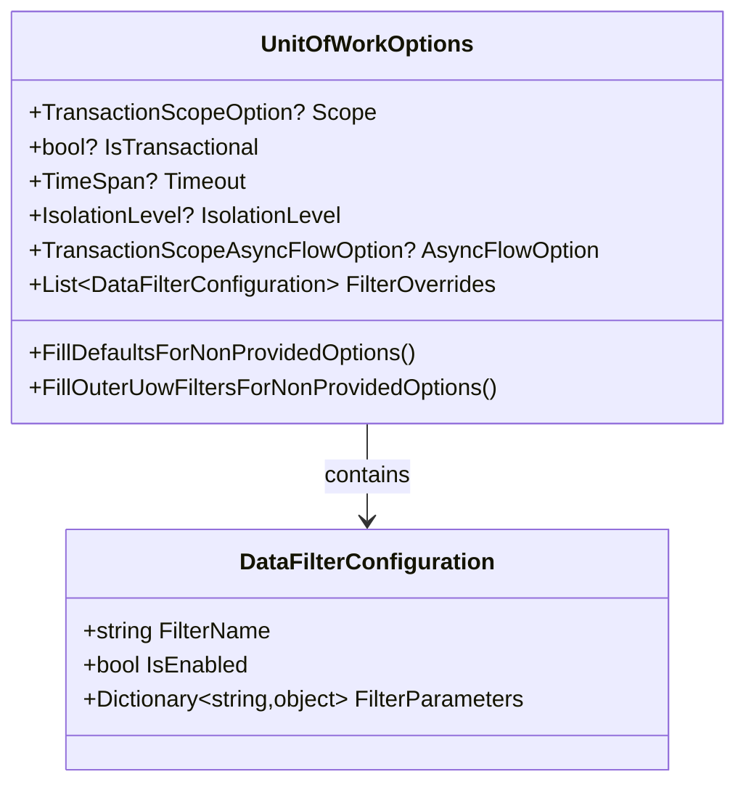
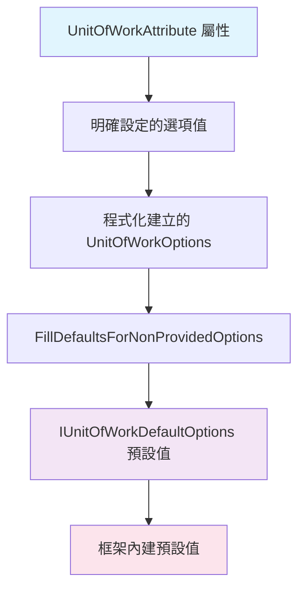

# 08 - UOW選項配置

## 📚 UnitOfWorkOptions 核心結構

`UnitOfWorkOptions` 是 ASP.NET Boilerplate 中控制 UOW 行為的核心配置類別，它定義了交易模式、隔離級別、超時設定、過濾器配置等關鍵參數。

### 完整的選項結構



## 🔧 選項屬性詳解

### 1. 交易相關選項

#### Scope (交易範圍)
```csharp
// UnitOfWorkOptions.cs
public TransactionScopeOption? Scope { get; set; }

// 使用範例
var options = new UnitOfWorkOptions
{
    Scope = TransactionScopeOption.Required  // 預設值
};
```

**可選值與行為：**
- `Required`: 需要交易，如有外部交易則加入，否則建立新交易
- `RequiresNew`: 總是建立新交易，暫停外部交易
- `Suppress`: 禁用交易，暫停所有交易

#### IsTransactional (是否啟用交易)
```csharp
public bool? IsTransactional { get; set; }

// 明確禁用交易
var options = new UnitOfWorkOptions
{
    IsTransactional = false
};
```

⚠️ **重要限制：** 在巢狀 UOW 中，如果外部 UOW 已是交易模式，則內部 UOW 設定 `IsTransactional = false` 會被忽略。

### 2. 隔離級別與超時

#### IsolationLevel (隔離級別)
```csharp
public IsolationLevel? IsolationLevel { get; set; }

// 設定高隔離級別
var options = new UnitOfWorkOptions
{
    IsolationLevel = IsolationLevel.RepeatableRead
};
```

#### Timeout (超時設定)
```csharp
public TimeSpan? Timeout { get; set; }

// 設定 30 秒超時
var options = new UnitOfWorkOptions
{
    Timeout = TimeSpan.FromSeconds(30)
};
```

### 3. 非同步流程控制

#### AsyncFlowOption (非同步流程選項)
```csharp
public TransactionScopeAsyncFlowOption? AsyncFlowOption { get; set; }

// 在 Entity Framework TransactionScope 策略中的應用
CurrentTransaction = new TransactionScope(
    Options.Scope.GetValueOrDefault(TransactionScopeOption.Required),
    transactionOptions,
    Options.AsyncFlowOption.GetValueOrDefault(TransactionScopeAsyncFlowOption.Enabled)
);
```

**可選值：**
- `Enabled`: 允許交易流程在非同步操作間流動（預設）
- `Suppress`: 禁用非同步流程

## 🎯 預設值填充機制

ASP.NET Boilerplate 提供強大的預設值填充機制，確保未明確設定的選項能獲得合理的預設值。

### FillDefaultsForNonProvidedOptions 實作

```csharp
// UnitOfWorkOptions.cs
internal void FillDefaultsForNonProvidedOptions(IUnitOfWorkDefaultOptions defaultOptions)
{
    if (!IsTransactional.HasValue)
    {
        IsTransactional = defaultOptions.IsTransactional;
    }

    if (!Scope.HasValue)
    {
        Scope = defaultOptions.Scope;
    }

    if (!Timeout.HasValue && defaultOptions.Timeout.HasValue)
    {
        Timeout = defaultOptions.Timeout.Value;
    }

    if (!IsolationLevel.HasValue && defaultOptions.IsolationLevel.HasValue)
    {
        IsolationLevel = defaultOptions.IsolationLevel.Value;
    }
}
```

### 預設值配置

```csharp
// UnitOfWorkDefaultOptions.cs
public class UnitOfWorkDefaultOptions : IUnitOfWorkDefaultOptions
{
    public static List<Func<Type, bool>> ConventionalUowSelectorList = new List<Func<Type, bool>>
    {
        type => typeof(IRepository).IsAssignableFrom(type) ||
                typeof(IApplicationService).IsAssignableFrom(type)
    };
    
    public TransactionScopeOption Scope { get; set; }
    public bool IsTransactional { get; set; }
    public TimeSpan? Timeout { get; set; }
    public bool IsTransactionScopeAvailable { get; set; }
    public IsolationLevel? IsolationLevel { get; set; }

    public IReadOnlyList<DataFilterConfiguration> Filters => _filters;
    private readonly List<DataFilterConfiguration> _filters;
    
    public IReadOnlyList<AuditFieldConfiguration> AuditFieldConfiguration => _auditFieldConfiguration;
    private readonly List<AuditFieldConfiguration> _auditFieldConfiguration;

    public List<Func<Type, bool>> ConventionalUowSelectors { get; }

    public UnitOfWorkDefaultOptions()
    {
        _filters = new List<DataFilterConfiguration>();
        _auditFieldConfiguration = new List<AuditFieldConfiguration>();
        IsTransactional = true;
        Scope = TransactionScopeOption.Required;
        IsTransactionScopeAvailable = true;
        ConventionalUowSelectors = ConventionalUowSelectorList.ToList();
    }

    /// <summary>
    /// 註冊資料過濾器
    /// </summary>
    public void RegisterFilter(string filterName, bool isEnabledByDefault)
    {
        if (_filters.Any(f => f.FilterName == filterName))
        {
            throw new AbpException("There is already a filter with name: " + filterName);
        }

        _filters.Add(new DataFilterConfiguration(filterName, isEnabledByDefault));
    }
    
    /// <summary>
    /// 註冊稽核欄位配置
    /// </summary>
    public void RegisterAuditFieldConfiguration(string fieldName, bool isSavingEnabledByDefault)
    {
        if (_auditFieldConfiguration.Any(f => f.FieldName == fieldName))
        {
            throw new AbpException("There is already a audit field configuration with name: " + fieldName);
        }

        _auditFieldConfiguration.Add(new AuditFieldConfiguration(fieldName, isSavingEnabledByDefault));
    }

    /// <summary>
    /// 覆蓋現有過濾器設定
    /// </summary>
    public void OverrideFilter(string filterName, bool isEnabledByDefault)
    {
        _filters.RemoveAll(f => f.FilterName == filterName);
        _filters.Add(new DataFilterConfiguration(filterName, isEnabledByDefault));
    }
}
```

## 📊 過濾器配置系統

UOW 選項中的過濾器系統允許細粒度控制資料過濾行為。

### FilterOverrides 結構

```csharp
public List<DataFilterConfiguration> FilterOverrides { get; }

public class DataFilterConfiguration
{
    public string FilterName { get; set; }
    public bool IsEnabled { get; set; }
    public Dictionary<string, object> FilterParameters { get; set; }
}
```

### 過濾器配置範例

```csharp
var options = new UnitOfWorkOptions();

// 禁用軟刪除過濾器
options.FilterOverrides.Add(new DataFilterConfiguration
{
    FilterName = AbpDataFilters.SoftDelete,
    IsEnabled = false
});

// 設定多租戶過濾器參數
options.FilterOverrides.Add(new DataFilterConfiguration
{
    FilterName = AbpDataFilters.MustHaveTenant,
    IsEnabled = true,
    FilterParameters = new Dictionary<string, object>
    {
        { AbpDataFilters.Parameters.TenantId, 123 }
    }
});
```

### 巢狀UOW的過濾器繼承

```csharp
// UnitOfWorkOptions.cs
internal void FillOuterUowFiltersForNonProvidedOptions(List<DataFilterConfiguration> filterOverrides)
{
    foreach (var filterOverride in filterOverrides)
    {
        // 只添加內部 UOW 未明確設定的過濾器
        if (FilterOverrides.Any(fo => fo.FilterName == filterOverride.FilterName))
        {
            continue;
        }

        FilterOverrides.Add(filterOverride);
    }
}
```

## 🔧 實際配置範例

### 1. 通過 Attribute 配置

```csharp
public class OrderService : ApplicationService
{
    // 基本配置
    [UnitOfWork(isTransactional: true)]
    public async Task CreateOrderAsync(CreateOrderDto input)
    {
        // 使用預設的交易設定
    }

    // 完整配置
    [UnitOfWork(
        scope: TransactionScopeOption.RequiresNew,
        isolationLevel: IsolationLevel.ReadCommitted,
        timeout: 60000)] // 60 秒
    public async Task ProcessPaymentAsync(int orderId)
    {
        // 獨立交易處理付款
    }

    // 禁用交易
    [UnitOfWork(isTransactional: false)]
    public async Task<List<OrderDto>> GetOrdersAsync()
    {
        // 唯讀操作，不需要交易
    }
}
```

### 2. 程式化配置

```csharp
public class AdvancedOrderService : ApplicationService
{
    public async Task ProcessOrderWithCustomSettingsAsync(int orderId, bool isHighPriority)
    {
        var options = new UnitOfWorkOptions
        {
            IsTransactional = true,
            Scope = TransactionScopeOption.Required,
            IsolationLevel = isHighPriority 
                ? IsolationLevel.Serializable 
                : IsolationLevel.ReadCommitted,
            Timeout = TimeSpan.FromMinutes(isHighPriority ? 2 : 10)
        };

        // 高優先級訂單包含已刪除的項目
        if (isHighPriority)
        {
            options.FilterOverrides.Add(new DataFilterConfiguration
            {
                FilterName = AbpDataFilters.SoftDelete,
                IsEnabled = false
            });
        }

        using (var uow = UnitOfWorkManager.Begin(options))
        {
            await ProcessOrderInternalAsync(orderId);
            await uow.CompleteAsync();
        }
    }
}
```

### 3. 條件式配置

```csharp
public class ReportService : ApplicationService
{
    public async Task GenerateReportAsync(ReportType reportType)
    {
        var options = CreateOptionsForReportType(reportType);
        
        using (var uow = UnitOfWorkManager.Begin(options))
        {
            await GenerateReportInternalAsync(reportType);
            await uow.CompleteAsync();
        }
    }

    private UnitOfWorkOptions CreateOptionsForReportType(ReportType reportType)
    {
        var options = new UnitOfWorkOptions
        {
            IsTransactional = false, // 報表生成不需要交易
            Scope = TransactionScopeOption.Suppress
        };

        switch (reportType)
        {
            case ReportType.Financial:
                // 財務報表需要讀取已刪除的資料
                options.FilterOverrides.Add(new DataFilterConfiguration
                {
                    FilterName = AbpDataFilters.SoftDelete,
                    IsEnabled = false
                });
                break;

            case ReportType.MultiTenant:
                // 多租戶報表需要跨租戶資料
                options.FilterOverrides.Add(new DataFilterConfiguration
                {
                    FilterName = AbpDataFilters.MustHaveTenant,
                    IsEnabled = false
                });
                break;

            case ReportType.Standard:
                // 標準報表使用預設過濾器
                break;
        }

        return options;
    }
}
```

## 🎯 進階配置模式

### 1. 配置建構器模式

```csharp
public class UnitOfWorkOptionsBuilder
{
    private UnitOfWorkOptions _options = new UnitOfWorkOptions();

    public static UnitOfWorkOptionsBuilder Create() => new UnitOfWorkOptionsBuilder();

    public UnitOfWorkOptionsBuilder AsTransactional(bool isTransactional = true)
    {
        _options.IsTransactional = isTransactional;
        return this;
    }

    public UnitOfWorkOptionsBuilder WithScope(TransactionScopeOption scope)
    {
        _options.Scope = scope;
        return this;
    }

    public UnitOfWorkOptionsBuilder WithIsolationLevel(IsolationLevel isolationLevel)
    {
        _options.IsolationLevel = isolationLevel;
        return this;
    }

    public UnitOfWorkOptionsBuilder WithTimeout(TimeSpan timeout)
    {
        _options.Timeout = timeout;
        return this;
    }

    public UnitOfWorkOptionsBuilder DisableFilter(string filterName)
    {
        _options.FilterOverrides.Add(new DataFilterConfiguration
        {
            FilterName = filterName,
            IsEnabled = false
        });
        return this;
    }

    public UnitOfWorkOptionsBuilder EnableFilter(string filterName, Dictionary<string, object> parameters = null)
    {
        _options.FilterOverrides.Add(new DataFilterConfiguration
        {
            FilterName = filterName,
            IsEnabled = true,
            FilterParameters = parameters ?? new Dictionary<string, object>()
        });
        return this;
    }

    public UnitOfWorkOptions Build() => _options;
}

// 使用範例
public async Task ProcessDataAsync()
{
    var options = UnitOfWorkOptionsBuilder.Create()
        .AsTransactional()
        .WithScope(TransactionScopeOption.RequiresNew)
        .WithIsolationLevel(IsolationLevel.ReadCommitted)
        .WithTimeout(TimeSpan.FromMinutes(5))
        .DisableFilter(AbpDataFilters.SoftDelete)
        .Build();

    using (var uow = UnitOfWorkManager.Begin(options))
    {
        await ProcessDataInternalAsync();
        await uow.CompleteAsync();
    }
}
```

### 2. 預設配置模板

```csharp
public static class UnitOfWorkOptionsTemplates
{
    public static UnitOfWorkOptions ReadOnly => new UnitOfWorkOptions
    {
        IsTransactional = false,
        Scope = TransactionScopeOption.Suppress
    };

    public static UnitOfWorkOptions LongRunning => new UnitOfWorkOptions
    {
        IsTransactional = true,
        IsolationLevel = IsolationLevel.ReadCommitted,
        Timeout = TimeSpan.FromMinutes(30)
    };

    public static UnitOfWorkOptions HighConsistency => new UnitOfWorkOptions
    {
        IsTransactional = true,
        IsolationLevel = IsolationLevel.Serializable,
        Timeout = TimeSpan.FromMinutes(2)
    };

    public static UnitOfWorkOptions Independent => new UnitOfWorkOptions
    {
        IsTransactional = true,
        Scope = TransactionScopeOption.RequiresNew,
        IsolationLevel = IsolationLevel.ReadCommitted
    };

    public static UnitOfWorkOptions WithoutFilters => new UnitOfWorkOptions
    {
        FilterOverrides = new List<DataFilterConfiguration>
        {
            new DataFilterConfiguration { FilterName = AbpDataFilters.SoftDelete, IsEnabled = false },
            new DataFilterConfiguration { FilterName = AbpDataFilters.MustHaveTenant, IsEnabled = false },
            new DataFilterConfiguration { FilterName = AbpDataFilters.MayHaveTenant, IsEnabled = false }
        }
    };
}

// 使用範例
public async Task GenerateSystemReportAsync()
{
    using (var uow = UnitOfWorkManager.Begin(UnitOfWorkOptionsTemplates.WithoutFilters))
    {
        // 可以存取所有資料，包括已刪除和跨租戶的資料
        await GenerateReportInternalAsync();
        await uow.CompleteAsync();
    }
}
```

### 3. 動態配置工廠

```csharp
public interface IUnitOfWorkOptionsFactory
{
    UnitOfWorkOptions CreateForOperation(OperationType operationType);
    UnitOfWorkOptions CreateForUser(ClaimsPrincipal user);
    UnitOfWorkOptions CreateForTenant(int? tenantId);
}

public class UnitOfWorkOptionsFactory : IUnitOfWorkOptionsFactory, ITransientDependency
{
    private readonly IUnitOfWorkDefaultOptions _defaultOptions;

    public UnitOfWorkOptionsFactory(IUnitOfWorkDefaultOptions defaultOptions)
    {
        _defaultOptions = defaultOptions;
    }

    public UnitOfWorkOptions CreateForOperation(OperationType operationType)
    {
        var options = new UnitOfWorkOptions();

        switch (operationType)
        {
            case OperationType.Query:
                options.IsTransactional = false;
                options.Scope = TransactionScopeOption.Suppress;
                break;

            case OperationType.Command:
                options.IsTransactional = true;
                options.IsolationLevel = IsolationLevel.ReadCommitted;
                break;

            case OperationType.Report:
                options.IsTransactional = false;
                options.FilterOverrides.Add(new DataFilterConfiguration
                {
                    FilterName = AbpDataFilters.SoftDelete,
                    IsEnabled = false
                });
                break;
        }

        options.FillDefaultsForNonProvidedOptions(_defaultOptions);
        return options;
    }

    public UnitOfWorkOptions CreateForUser(ClaimsPrincipal user)
    {
        var options = new UnitOfWorkOptions();
        
        if (user.IsInRole("Admin"))
        {
            // 管理員可以看到所有資料
            options.FilterOverrides.Add(new DataFilterConfiguration
            {
                FilterName = AbpDataFilters.MustHaveTenant,
                IsEnabled = false
            });
        }

        return options;
    }

    public UnitOfWorkOptions CreateForTenant(int? tenantId)
    {
        var options = new UnitOfWorkOptions();

        if (tenantId.HasValue)
        {
            options.FilterOverrides.Add(new DataFilterConfiguration
            {
                FilterName = AbpDataFilters.MustHaveTenant,
                IsEnabled = true,
                FilterParameters = new Dictionary<string, object>
                {
                    { AbpDataFilters.Parameters.TenantId, tenantId.Value }
                }
            });
        }

        return options;
    }
}
```

## ⚠️ 配置注意事項

### 1. 預設值覆蓋順序


### 2. 巢狀 UOW 的配置繼承
```csharp
[UnitOfWork(IsolationLevel.Serializable, timeout: 60000)]
public async Task OuterMethodAsync()
{
    // 外部 UOW：Serializable，60秒超時
    
    await InnerMethodAsync(); // 會繼承外部設定
}

[UnitOfWork(IsolationLevel.ReadCommitted)] // 這個設定會被忽略
public async Task InnerMethodAsync()
{
    // 實際執行時仍使用 Serializable 隔離級別
    // 因為在巢狀 UOW 中
}
```

### 3. 過濾器配置的優先順序
```csharp
public async Task MethodWithFilterConflict()
{
    var options = new UnitOfWorkOptions();
    
    // 外部 UOW 禁用了 SoftDelete 過濾器
    options.FilterOverrides.Add(new DataFilterConfiguration
    {
        FilterName = AbpDataFilters.SoftDelete,
        IsEnabled = false
    });

    using (var outerUow = UnitOfWorkManager.Begin(options))
    {
        // 內部方法嘗試啟用 SoftDelete 過濾器
        await MethodThatEnablesSoftDeleteAsync(); // 設定會被外部覆蓋
        
        await outerUow.CompleteAsync();
    }
}
```

---

*下一章將探討 [09-巢狀UOW與外部UOW](09-巢狀UOW與外部UOW.md) 中的巢狀工作單元管理機制。*
