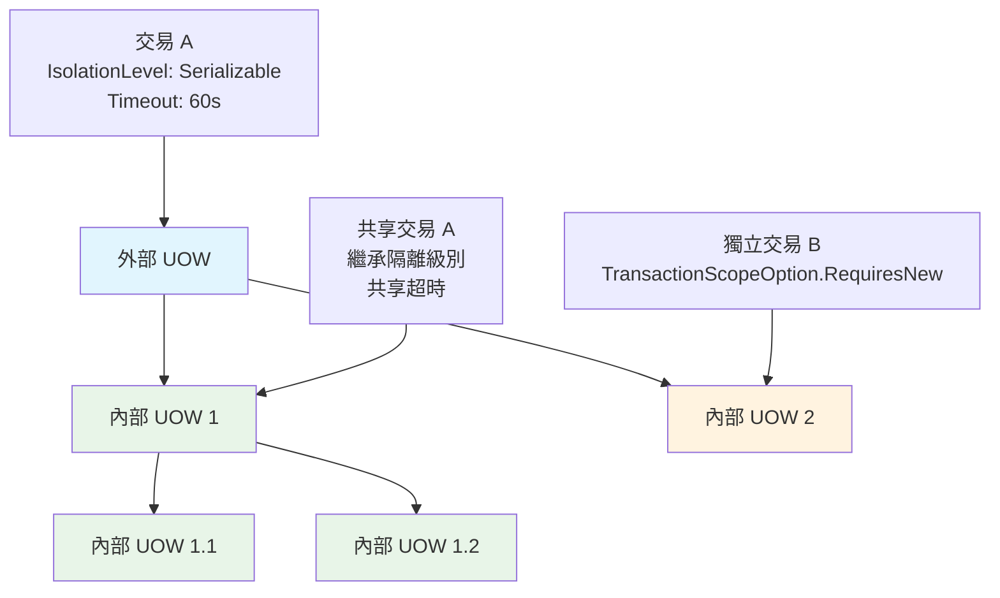

# 09 - 巢狀UOW與外部UOW

## 📚 巢狀UOW架構概念

在 ASP.NET Boilerplate 中，巢狀 Unit of Work (UOW) 是一個重要的設計模式，允許在現有的 UOW 範圍內建立新的 UOW 範圍。這種設計支援複雜的業務場景，如服務間呼叫、遞迴操作等。

### 巢狀UOW的層次結構



## 🔧 核心實作機制

### UnitOfWorkManager 的巢狀處理邏輯

```csharp
// UnitOfWorkManager.cs - 關鍵的巢狀處理邏輯
public IUnitOfWorkCompleteHandle Begin(UnitOfWorkOptions options)
{
    options.FillDefaultsForNonProvidedOptions(_defaultOptions);

    var outerUow = _currentUnitOfWorkProvider.Current;

    // 關鍵決策點：是否建立新的 UOW
    if (options.Scope == TransactionScopeOption.Required && outerUow != null)
    {
        // 檢查外部 UOW 是否為 Suppress 模式
        return outerUow.Options?.Scope == TransactionScopeOption.Suppress
            ? new InnerSuppressUnitOfWorkCompleteHandle(outerUow)
            : new InnerUnitOfWorkCompleteHandle();
    }

    // 建立新的獨立 UOW
    var uow = _iocResolver.Resolve<IUnitOfWork>();
    
    // 設定外部 UOW 參考
    uow.Outer = outerUow;

    // 繼承外部 UOW 的過濾器設定
    if (outerUow != null)
    {
        options.FillOuterUowFiltersForNonProvidedOptions(outerUow.Filters.ToList());
    }

    uow.Begin(options);

    // 繼承外部 UOW 的租戶設定
    if (outerUow != null)
    {
        uow.SetTenantId(outerUow.GetTenantId(), false);
    }

    _currentUnitOfWorkProvider.Current = uow;
    return uow;
}
```

### 內部UOW處理器

#### InnerUnitOfWorkCompleteHandle
```csharp
// InnerUnitOfWorkCompleteHandle.cs
internal class InnerUnitOfWorkCompleteHandle : IUnitOfWorkCompleteHandle
{
    private bool _isCompleteCalled;
    private bool _isDisposed;

    public virtual void Complete()
    {
        _isCompleteCalled = true;
    }

    public virtual Task CompleteAsync()
    {
        _isCompleteCalled = true;
        return Task.FromResult(0);
    }

    public void Dispose()
    {
        if (_isDisposed) return;
        
        _isDisposed = true;

        // 如果沒有呼叫 Complete，則拋出例外
        if (!_isCompleteCalled)
        {
            if (HasException()) return;
            
            throw new AbpException(DidNotCallCompleteMethodExceptionMessage);
        }
    }
}
```

#### InnerSuppressUnitOfWorkCompleteHandle
```csharp
// InnerSuppressUnitOfWorkCompleteHandle.cs
internal class InnerSuppressUnitOfWorkCompleteHandle : InnerUnitOfWorkCompleteHandle
{
    private readonly IUnitOfWork _parentUnitOfWork;

    public InnerSuppressUnitOfWorkCompleteHandle(IUnitOfWork parentUnitOfWork)
    {
        _parentUnitOfWork = parentUnitOfWork;
    }

    public override void Complete()
    {
        // 在 Suppress 模式下，仍需要儲存變更到外部 UOW
        _parentUnitOfWork.SaveChanges();
        base.Complete();
    }

    public override async Task CompleteAsync()
    {
        await _parentUnitOfWork.SaveChangesAsync();
        await base.CompleteAsync();
    }
}
```

## 🎯 巢狀UOW的行為模式

### 1. Required 模式 (預設行為)

在 Required 模式下，內部 UOW 會加入外部 UOW 的交易：

```csharp
[UnitOfWork] // 預設為 Required
public async Task OuterServiceMethodAsync()
{
    // 這裡建立了外部 UOW (交易 A)
    var user = new User("John", "john@email.com");
    await _userRepository.InsertAsync(user);

    // 呼叫內部服務
    await _profileService.CreateProfileAsync(user.Id);
    
    // 如果任何地方發生錯誤，整個交易 A 都會回滾
}

[UnitOfWork] // 也是 Required
public async Task CreateProfileAsync(int userId)
{
    // 這個方法在同一個交易 A 中執行
    // 不會建立新的實際 UOW，而是使用 InnerUnitOfWorkCompleteHandle
    
    var profile = new UserProfile { UserId = userId };
    await _profileRepository.InsertAsync(profile);
    
    // Complete() 呼叫只是標記內部範圍完成，不會提交交易
}
```

### 2. RequiresNew 模式 (獨立交易)

RequiresNew 模式會建立完全獨立的 UOW：

```csharp
[UnitOfWork]
public async Task ProcessOrderWithLoggingAsync(int orderId)
{
    try
    {
        // 外部交易 A - 處理訂單
        var order = await _orderRepository.GetAsync(orderId);
        order.Status = OrderStatus.Processing;
        
        // 記錄操作 - 使用獨立交易
        await _loggingService.LogOrderProcessingAsync(orderId);
        
        // 處理付款
        await _paymentService.ProcessPaymentAsync(order);
        
        order.Status = OrderStatus.Completed;
    }
    catch (Exception ex)
    {
        // 即使訂單處理失敗，日誌記錄仍會被保留
        await _loggingService.LogErrorAsync(orderId, ex.Message);
        throw;
    }
}

[UnitOfWork(TransactionScopeOption.RequiresNew)]
public async Task LogOrderProcessingAsync(int orderId)
{
    // 這個方法在獨立的交易 B 中執行
    // 會建立新的實際 UOW 實例
    
    var log = new OrderLog
    {
        OrderId = orderId,
        Action = "Processing Started",
        Timestamp = Clock.Now
    };
    
    await _logRepository.InsertAsync(log);
    // 這裡的 Complete() 會立即提交交易 B
}
```

### 3. Suppress 模式 (非交易)

Suppress 模式會暫停所有交易：

```csharp
[UnitOfWork]
public async Task ProcessDataWithReportAsync()
{
    // 外部交易 A
    var data = await ProcessBusinessDataAsync();
    
    // 生成報表 - 在非交易模式下執行
    await _reportService.GenerateReportAsync(data);
}

[UnitOfWork(TransactionScopeOption.Suppress)]
public async Task GenerateReportAsync(object data)
{
    // 這個方法在非交易模式下執行
    // 使用 InnerSuppressUnitOfWorkCompleteHandle
    
    // 長時間執行的報表生成不會阻塞外部交易
    await GenerateLargeReportAsync(data);
    
    // Complete() 會呼叫 _parentUnitOfWork.SaveChanges()
    // 但不會影響外部交易的提交時機
}
```

## 📊 資料繼承與隔離

### 過濾器繼承機制

```csharp
// UnitOfWorkOptions.cs
internal void FillOuterUowFiltersForNonProvidedOptions(List<DataFilterConfiguration> filterOverrides)
{
    foreach (var filterOverride in filterOverrides)
    {
        // 只有內部 UOW 未明確設定的過濾器才會被繼承
        if (FilterOverrides.Any(fo => fo.FilterName == filterOverride.FilterName))
        {
            continue;
        }

        FilterOverrides.Add(filterOverride);
    }
}
```

**實際應用範例：**

```csharp
public class TenantService : ApplicationService
{
    [UnitOfWork]
    public async Task ProcessTenantDataAsync()
    {
        // 外部 UOW 設定租戶過濾器
        using (CurrentUnitOfWork.DisableFilter(AbpDataFilters.MustHaveTenant))
        {
            // 可以存取所有租戶的資料
            var allTenants = await _tenantRepository.GetAllListAsync();
            
            foreach (var tenant in allTenants)
            {
                // 處理每個租戶的資料
                await ProcessSingleTenantDataAsync(tenant.Id);
            }
        }
    }

    [UnitOfWork]
    public async Task ProcessSingleTenantDataAsync(int tenantId)
    {
        // 內部 UOW 會繼承外部的過濾器設定
        // 但可以覆蓋特定過濾器
        
        using (CurrentUnitOfWork.SetTenantId(tenantId))
        {
            // 這裡只會處理指定租戶的資料
            var tenantUsers = await _userRepository.GetAllListAsync();
            await ProcessUsersAsync(tenantUsers);
        }
    }
}
```

### 租戶ID繼承

```csharp
// UnitOfWorkManager.cs 中的租戶繼承邏輯
uow.Begin(options);

// 繼承外部 UOW 的租戶設定
if (outerUow != null)
{
    uow.SetTenantId(outerUow.GetTenantId(), false);
}
```

## 🔧 實際應用場景

### 1. 服務間呼叫

```csharp
public class OrderProcessingService : ApplicationService
{
    [UnitOfWork]
    public async Task ProcessCompleteOrderAsync(int orderId)
    {
        // 主要訂單處理流程
        var order = await _orderRepository.GetAsync(orderId);
        
        // 各個服務都有自己的 UOW 註解，但會共享外部交易
        await _inventoryService.ReserveItemsAsync(order.Items);
        await _paymentService.ProcessPaymentAsync(order);
        await _shippingService.CreateShipmentAsync(order);
        
        order.Status = OrderStatus.Completed;
        
        // 發送通知 - 使用獨立交易
        await _notificationService.SendOrderCompletedNotificationAsync(orderId);
    }
}

public class NotificationService : ApplicationService
{
    [UnitOfWork(TransactionScopeOption.RequiresNew)]
    public async Task SendOrderCompletedNotificationAsync(int orderId)
    {
        // 即使主要訂單處理失敗，通知記錄仍會保存
        var notification = new Notification
        {
            OrderId = orderId,
            Type = NotificationType.OrderCompleted,
            CreatedTime = Clock.Now
        };
        
        await _notificationRepository.InsertAsync(notification);
        
        // 實際發送通知的邏輯...
        await SendEmailNotificationAsync(orderId);
    }
}
```

### 2. 遞迴操作

```csharp
public class OrganizationService : ApplicationService
{
    [UnitOfWork]
    public async Task UpdateOrganizationHierarchyAsync(int orgId, string newName)
    {
        // 更新組織及其所有子組織
        await UpdateOrganizationRecursiveAsync(orgId, newName);
    }

    [UnitOfWork] // 每次遞迴呼叫都會建立內部 UOW
    private async Task UpdateOrganizationRecursiveAsync(int orgId, string namePrefix)
    {
        var org = await _organizationRepository.GetAsync(orgId);
        org.Name = $"{namePrefix}-{org.OriginalName}";
        
        // 獲取所有子組織
        var childOrgs = await _organizationRepository
            .GetAll()
            .Where(o => o.ParentId == orgId)
            .ToListAsync();
        
        // 遞迴更新子組織
        foreach (var child in childOrgs)
        {
            await UpdateOrganizationRecursiveAsync(child.Id, org.Name);
        }
    }
}
```

### 3. 批次處理與錯誤隔離

```csharp
public class DataMigrationService : ApplicationService
{
    [UnitOfWork]
    public async Task MigrateBatchDataAsync(List<LegacyData> dataList)
    {
        var successCount = 0;
        var errorCount = 0;
        
        foreach (var data in dataList)
        {
            try
            {
                // 每筆資料使用獨立交易處理
                await MigrateSingleDataAsync(data);
                successCount++;
            }
            catch (Exception ex)
            {
                errorCount++;
                // 記錄錯誤但不影響其他資料處理
                await _logService.LogMigrationErrorAsync(data.Id, ex.Message);
            }
        }
        
        // 記錄批次處理結果
        await _reportRepository.InsertAsync(new MigrationReport
        {
            TotalRecords = dataList.Count,
            SuccessCount = successCount,
            ErrorCount = errorCount,
            ProcessedAt = Clock.Now
        });
    }

    [UnitOfWork(TransactionScopeOption.RequiresNew)]
    private async Task MigrateSingleDataAsync(LegacyData data)
    {
        // 每筆資料的遷移在獨立交易中進行
        // 失敗不會影響其他資料或主要報表記錄
        
        var newEntity = new ModernEntity
        {
            Name = data.Name,
            Value = ConvertValue(data.LegacyValue),
            MigratedAt = Clock.Now
        };
        
        await _modernRepository.InsertAsync(newEntity);
    }
}
```

## ⚠️ 巢狀UOW的陷阱與注意事項

### 1. 內部UOW的Complete()責任

```csharp
[UnitOfWork]
public async Task RiskyMethodAsync()
{
    // 外部 UOW
    
    await InnerMethodAsync(); // 如果忘記呼叫 Complete()，會拋出例外
}

[UnitOfWork]
public async Task InnerMethodAsync()
{
    // 執行一些操作...
    
    // ❌ 忘記呼叫 Complete() - 會在 Dispose 時拋出 AbpException
    // ✅ 必須呼叫 Complete()
}
```

### 2. 交易範圍的限制

```csharp
[UnitOfWork(TransactionScopeOption.Required)]
public async Task OuterTransactionalMethodAsync()
{
    // 外部方法啟用交易
    
    await InnerNonTransactionalMethodAsync(); // 設定會被忽略
}

[UnitOfWork(isTransactional: false)] // ❌ 在巢狀情況下會被忽略
public async Task InnerNonTransactionalMethodAsync()
{
    // 實際上仍會在交易中執行
    // 因為外部 UOW 已經啟用交易
}
```

### 3. 隔離級別的限制

```csharp
[UnitOfWork(IsolationLevel.Serializable)]
public async Task OuterMethodAsync()
{
    // 外部 UOW 設定 Serializable 隔離級別
    
    await InnerMethodAsync(); // 隔離級別設定會被忽略
}

[UnitOfWork(IsolationLevel.ReadCommitted)] // ❌ 會被忽略
public async Task InnerMethodAsync()
{
    // 實際執行時仍使用 Serializable 隔離級別
}
```

### 4. 過濾器設定的優先順序

```csharp
[UnitOfWork]
public async Task OuterMethodWithFilterAsync()
{
    using (CurrentUnitOfWork.DisableFilter(AbpDataFilters.SoftDelete))
    {
        // 外部 UOW 禁用軟刪除過濾器
        
        await InnerMethodAsync();
    }
}

[UnitOfWork]
public async Task InnerMethodAsync()
{
    // 嘗試啟用軟刪除過濾器
    using (CurrentUnitOfWork.EnableFilter(AbpDataFilters.SoftDelete))
    {
        // ❌ 這個設定可能不會生效
        // 因為外部已經禁用了過濾器
        
        var data = await _repository.GetAllListAsync(); // 仍可能包含已刪除的資料
    }
}
```

## 🎯 最佳實務建議

### 1. 明確的 Complete() 呼叫

```csharp
[UnitOfWork]
public async Task WellStructuredMethodAsync()
{
    try
    {
        await ProcessDataAsync();
        
        // 明確呼叫子方法並確保 Complete
        using (var uow = UnitOfWorkManager.Begin())
        {
            await SubProcessAsync();
            await uow.CompleteAsync(); // 明確完成
        }
    }
    catch (Exception)
    {
        // 錯誤處理邏輯
        throw;
    }
}
```

### 2. 合理的交易邊界設計

```csharp
public class OrderService : ApplicationService
{
    [UnitOfWork] // 主要業務邏輯的交易邊界
    public async Task ProcessOrderAsync(int orderId)
    {
        // 核心訂單處理
        await ProcessOrderCoreAsync(orderId);
        
        // 非關鍵的後續處理使用獨立交易
        await ProcessOrderPostActionsAsync(orderId);
    }

    private async Task ProcessOrderCoreAsync(int orderId)
    {
        // 關鍵業務邏輯，共享主交易
        var order = await _orderRepository.GetAsync(orderId);
        await _paymentService.ProcessPaymentAsync(order);
        await _inventoryService.UpdateStockAsync(order.Items);
    }

    [UnitOfWork(TransactionScopeOption.RequiresNew)]
    private async Task ProcessOrderPostActionsAsync(int orderId)
    {
        // 非關鍵操作，獨立交易
        await _emailService.SendConfirmationAsync(orderId);
        await _analyticsService.RecordOrderEventAsync(orderId);
    }
}
```

### 3. 過濾器狀態的明確管理

```csharp
[UnitOfWork]
public async Task ManageFiltersExplicitlyAsync()
{
    // 記錄當前過濾器狀態
    var originalSoftDeleteState = CurrentUnitOfWork.IsFilterEnabled(AbpDataFilters.SoftDelete);
    
    try
    {
        using (CurrentUnitOfWork.DisableFilter(AbpDataFilters.SoftDelete))
        {
            await ProcessWithDeletedDataAsync();
        }
        
        // 確保過濾器狀態恢復
        if (originalSoftDeleteState)
        {
            CurrentUnitOfWork.EnableFilter(AbpDataFilters.SoftDelete);
        }
    }
    finally
    {
        // 清理邏輯
    }
}
```

---

*第三部分完成。下一章將開始第四部分：[10-資料過濾器系統](10-資料過濾器系統.md)。*
