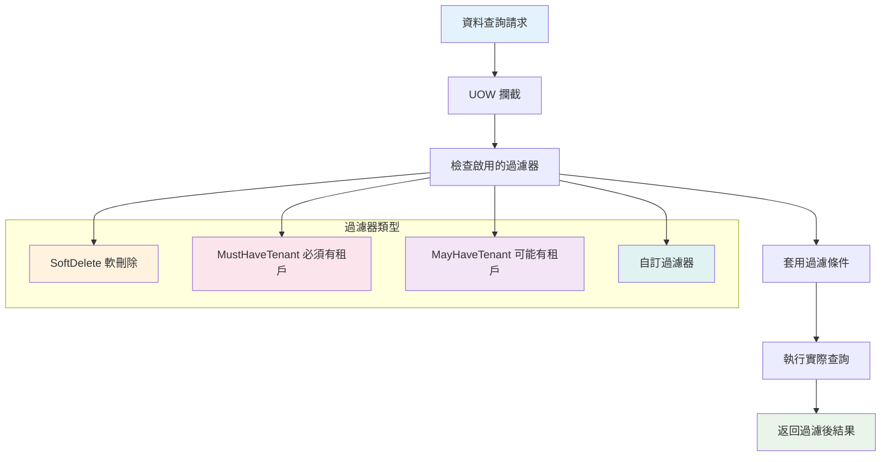
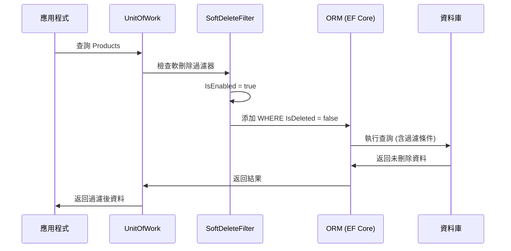
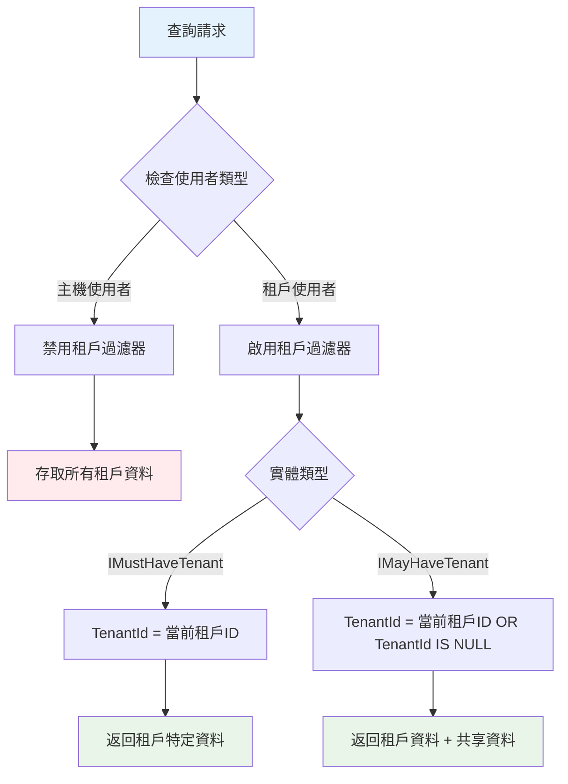
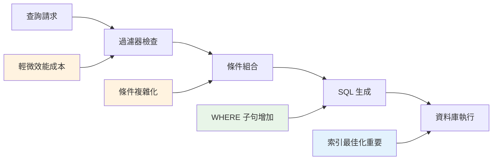

# 10 - 資料過濾器系統

## 📚 資料過濾器概述

ASP.NET Boilerplate 的資料過濾器系統是 UOW 中一個強大的功能，提供了透明且自動的資料過濾機制。它能在查詢資料時自動套用預定義的過濾條件，無需開發者在每個查詢中手動添加過濾邏輯。

### 核心設計理念



## 🔧 核心過濾器架構

### 1. IDataFilter 介面架構

```csharp
// 過濾器的核心介面
public interface IDataFilter
{
    IDisposable Enable<TFilter>();
    IDisposable Disable<TFilter>();
    bool IsEnabled<TFilter>();
}

// 過濾器配置
public class DataFilterConfiguration
{
    public string FilterName { get; }
    public bool IsEnabled { get; }
    public IDictionary<string, object> FilterParameters { get; }
}
```

### 2. 標準過濾器定義

```csharp
// AbpDataFilters.cs - 框架預定義的過濾器
public static class AbpDataFilters
{
    /// <summary>
    /// 軟刪除過濾器 - 隱藏已刪除的資料
    /// </summary>
    public const string SoftDelete = "SoftDelete";

    /// <summary>
    /// 必須有租戶過濾器 - 限制只能存取當前租戶的資料
    /// </summary>
    public const string MustHaveTenant = "MustHaveTenant";

    /// <summary>
    /// 可能有租戶過濾器 - 限制存取權限包含當前租戶與主機資料
    /// </summary>
    public const string MayHaveTenant = "MayHaveTenant";

    public static class Parameters
    {
        public const string TenantId = "tenantId";
        public const string IsDeleted = "isDeleted";
    }
}
```

## 🛡️ 軟刪除過濾器 (SoftDelete)

### 實體介面實作

```csharp
// 軟刪除介面
public interface ISoftDelete
{
    bool IsDeleted { get; set; }
}

// 實體範例
public class Product : Entity, ISoftDelete
{
    public string Name { get; set; }
    public decimal Price { get; set; }
    
    // 軟刪除標記
    public bool IsDeleted { get; set; }
}
```

### 軟刪除過濾器實作機制



### 軟刪除過濾器配置

```csharp
public class MyModule : AbpModule
{
    public override void PreInitialize()
    {
        // 軟刪除過濾器預設為啟用
        // 可以全域禁用
        Configuration.UnitOfWork.OverrideFilter(
            AbpDataFilters.SoftDelete, 
            false
        );
    }
}
```

### 軟刪除過濾器的動態控制

```csharp
public class ProductService : ApplicationService
{
    private readonly IRepository<Product> _productRepository;

    public async Task<List<ProductDto>> GetAllProductsAsync()
    {
        // 預設只返回未刪除的產品
        return await _productRepository.GetAllListAsync();
    }

    public async Task<List<ProductDto>> GetAllProductsIncludingDeletedAsync()
    {
        // 暫時禁用軟刪除過濾器，包含已刪除的產品
        using (CurrentUnitOfWork.DisableFilter(AbpDataFilters.SoftDelete))
        {
            return await _productRepository.GetAllListAsync();
        }
        // 自動重新啟用過濾器
    }

    public async Task<List<ProductDto>> GetOnlyDeletedProductsAsync()
    {
        using (CurrentUnitOfWork.DisableFilter(AbpDataFilters.SoftDelete))
        {
            // 手動過濾只取得已刪除的產品
            return await _productRepository
                .GetAllListAsync(p => p.IsDeleted == true);
        }
    }
}
```

## 🏢 多租戶過濾器系統

### MustHaveTenant 過濾器

```csharp
// 必須有租戶介面
public interface IMustHaveTenant
{
    int TenantId { get; set; }
}

// 租戶特定實體範例
public class Order : Entity, IMustHaveTenant
{
    public int TenantId { get; set; }
    public string OrderNumber { get; set; }
    public decimal Amount { get; set; }
    public DateTime OrderDate { get; set; }
}
```

### MayHaveTenant 過濾器

```csharp
// 可能有租戶介面
public interface IMayHaveTenant
{
    int? TenantId { get; set; }
}

// 共享或租戶特定實體範例
public class Setting : Entity, IMayHaveTenant
{
    public int? TenantId { get; set; }  // null = 主機設定
    public string Key { get; set; }
    public string Value { get; set; }
}
```

### 多租戶過濾器工作流程



### 租戶過濾器實作範例

```csharp
public class OrderService : ApplicationService
{
    private readonly IRepository<Order> _orderRepository;

    // 自動過濾，只取得當前租戶的訂單
    public async Task<List<OrderDto>> GetMyOrdersAsync()
    {
        // MustHaveTenant 過濾器自動生效
        // WHERE TenantId = @currentTenantId
        return await _orderRepository.GetAllListAsync();
    }

    // 主機管理員檢視所有租戶的訂單
    [AbpAuthorize("HostAdmin")]
    public async Task<List<OrderDto>> GetAllTenantsOrdersAsync()
    {
        using (CurrentUnitOfWork.DisableFilter(AbpDataFilters.MustHaveTenant))
        {
            return await _orderRepository.GetAllListAsync();
        }
    }

    // 指定租戶的訂單 (主機管理功能)
    [AbpAuthorize("HostAdmin")]
    public async Task<List<OrderDto>> GetOrdersByTenantAsync(int tenantId)
    {
        using (CurrentUnitOfWork.DisableFilter(AbpDataFilters.MustHaveTenant))
        using (CurrentUnitOfWork.SetFilterParameter(
            AbpDataFilters.MustHaveTenant, 
            AbpDataFilters.Parameters.TenantId, 
            tenantId))
        {
            return await _orderRepository.GetAllListAsync();
        }
    }
}
```

## ⚙️ 自訂資料過濾器

### 建立自訂過濾器

```csharp
// 1. 定義過濾器介面
public interface IActiveFilter
{
    bool IsActive { get; set; }
}

// 2. 實體實作
public class Product : Entity, IActiveFilter
{
    public string Name { get; set; }
    public bool IsActive { get; set; } = true;
}

// 3. 註冊過濾器
public class MyModule : AbpModule
{
    public override void PreInitialize()
    {
        Configuration.UnitOfWork.RegisterFilter("ActiveFilter", true);
    }
}
```

### 自訂過濾器實作

```csharp
// Entity Framework Core 實作
public class MyDbContext : AbpDbContext<MyDbContext>
{
    protected override bool ShouldFilterEntity<TEntity>(ModelBuilder modelBuilder)
    {
        if (typeof(IActiveFilter).IsAssignableFrom(typeof(TEntity)))
        {
            return true;
        }
        return base.ShouldFilterEntity<TEntity>(modelBuilder);
    }

    protected override Expression<Func<TEntity, bool>> CreateFilterExpression<TEntity>(
        ModelBuilder modelBuilder)
    {
        var expression = base.CreateFilterExpression<TEntity>(modelBuilder);

        if (typeof(IActiveFilter).IsAssignableFrom(typeof(TEntity)))
        {
            Expression<Func<TEntity, bool>> activeFilter = 
                e => !CurrentUnitOfWorkProvider.Current.IsFilterEnabled("ActiveFilter") ||
                     ((IActiveFilter)e).IsActive;

            expression = expression == null 
                ? activeFilter 
                : CombineExpressions(expression, activeFilter);
        }

        return expression;
    }
}
```

### 自訂過濾器使用

```csharp
public class ProductService : ApplicationService
{
    private readonly IRepository<Product> _productRepository;

    public async Task<List<ProductDto>> GetActiveProductsAsync()
    {
        // 自動過濾，只取得啟用的產品
        return await _productRepository.GetAllListAsync();
    }

    public async Task<List<ProductDto>> GetAllProductsAsync()
    {
        // 包含非啟用的產品
        using (CurrentUnitOfWork.DisableFilter("ActiveFilter"))
        {
            return await _productRepository.GetAllListAsync();
        }
    }

    public async Task<List<ProductDto>> GetInactiveProductsAsync()
    {
        using (CurrentUnitOfWork.DisableFilter("ActiveFilter"))
        {
            return await _productRepository
                .GetAllListAsync(p => !p.IsActive);
        }
    }
}
```

## 🔧 過濾器參數管理

### 動態過濾器參數

```csharp
public class ReportService : ApplicationService
{
    public async Task<List<OrderDto>> GetOrdersByDateRangeAsync(
        DateTime startDate, DateTime endDate)
    {
        // 設定日期範圍過濾器參數
        using (CurrentUnitOfWork.SetFilterParameter(
            "DateRangeFilter", 
            "StartDate", 
            startDate))
        using (CurrentUnitOfWork.SetFilterParameter(
            "DateRangeFilter", 
            "EndDate", 
            endDate))
        {
            return await _orderRepository.GetAllListAsync();
        }
    }
}
```

### 過濾器狀態檢查

```csharp
public class DiagnosticService : ApplicationService
{
    public FilterStatusDto GetCurrentFilterStatus()
    {
        return new FilterStatusDto
        {
            SoftDeleteEnabled = CurrentUnitOfWork.IsFilterEnabled(AbpDataFilters.SoftDelete),
            MustHaveTenantEnabled = CurrentUnitOfWork.IsFilterEnabled(AbpDataFilters.MustHaveTenant),
            MayHaveTenantEnabled = CurrentUnitOfWork.IsFilterEnabled(AbpDataFilters.MayHaveTenant),
            CurrentTenantId = AbpSession.TenantId,
            CurrentUserId = AbpSession.UserId
        };
    }
}
```

## 📊 效能最佳化與注意事項

### 1. 過濾器效能影響



### 2. 索引策略建議

```sql
-- 軟刪除過濾器索引
CREATE INDEX IX_Product_IsDeleted_Name 
ON Products (IsDeleted, Name)
WHERE IsDeleted = 0;

-- 多租戶過濾器索引
CREATE INDEX IX_Order_TenantId_OrderDate 
ON Orders (TenantId, OrderDate)
WHERE TenantId IS NOT NULL;

-- 複合過濾器索引
CREATE INDEX IX_Product_Active_Tenant_Category 
ON Products (IsActive, TenantId, CategoryId)
WHERE IsActive = 1 AND IsDeleted = 0;
```

### 3. 過濾器最佳實務

```csharp
public class OptimizedService : ApplicationService
{
    // ✅ 良好實務：明確的過濾器控制
    public async Task<List<ProductDto>> GetProductsWithExplicitFilteringAsync()
    {
        using (CurrentUnitOfWork.DisableFilter(AbpDataFilters.SoftDelete))
        {
            var products = await _productRepository
                .GetAllListAsync(p => !p.IsDeleted && p.IsActive);
            
            return ObjectMapper.Map<List<ProductDto>>(products);
        }
    }

    // ❌ 避免：過度的巢狀過濾器操作
    public async Task<List<ProductDto>> AvoidNestedFilterOperationsAsync()
    {
        using (CurrentUnitOfWork.DisableFilter(AbpDataFilters.SoftDelete))
        using (CurrentUnitOfWork.DisableFilter(AbpDataFilters.MustHaveTenant))
        using (CurrentUnitOfWork.EnableFilter("CustomFilter"))
        {
            // 過度複雜的過濾器操作
            return await GetComplexFilteredDataAsync();
        }
    }

    // ✅ 良好實務：批次過濾器設定
    public async Task<List<ProductDto>> GetBatchFilteredDataAsync()
    {
        var filterDisposables = new List<IDisposable>
        {
            CurrentUnitOfWork.DisableFilter(AbpDataFilters.SoftDelete),
            CurrentUnitOfWork.DisableFilter(AbpDataFilters.MustHaveTenant)
        };

        try
        {
            return await _productRepository.GetAllListAsync();
        }
        finally
        {
            filterDisposables.ForEach(d => d.Dispose());
        }
    }
}
```

## 🧪 測試資料過濾器

### 單元測試過濾器行為

```csharp
public class DataFilterTests : AppTestBase
{
    private readonly IRepository<Product> _productRepository;

    [Fact]
    public async Task SoftDelete_Filter_Should_Hide_Deleted_Entities()
    {
        // Arrange
        var activeProduct = new Product { Name = "Active", IsDeleted = false };
        var deletedProduct = new Product { Name = "Deleted", IsDeleted = true };
        
        await _productRepository.InsertAsync(activeProduct);
        await _productRepository.InsertAsync(deletedProduct);
        await CurrentUnitOfWork.SaveChangesAsync();

        // Act
        var products = await _productRepository.GetAllListAsync();

        // Assert
        products.Count.ShouldBe(1);
        products.First().Name.ShouldBe("Active");
    }

    [Fact]
    public async Task Should_Get_Deleted_Entities_When_Filter_Disabled()
    {
        // Arrange & Act
        using (CurrentUnitOfWork.DisableFilter(AbpDataFilters.SoftDelete))
        {
            var allProducts = await _productRepository.GetAllListAsync();
            allProducts.Count.ShouldBe(2);
        }
    }
}
```

## 📈 監控與除錯

### 過濾器診斷工具

```csharp
public class FilterDiagnosticService : ApplicationService
{
    public FilterDiagnosticDto GetFilterDiagnostics()
    {
        var currentUow = CurrentUnitOfWork;
        
        return new FilterDiagnosticDto
        {
            ActiveFilters = currentUow.Filters
                .Where(f => f.IsEnabled)
                .Select(f => new FilterInfoDto
                {
                    Name = f.FilterName,
                    Parameters = f.FilterParameters.ToDictionary(p => p.Key, p => p.Value?.ToString())
                }).ToList(),
                
            DisabledFilters = currentUow.Filters
                .Where(f => !f.IsEnabled)
                .Select(f => f.FilterName)
                .ToList(),
                
            CurrentSession = new SessionInfoDto
            {
                TenantId = AbpSession.TenantId,
                UserId = AbpSession.UserId,
                ImpersonatorTenantId = AbpSession.ImpersonatorTenantId,
                ImpersonatorUserId = AbpSession.ImpersonatorUserId
            }
        };
    }
}
```

資料過濾器系統是 ASP.NET Boilerplate UOW 架構中的核心功能，提供了透明、高效且可擴展的資料存取控制機制。正確理解和運用過濾器系統，能大幅提升應用程式的安全性、資料完整性和開發效率。
