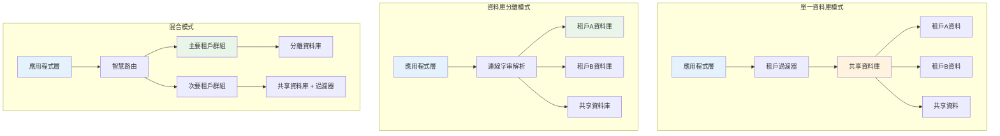
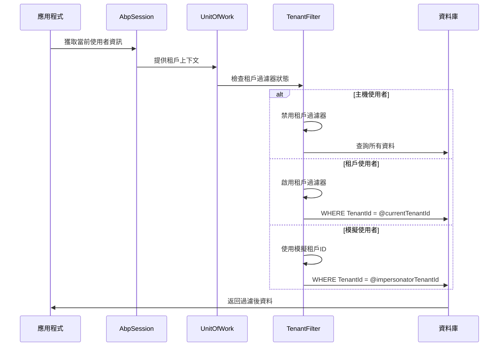

# 11 - 多租戶支援

## 🏢 多租戶架構概述

ASP.NET Boilerplate 的多租戶支援是建立在 UOW 基礎之上的企業級功能，提供了完整的資料隔離、使用者隔離和功能隔離機制。框架支援多種多租戶部署模式，並透過資料過濾器確保租戶間的資料安全。

### 多租戶部署架構



## 🔧 租戶實體介面架構

### 1. IMustHaveTenant 介面

```csharp
/// <summary>
/// 標記實體必須屬於特定租戶
/// </summary>
public interface IMustHaveTenant
{
    /// <summary>
    /// 租戶識別碼，不能為 null
    /// </summary>
    int TenantId { get; set; }
}
```

### 2. IMayHaveTenant 介面

```csharp
/// <summary>
/// 標記實體可能屬於租戶或主機
/// </summary>
public interface IMayHaveTenant
{
    /// <summary>
    /// 租戶識別碼，null 表示屬於主機
    /// </summary>
    int? TenantId { get; set; }
}
```

### 3. 實體實作範例

```csharp
// 必須有租戶的實體 - 訂單
[Table("AppOrders")]
public class Order : FullAuditedEntity<long>, IMustHaveTenant
{
    public int TenantId { get; set; }
    public string OrderNumber { get; set; }
    public decimal Amount { get; set; }
    public DateTime OrderDate { get; set; }
    
    public virtual ICollection<OrderItem> Items { get; set; }
}

// 可能有租戶的實體 - 系統設定
[Table("AppSettings")]
public class Setting : Entity, IMayHaveTenant
{
    public int? TenantId { get; set; }  // null = 全域設定
    public string Name { get; set; }
    public string Value { get; set; }
    public bool IsSecure { get; set; }
}

// 主機專屬實體 - 租戶管理
[Table("AbpTenants")]
public class Tenant : FullAuditedEntity, IMayHaveTenant
{
    public int? TenantId { get; set; } = null;  // 總是 null
    public string TenancyName { get; set; }
    public string Name { get; set; }
    public string ConnectionString { get; set; }
    public bool IsActive { get; set; }
}
```

## 🛡️ 租戶過濾器機制

### 過濾器啟用邏輯



### 租戶過濾器實作詳解

#### NHibernate UOW 中的租戶過濾器實作

```csharp
// NhUnitOfWork.cs 中的實際實作
protected virtual void CheckAndSetMustHaveTenant()
{
    if (AbpSession.TenantId != null && IsFilterEnabled(AbpDataFilters.MustHaveTenant))
    {
        ApplyEnableFilter(AbpDataFilters.MustHaveTenant);
        ApplyFilterParameterValue(AbpDataFilters.MustHaveTenant, 
            AbpDataFilters.Parameters.TenantId, AbpSession.GetTenantId());
    }
    else
    {
        ApplyDisableFilter(AbpDataFilters.MustHaveTenant);
    }
}

protected virtual void CheckAndSetMayHaveTenant()
{
    if (AbpSession.TenantId != null && IsFilterEnabled(AbpDataFilters.MayHaveTenant))
    {
        ApplyEnableFilter(AbpDataFilters.MayHaveTenant);
        ApplyFilterParameterValue(AbpDataFilters.MayHaveTenant, 
            AbpDataFilters.Parameters.TenantId, AbpSession.TenantId);
    }
    else
    {
        ApplyDisableFilter(AbpDataFilters.MayHaveTenant);
    }
}
```

#### Entity Framework 中的租戶檢查實作

```csharp
// AbpDbContext.cs 中的實際實作
protected virtual void CheckAndSetMustHaveTenantIdProperty(object entityAsObj)
{
    if (!(entityAsObj is IMustHaveTenant entity))
    {
        return;
    }

    if (entity.TenantId != 0)
    {
        return;
    }

    var currentTenantId = GetCurrentTenantIdOrNull();

    if (currentTenantId != null)
    {
        entity.TenantId = currentTenantId.Value;
    }
    else
    {
        throw new AbpException(
            $"Entity {entity.GetType().Name} must have TenantId property set!");
    }
}
```

#### 抽象過濾器介面設計

```csharp
// MustHaveTenant 過濾器實作
public class MustHaveTenantFilter : IDataFilter
{
    private readonly IAbpSession _abpSession;
    private readonly ICurrentUnitOfWorkProvider _currentUnitOfWorkProvider;

    public string FilterName => AbpDataFilters.MustHaveTenant;

    public bool IsEnabled => _currentUnitOfWorkProvider.Current?.IsFilterEnabled(FilterName) == true;

    protected virtual int GetCurrentTenantId()
    {
        var tenantId = _abpSession.TenantId;
        if (tenantId == null)
        {
            throw new AbpException("TenantId is null for MustHaveTenant filter!");
        }
        return tenantId.Value;
    }

    public Expression<Func<TEntity, bool>> CreateExpression<TEntity>()
        where TEntity : class, IMustHaveTenant
    {
        return entity => entity.TenantId == GetCurrentTenantId();
    }
}

// MayHaveTenant 過濾器實作
public class MayHaveTenantFilter : IDataFilter
{
    private readonly IAbpSession _abpSession;
    private readonly ICurrentUnitOfWorkProvider _currentUnitOfWorkProvider;

    public string FilterName => AbpDataFilters.MayHaveTenant;

    public bool IsEnabled => _currentUnitOfWorkProvider.Current?.IsFilterEnabled(FilterName) == true;

    protected virtual int? GetCurrentTenantId()
    {
        return _abpSession.TenantId;
    }

    public Expression<Func<TEntity, bool>> CreateExpression<TEntity>()
        where TEntity : class, IMayHaveTenant
    {
        var currentTenantId = GetCurrentTenantId();
        
        if (currentTenantId == null)
        {
            // 主機使用者可以存取所有資料
            return entity => true;
        }

        // 租戶使用者只能存取自己的資料和共享資料
        return entity => entity.TenantId == currentTenantId || entity.TenantId == null;
    }
}
```

## 🎯 租戶解析與路由

### 租戶解析策略

```csharp
public interface ITenantResolver
{
    int? ResolveTenantId();
    string GetTenantNameOrNull();
}

public class MultiSourceTenantResolver : ITenantResolver
{
    private readonly IHttpContextAccessor _httpContextAccessor;
    private readonly ICacheManager _cacheManager;

    public int? ResolveTenantId()
    {
        // 1. 從 HTTP Header 解析
        var tenantFromHeader = GetTenantFromHeader();
        if (tenantFromHeader != null) return tenantFromHeader;

        // 2. 從子網域解析
        var tenantFromSubdomain = GetTenantFromSubdomain();
        if (tenantFromSubdomain != null) return tenantFromSubdomain;

        // 3. 從 Query String 解析
        var tenantFromQuery = GetTenantFromQueryString();
        if (tenantFromQuery != null) return tenantFromQuery;

        // 4. 從 Cookie 解析
        var tenantFromCookie = GetTenantFromCookie();
        if (tenantFromCookie != null) return tenantFromCookie;

        return null;
    }

    private int? GetTenantFromSubdomain()
    {
        var httpContext = _httpContextAccessor.HttpContext;
        if (httpContext?.Request?.Host.Host == null) return null;

        var host = httpContext.Request.Host.Host;
        var parts = host.Split('.');
        
        if (parts.Length < 3) return null; // 需要至少 tenant.domain.com 格式

        var tenancyName = parts[0];
        return GetTenantIdByNameFromCache(tenancyName);
    }

    private int? GetTenantFromHeader()
    {
        var httpContext = _httpContextAccessor.HttpContext;
        var tenantHeader = httpContext?.Request?.Headers["Abp-TenantId"].FirstOrDefault();
        
        return int.TryParse(tenantHeader, out var tenantId) ? tenantId : (int?)null;
    }

    private int? GetTenantIdByNameFromCache(string tenancyName)
    {
        return _cacheManager.GetCache("TenantByName")
            .Get(tenancyName, () => GetTenantIdByNameFromDatabase(tenancyName));
    }
}
```

### 租戶路由中介軟體

```csharp
public class MultiTenancyMiddleware
{
    private readonly RequestDelegate _next;
    private readonly ITenantResolver _tenantResolver;
    private readonly IAbpSession _abpSession;

    public async Task InvokeAsync(HttpContext context)
    {
        // 解析租戶
        var tenantId = _tenantResolver.ResolveTenantId();
        
        if (tenantId.HasValue)
        {
            // 設定租戶上下文
            using (_abpSession.Use(tenantId, null))
            {
                await _next(context);
            }
        }
        else
        {
            // 主機模式
            await _next(context);
        }
    }
}
```

## 💾 連線字串管理

### 動態連線字串解析

```csharp
public interface IConnectionStringResolver
{
    string GetNameOrConnectionString(ConnectionStringResolveArgs args);
}

public class MultiTenantConnectionStringResolver : IConnectionStringResolver
{
    private readonly IRepository<Tenant> _tenantRepository;
    private readonly ICacheManager _cacheManager;

    public string GetNameOrConnectionString(ConnectionStringResolveArgs args)
    {
        // 檢查是否為租戶特定的 DbContext
        if (args["TenantId"] != null)
        {
            var tenantId = Convert.ToInt32(args["TenantId"]);
            return GetTenantConnectionString(tenantId);
        }

        // 使用預設連線字串
        return ConfigurationManager.ConnectionStrings["Default"]?.ConnectionString;
    }

    private string GetTenantConnectionString(int tenantId)
    {
        var cacheKey = $"TenantConnectionString:{tenantId}";
        
        return _cacheManager.GetCache("TenantConnectionStrings")
            .Get(cacheKey, () => 
            {
                var tenant = _tenantRepository.FirstOrDefault(tenantId);
                return string.IsNullOrEmpty(tenant?.ConnectionString) 
                    ? GetDefaultConnectionString() 
                    : tenant.ConnectionString;
            });
    }
}
```

### DbContext 租戶支援

```csharp
public class MultiTenantDbContext : AbpDbContext<MultiTenantDbContext>
{
    public MultiTenantDbContext(DbContextOptions<MultiTenantDbContext> options)
        : base(options)
    {
    }

    protected override void OnModelCreating(ModelBuilder modelBuilder)
    {
        base.OnModelCreating(modelBuilder);

        // 配置租戶相關實體的全域過濾器
        ConfigureTenantFilters(modelBuilder);
    }

    private void ConfigureTenantFilters(ModelBuilder modelBuilder)
    {
        // 為所有 IMustHaveTenant 實體配置過濾器
        foreach (var entityType in modelBuilder.Model.GetEntityTypes())
        {
            if (typeof(IMustHaveTenant).IsAssignableFrom(entityType.ClrType))
            {
                var method = SetMustHaveTenantFilterMethod
                    .MakeGenericMethod(entityType.ClrType);
                method.Invoke(this, new object[] { modelBuilder });
            }
            else if (typeof(IMayHaveTenant).IsAssignableFrom(entityType.ClrType))
            {
                var method = SetMayHaveTenantFilterMethod
                    .MakeGenericMethod(entityType.ClrType);
                method.Invoke(this, new object[] { modelBuilder });
            }
        }
    }

    private static readonly MethodInfo SetMustHaveTenantFilterMethod = 
        typeof(MultiTenantDbContext)
            .GetMethod(nameof(SetMustHaveTenantFilter), 
                BindingFlags.NonPublic | BindingFlags.Instance);

    private static readonly MethodInfo SetMayHaveTenantFilterMethod = 
        typeof(MultiTenantDbContext)
            .GetMethod(nameof(SetMayHaveTenantFilter), 
                BindingFlags.NonPublic | BindingFlags.Instance);

    private void SetMustHaveTenantFilter<TEntity>(ModelBuilder modelBuilder)
        where TEntity : class, IMustHaveTenant
    {
        modelBuilder.Entity<TEntity>()
            .HasQueryFilter(e => 
                !this.IsFilterEnabled(AbpDataFilters.MustHaveTenant) ||
                e.TenantId == this.CurrentTenantId);
    }

    private void SetMayHaveTenantFilter<TEntity>(ModelBuilder modelBuilder)
        where TEntity : class, IMayHaveTenant
    {
        modelBuilder.Entity<TEntity>()
            .HasQueryFilter(e => 
                !this.IsFilterEnabled(AbpDataFilters.MayHaveTenant) ||
                e.TenantId == this.CurrentTenantId ||
                (this.CurrentTenantId == null) ||
                e.TenantId == null);
    }
}
```

## 🔒 租戶安全性與授權

### 租戶專屬授權

```csharp
public class TenantAuthorizeAttribute : AbpAuthorizeAttribute
{
    public bool RequireHost { get; set; }
    public bool RequireTenant { get; set; } = true;

    public override async Task AuthorizeAsync(AuthorizationContext context)
    {
        await base.AuthorizeAsync(context);

        var abpSession = context.GetRequiredService<IAbpSession>();

        if (RequireHost && abpSession.TenantId.HasValue)
        {
            throw new AbpAuthorizationException("This operation requires host access!");
        }

        if (RequireTenant && !abpSession.TenantId.HasValue)
        {
            throw new AbpAuthorizationException("This operation requires tenant access!");
        }
    }
}

// 使用範例
[TenantAuthorize(RequireHost = true)]
public class TenantManagementService : ApplicationService
{
    public async Task<List<TenantDto>> GetAllTenantsAsync()
    {
        // 只有主機使用者可以存取
        using (CurrentUnitOfWork.DisableFilter(AbpDataFilters.MayHaveTenant))
        {
            return await _tenantRepository.GetAllListAsync();
        }
    }
}

[TenantAuthorize(RequireTenant = true)]
public class OrderService : ApplicationService
{
    public async Task<List<OrderDto>> GetMyOrdersAsync()
    {
        // 只有租戶使用者可以存取，自動過濾為當前租戶
        return await _orderRepository.GetAllListAsync();
    }
}
```

### 跨租戶操作控制

```csharp
public class CrossTenantService : ApplicationService
{
    [TenantAuthorize(RequireHost = true)]
    public async Task<DataMigrationResult> MigrateTenantDataAsync(
        int fromTenantId, int toTenantId)
    {
        // 主機使用者執行的跨租戶資料遷移
        using (CurrentUnitOfWork.DisableFilter(AbpDataFilters.MustHaveTenant))
        using (CurrentUnitOfWork.DisableFilter(AbpDataFilters.MayHaveTenant))
        {
            var sourceData = await GetTenantDataAsync(fromTenantId);
            return await MigrateDataToTenantAsync(sourceData, toTenantId);
        }
    }

    private async Task<List<Order>> GetTenantDataAsync(int tenantId)
    {
        using (CurrentUnitOfWork.SetFilterParameter(
            AbpDataFilters.MustHaveTenant, 
            AbpDataFilters.Parameters.TenantId, 
            tenantId))
        {
            return await _orderRepository.GetAllListAsync();
        }
    }
}
```

## 📊 租戶資料統計與報表

### 多租戶資料匯總

```csharp
public class TenantReportService : ApplicationService
{
    [TenantAuthorize(RequireHost = true)]
    public async Task<TenantStatisticsDto> GetTenantStatisticsAsync()
    {
        using (CurrentUnitOfWork.DisableFilter(AbpDataFilters.MustHaveTenant))
        {
            var orderStats = await _orderRepository.GetAll()
                .GroupBy(o => o.TenantId)
                .Select(g => new TenantOrderStat
                {
                    TenantId = g.Key,
                    OrderCount = g.Count(),
                    TotalAmount = g.Sum(o => o.Amount),
                    LastOrderDate = g.Max(o => o.OrderDate)
                })
                .ToListAsync();

            return new TenantStatisticsDto
            {
                TotalTenants = await _tenantRepository.CountAsync(),
                ActiveTenants = await _tenantRepository.CountAsync(t => t.IsActive),
                OrderStatistics = orderStats
            };
        }
    }

    public async Task<TenantReportDto> GetCurrentTenantReportAsync()
    {
        // 自動限制為當前租戶
        var currentTenantId = AbpSession.GetTenantId();
        
        var orders = await _orderRepository.GetAllListAsync();
        var customers = await _customerRepository.GetAllListAsync();

        return new TenantReportDto
        {
            TenantId = currentTenantId,
            OrderCount = orders.Count,
            CustomerCount = customers.Count,
            TotalRevenue = orders.Sum(o => o.Amount),
            GeneratedAt = Clock.Now
        };
    }
}
```

## 🧪 多租戶測試策略

### 租戶隔離測試

```csharp
public class MultiTenancyTests : AppTestBase
{
    private readonly IRepository<Order> _orderRepository;
    private readonly IRepository<Tenant> _tenantRepository;

    [Fact]
    public async Task Should_Isolate_Tenant_Data()
    {
        // Arrange
        var tenant1 = await CreateTenantAsync("tenant1");
        var tenant2 = await CreateTenantAsync("tenant2");

        // Act & Assert for Tenant 1
        using (AbpSession.Use(tenant1.Id, null))
        {
            var order1 = new Order { OrderNumber = "T1-001", Amount = 100 };
            await _orderRepository.InsertAsync(order1);
            await CurrentUnitOfWork.SaveChangesAsync();

            var tenant1Orders = await _orderRepository.GetAllListAsync();
            tenant1Orders.Count.ShouldBe(1);
            tenant1Orders.First().OrderNumber.ShouldBe("T1-001");
        }

        // Act & Assert for Tenant 2
        using (AbpSession.Use(tenant2.Id, null))
        {
            var order2 = new Order { OrderNumber = "T2-001", Amount = 200 };
            await _orderRepository.InsertAsync(order2);
            await CurrentUnitOfWork.SaveChangesAsync();

            var tenant2Orders = await _orderRepository.GetAllListAsync();
            tenant2Orders.Count.ShouldBe(1);
            tenant2Orders.First().OrderNumber.ShouldBe("T2-001");
        }
    }

    [Fact]
    public async Task Host_User_Should_Access_All_Tenant_Data()
    {
        // Arrange
        await CreateTestDataForMultipleTenants();

        // Act - Host user context (TenantId = null)
        using (AbpSession.Use(null, null))
        using (CurrentUnitOfWork.DisableFilter(AbpDataFilters.MustHaveTenant))
        {
            var allOrders = await _orderRepository.GetAllListAsync();
            allOrders.Count.ShouldBeGreaterThan(1);
        }
    }
}
```

## 🔧 多租戶設定與配置

### 租戶特定設定

```csharp
public class TenantSettingProvider : SettingProvider
{
    public override IEnumerable<SettingDefinition> GetSettingDefinitions(
        SettingDefinitionProviderContext context)
    {
        return new[]
        {
            new SettingDefinition(
                name: "App.TenantSpecific.Theme",
                defaultValue: "Default",
                scopes: SettingScopes.Tenant
            ),
            new SettingDefinition(
                name: "App.TenantSpecific.AllowPublicRegistration",
                defaultValue: "true",
                scopes: SettingScopes.Tenant
            ),
            new SettingDefinition(
                name: "App.TenantSpecific.MaxUserCount",
                defaultValue: "100",
                scopes: SettingScopes.Tenant
            )
        };
    }
}

public class TenantSettingService : ApplicationService
{
    public async Task<string> GetTenantThemeAsync()
    {
        return await SettingManager.GetSettingValueForTenantAsync(
            "App.TenantSpecific.Theme", 
            AbpSession.GetTenantId()
        );
    }

    public async Task SetTenantThemeAsync(string theme)
    {
        await SettingManager.ChangeSettingForTenantAsync(
            AbpSession.GetTenantId(), 
            "App.TenantSpecific.Theme", 
            theme
        );
    }
}
```

ASP.NET Boilerplate 的多租戶支援提供了完整的企業級解決方案，從資料隔離到連線字串管理，從授權控制到效能最佳化，確保了多租戶應用程式的安全性、可擴展性和維護性。
