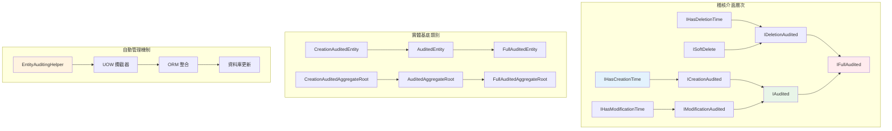
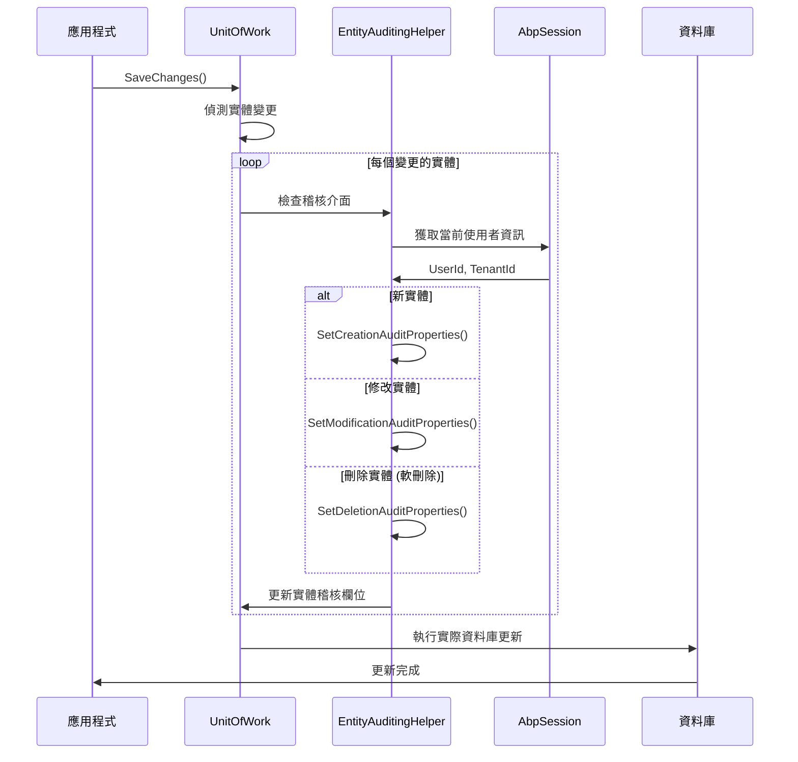

# 12 - 稽核欄位管理

## 📝 稽核欄位系統概述

ASP.NET Boilerplate 的稽核欄位管理是 UOW 系統中的重要組成部分，提供了自動化的資料追蹤功能。系統會自動記錄實體的建立、修改和刪除資訊，包括操作時間、操作使用者等關鍵稽核資訊。

### 稽核欄位架構層次



## 🔧 稽核介面架構

### 1. 基礎時間稽核介面

```csharp
/// <summary>
/// 定義實體具有建立時間
/// </summary>
public interface IHasCreationTime
{
    /// <summary>
    /// 建立時間
    /// </summary>
    DateTime CreationTime { get; set; }
}

/// <summary>
/// 定義實體具有修改時間
/// </summary>
public interface IHasModificationTime
{
    /// <summary>
    /// 最後修改時間
    /// </summary>
    DateTime? LastModificationTime { get; set; }
}

/// <summary>
/// 定義實體具有刪除時間
/// </summary>
public interface IHasDeletionTime : ISoftDelete
{
    /// <summary>
    /// 刪除時間
    /// </summary>
    DateTime? DeletionTime { get; set; }
}
```

### 2. 使用者稽核介面

```csharp
/// <summary>
/// 建立稽核 - 記錄建立者和建立時間
/// </summary>
public interface ICreationAudited : IHasCreationTime
{
    /// <summary>
    /// 建立者使用者ID
    /// </summary>
    long? CreatorUserId { get; set; }
}

/// <summary>
/// 修改稽核 - 記錄最後修改者和修改時間
/// </summary>
public interface IModificationAudited : IHasModificationTime
{
    /// <summary>
    /// 最後修改者使用者ID
    /// </summary>
    long? LastModifierUserId { get; set; }
}

/// <summary>
/// 刪除稽核 - 記錄刪除者和刪除時間
/// </summary>
public interface IDeletionAudited : IHasDeletionTime
{
    /// <summary>
    /// 刪除者使用者ID
    /// </summary>
    long? DeleterUserId { get; set; }
}
```

### 3. 複合稽核介面

```csharp
/// <summary>
/// 完整稽核介面 - 包含建立和修改稽核
/// </summary>
public interface IAudited : ICreationAudited, IModificationAudited
{
}

/// <summary>
/// 全稽核介面 - 包含建立、修改和刪除稽核
/// </summary>
public interface IFullAudited : IAudited, IDeletionAudited
{
}

/// <summary>
/// 支援使用者導航屬性的完整稽核介面
/// </summary>
public interface IFullAudited<TUser> : IFullAudited
    where TUser : IEntity<long>
{
    /// <summary>
    /// 建立者使用者實體
    /// </summary>
    TUser CreatorUser { get; set; }

    /// <summary>
    /// 最後修改者使用者實體
    /// </summary>
    TUser LastModifierUser { get; set; }

    /// <summary>
    /// 刪除者使用者實體
    /// </summary>
    TUser DeleterUser { get; set; }
}
```

## 🏗️ 稽核實體基底類別

### 1. 建立稽核實體

```csharp
/// <summary>
/// 建立稽核實體基底類別
/// </summary>
[Serializable]
public abstract class CreationAuditedEntity<TPrimaryKey> : Entity<TPrimaryKey>, ICreationAudited
{
    /// <summary>
    /// 建立時間
    /// </summary>
    public virtual DateTime CreationTime { get; set; }

    /// <summary>
    /// 建立者使用者ID
    /// </summary>
    public virtual long? CreatorUserId { get; set; }

    /// <summary>
    /// 建構函式 - 自動設定建立時間
    /// </summary>
    protected CreationAuditedEntity()
    {
        CreationTime = Clock.Now;
    }
}

/// <summary>
/// 支援使用者導航屬性的建立稽核實體
/// </summary>
[Serializable]
public abstract class CreationAuditedEntity<TPrimaryKey, TUser> : CreationAuditedEntity<TPrimaryKey>, ICreationAudited<TUser>
    where TUser : IEntity<long>
{
    /// <summary>
    /// 建立者使用者實體參考
    /// </summary>
    [ForeignKey("CreatorUserId")]
    public virtual TUser CreatorUser { get; set; }
}
```

### 2. 完整稽核實體

```csharp
/// <summary>
/// 完整稽核實體基底類別
/// </summary>
[Serializable]
public abstract class AuditedEntity<TPrimaryKey> : CreationAuditedEntity<TPrimaryKey>, IAudited
{
    /// <summary>
    /// 最後修改時間
    /// </summary>
    public virtual DateTime? LastModificationTime { get; set; }

    /// <summary>
    /// 最後修改者使用者ID
    /// </summary>
    public virtual long? LastModifierUserId { get; set; }
}

/// <summary>
/// 全稽核實體基底類別 - 包含軟刪除
/// </summary>
[Serializable]
public abstract class FullAuditedEntity<TPrimaryKey> : AuditedEntity<TPrimaryKey>, IFullAudited
{
    /// <summary>
    /// 是否已刪除 (軟刪除標記)
    /// </summary>
    public virtual bool IsDeleted { get; set; }

    /// <summary>
    /// 刪除者使用者ID
    /// </summary>
    public virtual long? DeleterUserId { get; set; }

    /// <summary>
    /// 刪除時間
    /// </summary>
    public virtual DateTime? DeletionTime { get; set; }
}
```

### 3. 實際使用範例

```csharp
// 產品實體 - 使用完整稽核
[Table("AppProducts")]
public class Product : FullAuditedEntity<long>, IMustHaveTenant
{
    public int TenantId { get; set; }
    
    [Required]
    [StringLength(ProductConsts.MaxNameLength)]
    public string Name { get; set; }
    
    [StringLength(ProductConsts.MaxDescriptionLength)]
    public string Description { get; set; }
    
    [Range(0, double.MaxValue)]
    public decimal Price { get; set; }
    
    public int CategoryId { get; set; }
    
    // 導航屬性
    [ForeignKey("CategoryId")]
    public virtual Category Category { get; set; }
    
    public virtual ICollection<OrderItem> OrderItems { get; set; }
}

// 類別實體 - 使用建立稽核 (不常修改)
[Table("AppCategories")]
public class Category : CreationAuditedEntity<int>, IMayHaveTenant
{
    public int? TenantId { get; set; }
    
    [Required]
    [StringLength(CategoryConsts.MaxNameLength)]
    public string Name { get; set; }
    
    [StringLength(CategoryConsts.MaxDescriptionLength)]
    public string Description { get; set; }
    
    public virtual ICollection<Product> Products { get; set; }
}

// 訂單實體 - 使用支援使用者導航的全稽核
[Table("AppOrders")]
public class Order : FullAuditedEntity<long, User>, IMustHaveTenant
{
    public int TenantId { get; set; }
    
    [Required]
    [StringLength(OrderConsts.MaxOrderNumberLength)]
    public string OrderNumber { get; set; }
    
    public DateTime OrderDate { get; set; }
    
    [Range(0, double.MaxValue)]
    public decimal TotalAmount { get; set; }
    
    public OrderStatus Status { get; set; }
    
    public virtual ICollection<OrderItem> Items { get; set; }
}
```

## ⚙️ 稽核欄位自動管理機制

### EntityAuditingHelper 核心邏輯

```csharp
public static class EntityAuditingHelper
{
    /// <summary>
    /// 設定建立稽核屬性
    /// </summary>
    public static void SetCreationAuditProperties(
        IMultiTenancyConfig multiTenancyConfig,
        object entityAsObj,
        int? tenantId,
        long? userId,
        IReadOnlyList<AuditFieldConfiguration> auditFields)
    {
        // 設定建立時間
        if (entityAsObj is IHasCreationTime)
        {
            var entity = entityAsObj.As<IHasCreationTime>();
            if (entity.CreationTime == default(DateTime))
            {
                var creationTimeFilter = auditFields?.FirstOrDefault(e => e.FieldName == AbpAuditFields.CreationTime);
                if (creationTimeFilter == null || creationTimeFilter.IsSavingEnabled)
                {
                    entity.CreationTime = Clock.Now;
                }
            }
        }

        // 設定建立者使用者ID
        if (entityAsObj is ICreationAudited)
        {
            var entity = entityAsObj.As<ICreationAudited>();
            if (entity.CreatorUserId != null)
            {
                return; // 已經設定，不覆蓋
            }

            if (userId == null)
            {
                return; // 無使用者資訊
            }

            var creationUserIdFilter = auditFields?.FirstOrDefault(e => e.FieldName == AbpAuditFields.CreatorUserId);
            if (creationUserIdFilter != null && !creationUserIdFilter.IsSavingEnabled)
            {
                return; // 禁用此欄位的自動設定
            }

            // 多租戶檢查
            if (multiTenancyConfig?.IsEnabled == true)
            {
                if (MultiTenancyHelper.IsMultiTenantEntity(entity) &&
                    !MultiTenancyHelper.IsTenantEntity(entity, tenantId))
                {
                    // 跨租戶操作，不設定建立者
                    return;
                }

                if (tenantId.HasValue && MultiTenancyHelper.IsHostEntity(entity))
                {
                    // 租戶使用者操作主機實體
                    return;
                }
            }

            entity.CreatorUserId = userId;
        }
    }

    /// <summary>
    /// 設定修改稽核屬性
    /// </summary>
    public static void SetModificationAuditProperties(
        IMultiTenancyConfig multiTenancyConfig,
        object entityAsObj,
        int? tenantId,
        long? userId,
        IReadOnlyList<AuditFieldConfiguration> auditFields)
    {
        // 設定修改時間
        if (entityAsObj is IHasModificationTime)
        {
            var lastModificationTimeFilter = auditFields?.FirstOrDefault(e => e.FieldName == AbpAuditFields.LastModificationTime);
            if (lastModificationTimeFilter == null || lastModificationTimeFilter.IsSavingEnabled)
            {
                entityAsObj.As<IHasModificationTime>().LastModificationTime = Clock.Now;
            }
        }

        // 設定修改者使用者ID
        if (entityAsObj is IModificationAudited)
        {
            var entity = entityAsObj.As<IModificationAudited>();
            var lastModifierUserIdFilter = auditFields?.FirstOrDefault(e => e.FieldName == AbpAuditFields.LastModifierUserId);
            
            if (lastModifierUserIdFilter != null && !lastModifierUserIdFilter.IsSavingEnabled)
            {
                return;
            }

            if (userId == null)
            {
                entity.LastModifierUserId = null;
                return;
            }

            // 多租戶安全檢查
            if (multiTenancyConfig?.IsEnabled == true)
            {
                if (MultiTenancyHelper.IsMultiTenantEntity(entity) &&
                    !MultiTenancyHelper.IsTenantEntity(entity, tenantId))
                {
                    entity.LastModifierUserId = null;
                    return;
                }

                if (tenantId.HasValue && MultiTenancyHelper.IsHostEntity(entity))
                {
                    entity.LastModifierUserId = null;
                    return;
                }
            }

            entity.LastModifierUserId = userId;
        }
    }

    /// <summary>
    /// 設定刪除稽核屬性
    /// </summary>
    public static void SetDeletionAuditProperties(
        IMultiTenancyConfig multiTenancyConfig,
        object entityAsObj,
        int? tenantId,
        long? userId,
        IReadOnlyList<AuditFieldConfiguration> auditFields)
    {
        // 設定刪除時間
        if (entityAsObj is IHasDeletionTime)
        {
            var entity = entityAsObj.As<IHasDeletionTime>();
            if (entity.DeletionTime == null)
            {
                var deletionTimeFilter = auditFields?.FirstOrDefault(e => e.FieldName == AbpAuditFields.DeletionTime);
                if (deletionTimeFilter == null || deletionTimeFilter.IsSavingEnabled)
                {
                    entity.DeletionTime = Clock.Now;
                }
            }
        }

        // 設定刪除者使用者ID
        if (entityAsObj is IDeletionAudited)
        {
            var entity = entityAsObj.As<IDeletionAudited>();
            
            if (entity.DeleterUserId != null)
            {
                return; // 已設定
            }

            if (userId == null)
            {
                entity.DeleterUserId = null;
                return;
            }

            var deleterUserIdFilter = auditFields?.FirstOrDefault(e => e.FieldName == AbpAuditFields.DeleterUserId);
            if (deleterUserIdFilter != null && !deleterUserIdFilter.IsSavingEnabled)
            {
                return;
            }

            // 多租戶安全檢查
            if (entity is IMayHaveTenant || entity is IMustHaveTenant)
            {
                if ((entity is IMayHaveTenant && entity.As<IMayHaveTenant>().TenantId == tenantId) ||
                    (entity is IMustHaveTenant && entity.As<IMustHaveTenant>().TenantId == tenantId))
                {
                    entity.DeleterUserId = userId;
                }
                else
                {
                    entity.DeleterUserId = null;
                }
            }
            else
            {
                entity.DeleterUserId = userId;
            }
        }
    }
}
```

### UOW 中的稽核觸發機制



## 🎛️ 稽核欄位配置與控制

### 1. 稽核欄位配置定義

```csharp
/// <summary>
/// 稽核欄位配置
/// </summary>
public class AuditFieldConfiguration
{
    /// <summary>
    /// 欄位名稱
    /// </summary>
    public string FieldName { get; }

    /// <summary>
    /// 是否啟用自動儲存
    /// </summary>
    public bool IsSavingEnabled { get; set; }

    public AuditFieldConfiguration(string fieldName, bool isSavingEnabled = true)
    {
        FieldName = fieldName;
        IsSavingEnabled = isSavingEnabled;
    }
}

/// <summary>
/// 標準稽核欄位名稱
/// </summary>
public static class AbpAuditFields
{
    public const string CreatorUserId = "CreatorUserId";
    public const string LastModifierUserId = "LastModifierUserId";
    public const string DeleterUserId = "DeleterUserId";
    public const string LastModificationTime = "LastModificationTime";
    public const string DeletionTime = "DeletionTime";
}
```

### 2. 全域稽核欄位配置

```csharp
public class MyModule : AbpModule
{
    public override void PreInitialize()
    {
        // 禁用特定稽核欄位的自動設定
        Configuration.UnitOfWork.RegisterAuditFieldConfiguration(
            new AuditFieldConfiguration(AbpAuditFields.LastModifierUserId, false)
        );

        // 禁用刪除時間的自動設定
        Configuration.UnitOfWork.RegisterAuditFieldConfiguration(
            new AuditFieldConfiguration(AbpAuditFields.DeletionTime, false)
        );
    }
}
```

### 3. 動態稽核欄位控制

```csharp
public class ProductService : ApplicationService
{
    /// <summary>
    /// 批次匯入產品 - 禁用建立者稽核
    /// </summary>
    public async Task BatchImportProductsAsync(List<ProductImportDto> products)
    {
        // 暫時禁用建立者使用者ID的自動設定
        using (CurrentUnitOfWork.DisableAuditing(AbpAuditFields.CreatorUserId))
        {
            foreach (var productDto in products)
            {
                var product = ObjectMapper.Map<Product>(productDto);
                
                // 手動設定建立者為系統管理員
                product.CreatorUserId = 1; // 系統管理員ID
                
                await _productRepository.InsertAsync(product);
            }
            
            await CurrentUnitOfWork.SaveChangesAsync();
        }
    }

    /// <summary>
    /// 系統自動更新 - 禁用修改者稽核
    /// </summary>
    public async Task SystemUpdatePricesAsync(decimal adjustmentRate)
    {
        using (CurrentUnitOfWork.DisableAuditing(
            AbpAuditFields.LastModifierUserId, 
            AbpAuditFields.LastModificationTime))
        {
            var products = await _productRepository.GetAllListAsync();
            
            foreach (var product in products)
            {
                product.Price *= adjustmentRate;
                
                // 手動設定更新資訊
                product.LastModificationTime = Clock.Now;
                product.LastModifierUserId = null; // 系統更新
            }
            
            await CurrentUnitOfWork.SaveChangesAsync();
        }
    }

    /// <summary>
    /// 永久刪除已軟刪除的資料 - 保留稽核資訊
    /// </summary>
    [UnitOfWork]
    public async Task PermanentDeleteOldDataAsync(DateTime cutoffDate)
    {
        // 禁用軟刪除過濾器，但保留稽核欄位控制
        using (CurrentUnitOfWork.DisableFilter(AbpDataFilters.SoftDelete))
        {
            var oldDeletedProducts = await _productRepository
                .GetAllListAsync(p => p.IsDeleted && p.DeletionTime < cutoffDate);

            foreach (var product in oldDeletedProducts)
            {
                // 記錄永久刪除的稽核資訊
                Logger.Info($"Permanently deleting product {product.Id}, " +
                          $"originally deleted by user {product.DeleterUserId} " +
                          $"at {product.DeletionTime}");
                
                await _productRepository.HardDeleteAsync(product);
            }
        }
    }
}
```

## 📊 稽核資料查詢與報表

### 1. 稽核歷史查詢服務

```csharp
public class AuditReportService : ApplicationService
{
    /// <summary>
    /// 獲取實體稽核歷史
    /// </summary>
    public async Task<EntityAuditHistoryDto> GetEntityAuditHistoryAsync(
        string entityType, 
        string entityId)
    {
        // 透過稽核日誌獲取變更歷史
        var auditLogs = await _auditLogRepository
            .GetAllListAsync(log => 
                log.ServiceName.Contains(entityType) &&
                log.Parameters.Contains($"\"Id\":{entityId}"));

        return new EntityAuditHistoryDto
        {
            EntityType = entityType,
            EntityId = entityId,
            ChangeHistory = auditLogs.Select(log => new AuditChangeDto
            {
                ChangeTime = log.ExecutionTime,
                UserId = log.UserId,
                Action = DetermineAction(log.MethodName),
                Changes = ParseParameterChanges(log.Parameters, log.ReturnValue)
            }).ToList()
        };
    }

    /// <summary>
    /// 獲取使用者活動報表
    /// </summary>
    public async Task<UserActivityReportDto> GetUserActivityReportAsync(
        long userId, 
        DateTime startDate, 
        DateTime endDate)
    {
        using (CurrentUnitOfWork.DisableFilter(AbpDataFilters.MayHaveTenant))
        {
            // 查詢使用者建立的實體
            var createdEntities = await GetUserCreatedEntitiesAsync(userId, startDate, endDate);
            
            // 查詢使用者修改的實體
            var modifiedEntities = await GetUserModifiedEntitiesAsync(userId, startDate, endDate);
            
            // 查詢使用者刪除的實體
            var deletedEntities = await GetUserDeletedEntitiesAsync(userId, startDate, endDate);

            return new UserActivityReportDto
            {
                UserId = userId,
                ReportPeriod = new DateRange(startDate, endDate),
                CreatedCount = createdEntities.Count,
                ModifiedCount = modifiedEntities.Count,
                DeletedCount = deletedEntities.Count,
                TotalActions = createdEntities.Count + modifiedEntities.Count + deletedEntities.Count,
                ActivityDetails = CombineActivityDetails(createdEntities, modifiedEntities, deletedEntities)
            };
        }
    }

    /// <summary>
    /// 獲取實體生命週期報表
    /// </summary>
    public async Task<EntityLifecycleReportDto> GetEntityLifecycleReportAsync<TEntity>(
        Expression<Func<TEntity, bool>> predicate = null)
        where TEntity : class, IFullAudited
    {
        using (CurrentUnitOfWork.DisableFilter(AbpDataFilters.SoftDelete))
        {
            var query = _repository.GetAll().AsQueryable();
            
            if (predicate != null)
            {
                query = query.Where(predicate);
            }

            var entities = await query.ToListAsync();

            var report = new EntityLifecycleReportDto
            {
                EntityType = typeof(TEntity).Name,
                TotalEntities = entities.Count,
                ActiveEntities = entities.Count(e => !e.IsDeleted),
                DeletedEntities = entities.Count(e => e.IsDeleted),
                
                CreationStats = new AuditStatsDto
                {
                    EarliestDate = entities.Min(e => e.CreationTime),
                    LatestDate = entities.Max(e => e.CreationTime),
                    UniqueUsers = entities.Where(e => e.CreatorUserId.HasValue)
                                        .Select(e => e.CreatorUserId.Value)
                                        .Distinct().Count()
                },
                
                ModificationStats = new AuditStatsDto
                {
                    EarliestDate = entities.Where(e => e.LastModificationTime.HasValue)
                                         .Min(e => e.LastModificationTime),
                    LatestDate = entities.Where(e => e.LastModificationTime.HasValue)
                                       .Max(e => e.LastModificationTime),
                    UniqueUsers = entities.Where(e => e.LastModifierUserId.HasValue)
                                        .Select(e => e.LastModifierUserId.Value)
                                        .Distinct().Count()
                },
                
                DeletionStats = new AuditStatsDto
                {
                    EarliestDate = entities.Where(e => e.DeletionTime.HasValue)
                                         .Min(e => e.DeletionTime),
                    LatestDate = entities.Where(e => e.DeletionTime.HasValue)
                                       .Max(e => e.DeletionTime),
                    UniqueUsers = entities.Where(e => e.DeleterUserId.HasValue)
                                        .Select(e => e.DeleterUserId.Value)
                                        .Distinct().Count()
                }
            };

            return report;
        }
    }
}
```

## 🔒 稽核欄位安全性考量

### 1. 多租戶稽核安全

```csharp
public class SecureAuditService : ApplicationService
{
    /// <summary>
    /// 安全的跨租戶稽核查詢
    /// </summary>
    [AbpAuthorize("HostAdmin")]
    public async Task<CrossTenantAuditReportDto> GetCrossTenantAuditReportAsync(
        int[] tenantIds, 
        DateTime startDate, 
        DateTime endDate)
    {
        using (CurrentUnitOfWork.DisableFilter(AbpDataFilters.MustHaveTenant))
        using (CurrentUnitOfWork.DisableFilter(AbpDataFilters.MayHaveTenant))
        {
            var auditData = new Dictionary<int, TenantAuditSummaryDto>();

            foreach (var tenantId in tenantIds)
            {
                // 設定特定租戶過濾器
                using (CurrentUnitOfWork.SetFilterParameter(
                    AbpDataFilters.MustHaveTenant, 
                    AbpDataFilters.Parameters.TenantId, 
                    tenantId))
                {
                    var tenantSummary = await GetTenantAuditSummaryAsync(tenantId, startDate, endDate);
                    auditData[tenantId] = tenantSummary;
                }
            }

            return new CrossTenantAuditReportDto
            {
                ReportPeriod = new DateRange(startDate, endDate),
                TenantSummaries = auditData,
                GeneratedAt = Clock.Now,
                GeneratedBy = AbpSession.UserId
            };
        }
    }

    /// <summary>
    /// 稽核欄位敏感資料遮罩
    /// </summary>
    public async Task<List<ProductAuditDto>> GetMaskedProductAuditAsync()
    {
        var products = await _productRepository.GetAllListAsync();
        
        return products.Select(p => new ProductAuditDto
        {
            Id = p.Id,
            Name = p.Name,
            CreationTime = p.CreationTime,
            
            // 根據權限決定是否顯示敏感稽核資訊
            CreatorUserId = await PermissionChecker.IsGrantedAsync("ViewUserInfo") 
                ? p.CreatorUserId 
                : null,
                
            LastModificationTime = p.LastModificationTime,
            LastModifierUserId = await PermissionChecker.IsGrantedAsync("ViewUserInfo") 
                ? p.LastModifierUserId 
                : null,
                
            // 刪除資訊只有管理員可見
            IsDeleted = await PermissionChecker.IsGrantedAsync("Admin") 
                ? p.IsDeleted 
                : false,
                
            DeletionTime = await PermissionChecker.IsGrantedAsync("Admin") 
                ? p.DeletionTime 
                : null
        }).ToList();
    }
}
```

## 🧪 稽核欄位測試策略

### 1. 稽核自動化測試

```csharp
public class AuditFieldTests : AppTestBase
{
    private readonly IRepository<Product> _productRepository;

    [Fact]
    public async Task Should_Set_Creation_Audit_Properties()
    {
        // Arrange
        var testUserId = 100L;
        var testTenantId = 1;

        // Act
        using (AbpSession.Use(testTenantId, testUserId))
        {
            var product = new Product
            {
                Name = "Test Product",
                Price = 100
            };

            await _productRepository.InsertAsync(product);
            await CurrentUnitOfWork.SaveChangesAsync();

            // Assert
            product.CreationTime.ShouldNotBe(default(DateTime));
            product.CreatorUserId.ShouldBe(testUserId);
            product.TenantId.ShouldBe(testTenantId);
        }
    }

    [Fact]
    public async Task Should_Set_Modification_Audit_Properties()
    {
        // Arrange
        var product = await CreateTestProductAsync();
        var modifierUserId = 200L;

        // Act
        using (AbpSession.Use(1, modifierUserId))
        {
            product.Name = "Modified Product";
            await _productRepository.UpdateAsync(product);
            await CurrentUnitOfWork.SaveChangesAsync();

            // Assert
            product.LastModificationTime.ShouldNotBeNull();
            product.LastModifierUserId.ShouldBe(modifierUserId);
        }
    }

    [Fact]
    public async Task Should_Set_Deletion_Audit_Properties()
    {
        // Arrange
        var product = await CreateTestProductAsync();
        var deleterUserId = 300L;

        // Act
        using (AbpSession.Use(1, deleterUserId))
        {
            await _productRepository.DeleteAsync(product.Id);
            await CurrentUnitOfWork.SaveChangesAsync();

            // Assert
            product.IsDeleted.ShouldBeTrue();
            product.DeletionTime.ShouldNotBeNull();
            product.DeleterUserId.ShouldBe(deleterUserId);
        }
    }

    [Fact]
    public async Task Should_Not_Set_Audit_Fields_When_Disabled()
    {
        // Arrange & Act
        using (CurrentUnitOfWork.DisableAuditing(AbpAuditFields.CreatorUserId))
        using (AbpSession.Use(1, 100L))
        {
            var product = new Product { Name = "Test", Price = 100 };
            await _productRepository.InsertAsync(product);
            await CurrentUnitOfWork.SaveChangesAsync();

            // Assert
            product.CreatorUserId.ShouldBeNull();
            product.CreationTime.ShouldNotBe(default(DateTime)); // 時間仍會設定
        }
    }
}
```

稽核欄位管理是 ASP.NET Boilerplate 提供的強大功能，能夠自動化追蹤資料變更歷史，為企業應用提供完整的資料稽核能力。透過適當的配置和安全措施，可以建立符合合規要求的稽核系統。

---

## 🎯 第四部分總結

第四部分「過濾器與資料存取」深入探討了 ASP.NET Boilerplate UOW 系統中的資料管理核心功能：

### 主要內容回顧

1. **資料過濾器系統** - 提供透明的資料過濾機制，包含軟刪除、多租戶過濾器及自訂過濾器實作
2. **多租戶支援** - 完整的企業級多租戶解決方案，從資料隔離到連線字串管理
3. **稽核欄位管理** - 自動化的資料變更追蹤，確保完整的稽核軌跡

### 核心技術要點

- **自動過濾機制**：透過 UOW 攔截器自動套用資料過濾條件
- **多租戶架構**：支援單一資料庫、分離資料庫及混合模式部署
- **稽核自動化**：透過 EntityAuditingHelper 自動管理稽核欄位
- **安全性控制**：完整的租戶隔離和跨租戶操作控制機制

### 實務應用價值

- **企業合規**：滿足資料稽核和合規要求
- **安全隔離**：確保多租戶環境的資料安全
- **開發效率**：減少重複的過濾器邏輯編寫
- **維護性**：集中化的過濾器管理和配置

---

*第四部分完成。下一章將開始第五部分：[13-Repository與UOW整合](13-Repository與UOW整合.md)。*
