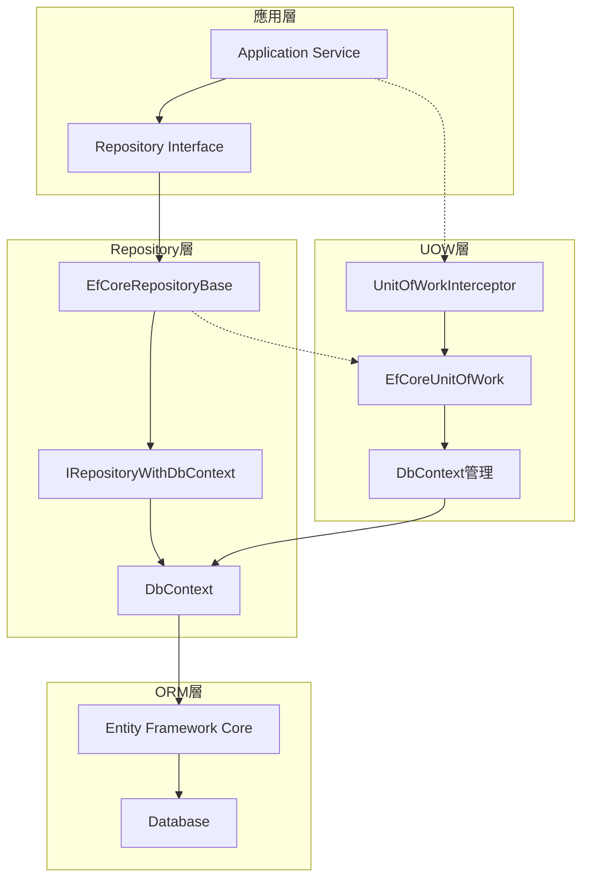
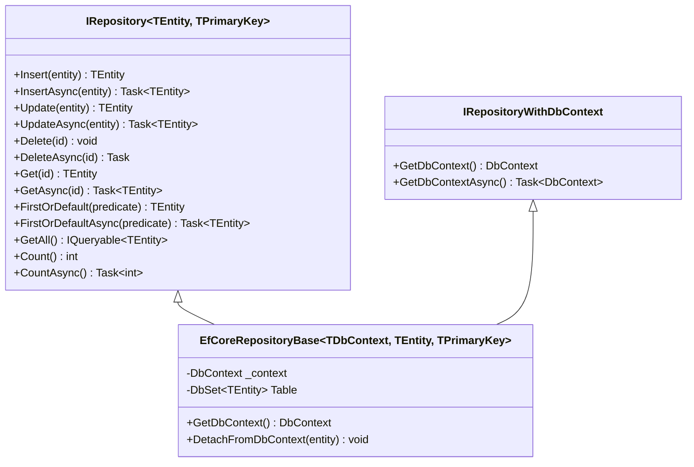
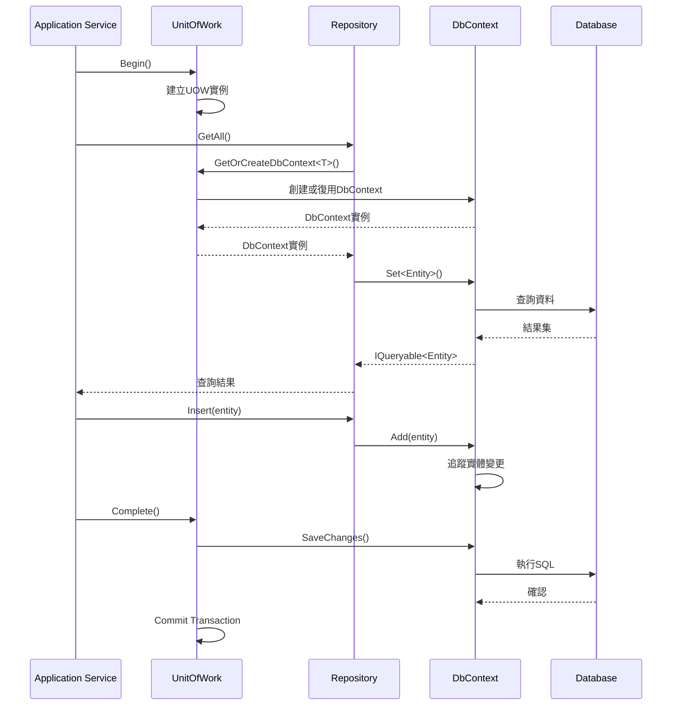

# 13 - Repository與UOW整合

## 🏗️ Repository模式與UOW整合概述

Repository模式與Unit of Work模式在ASP.NET Boilerplate中深度整合，提供了一個統一且高效的資料存取層架構。Repository負責封裝資料存取邏輯，而UOW負責管理交易邊界和資料庫連線，兩者協同工作確保資料的一致性和完整性。

### Repository與UOW關係架構



## 📋 Repository基礎接口設計

### IRepository核心接口



### Repository實作範例

以下是Entity Framework Core Repository的核心實作：

```csharp
public class EfCoreRepositoryBase<TDbContext, TEntity, TPrimaryKey> : 
    AbpRepositoryBase<TEntity, TPrimaryKey>, 
    IRepositoryWithDbContext
    where TEntity : class, IEntity<TPrimaryKey>
    where TDbContext : DbContext
{
    public virtual DbContext GetDbContext()
    {
        return _dbContextProvider.GetDbContext();
    }

    public virtual async Task<DbContext> GetDbContextAsync()
    {
        return await _dbContextProvider.GetDbContextAsync();
    }

    public virtual DbSet<TEntity> Table => GetDbContext().Set<TEntity>();

    protected virtual IDbContextProvider<TDbContext> _dbContextProvider;

    public EfCoreRepositoryBase(IDbContextProvider<TDbContext> dbContextProvider)
    {
        _dbContextProvider = dbContextProvider;
    }
}
```

## 🔄 DbContext與UOW整合機制

### DbContext生命週期管理



### DbContext Provider實作

```csharp
public class EfCoreDbContextProvider<TDbContext> : IDbContextProvider<TDbContext>
    where TDbContext : DbContext
{
    private readonly IUnitOfWorkManager _unitOfWorkManager;

    public EfCoreDbContextProvider(IUnitOfWorkManager unitOfWorkManager)
    {
        _unitOfWorkManager = unitOfWorkManager;
    }

    public TDbContext GetDbContext()
    {
        return GetDbContextInstance();
    }

    public async Task<TDbContext> GetDbContextAsync()
    {
        return await GetDbContextInstanceAsync();
    }

    private TDbContext GetDbContextInstance()
    {
        var uow = _unitOfWorkManager.Current;
        if (uow == null)
        {
            throw new AbpException("沒有活動的UOW可以取得DbContext");
        }

        if (!(uow is EfCoreUnitOfWork efCoreUow))
        {
            throw new AbpException("當前UOW不是EfCore實作");
        }

        return efCoreUow.GetOrCreateDbContext<TDbContext>();
    }
}
```

## 🎯 Repository擴展方法

### EfCoreRepositoryExtensions

ASP.NET Boilerplate提供了豐富的Repository擴展方法：

```csharp
public static class EfCoreRepositoryExtensions
{
    // 取得DbContext
    public static DbContext GetDbContext<TEntity, TPrimaryKey>(
        this IRepository<TEntity, TPrimaryKey> repository)
        where TEntity : class, IEntity<TPrimaryKey>
    {
        var repositoryWithDbContext = ProxyHelper.UnProxy(repository) as IRepositoryWithDbContext;
        if (repositoryWithDbContext != null)
        {
            return repositoryWithDbContext.GetDbContext();
        }
        throw new ArgumentException("Repository不支援IRepositoryWithDbContext");
    }

    // 從DbContext分離實體
    public static void DetachFromDbContext<TEntity, TPrimaryKey>(
        this IRepository<TEntity, TPrimaryKey> repository, TEntity entity)
        where TEntity : class, IEntity<TPrimaryKey>
    {
        repository.GetDbContext().Entry(entity).State = EntityState.Detached;
    }

    // 批次插入
    public static void InsertRange<TEntity, TPrimaryKey>(
        this IRepository<TEntity, TPrimaryKey> repository,
        params TEntity[] entities)
        where TEntity : class, IEntity<TPrimaryKey>
    {
        repository.GetDbContext().AddRange(entities.ToArray<object>());
    }

    // 非同步批次插入
    public static async Task InsertRangeAsync<TEntity, TPrimaryKey>(
        this IRepository<TEntity, TPrimaryKey> repository, 
        params TEntity[] entities)
        where TEntity : class, IEntity<TPrimaryKey>
    {
        repository.GetDbContext().AddRange(entities.ToArray<object>());
        await repository.GetDbContext().SaveChangesAsync();
    }
}
```

## 💡 實際應用範例

### 基本Repository使用

```csharp
public class ProductAppService : ApplicationService
{
    private readonly IRepository<Product> _productRepository;
    private readonly IRepository<Category> _categoryRepository;

    public ProductAppService(
        IRepository<Product> productRepository,
        IRepository<Category> categoryRepository)
    {
        _productRepository = productRepository;
        _categoryRepository = categoryRepository;
    }

    // 自動UOW管理（Application Service預設啟用）
    public async Task<ProductDto> CreateProductAsync(CreateProductInput input)
    {
        // 查詢分類
        var category = await _categoryRepository.GetAsync(input.CategoryId);
        
        // 建立產品
        var product = new Product
        {
            Name = input.Name,
            Price = input.Price,
            CategoryId = category.Id
        };

        // 插入產品（在同一個UOW中）
        await _productRepository.InsertAsync(product);
        
        // UOW會自動Complete，無需手動SaveChanges
        return ObjectMapper.Map<ProductDto>(product);
    }
}
```

### 複雜查詢與Repository整合

```csharp
public class OrderAppService : ApplicationService
{
    private readonly IRepository<Order> _orderRepository;
    private readonly IRepository<Product> _productRepository;

    public async Task<PagedResultDto<OrderDto>> GetOrdersAsync(GetOrdersInput input)
    {
        // 使用Repository的GetAll方法取得IQueryable
        var query = _orderRepository.GetAll()
            .Include(o => o.OrderItems)
            .ThenInclude(oi => oi.Product)
            .WhereIf(!input.CustomerName.IsNullOrEmpty(), 
                o => o.Customer.Name.Contains(input.CustomerName))
            .WhereIf(input.MinTotal.HasValue, 
                o => o.TotalAmount >= input.MinTotal);

        // 分頁查詢
        var totalCount = await AsyncQueryableExecuter.CountAsync(query);
        var orders = await AsyncQueryableExecuter.ToListAsync(
            query.OrderByDescending(o => o.CreationTime)
                 .PageBy(input));

        return new PagedResultDto<OrderDto>(
            totalCount,
            ObjectMapper.Map<List<OrderDto>>(orders));
    }
}
```

### 自訂Repository實作

```csharp
public interface IProductRepository : IRepository<Product>
{
    Task<List<Product>> GetTopSellingProductsAsync(int count);
    Task<Product> GetWithCategoryAsync(int productId);
}

public class ProductRepository : EfCoreRepositoryBase<MyDbContext, Product>, IProductRepository
{
    public ProductRepository(IDbContextProvider<MyDbContext> dbContextProvider) 
        : base(dbContextProvider)
    {
    }

    public async Task<List<Product>> GetTopSellingProductsAsync(int count)
    {
        var dbContext = GetDbContext();
        return await dbContext.Products
            .Include(p => p.Category)
            .OrderByDescending(p => p.SalesCount)
            .Take(count)
            .ToListAsync();
    }

    public async Task<Product> GetWithCategoryAsync(int productId)
    {
        return await GetAll()
            .Include(p => p.Category)
            .FirstOrDefaultAsync(p => p.Id == productId);
    }
}
```

## 🔧 進階整合技巧

### DbContext直接存取

```csharp
public class ReportAppService : ApplicationService
{
    private readonly IRepository<Order> _orderRepository;

    public async Task<SalesReportDto> GenerateSalesReportAsync(DateTime from, DateTime to)
    {
        // 取得DbContext執行原生SQL查詢
        var dbContext = _orderRepository.GetDbContext();
        
        var salesData = await dbContext.Database.SqlQueryRaw<SalesDataDto>(
            @"SELECT 
                DATE(CreationTime) as Date,
                SUM(TotalAmount) as TotalSales,
                COUNT(*) as OrderCount
              FROM Orders 
              WHERE CreationTime BETWEEN {0} AND {1}
              GROUP BY DATE(CreationTime)",
            from, to).ToListAsync();

        return new SalesReportDto
        {
            Period = new DateRange(from, to),
            SalesData = salesData
        };
    }
}
```

### 跨Repository交易

```csharp
public class TransferAppService : ApplicationService
{
    private readonly IRepository<Account> _accountRepository;
    private readonly IRepository<TransferLog> _transferLogRepository;

    [UnitOfWork] // 確保交易範圍
    public async Task TransferMoneyAsync(TransferMoneyInput input)
    {
        // 所有操作在同一個UOW中
        var fromAccount = await _accountRepository.GetAsync(input.FromAccountId);
        var toAccount = await _accountRepository.GetAsync(input.ToAccountId);

        // 業務邏輯驗證
        if (fromAccount.Balance < input.Amount)
        {
            throw new UserFriendlyException("餘額不足");
        }

        // 更新帳戶餘額
        fromAccount.Balance -= input.Amount;
        toAccount.Balance += input.Amount;

        await _accountRepository.UpdateAsync(fromAccount);
        await _accountRepository.UpdateAsync(toAccount);

        // 記錄轉帳日誌
        var transferLog = new TransferLog
        {
            FromAccountId = input.FromAccountId,
            ToAccountId = input.ToAccountId,
            Amount = input.Amount,
            TransferTime = Clock.Now
        };

        await _transferLogRepository.InsertAsync(transferLog);

        // UOW自動Complete，所有變更一起提交
    }
}
```

## 🎨 Repository工廠模式

### 動態Repository建立

```csharp
public class GenericAppService : ApplicationService
{
    private readonly IIocResolver _iocResolver;

    public GenericAppService(IIocResolver iocResolver)
    {
        _iocResolver = iocResolver;
    }

    public async Task<T> GetEntityAsync<T>(int id) where T : class, IEntity<int>
    {
        // 動態解析Repository
        var repository = _iocResolver.Resolve<IRepository<T>>();
        try
        {
            return await repository.GetAsync(id);
        }
        finally
        {
            _iocResolver.Release(repository);
        }
    }
}
```

## 🚨 注意事項與最佳實務

### Repository使用原則

1. **保持Repository簡潔**
   ```csharp
   // ✅ 好的實務
   public interface IOrderRepository : IRepository<Order>
   {
       Task<List<Order>> GetOrdersByCustomerAsync(int customerId);
   }

   // ❌ 避免複雜業務邏輯
   public interface IOrderRepository : IRepository<Order>
   {
       Task ProcessOrderPaymentAndSendEmailAsync(int orderId);
   }
   ```

2. **適當使用Include**
   ```csharp
   // ✅ 明確的Include
   public async Task<Order> GetOrderWithDetailsAsync(int orderId)
   {
       return await GetAll()
           .Include(o => o.OrderItems)
           .ThenInclude(oi => oi.Product)
           .FirstOrDefaultAsync(o => o.Id == orderId);
   }

   // ❌ 過度Include導致N+1問題
   public async Task<List<Order>> GetAllOrdersAsync()
   {
       return await GetAll()
           .Include(o => o.OrderItems)
           .ThenInclude(oi => oi.Product)
           .ThenInclude(p => p.Category)
           .ThenInclude(c => c.SubCategories)
           .ToListAsync();
   }
   ```

3. **DbContext生命週期管理**
   ```csharp
   // ✅ 讓UOW管理DbContext
   public async Task<Product> GetProductAsync(int id)
   {
       return await _productRepository.GetAsync(id);
   }

   // ❌ 手動管理DbContext
   public async Task<Product> GetProductAsync(int id)
   {
       using (var context = new MyDbContext())
       {
           return await context.Products.FindAsync(id);
       }
   }
   ```

Repository與UOW的深度整合為ASP.NET Boilerplate提供了強大且靈活的資料存取能力，確保了資料一致性的同時也簡化了開發複雜度。

## 📖 相關章節

- **下一章節**: [14-Application Service中的UOW](14-ApplicationService中的UOW.md) - 了解如何在應用服務層使用Repository和UOW
- **相關章節**: [19-與ORM框架整合](19-與ORM框架整合.md) - 深入了解不同ORM框架的整合實作

本章重點在Repository的技術實作與UOW的整合機制，下一章將介紹在Application Service層面如何實際應用這些概念進行業務開發。
