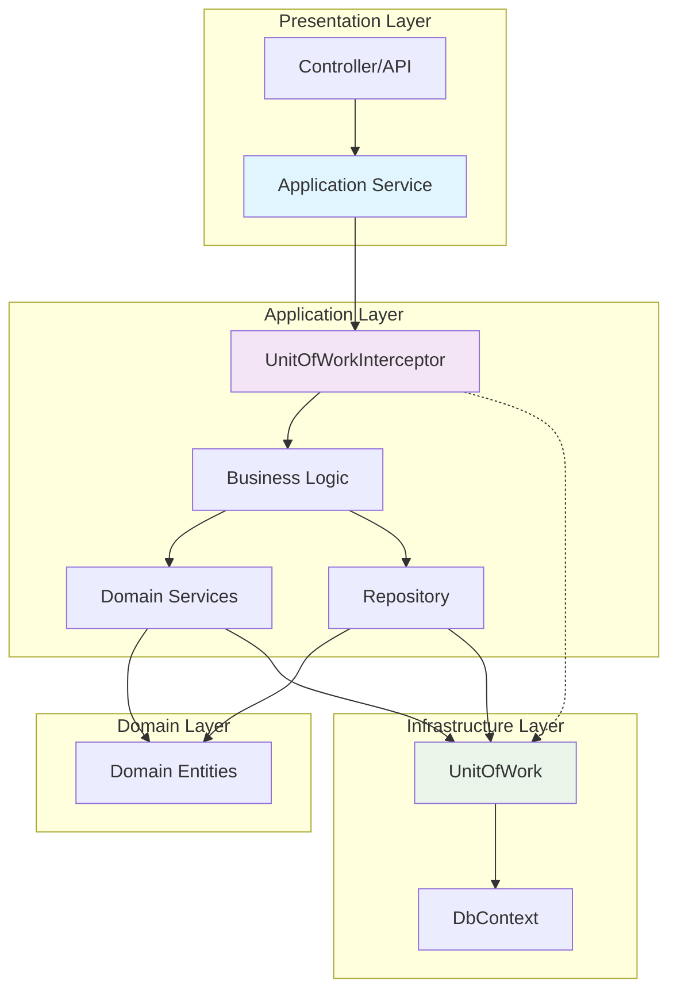
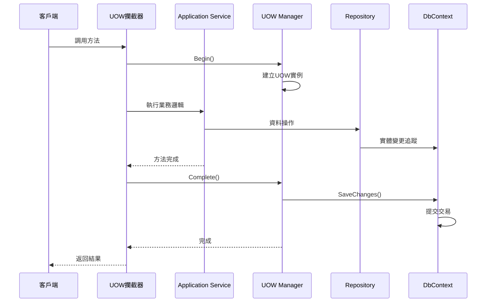

# 14 - Application Service中的UOW

## 🎯 Application Service與UOW概述

Application Service是ASP.NET Boilerplate架構中的重要組件，負責實作業務用例並協調Domain Layer的各種服務。UOW在Application Service中扮演關鍵角色，自動管理交易邊界、資料庫連線，並確保業務操作的ACID特性。

### Application Service層次架構



## 🔄 自動UOW管理機制

### UOW攔截器運作原理

Application Service中的方法預設會被UnitOfWorkInterceptor攔截，自動管理UOW生命週期：



### 自動UOW註冊機制

```csharp
// 在模組中自動註冊UOW攔截器
public class MyApplicationModule : AbpModule
{
    public override void Initialize()
    {
        // Application Service預設啟用UOW攔截
        Configuration.UnitOfWork.RegisterFilter(
            AbpDataFilters.SoftDelete, true);
    }
}

// UOW攔截器自動應用於Application Service
[Interceptor(typeof(UnitOfWorkInterceptor))]
public abstract class ApplicationService : AbpServiceBase, IApplicationService
{
    // 所有繼承自ApplicationService的類別都會自動應用UOW
}
```

## 📋 Demo專案實際範例

### UserAppService - 完整實作分析

以下是Demo專案中`UserAppService`的實際實作，展示了UOW在真實場景中的應用：

```csharp
[AbpAuthorize(PermissionNames.Pages_Users)]
public class UserAppService : AsyncCrudAppService<User, UserDto, long, PagedUserResultRequestDto, CreateUserDto, UserDto>, IUserAppService
{
    private readonly UserManager _userManager;
    private readonly RoleManager _roleManager;
    private readonly IRepository<Role> _roleRepository;
    private readonly IPasswordHasher<User> _passwordHasher;
    private readonly IAbpSession _abpSession;
    private readonly LogInManager _logInManager;

    public UserAppService(
        IRepository<User, long> repository,
        UserManager userManager,
        RoleManager roleManager,
        IRepository<Role> roleRepository,
        IPasswordHasher<User> passwordHasher,
        IAbpSession abpSession,
        LogInManager logInManager)
        : base(repository)
    {
        _userManager = userManager;
        _roleManager = roleManager;
        _roleRepository = roleRepository;
        _passwordHasher = passwordHasher;
        _abpSession = abpSession;
        _logInManager = logInManager;
    }

    /// <summary>
    /// 建立使用者 - 展示複雜的UOW使用場景
    /// </summary>
    public override async Task<UserDto> CreateAsync(CreateUserDto input)
    {
        CheckCreatePermission();

        var user = ObjectMapper.Map<User>(input);

        // 自動設定租戶ID（多租戶支援）
        user.TenantId = AbpSession.TenantId;
        user.IsEmailConfirmed = true;

        await _userManager.InitializeOptionsAsync(AbpSession.TenantId);

        // UserManager內部會使用UOW管理交易
        CheckErrors(await _userManager.CreateAsync(user, input.Password));

        if (input.RoleNames != null)
        {
            // 角色指派也在同一個UOW中
            CheckErrors(await _userManager.SetRolesAsync(user, input.RoleNames));
        }

        // 手動觸發SaveChanges確保即時可見性
        CurrentUnitOfWork.SaveChanges();

        return MapToEntityDto(user);
    }

    /// <summary>
    /// 更新使用者 - 標準CRUD操作
    /// </summary>
    public override async Task<UserDto> UpdateAsync(UserDto input)
    {
        CheckUpdatePermission();

        var user = await _userManager.GetUserByIdAsync(input.Id);

        MapToEntity(input, user);

        CheckErrors(await _userManager.UpdateAsync(user));

        if (input.RoleNames != null)
        {
            CheckErrors(await _userManager.SetRolesAsync(user, input.RoleNames));
        }

        return await GetAsync(input);
    }

    /// <summary>
    /// 啟用/停用使用者 - 簡單的狀態變更
    /// </summary>
    [AbpAuthorize(PermissionNames.Pages_Users_Activation)]
    public async Task Activate(EntityDto<long> user)
    {
        await Repository.UpdateAsync(user.Id, async (entity) =>
        {
            entity.IsActive = true;
        });
    }

    [AbpAuthorize(PermissionNames.Pages_Users_Activation)]
    public async Task DeActivate(EntityDto<long> user)
    {
        await Repository.UpdateAsync(user.Id, async (entity) =>
        {
            entity.IsActive = false;
        });
    }
}
```

### UOW在UserAppService中的關鍵要點

1. **自動交易管理**: 每個方法呼叫都會自動建立UOW
2. **多租戶支援**: `user.TenantId = AbpSession.TenantId` 確保租戶隔離
3. **手動SaveChanges**: `CurrentUnitOfWork.SaveChanges()` 確保立即可見性
4. **複雜操作協調**: 使用者建立 + 角色指派在同一交易中
5. **權限控制**: 與UOW整合的權限驗證

## 📋 Application Service基本範例

### 簡單CRUD操作

```csharp
using System.Threading.Tasks;
using Abp.Application.Services;
using Abp.Domain.Repositories;
using Abp.Domain.Uow;
using AutoMapper;

public class ProductAppService : ApplicationService, IProductAppService
{
    private readonly IRepository<Product> _productRepository;
    private readonly IRepository<Category> _categoryRepository;

    public ProductAppService(
        IRepository<Product> productRepository,
        IRepository<Category> categoryRepository)
    {
        _productRepository = productRepository;
        _categoryRepository = categoryRepository;
    }

    // 方法自動包含在UOW中
    public async Task<ProductDto> CreateAsync(CreateProductInput input)
    {
        // 驗證分類存在
        var category = await _categoryRepository.GetAsync(input.CategoryId);
        
        // 建立產品實體
        var product = new Product
        {
            Name = input.Name,
            Description = input.Description,
            Price = input.Price,
            CategoryId = category.Id
        };

        // 插入到資料庫（在UOW中追蹤）
        await _productRepository.InsertAsync(product);
        
        // 不需要手動SaveChanges，UOW會自動處理
        return ObjectMapper.Map<ProductDto>(product);
    }

    public async Task<ProductDto> UpdateAsync(UpdateProductInput input)
    {
        // 取得現有產品
        var product = await _productRepository.GetAsync(input.Id);
        
        // 更新屬性
        product.Name = input.Name;
        product.Description = input.Description;
        product.Price = input.Price;

        // 驗證新分類（如果有變更）
        if (product.CategoryId != input.CategoryId)
        {
            var category = await _categoryRepository.GetAsync(input.CategoryId);
            product.CategoryId = category.Id;
        }

        // Repository會自動追蹤變更
        await _productRepository.UpdateAsync(product);
        
        return ObjectMapper.Map<ProductDto>(product);
    }
}
        
        return ObjectMapper.Map<ProductDto>(product);
    }
}
```

### 複雜業務邏輯範例

```csharp
using System.Collections.Generic;
using System.Threading.Tasks;
using Abp.Application.Services;
using Abp.Domain.Repositories;
using Abp.Domain.Uow;
using Abp.UI;
using Abp.Timing;

public class OrderAppService : ApplicationService, IOrderAppService
{
    private readonly IRepository<Order> _orderRepository;
    private readonly IRepository<Product> _productRepository;
    private readonly IRepository<Customer> _customerRepository;
    private readonly DomainService.IOrderDomainService _orderDomainService;

    public OrderAppService(
        IRepository<Order> orderRepository,
        IRepository<Product> productRepository,
        IRepository<Customer> customerRepository,
        DomainService.IOrderDomainService orderDomainService)
    {
        _orderRepository = orderRepository;
        _productRepository = productRepository;
        _customerRepository = customerRepository;
        _orderDomainService = orderDomainService;
    }

    public async Task<OrderDto> CreateOrderAsync(CreateOrderInput input)
    {
        // 步驟1: 驗證客戶
        var customer = await _customerRepository.GetAsync(input.CustomerId);
        
        // 步驟2: 建立訂單
        var order = new Order
        {
            CustomerId = customer.Id,
            OrderDate = Clock.Now,
            Status = OrderStatus.Pending
        };

        // 步驟3: 處理訂單項目
        foreach (var itemInput in input.OrderItems)
        {
            var product = await _productRepository.GetAsync(itemInput.ProductId);
            
            // 檢查庫存
            if (product.Stock < itemInput.Quantity)
            {
                throw new UserFriendlyException(
                    $"產品 {product.Name} 庫存不足");
            }

            // 建立訂單項目
            var orderItem = new OrderItem
            {
                ProductId = product.Id,
                Quantity = itemInput.Quantity,
                UnitPrice = product.Price
            };

            order.OrderItems.Add(orderItem);
            
            // 更新庫存
            product.Stock -= itemInput.Quantity;
            await _productRepository.UpdateAsync(product);
        }

        // 步驟4: 計算總金額（使用Domain Service）
        _orderDomainService.CalculateOrderTotal(order);

        // 步驟5: 儲存訂單
        await _orderRepository.InsertAsync(order);

        // 所有操作都在同一個UOW中，確保ACID特性
        return ObjectMapper.Map<OrderDto>(order);
    }
}
```

## ⚙️ UOW屬性配置

### 自訂UOW行為

```csharp
using System.Data;
using System.Linq;
using System.Threading.Tasks;
using System.Transactions;
using Abp.Application.Services;
using Abp.Domain.Repositories;
using Abp.Domain.Uow;
using Abp.Timing;
using Microsoft.EntityFrameworkCore;

public class PaymentAppService : ApplicationService
{
    private readonly IRepository<Payment> _paymentRepository;
    private readonly IRepository<PaymentAudit> _auditRepository;

    public PaymentAppService(
        IRepository<Payment> paymentRepository,
        IRepository<PaymentAudit> auditRepository)
    {
        _paymentRepository = paymentRepository;
        _auditRepository = auditRepository;
    }

    // 指定交易隔離級別
    [UnitOfWork(IsolationLevel.ReadCommitted)]
    public async Task ProcessPaymentAsync(ProcessPaymentInput input)
    {
        // 支付處理邏輯
        var payment = new Payment
        {
            Amount = input.Amount,
            Status = PaymentStatus.Processing
        };

        await _paymentRepository.InsertAsync(payment);
    }

    // 非交易性操作
    [UnitOfWork(isTransactional: false)]
    public async Task<PaymentStatsDto> GetPaymentStatsAsync()
    {
        // 只讀操作，不需要交易
        var totalPayments = await _paymentRepository.CountAsync();
        var totalAmount = await _paymentRepository.GetAll()
            .SumAsync(p => p.Amount);

        return new PaymentStatsDto
        {
            TotalPayments = totalPayments,
            TotalAmount = totalAmount
        };
    }

    // 自訂交易範圍
    [UnitOfWork(TransactionScopeOption.RequiresNew)]
    public async Task LogPaymentAuditAsync(PaymentAuditInput input)
    {
        // 獨立交易，不受外部交易影響
        var audit = new PaymentAudit
        {
            PaymentId = input.PaymentId,
            Action = input.Action,
            Timestamp = Clock.Now
        };

        await _auditRepository.InsertAsync(audit);
    }
}
```

### 停用自動UOW

```csharp
public class ReportAppService : ApplicationService
{
    private readonly IRepository<SalesData> _salesRepository;

    // 停用UOW（適用於純讀取操作）
    [UnitOfWork(IsDisabled = true)]
    public async Task<ReportDto> GenerateReportAsync(ReportInput input)
    {
        // 手動管理資料庫連線
        var salesData = await _salesRepository.GetAll()
            .Where(s => s.Date >= input.FromDate && s.Date <= input.ToDate)
            .ToListAsync();

        return new ReportDto
        {
            Data = salesData.Select(s => new ReportItemDto
            {
                Date = s.Date,
                Amount = s.Amount
            }).ToList()
        };
    }
}
```

## 🎛️ 手動UOW管理

### 使用IUnitOfWorkManager

```csharp
public class BatchProcessAppService : ApplicationService
{
    private readonly IUnitOfWorkManager _unitOfWorkManager;
    private readonly IRepository<Product> _productRepository;

    public BatchProcessAppService(
        IUnitOfWorkManager unitOfWorkManager,
        IRepository<Product> productRepository)
    {
        _unitOfWorkManager = unitOfWorkManager;
        _productRepository = productRepository;
    }

    [UnitOfWork(IsDisabled = true)] // 停用自動UOW
    public async Task BatchUpdateProductsAsync(List<UpdateProductInput> inputs)
    {
        const int batchSize = 100;
        
        for (int i = 0; i < inputs.Count; i += batchSize)
        {
            var batch = inputs.Skip(i).Take(batchSize);
            
            // 為每個批次建立獨立的UOW
            using (var uow = _unitOfWorkManager.Begin())
            {
                foreach (var input in batch)
                {
                    var product = await _productRepository.GetAsync(input.Id);
                    product.Price = input.NewPrice;
                    await _productRepository.UpdateAsync(product);
                }

                await uow.CompleteAsync();
            }
        }
    }
}
```

### 巢狀UOW使用

```csharp
public class CompositeAppService : ApplicationService
{
    private readonly IUnitOfWorkManager _unitOfWorkManager;
    private readonly OrderAppService _orderAppService;
    private readonly PaymentAppService _paymentAppService;

    public async Task ProcessOrderWithPaymentAsync(CreateOrderWithPaymentInput input)
    {
        OrderDto order;
        
        // 外層UOW（主要交易）
        using (var outerUow = _unitOfWorkManager.Begin())
        {
            // 建立訂單
            order = await _orderAppService.CreateOrderAsync(input.OrderInput);

            // 內層UOW（支付處理）
            using (var paymentUow = _unitOfWorkManager.Begin(
                TransactionScopeOption.RequiresNew))
            {
                try
                {
                    await _paymentAppService.ProcessPaymentAsync(new ProcessPaymentInput
                    {
                        OrderId = order.Id,
                        Amount = order.TotalAmount
                    });

                    await paymentUow.CompleteAsync();
                }
                catch (PaymentException)
                {
                    // 支付失敗，但不影響訂單建立
                    Logger.Warn($"訂單 {order.Id} 支付失敗");
                }
            }

            await outerUow.CompleteAsync();
        }
    }
}
```

## 🔄 非同步處理與UOW

### 非同步方法中的UOW

```csharp
public class NotificationAppService : ApplicationService
{
    private readonly IRepository<Notification> _notificationRepository;
    private readonly IEmailSender _emailSender;

    public async Task SendNotificationAsync(SendNotificationInput input)
    {
        // 步驟1: 儲存通知記錄
        var notification = new Notification
        {
            Title = input.Title,
            Content = input.Content,
            RecipientId = input.RecipientId,
            Status = NotificationStatus.Pending
        };

        await _notificationRepository.InsertAsync(notification);

        // 步驟2: 發送電子郵件（可能耗時）
        try
        {
            await _emailSender.SendAsync(
                input.Email, 
                input.Title, 
                input.Content);

            notification.Status = NotificationStatus.Sent;
            notification.SentTime = Clock.Now;
        }
        catch (Exception ex)
        {
            notification.Status = NotificationStatus.Failed;
            notification.ErrorMessage = ex.Message;
            Logger.Error("發送通知失敗", ex);
        }

        await _notificationRepository.UpdateAsync(notification);
        
        // UOW確保通知狀態正確更新
    }
}
```

### 背景作業與UOW

```csharp
public class DataSyncAppService : ApplicationService
{
    private readonly IBackgroundJobManager _backgroundJobManager;

    public async Task StartDataSyncAsync(DataSyncInput input)
    {
        // 建立同步任務記錄
        var syncTask = new DataSyncTask
        {
            Status = SyncTaskStatus.Pending,
            CreationTime = Clock.Now
        };

        await _syncTaskRepository.InsertAsync(syncTask);

        // 啟動背景作業
        await _backgroundJobManager.EnqueueAsync<DataSyncJob>(
            new DataSyncJobArgs { TaskId = syncTask.Id });

        // UOW確保任務記錄已儲存後才啟動背景作業
    }
}

public class DataSyncJob : BackgroundJob<DataSyncJobArgs>
{
    private readonly IUnitOfWorkManager _unitOfWorkManager;

    public override async Task ExecuteAsync(DataSyncJobArgs args)
    {
        // 背景作業中手動管理UOW
        using (var uow = _unitOfWorkManager.Begin())
        {
            // 執行資料同步邏輯
            await ProcessDataSyncAsync(args.TaskId);
            await uow.CompleteAsync();
        }
    }
}
```

## 🚨 錯誤處理與回滾

### 例外處理模式

```csharp
public class TransferAppService : ApplicationService
{
    private readonly IRepository<Account> _accountRepository;
    private readonly IRepository<TransferLog> _transferLogRepository;

    public async Task TransferMoneyAsync(TransferMoneyInput input)
    {
        try
        {
            // 驗證帳戶
            var fromAccount = await _accountRepository.GetAsync(input.FromAccountId);
            var toAccount = await _accountRepository.GetAsync(input.ToAccountId);

            // 業務邏輯驗證
            if (fromAccount.Balance < input.Amount)
            {
                throw new UserFriendlyException("餘額不足");
            }

            // 執行轉帳
            fromAccount.Balance -= input.Amount;
            toAccount.Balance += input.Amount;

            await _accountRepository.UpdateAsync(fromAccount);
            await _accountRepository.UpdateAsync(toAccount);

            // 記錄轉帳日誌
            var transferLog = new TransferLog
            {
                FromAccountId = input.FromAccountId,
                ToAccountId = input.ToAccountId,
                Amount = input.Amount,
                Status = TransferStatus.Success
            };

            await _transferLogRepository.InsertAsync(transferLog);
        }
        catch (Exception ex)
        {
            // 任何例外都會導致UOW自動回滾
            Logger.Error($"轉帳失敗: {ex.Message}", ex);
            
            // 記錄失敗日誌（在新的UOW中）
            await LogTransferFailureAsync(input, ex.Message);
            
            throw; // 重新拋出例外
        }
    }

    [UnitOfWork(TransactionScopeOption.RequiresNew)]
    private async Task LogTransferFailureAsync(TransferMoneyInput input, string error)
    {
        var failureLog = new TransferLog
        {
            FromAccountId = input.FromAccountId,
            ToAccountId = input.ToAccountId,
            Amount = input.Amount,
            Status = TransferStatus.Failed,
            ErrorMessage = error
        };

        await _transferLogRepository.InsertAsync(failureLog);
    }
}
```

## 📊 效能最佳化

### 批次操作最佳化

```csharp
public class BulkOperationAppService : ApplicationService
{
    private readonly IRepository<Product> _productRepository;

    public async Task BulkUpdatePricesAsync(BulkUpdatePricesInput input)
    {
        // 使用Repository擴展方法進行批次操作
        var products = await _productRepository.GetAll()
            .Where(p => input.ProductIds.Contains(p.Id))
            .ToListAsync();

        foreach (var product in products)
        {
            var priceUpdate = input.PriceUpdates
                .First(u => u.ProductId == product.Id);
            product.Price = priceUpdate.NewPrice;
        }

        // 使用擴展方法批次更新
        _productRepository.GetDbContext().UpdateRange(products);
        
        // UOW會統一提交所有變更
    }

    [UnitOfWork(isTransactional: false)]
    public async Task<List<ProductDto>> GetProductsInBatchesAsync(GetProductsInput input)
    {
        const int batchSize = 1000;
        var allProducts = new List<Product>();

        for (int i = 0; i < input.TotalCount; i += batchSize)
        {
            var batch = await _productRepository.GetAll()
                .Skip(i)
                .Take(batchSize)
                .ToListAsync();
            
            allProducts.AddRange(batch);
        }

        return ObjectMapper.Map<List<ProductDto>>(allProducts);
    }
}
```

Application Service與UOW的整合為開發者提供了強大且易用的交易管理能力，確保業務邏輯的一致性和資料完整性。
