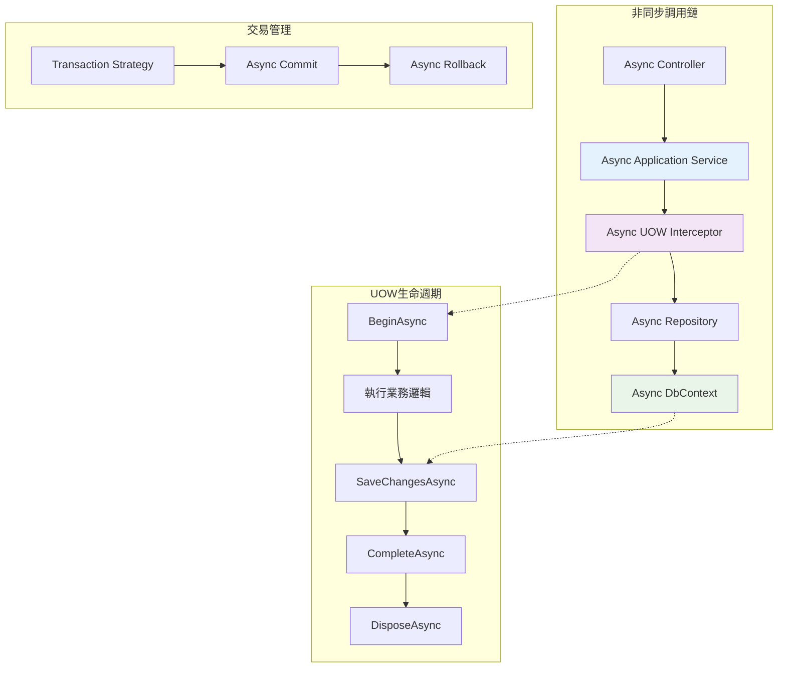

# 15 - 非同步UOW處理

## 🚀 非同步UOW概述

非同步程式設計是現代.NET應用程式的核心特性，ASP.NET Boilerplate的UOW系統全面支援非同步操作，提供了完整的`async/await`模式整合。非同步UOW不僅提升了應用程式的效能和可擴展性，還確保了在高併發環境下的資源有效利用。

### 非同步UOW架構層次



## 🔄 非同步UOW核心接口

### IUnitOfWork非同步方法

```csharp
public interface IUnitOfWork : IActiveUnitOfWork, IUnitOfWorkCompleteHandle
{
    // 同步方法
    void SaveChanges();
    void Complete();
    
    // 非同步對應方法
    Task SaveChangesAsync();
    Task CompleteAsync();
}

public interface IUnitOfWorkCompleteHandle : IDisposable
{
    void Complete();
    Task CompleteAsync(); // 非同步完成
}

public interface IActiveUnitOfWork
{
    void SaveChanges();
    Task SaveChangesAsync(); // 非同步儲存
}
```

### UnitOfWorkBase非同步實作

```csharp
public abstract class UnitOfWorkBase : IUnitOfWork
{
    public async Task CompleteAsync()
    {
        PreventMultipleComplete();
        try
        {
            await CompleteUowAsync();
            _succeed = true;
            OnCompleted();
        }
        catch (Exception ex)
        {
            _exception = ex;
            throw;
        }
    }

    public async Task SaveChangesAsync()
    {
        if (IsDisposed)
        {
            throw new ObjectDisposedException(null, "此UOW已被釋放");
        }

        await SaveChangesInternalAsync();
    }

    // 由子類實作的抽象方法
    protected abstract Task CompleteUowAsync();
    protected abstract Task SaveChangesInternalAsync();
}
```

## 🎯 EF Core非同步UOW實作

### EfCoreUnitOfWork非同步操作

```csharp
public class EfCoreUnitOfWork : UnitOfWorkBase, ITransientDependency
{
    public override async Task SaveChangesAsync()
    {
        foreach (var dbContext in GetAllActiveDbContexts())
        {
            await SaveChangesInDbContextAsync(dbContext);
        }
    }

    protected override async Task CompleteUowAsync()
    {
        await SaveChangesAsync();
        CommitTransaction();
    }

    protected virtual Task SaveChangesInDbContextAsync(DbContext dbContext)
    {
        return dbContext.SaveChangesAsync();
    }

    public virtual async Task<TDbContext> GetOrCreateDbContextAsync<TDbContext>(
        MultiTenancySides? multiTenancySide = null, 
        string name = null)
        where TDbContext : DbContext
    {
        var concreteDbContextType = _dbContextTypeMatcher.GetConcreteType(typeof(TDbContext));

        var connectionStringResolveArgs = new ConnectionStringResolveArgs(multiTenancySide)
        {
            ["DbContextType"] = typeof(TDbContext),
            ["DbContextConcreteType"] = concreteDbContextType
        };

        var connectionString = await ResolveConnectionStringAsync(connectionStringResolveArgs);

        var dbContextKey = concreteDbContextType.FullName + "#" + connectionString;
        if (name != null)
        {
            dbContextKey += "#" + name;
        }

        if (ActiveDbContexts.TryGetValue(dbContextKey, out var dbContext))
        {
            return (TDbContext)dbContext;
        }

        if (Options.IsTransactional == true)
        {
            dbContext = await _transactionStrategy
                .CreateDbContextAsync<TDbContext>(connectionString, _dbContextResolver);
        }
        else
        {
            dbContext = _dbContextResolver.Resolve<TDbContext>(connectionString);
        }

        ActiveDbContexts[dbContextKey] = dbContext;
        return (TDbContext)dbContext;
    }
}
```

## 🔧 非同步攔截器實作

### UnitOfWorkInterceptor非同步處理

```csharp
internal class UnitOfWorkInterceptor : AbpInterceptorBase, ITransientDependency
{
    protected override async Task InternalInterceptAsynchronous(IInvocation invocation)
    {
        var proceedInfo = invocation.CaptureProceedInfo();
        var method = GetMethodInfo(invocation);
        var unitOfWorkAttr = _unitOfWorkOptions.GetUnitOfWorkAttributeOrNull(method);

        if (unitOfWorkAttr == null || unitOfWorkAttr.IsDisabled)
        {
            proceedInfo.Invoke();
            var task = (Task)invocation.ReturnValue;
            await task;
            return;
        }

        using (var uow = _unitOfWorkManager.Begin(unitOfWorkAttr.CreateOptions()))
        {
            proceedInfo.Invoke();
            var task = (Task)invocation.ReturnValue;
            await task;
            await uow.CompleteAsync(); // 非同步完成UOW
        }
    }

    protected override async Task<TResult> InternalInterceptAsynchronous<TResult>(IInvocation invocation)
    {
        var proceedInfo = invocation.CaptureProceedInfo();
        var method = GetMethodInfo(invocation);
        var unitOfWorkAttr = _unitOfWorkOptions.GetUnitOfWorkAttributeOrNull(method);

        if (unitOfWorkAttr == null || unitOfWorkAttr.IsDisabled)
        {
            proceedInfo.Invoke();
            var taskResult = (Task<TResult>)invocation.ReturnValue;
            return await taskResult;
        }

        using (var uow = _unitOfWorkManager.Begin(unitOfWorkAttr.CreateOptions()))
        {
            proceedInfo.Invoke();
            var taskResult = (Task<TResult>)invocation.ReturnValue;
            var result = await taskResult;
            await uow.CompleteAsync(); // 非同步完成UOW
            return result;
        }
    }
}
```

## 💼 Application Service非同步範例

### 基本非同步操作

```csharp
public class ProductAppService : ApplicationService, IProductAppService
{
    private readonly IRepository<Product> _productRepository;
    private readonly IRepository<Category> _categoryRepository;

    public async Task<ProductDto> CreateAsync(CreateProductInput input)
    {
        // 非同步驗證分類存在
        var category = await _categoryRepository.GetAsync(input.CategoryId);
        
        // 建立產品實體
        var product = new Product
        {
            Name = input.Name,
            Description = input.Description,
            Price = input.Price,
            CategoryId = category.Id
        };

        // 非同步插入
        await _productRepository.InsertAsync(product);
        
        // UOW會非同步完成，自動調用SaveChangesAsync
        return ObjectMapper.Map<ProductDto>(product);
    }

    public async Task<PagedResultDto<ProductDto>> GetAllAsync(GetProductsInput input)
    {
        var query = _productRepository.GetAll()
            .Include(p => p.Category)
            .WhereIf(!input.Filter.IsNullOrEmpty(), 
                p => p.Name.Contains(input.Filter));

        // 非同步計算總數
        var totalCount = await AsyncQueryableExecuter.CountAsync(query);

        // 非同步取得分頁資料
        var products = await AsyncQueryableExecuter.ToListAsync(
            query.OrderBy(input.Sorting ?? "Name")
                 .PageBy(input));

        return new PagedResultDto<ProductDto>(
            totalCount,
            ObjectMapper.Map<List<ProductDto>>(products));
    }
}
```

### 複雜非同步業務流程

```csharp
public class OrderAppService : ApplicationService, IOrderAppService
{
    private readonly IRepository<Order> _orderRepository;
    private readonly IRepository<Product> _productRepository;
    private readonly IRepository<Customer> _customerRepository;
    private readonly IEmailSender _emailSender;

    public async Task<OrderDto> CreateOrderAsync(CreateOrderInput input)
    {
        // 並行驗證客戶和產品
        var customerTask = _customerRepository.GetAsync(input.CustomerId);
        var productTasks = input.OrderItems.Select(item => 
            _productRepository.GetAsync(item.ProductId)).ToArray();

        // 等待所有驗證完成
        await Task.WhenAll(customerTask);
        await Task.WhenAll(productTasks);

        var customer = await customerTask;
        var products = await Task.WhenAll(productTasks);

        // 建立訂單
        var order = new Order
        {
            CustomerId = customer.Id,
            OrderDate = Clock.Now,
            Status = OrderStatus.Pending
        };

        // 處理訂單項目
        for (int i = 0; i < input.OrderItems.Count; i++)
        {
            var itemInput = input.OrderItems[i];
            var product = products[i];

            // 檢查庫存
            if (product.Stock < itemInput.Quantity)
            {
                throw new UserFriendlyException(
                    $"產品 {product.Name} 庫存不足");
            }

            var orderItem = new OrderItem
            {
                ProductId = product.Id,
                Quantity = itemInput.Quantity,
                UnitPrice = product.Price
            };

            order.OrderItems.Add(orderItem);
            
            // 更新庫存
            product.Stock -= itemInput.Quantity;
        }

        // 計算總金額
        order.TotalAmount = order.OrderItems.Sum(oi => oi.Quantity * oi.UnitPrice);

        // 非同步儲存
        await _orderRepository.InsertAsync(order);

        // 非同步發送確認郵件（不阻塞主流程）
        _ = Task.Run(async () =>
        {
            try
            {
                await _emailSender.SendOrderConfirmationAsync(customer.Email, order);
            }
            catch (Exception ex)
            {
                Logger.Error("發送訂單確認郵件失敗", ex);
            }
        });

        return ObjectMapper.Map<OrderDto>(order);
    }
}
```

## 🔄 UnitOfWorkManager非同步擴展

### 非同步擴展方法

```csharp
public static class UnitOfWorkManagerExtensions
{
    public static async Task WithUnitOfWorkAsync(
        this IUnitOfWorkManager manager,
        Func<Task> action,
        UnitOfWorkOptions options = null)
    {
        using (var uow = manager.Begin(options ?? new UnitOfWorkOptions()))
        {
            await action();
            await uow.CompleteAsync();
        }
    }

    public static async Task<TResult> WithUnitOfWorkAsync<TResult>(
        this IUnitOfWorkManager manager,
        Func<Task<TResult>> action,
        UnitOfWorkOptions options = null)
    {
        TResult result;

        using (var uow = manager.Begin(options ?? new UnitOfWorkOptions()))
        {
            result = await action();
            await uow.CompleteAsync();
        }

        return result;
    }
}
```

### 實際使用範例

```csharp
public class DataMigrationAppService : ApplicationService
{
    private readonly IUnitOfWorkManager _unitOfWorkManager;
    private readonly IRepository<Customer> _customerRepository;

    [UnitOfWork(IsDisabled = true)] // 停用自動UOW
    public async Task MigrateCustomerDataAsync(MigrateDataInput input)
    {
        const int batchSize = 1000;
        var processedCount = 0;

        foreach (var customerBatch in input.Customers.Batch(batchSize))
        {
            await _unitOfWorkManager.WithUnitOfWorkAsync(async () =>
            {
                foreach (var customerData in customerBatch)
                {
                    var customer = new Customer
                    {
                        Name = customerData.Name,
                        Email = customerData.Email,
                        Phone = customerData.Phone
                    };

                    await _customerRepository.InsertAsync(customer);
                }

                processedCount += customerBatch.Count();
                Logger.Info($"已處理 {processedCount} 筆客戶資料");
            });
        }
    }
}
```

## 🔄 非同步Repository操作

### Repository非同步方法

```csharp
public class ProductRepository : EfCoreRepositoryBase<MyDbContext, Product>, IProductRepository
{
    public async Task<List<Product>> GetTopSellingProductsAsync(int count)
    {
        var dbContext = await GetDbContextAsync();
        return await dbContext.Products
            .Include(p => p.Category)
            .OrderByDescending(p => p.SalesCount)
            .Take(count)
            .ToListAsync();
    }

    public async Task<Product> GetWithAllDetailsAsync(int productId)
    {
        return await GetAll()
            .Include(p => p.Category)
            .Include(p => p.OrderItems)
            .ThenInclude(oi => oi.Order)
            .FirstOrDefaultAsync(p => p.Id == productId);
    }

    public async Task<bool> IsNameExistsAsync(string name, int? excludeId = null)
    {
        var query = GetAll().Where(p => p.Name == name);
        
        if (excludeId.HasValue)
        {
            query = query.Where(p => p.Id != excludeId);
        }

        return await AsyncQueryableExecuter.AnyAsync(query);
    }

    public async Task BulkUpdatePricesAsync(Dictionary<int, decimal> priceUpdates)
    {
        var dbContext = await GetDbContextAsync();
        
        var productIds = priceUpdates.Keys.ToList();
        var products = await dbContext.Products
            .Where(p => productIds.Contains(p.Id))
            .ToListAsync();

        foreach (var product in products)
        {
            if (priceUpdates.TryGetValue(product.Id, out var newPrice))
            {
                product.Price = newPrice;
            }
        }

        // DbContext會在UOW完成時自動SaveChangesAsync
    }
}
```

## ⚡ 效能最佳化技巧

### 並行處理最佳化

```csharp
public class AnalyticsAppService : ApplicationService
{
    private readonly IRepository<Order> _orderRepository;
    private readonly IRepository<Product> _productRepository;
    private readonly IRepository<Customer> _customerRepository;

    public async Task<DashboardDto> GetDashboardDataAsync(GetDashboardInput input)
    {
        // 並行執行多個查詢
        var tasks = new[]
        {
            GetOrderStatsAsync(input.DateRange),
            GetProductStatsAsync(input.DateRange),
            GetCustomerStatsAsync(input.DateRange),
            GetRevenueStatsAsync(input.DateRange)
        };

        await Task.WhenAll(tasks);

        return new DashboardDto
        {
            OrderStats = await tasks[0],
            ProductStats = await tasks[1],
            CustomerStats = await tasks[2],
            RevenueStats = await tasks[3]
        };
    }

    private async Task<OrderStatsDto> GetOrderStatsAsync(DateRange dateRange)
    {
        var query = _orderRepository.GetAll()
            .Where(o => o.CreationTime >= dateRange.StartDate && 
                       o.CreationTime <= dateRange.EndDate);

        var totalOrders = await AsyncQueryableExecuter.CountAsync(query);
        var completedOrders = await AsyncQueryableExecuter.CountAsync(
            query.Where(o => o.Status == OrderStatus.Completed));

        return new OrderStatsDto
        {
            TotalOrders = totalOrders,
            CompletedOrders = completedOrders,
            CompletionRate = totalOrders > 0 ? (double)completedOrders / totalOrders : 0
        };
    }
}
```

### 串流處理大量資料

```csharp
public class ReportAppService : ApplicationService
{
    private readonly IRepository<SalesData> _salesRepository;

    [UnitOfWork(isTransactional: false)]
    public async IAsyncEnumerable<SalesReportItemDto> GetSalesReportStreamAsync(
        GetSalesReportInput input,
        [EnumeratorCancellation] CancellationToken cancellationToken = default)
    {
        const int batchSize = 1000;
        var skip = 0;

        while (!cancellationToken.IsCancellationRequested)
        {
            var batch = await _salesRepository.GetAll()
                .Where(s => s.Date >= input.FromDate && s.Date <= input.ToDate)
                .OrderBy(s => s.Date)
                .Skip(skip)
                .Take(batchSize)
                .ToListAsync(cancellationToken);

            if (batch.Count == 0)
                break;

            foreach (var item in batch)
            {
                yield return new SalesReportItemDto
                {
                    Date = item.Date,
                    Amount = item.Amount,
                    ProductName = item.ProductName
                };
            }

            skip += batchSize;
        }
    }
}
```

## 🚨 非同步錯誤處理

### 例外處理最佳實務

```csharp
public class PaymentAppService : ApplicationService
{
    private readonly IRepository<Payment> _paymentRepository;
    private readonly IPaymentGateway _paymentGateway;

    public async Task<PaymentResultDto> ProcessPaymentAsync(ProcessPaymentInput input)
    {
        Payment payment = null;
        
        try
        {
            // 建立支付記錄
            payment = new Payment
            {
                Amount = input.Amount,
                Currency = input.Currency,
                Status = PaymentStatus.Processing,
                GatewayTransactionId = Guid.NewGuid().ToString()
            };

            await _paymentRepository.InsertAsync(payment);

            // 調用外部支付服務
            var gatewayResult = await _paymentGateway.ProcessPaymentAsync(new GatewayPaymentRequest
            {
                Amount = payment.Amount,
                Currency = payment.Currency,
                TransactionId = payment.GatewayTransactionId
            });

            // 更新支付狀態
            payment.Status = gatewayResult.IsSuccess 
                ? PaymentStatus.Completed 
                : PaymentStatus.Failed;
            payment.GatewayResponseCode = gatewayResult.ResponseCode;
            payment.GatewayResponseMessage = gatewayResult.ResponseMessage;

            await _paymentRepository.UpdateAsync(payment);

            return new PaymentResultDto
            {
                IsSuccess = gatewayResult.IsSuccess,
                PaymentId = payment.Id,
                TransactionId = payment.GatewayTransactionId
            };
        }
        catch (PaymentGatewayException ex)
        {
            // 處理支付閘道例外
            Logger.Error($"支付閘道錯誤: {ex.Message}", ex);
            
            if (payment != null)
            {
                payment.Status = PaymentStatus.Failed;
                payment.GatewayResponseMessage = ex.Message;
                await _paymentRepository.UpdateAsync(payment);
            }

            return new PaymentResultDto
            {
                IsSuccess = false,
                ErrorMessage = "支付處理失敗，請稍後再試"
            };
        }
        catch (Exception ex)
        {
            // 一般例外處理
            Logger.Error($"處理支付時發生未預期錯誤: {ex.Message}", ex);
            throw new UserFriendlyException("系統暫時無法處理支付，請稍後再試");
        }
    }
}
```

### 取消令牌支援

```csharp
public class DataExportAppService : ApplicationService
{
    private readonly IRepository<ExportData> _dataRepository;

    public async Task<ExportResultDto> ExportDataAsync(
        ExportDataInput input, 
        CancellationToken cancellationToken = default)
    {
        const int batchSize = 10000;
        var exportedCount = 0;
        var exportFile = new StringBuilder();

        try
        {
            var totalCount = await _dataRepository.CountAsync(
                d => d.CreationTime >= input.FromDate && 
                     d.CreationTime <= input.ToDate);

            for (int skip = 0; skip < totalCount; skip += batchSize)
            {
                // 檢查取消令牌
                cancellationToken.ThrowIfCancellationRequested();

                var batch = await _dataRepository.GetAll()
                    .Where(d => d.CreationTime >= input.FromDate && 
                               d.CreationTime <= input.ToDate)
                    .OrderBy(d => d.CreationTime)
                    .Skip(skip)
                    .Take(batchSize)
                    .ToListAsync(cancellationToken);

                foreach (var item in batch)
                {
                    exportFile.AppendLine($"{item.Id},{item.Name},{item.Value}");
                    exportedCount++;
                }

                // 定期報告進度
                if (exportedCount % (batchSize * 5) == 0)
                {
                    Logger.Info($"已匯出 {exportedCount}/{totalCount} 筆資料");
                }
            }

            return new ExportResultDto
            {
                IsSuccess = true,
                ExportedCount = exportedCount,
                Data = exportFile.ToString()
            };
        }
        catch (OperationCanceledException)
        {
            Logger.Info($"資料匯出被取消，已匯出 {exportedCount} 筆資料");
            throw;
        }
    }
}
```

非同步UOW處理為ASP.NET Boilerplate應用程式提供了卓越的效能和可擴展性，在保持資料一致性的同時實現了高吞吐量的資料處理能力。
