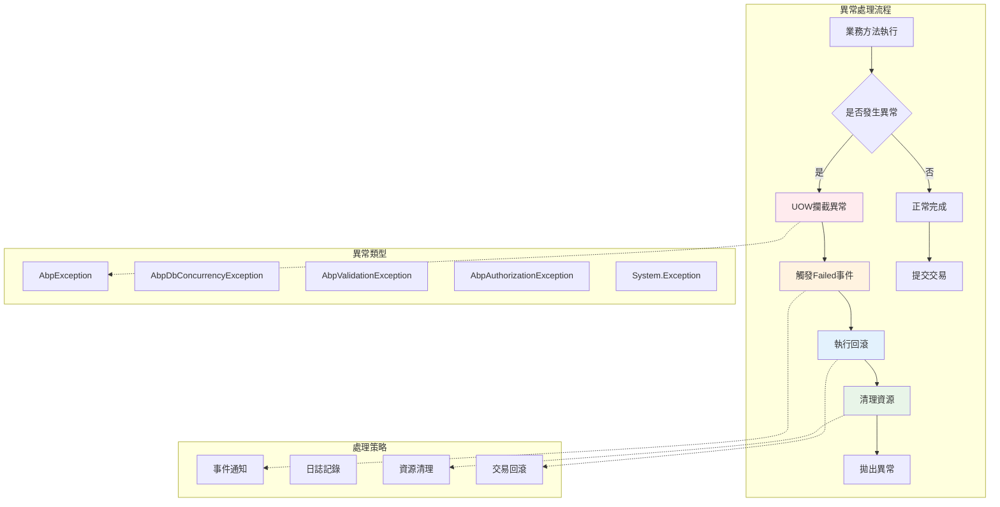
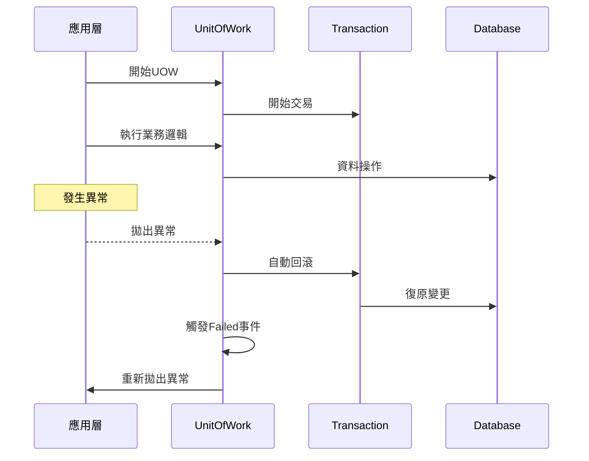

# 16 - 異常處理機制

## 🛡️ UOW異常處理概述

ASP.NET Boilerplate的UOW系統提供了完整的異常處理機制，確保在發生錯誤時能夠正確地回滾交易、清理資源並提供適當的錯誤資訊。異常處理是UOW模式中至關重要的一環，直接影響資料的一致性和系統的穩定性。

### 異常處理架構



## 🔍 核心異常類型

### 1. AbpException基礎異常

```csharp
namespace Abp
{
    /// <summary>
    /// Base exception type for those are thrown by Abp system for Abp specific exceptions.
    /// </summary>
    [Serializable]
    public class AbpException : Exception
    {
        public AbpException()
        {
        }

        public AbpException(SerializationInfo serializationInfo, StreamingContext context)
            : base(serializationInfo, context)
        {
        }

        public AbpException(string message)
            : base(message)
        {
        }

        public AbpException(string message, Exception innerException)
            : base(message, innerException)
        {
        }
    }
}
```

### 2. UOW相關專用異常

#### AbpDbConcurrencyException

```csharp
namespace Abp.Domain.Uow
{
    /// <summary>
    /// Database concurrency exception for UOW
    /// </summary>
    [Serializable]
    public class AbpDbConcurrencyException : AbpException
    {
        public AbpDbConcurrencyException()
        {
        }

        public AbpDbConcurrencyException(string message)
            : base(message)
        {
        }

        public AbpDbConcurrencyException(string message, Exception innerException)
            : base(message, innerException)
        {
        }
    }
}
```

#### 併發異常處理實例

```csharp
// EF Core併發異常處理器
public class EfCoreOpenIddictDbConcurrencyExceptionHandler 
    : IOpenIddictDbConcurrencyExceptionHandler, ITransientDependency
{
    public virtual Task HandleAsync(AbpDbConcurrencyException exception)
    {
        if (exception?.InnerException is DbUpdateConcurrencyException updateConcurrencyException)
        {
            foreach (var entry in updateConcurrencyException.Entries)
            {
                // 重置實體狀態以防止後續SaveChangesAsync()調用失敗
                entry.State = EntityState.Unchanged;
            }
        }

        return Task.CompletedTask;
    }
}
```

## 🎯 UOW失敗事件機制

### UnitOfWorkFailedEventArgs

```csharp
namespace Abp.Domain.Uow
{
    /// <summary>
    /// Used as event arguments on <see cref="IActiveUnitOfWork.Failed"/> event.
    /// </summary>
    public class UnitOfWorkFailedEventArgs : EventArgs
    {
        /// <summary>
        /// Exception that caused failure.
        /// </summary>
        public Exception Exception { get; private set; }

        public UnitOfWorkFailedEventArgs(Exception exception)
        {
            Exception = exception;
        }
    }
}
```

### UOW基礎類別中的異常處理

```csharp
public abstract class UnitOfWorkBase : IUnitOfWork
{
    // 異常處理相關屬性
    private bool _succeed;
    private Exception _exception;

    /// <summary>
    /// Called to trigger <see cref="Failed"/> event.
    /// </summary>
    protected virtual void OnFailed(Exception exception)
    {
        Failed.InvokeSafely(this, new UnitOfWorkFailedEventArgs(exception));
    }

    protected virtual void OnCompleted()
    {
        Completed.InvokeSafely(this);
    }

    protected virtual void OnDisposed()
    {
        Disposed.InvokeSafely(this);
    }
}
```

## 🔄 交易回滾機制

### 自動回滾處理



### NHibernate UOW的異常處理

```csharp
public class NhUnitOfWork : UnitOfWorkBase, ITransientDependency
{
    private ITransaction _transaction;

    protected override void CompleteUow()
    {
        SaveChanges();
        if (_transaction != null)
        {
            _transaction.Commit();
        }
    }

    protected override async Task CompleteUowAsync()
    {
        await SaveChangesAsync();
        if (_transaction != null)
        {
            await _transaction.CommitAsync();
        }
    }

    /// <summary>
    /// Rollbacks transaction and closes database connection.
    /// </summary>
    protected override void DisposeUow()
    {
        if (_transaction != null)
        {
            _transaction.Dispose(); // 自動回滾
            _transaction = null;
        }

        Session.Dispose();
    }
}
```

## 🚨 異常處理最佳實務

### 1. 內部UOW完成處理

```csharp
internal class InnerUnitOfWorkCompleteHandle : IUnitOfWorkCompleteHandle
{
    public const string DidNotCallCompleteMethodExceptionMessage = 
        "Did not call Complete method of a unit of work.";

    private volatile bool _isCompleteCalled;
    private volatile bool _isDisposed;

    public void Dispose()
    {
        if (_isDisposed)
        {
            return;
        }

        _isDisposed = true;

        if (!_isCompleteCalled)
        {
            if (HasException())
            {
                return; // 如果已有異常，不拋出新的異常
            }

            throw new AbpException(DidNotCallCompleteMethodExceptionMessage);
        }
    }

    private static bool HasException()
    {
        try
        {
            return Marshal.GetExceptionCode() != 0;
        }
        catch (Exception)
        {
            return false;
        }
    }
}
```

### 2. 異常處理實際範例

```csharp
public class BlogService : ApplicationService
{
    private readonly IRepository<Blog> _blogRepository;

    public async Task CreateBlogAsync(CreateBlogInput input)
    {
        try
        {
            using (var uow = UnitOfWorkManager.Begin())
            {
                var blog = new Blog(input.Name, input.Url);
                
                // 可能引發驗證異常
                await _blogRepository.InsertAsync(blog);
                
                // 可能引發業務邏輯異常
                if (await _blogRepository.CountAsync() > 1000)
                {
                    throw new UserFriendlyException("部落格數量已達上限！");
                }

                await uow.CompleteAsync();
            }
        }
        catch (AbpValidationException ex)
        {
            Logger.Warn("驗證失敗", ex);
            throw; // 重新拋出，讓框架處理
        }
        catch (UserFriendlyException ex)
        {
            Logger.Info("使用者友善錯誤", ex);
            throw; // 重新拋出，顯示給使用者
        }
        catch (Exception ex)
        {
            Logger.Error("建立部落格時發生未預期錯誤", ex);
            throw new AbpException("建立部落格失敗", ex);
        }
    }
}
```

## 📊 異常處理測試

### 交易回滾測試

```csharp
[Fact]
public async Task Should_Rollback_Transaction_On_Failure()
{
    const string exceptionMessage = "This is a test exception!";
    var blogName = Guid.NewGuid().ToString("N");

    try
    {
        using (var uow = _uowManager.Begin())
        {
            await _blogRepository.InsertAsync(
                new Blog(blogName, $"http://{blogName}.com/")
            );

            throw new Exception(exceptionMessage); // 強制回滾

            // 無法到達的程式碼
            // await uow.CompleteAsync();
        }
    }
    catch (Exception ex) when (ex.Message == exceptionMessage)
    {
        // 預期的異常
    }

    // 驗證回滾成功
    var blog = await _blogRepository.FirstOrDefaultAsync(x => x.Name == blogName);
    blog.ShouldBeNull();
}
```

### 併發異常測試

```csharp
[Fact]
public async Task Should_Handle_Concurrency_Exception()
{
    var blog = await _blogRepository.InsertAsync(new Blog("Test", "http://test.com"));
    
    // 模擬兩個同時修改
    var blog1 = await _blogRepository.GetAsync(blog.Id);
    var blog2 = await _blogRepository.GetAsync(blog.Id);
    
    blog1.Name = "Modified by User 1";
    blog2.Name = "Modified by User 2";
    
    await _blogRepository.UpdateAsync(blog1);
    
    // 第二個更新應該引發併發異常
    await Assert.ThrowsAsync<AbpDbConcurrencyException>(() => 
        _blogRepository.UpdateAsync(blog2));
}
```

## 🔧 框架級異常處理

### ASP.NET Core異常過濾器

```csharp
public class AbpExceptionFilter : IExceptionFilter, ITransientDependency
{
    private readonly IErrorInfoBuilder _errorInfoBuilder;
    public ILogger Logger { get; set; }
    public IEventBus EventBus { get; set; }

    public void OnException(ExceptionContext context)
    {
        if (!context.ActionDescriptor.IsControllerAction())
        {
            return;
        }

        var wrapResultAttribute = ReflectionHelper.GetSingleAttributeOfMemberOrDeclaringTypeOrDefault(
            context.ActionDescriptor.GetMethodInfo(),
            _configuration.DefaultWrapResultAttribute
        );

        if (wrapResultAttribute.LogError)
        {
            LogHelper.LogException(Logger, context.Exception);
        }

        HandleAndWrapException(context, wrapResultAttribute);
    }

    private void HandleError(ExceptionContext context)
    {
        context.Result = new ObjectResult(
            new AjaxResponse(
                _errorInfoBuilder.BuildForException(context.Exception),
                context.Exception is AbpAuthorizationException
            )
        );

        EventBus.Trigger(this, new AbpHandledExceptionData(context.Exception));
        context.Exception = null; // 標記為已處理
    }
}
```

## 📝 異常處理指導原則

### 1. 異常分類處理

```csharp
public class ExceptionHandlingService
{
    public void HandleException(Exception exception)
    {
        switch (exception)
        {
            case AbpValidationException validationEx:
                // 驗證異常：顯示詳細驗證資訊
                HandleValidationException(validationEx);
                break;
                
            case AbpAuthorizationException authEx:
                // 授權異常：記錄安全事件
                HandleAuthorizationException(authEx);
                break;
                
            case AbpDbConcurrencyException concurrencyEx:
                // 併發異常：提供重試機制
                HandleConcurrencyException(concurrencyEx);
                break;
                
            case UserFriendlyException friendlyEx:
                // 使用者友善異常：直接顯示訊息
                HandleUserFriendlyException(friendlyEx);
                break;
                
            default:
                // 系統異常：記錄詳細錯誤資訊
                HandleSystemException(exception);
                break;
        }
    }
}
```

### 2. UOW管理器中的異常處理

```csharp
public class UnitOfWorkManager : IUnitOfWorkManager
{
    public IUnitOfWorkCompleteHandle Begin(UnitOfWorkOptions options)
    {
        var uow = _iocResolver.Resolve<IUnitOfWork>();

        uow.Failed += (sender, args) =>
        {
            _currentUnitOfWorkProvider.Current = null;
            Logger.Error("UOW執行失敗", args.Exception);
        };

        uow.Disposed += (sender, args) =>
        {
            _iocResolver.Release(uow);
        };

        try
        {
            uow.Begin(options);
            _currentUnitOfWorkProvider.Current = uow;
            return uow;
        }
        catch
        {
            _iocResolver.Release(uow);
            throw;
        }
    }
}
```

## 🎭 異常處理事件

### AbpHandledExceptionData事件

```csharp
namespace Abp.Events.Bus.Exceptions
{
    /// <summary>
    /// This type of events are used to notify for exceptions handled by ABP infrastructure.
    /// </summary>
    public class AbpHandledExceptionData : ExceptionData
    {
        public AbpHandledExceptionData(Exception exception)
            : base(exception)
        {
        }
    }
}
```

### 自訂異常處理器

```csharp
public class CustomExceptionHandler : IEventHandler<AbpHandledExceptionData>, ITransientDependency
{
    public void HandleEvent(AbpHandledExceptionData eventData)
    {
        var exception = eventData.Exception;
        
        // 記錄異常詳情
        Logger.Error("處理異常", exception);
        
        // 發送通知（如有需要）
        if (exception is CriticalSystemException)
        {
            NotifyAdministrators(exception);
        }
        
        // 更新異常統計
        UpdateExceptionMetrics(exception);
    }
}
```

## 🔍 異常處理偵錯技巧

### 1. 使用結構化日誌

```csharp
public class StructuredLoggingService
{
    public void LogUowException(Exception exception, string uowId, string operationType)
    {
        Logger.Error("UOW異常 {UowId} {OperationType} {ExceptionType} {Message}", 
            uowId, operationType, exception.GetType().Name, exception.Message);
            
        if (exception.InnerException != null)
        {
            Logger.Error("內部異常: {InnerExceptionType} {InnerMessage}", 
                exception.InnerException.GetType().Name, exception.InnerException.Message);
        }
    }
}
```

### 2. 異常追蹤標識

```csharp
public class UowExceptionTracker
{
    private readonly AsyncLocal<string> _correlationId = new AsyncLocal<string>();
    
    public void BeginTracking()
    {
        _correlationId.Value = Guid.NewGuid().ToString();
    }
    
    public void TrackException(Exception exception)
    {
        var properties = new Dictionary<string, object>
        {
            ["CorrelationId"] = _correlationId.Value,
            ["ExceptionType"] = exception.GetType().FullName,
            ["StackTrace"] = exception.StackTrace,
            ["Timestamp"] = DateTime.UtcNow
        };
        
        Logger.Error(exception, "UOW異常追蹤 {Properties}", properties);
    }
}
```

## 💡 小結

UOW的異常處理機制是確保系統穩定性和資料一致性的關鍵組件。通過適當的異常分類、事件通知、交易回滾和資源清理，框架能夠優雅地處理各種錯誤情況，並提供豐富的偵錯資訊協助開發者快速定位和解決問題。
