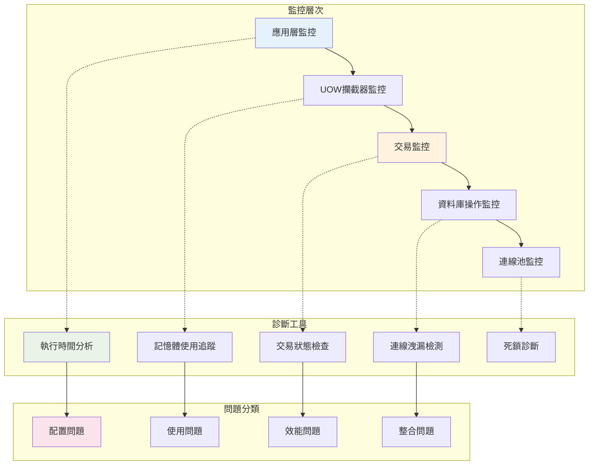
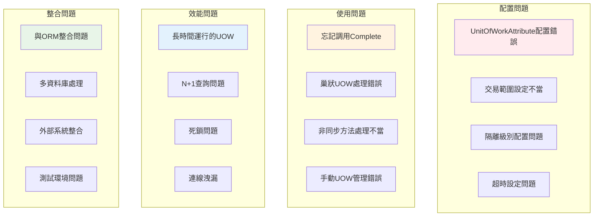

# 17 - 效能監控、除錯與問題排解

## 📊 UOW效能監控與問題診斷概述

UOW系統的效能監控和問題診斷是確保應用程式穩定運行的關鍵環節。本章節提供完整的監控機制、除錯工具以及常見問題的解決方案，幫助開發者快速識別和解決UOW相關的效能瓶頸和運行時問題。

### 監控與診斷架構



## 📊 實用的UOW監控與除錯指南

### 🔧 立即可用的監控解決方案

#### 1. UOW生命週期事件監控

在ASP.NET Boilerplate中，你可以輕鬆監控UOW的生命週期事件：

```csharp
public class UowMonitoringService : ITransientDependency
{
    private readonly ILogger _logger;

    public UowMonitoringService(ILogger<UowMonitoringService> logger)
    {
        _logger = logger;
    }

    public void MonitorUnitOfWork(IActiveUnitOfWork uow)
    {
        var stopwatch = Stopwatch.StartNew();
        
        uow.Completed += (sender, args) =>
        {
            stopwatch.Stop();
            _logger.LogInformation(
                "UOW {Id} completed in {Duration}ms", 
                uow.Id, stopwatch.ElapsedMilliseconds);
        };

        uow.Failed += (sender, args) =>
        {
            stopwatch.Stop();
            _logger.LogError(args.Exception,
                "UOW {Id} failed after {Duration}ms: {ErrorMessage}", 
                uow.Id, stopwatch.ElapsedMilliseconds, args.Exception.Message);
        };

        uow.Disposed += (sender, args) =>
        {
            _logger.LogDebug("UOW {Id} disposed", uow.Id);
        };
    }
}

// 在你的應用服務中使用
public class MonitoredAppService : ApplicationService
{
    private readonly UowMonitoringService _monitoringService;

    public MonitoredAppService(UowMonitoringService monitoringService)
    {
        _monitoringService = monitoringService;
    }

    protected override void OnMethodExecuting(MethodExecutingContext context)
    {
        if (CurrentUnitOfWork != null)
        {
            _monitoringService.MonitorUnitOfWork(CurrentUnitOfWork);
        }
        
        base.OnMethodExecuting(context);
    }
}
```

#### 2. 實時SQL查詢監控

使用Entity Framework的日誌功能監控UOW中的SQL查詢：

```csharp
// 在DbContext中設置
public class DemoDbContext : AbpDbContext<DemoDbContext>
{
    protected override void OnConfiguring(DbContextOptionsBuilder optionsBuilder)
    {
        if (AbpSession.TenantId == null) // 僅在開發環境
        {
            optionsBuilder.LogTo(sql => 
            {
                if (sql.Contains("SELECT") || sql.Contains("INSERT") || 
                    sql.Contains("UPDATE") || sql.Contains("DELETE"))
                {
                    Debug.WriteLine($"[UOW-SQL] {DateTime.Now:HH:mm:ss.fff}: {sql}");
                }
            }, LogLevel.Information);
        }
        
        base.OnConfiguring(optionsBuilder);
    }
}

// 自訂SQL監控攔截器
public class SqlMonitoringInterceptor : DbCommandInterceptor
{
    private readonly ILogger<SqlMonitoringInterceptor> _logger;

    public SqlMonitoringInterceptor(ILogger<SqlMonitoringInterceptor> logger)
    {
        _logger = logger;
    }

    public override ValueTask<InterceptionResult<DbDataReader>> ReaderExecutingAsync(
        DbCommand command, 
        CommandEventData eventData, 
        InterceptionResult<DbDataReader> result,
        CancellationToken cancellationToken = default)
    {
        var stopwatch = Stopwatch.StartNew();
        
        // 記錄查詢開始
        _logger.LogDebug("Executing SQL: {CommandText}", command.CommandText);
        
        return base.ReaderExecutingAsync(command, eventData, result, cancellationToken);
    }

    public override ValueTask<DbDataReader> ReaderExecutedAsync(
        DbCommand command, 
        CommandExecutedEventData eventData, 
        DbDataReader result,
        CancellationToken cancellationToken = default)
    {
        // 記錄查詢完成
        _logger.LogInformation(
            "SQL executed in {Duration}ms: {CommandText}",
            eventData.Duration.TotalMilliseconds,
            command.CommandText.Substring(0, Math.Min(100, command.CommandText.Length)));
            
        return base.ReaderExecutedAsync(command, eventData, result, cancellationToken);
    }
}
```

### 🚨 常見問題快速診斷工具

#### 1. UOW洩漏檢測器

```csharp
public class UowLeakDetector : ITransientDependency
{
    private readonly ConcurrentDictionary<string, DateTime> _activeUows = new();
    private readonly ILogger _logger;
    private readonly Timer _checkTimer;

    public UowLeakDetector(ILogger<UowLeakDetector> logger)
    {
        _logger = logger;
        _checkTimer = new Timer(CheckForLeaks, null, 
            TimeSpan.FromMinutes(1), TimeSpan.FromMinutes(1));
    }

    public void RegisterUow(IActiveUnitOfWork uow)
    {
        _activeUows[uow.Id] = DateTime.UtcNow;
        
        uow.Disposed += (sender, args) =>
        {
            _activeUows.TryRemove(uow.Id, out _);
        };
    }

    private void CheckForLeaks(object state)
    {
        var cutoff = DateTime.UtcNow.AddMinutes(-5); // 5分鐘未釋放視為洩漏
        var leakedUows = _activeUows
            .Where(kvp => kvp.Value < cutoff)
            .ToList();

        foreach (var leak in leakedUows)
        {
            _logger.LogWarning(
                "Potential UOW leak detected: {UowId} active since {StartTime}",
                leak.Key, leak.Value);
        }
    }
}
```

#### 2. 交易死鎖檢測

```csharp
public class DeadlockDetector
{
    public static async Task<bool> IsDeadlockException(Exception ex)
    {
        // SQL Server 死鎖錯誤碼: 1205
        if (ex is SqlException sqlEx && sqlEx.Number == 1205)
        {
            return true;
        }

        // Entity Framework 包裝的死鎖
        if (ex.InnerException is SqlException innerSqlEx && innerSqlEx.Number == 1205)
        {
            return true;
        }

        return false;
    }

    public static async Task<T> ExecuteWithDeadlockRetry<T>(
        Func<Task<T>> operation, 
        int maxRetries = 3,
        TimeSpan delay = default)
    {
        if (delay == default) delay = TimeSpan.FromMilliseconds(100);
        
        for (int attempt = 1; attempt <= maxRetries; attempt++)
        {
            try
            {
                return await operation();
            }
            catch (Exception ex) when (await IsDeadlockException(ex) && attempt < maxRetries)
            {
                await Task.Delay(delay * attempt); // 指數退避
            }
        }

        // 最後一次嘗試不捕獲異常
        return await operation();
    }
}

// 在服務中使用
public class OrderService : ApplicationService
{
    public async Task<OrderDto> CreateOrderAsync(CreateOrderDto input)
    {
        return await DeadlockDetector.ExecuteWithDeadlockRetry(async () =>
        {
            var order = new Order(input);
            await _orderRepository.InsertAsync(order);
            return ObjectMapper.Map<OrderDto>(order);
        });
    }
}
```

### 📊 實際效能指標收集

#### 1. 簡單的效能計數器

```csharp
public class UowPerformanceCounters : ISingletonDependency
{
    private long _totalUows;
    private long _completedUows;
    private long _failedUows;
    private readonly ConcurrentQueue<long> _executionTimes = new();

    public void RecordUowStart()
    {
        Interlocked.Increment(ref _totalUows);
    }

    public void RecordUowCompleted(long executionTimeMs)
    {
        Interlocked.Increment(ref _completedUows);
        _executionTimes.Enqueue(executionTimeMs);
        
        // 保持最近1000筆記錄
        while (_executionTimes.Count > 1000)
        {
            _executionTimes.TryDequeue(out _);
        }
    }

    public void RecordUowFailed()
    {
        Interlocked.Increment(ref _failedUows);
    }

    public PerformanceStatistics GetStatistics()
    {
        var times = _executionTimes.ToArray();
        return new PerformanceStatistics
        {
            TotalUows = _totalUows,
            CompletedUows = _completedUows,
            FailedUows = _failedUows,
            SuccessRate = _totalUows > 0 ? (double)_completedUows / _totalUows * 100 : 0,
            AverageExecutionTime = times.Length > 0 ? times.Average() : 0,
            MaxExecutionTime = times.Length > 0 ? times.Max() : 0,
            MinExecutionTime = times.Length > 0 ? times.Min() : 0
        };
    }
}

public class PerformanceStatistics
{
    public long TotalUows { get; set; }
    public long CompletedUows { get; set; }
    public long FailedUows { get; set; }
    public double SuccessRate { get; set; }
    public double AverageExecutionTime { get; set; }
    public long MaxExecutionTime { get; set; }
    public long MinExecutionTime { get; set; }
}
```

### 🔍 除錯輔助工具

#### 1. UOW狀態檢查器

```csharp
public class UowDiagnostics
{
    public static string GetCurrentUowStatus(IUnitOfWorkManager uowManager)
    {
        var current = uowManager.Current;
        if (current == null)
        {
            return "No active UOW";
        }

        var status = new StringBuilder();
        status.AppendLine($"UOW ID: {current.Id}");
        status.AppendLine($"Is Transactional: {current.Options.IsTransactional}");
        status.AppendLine($"Isolation Level: {current.Options.IsolationLevel}");
        status.AppendLine($"Scope: {current.Options.Scope}");
        
        if (current.Outer != null)
        {
            status.AppendLine($"Has Outer UOW: {current.Outer.Id}");
        }

        status.AppendLine("Active Filters:");
        foreach (var filter in current.Filters.Where(f => f.IsEnabled))
        {
            status.AppendLine($"  - {filter.FilterName}");
        }

        return status.ToString();
    }
}

// 在Controller或Service中使用
[HttpGet("debug/uow-status")]
public string GetUowStatus()
{
    return UowDiagnostics.GetCurrentUowStatus(UnitOfWorkManager);
}
```
        {
            ServiceName = invocation.TargetType.Name,
            MethodName = invocation.Method.Name,
            Parameters = invocation.Arguments,
            ExecutionTime = DateTime.UtcNow,
            UserId = AbpSession.UserId,
            TenantId = AbpSession.TenantId
        };
    }
}
```

### 2. 自訂計時攔截器

```csharp
public class MeasureDurationInterceptor : AbpInterceptorBase, ITransientDependency
{
    public ILogger Logger { get; set; }

    public MeasureDurationInterceptor()
    {
        Logger = NullLogger.Instance;
    }

    public override void InterceptSynchronous(IInvocation invocation)
    {
        // 方法執行前
        var stopwatch = Stopwatch.StartNew();
        
        // 執行實際方法
        invocation.Proceed();
        
        // 方法執行後
        stopwatch.Stop();
        LogExecutionTime(invocation, stopwatch);
    }

    protected override async Task InternalInterceptAsynchronous(IInvocation invocation)
    {
        var proceedInfo = invocation.CaptureProceedInfo();
        var stopwatch = Stopwatch.StartNew();

        proceedInfo.Invoke();
        var task = (Task)invocation.ReturnValue;
        await task;

        stopwatch.Stop();
        LogExecutionTime(invocation, stopwatch);
    }

    protected override async Task<TResult> InternalInterceptAsynchronous<TResult>(IInvocation invocation)
    {
        var proceedInfo = invocation.CaptureProceedInfo();
        var stopwatch = Stopwatch.StartNew();

        proceedInfo.Invoke();
        var taskResult = (Task<TResult>)invocation.ReturnValue;
        var result = await taskResult;

        stopwatch.Stop();
        LogExecutionTime(invocation, stopwatch);
        
        return result;
    }

    private void LogExecutionTime(IInvocation invocation, Stopwatch stopwatch)
    {
        Logger.InfoFormat(
            "MeasureDurationInterceptor: {0} executed in {1} milliseconds.",
            invocation.MethodInvocationTarget.Name,
            stopwatch.Elapsed.TotalMilliseconds.ToString("0.000")
        );
    }
}
```

## 🔍 UOW生命週期監控

### UOW監控擴展

```csharp
public class UowPerformanceMonitor : ITransientDependency
{
    private readonly ILogger _logger;
    private readonly Dictionary<string, UowMetrics> _activeUows;

    public UowPerformanceMonitor(ILogger logger)
    {
        _logger = logger;
        _activeUows = new Dictionary<string, UowMetrics>();
    }

    public void StartMonitoring(IUnitOfWork uow)
    {
        var uowId = GetUowId(uow);
        var metrics = new UowMetrics
        {
            StartTime = DateTime.UtcNow,
            UowId = uowId,
            ThreadId = Thread.CurrentThread.ManagedThreadId
        };

        _activeUows[uowId] = metrics;

        // 註冊事件處理器
        uow.Completed += (sender, args) => OnUowCompleted(uowId);
        uow.Failed += (sender, args) => OnUowFailed(uowId, args.Exception);
        uow.Disposed += (sender, args) => OnUowDisposed(uowId);

        _logger.Debug($"UOW {uowId} 開始監控");
    }

    private void OnUowCompleted(string uowId)
    {
        if (_activeUows.TryGetValue(uowId, out var metrics))
        {
            metrics.EndTime = DateTime.UtcNow;
            metrics.Status = UowStatus.Completed;
            
            var duration = metrics.Duration;
            _logger.Info($"UOW {uowId} 完成，耗時: {duration.TotalMilliseconds:F2}ms");
            
            if (duration.TotalSeconds > 5) // 超過5秒的UOW
            {
                _logger.Warn($"UOW {uowId} 執行時間過長: {duration.TotalSeconds:F2}s");
            }
        }
    }

    private void OnUowFailed(string uowId, Exception exception)
    {
        if (_activeUows.TryGetValue(uowId, out var metrics))
        {
            metrics.EndTime = DateTime.UtcNow;
            metrics.Status = UowStatus.Failed;
            metrics.Exception = exception;
            
            _logger.Error($"UOW {uowId} 失敗，耗時: {metrics.Duration.TotalMilliseconds:F2}ms", exception);
        }
    }

    private void OnUowDisposed(string uowId)
    {
        _activeUows.Remove(uowId);
        _logger.Debug($"UOW {uowId} 監控結束");
    }
}

public class UowMetrics
{
    public string UowId { get; set; }
    public DateTime StartTime { get; set; }
    public DateTime? EndTime { get; set; }
    public UowStatus Status { get; set; }
    public Exception Exception { get; set; }
    public int ThreadId { get; set; }
    
    public TimeSpan Duration => 
        EndTime?.Subtract(StartTime) ?? DateTime.UtcNow.Subtract(StartTime);
}

public enum UowStatus
{
    Active,
    Completed,
    Failed
}
```

## 📈 資料庫效能監控

### 1. 連線監控

```csharp
public class DbConnectionMonitor
{
    private readonly ILogger _logger;
    private readonly ConcurrentDictionary<string, ConnectionMetrics> _connections;

    public DbConnectionMonitor(ILogger logger)
    {
        _logger = logger;
        _connections = new ConcurrentDictionary<string, ConnectionMetrics>();
    }

    public void TrackConnection(IDbConnection connection, string context)
    {
        var connectionId = Guid.NewGuid().ToString();
        var metrics = new ConnectionMetrics
        {
            ConnectionId = connectionId,
            ConnectionString = MaskConnectionString(connection.ConnectionString),
            Context = context,
            OpenTime = DateTime.UtcNow,
            State = connection.State
        };

        _connections[connectionId] = metrics;

        connection.StateChange += (sender, e) =>
        {
            if (_connections.TryGetValue(connectionId, out var m))
            {
                m.State = e.CurrentState;
                if (e.CurrentState == ConnectionState.Closed)
                {
                    m.CloseTime = DateTime.UtcNow;
                    LogConnectionLifetime(m);
                }
            }
        };

        _logger.Debug($"連線 {connectionId} 開始追蹤 - {context}");
    }

    private void LogConnectionLifetime(ConnectionMetrics metrics)
    {
        var lifetime = metrics.CloseTime - metrics.OpenTime;
        if (lifetime.HasValue)
        {
            _logger.Info($"連線 {metrics.ConnectionId} 生命週期: {lifetime.Value.TotalSeconds:F2}s");
            
            if (lifetime.Value.TotalMinutes > 30) // 超過30分鐘的連線
            {
                _logger.Warn($"連線 {metrics.ConnectionId} 持續時間過長: {lifetime.Value.TotalMinutes:F2}分鐘");
            }
        }
    }
}

public class ConnectionMetrics
{
    public string ConnectionId { get; set; }
    public string ConnectionString { get; set; }
    public string Context { get; set; }
    public DateTime OpenTime { get; set; }
    public DateTime? CloseTime { get; set; }
    public ConnectionState State { get; set; }
}
```

## ⚡ 效能最佳實務與考量

### 長時間運行UOW的效能影響

長時間運行的UOW會對系統效能造成嚴重影響，主要問題包括：

#### 1. 連線池耗盡問題

```csharp
// ❌ 錯誤：長時間佔用連線
[UnitOfWork]
public async Task ProcessLargeDataSet()
{
    // 這個UOW可能運行數小時，佔用連線池中的連線
    var items = await _repository.GetAllListAsync(); // 可能數十萬筆
    
    foreach (var item in items)
    {
        await ProcessComplexBusinessLogic(item); // 耗時操作
        await Task.Delay(1000); // 模擬外部API調用
    }
    
    // 連線一直被佔用直到所有處理完成
}

// ✅ 正確：分批處理，及時釋放連線
[UnitOfWork(IsDisabled = true)]
public async Task ProcessLargeDataSetOptimized()
{
    const int batchSize = 100;
    var totalCount = await _repository.CountAsync();
    
    for (int skip = 0; skip < totalCount; skip += batchSize)
    {
        // 每個批次使用獨立的UOW，及時釋放連線
        using (var uow = _unitOfWorkManager.Begin())
        {
            var batch = await _repository.GetAll()
                .OrderBy(x => x.Id) // 確保順序一致
                .Skip(skip)
                .Take(batchSize)
                .ToListAsync();
                
            foreach (var item in batch)
            {
                await ProcessComplexBusinessLogic(item);
            }
            
            await uow.CompleteAsync();
        }
        
        // 批次間暫停，釋放系統資源
        await Task.Delay(100);
        GC.Collect(); // 可選：強制垃圾回收
    }
}
```

#### 2. 記憶體洩漏與實體追蹤問題

```csharp
// 監控實體追蹤數量
public class EntityTrackingMonitor
{
    public void MonitorDbContext(DbContext context)
    {
        var trackedEntities = context.ChangeTracker.Entries().Count();
        
        if (trackedEntities > 10000) // 閾值檢查
        {
            Logger.Warn($"DbContext追蹤實體數量過多: {trackedEntities}");
            
            // 分析追蹤的實體類型
            var entityGroups = context.ChangeTracker.Entries()
                .GroupBy(e => e.Entity.GetType().Name)
                .Select(g => new { Type = g.Key, Count = g.Count() })
                .OrderByDescending(x => x.Count);
                
            foreach (var group in entityGroups.Take(10))
            {
                Logger.Info($"實體類型: {group.Type}, 數量: {group.Count}");
            }
        }
    }
    
    // 清理未必要的實體追蹤
    public void CleanupTracking(DbContext context, TimeSpan maxAge)
    {
        var cutoffTime = DateTime.Now.Subtract(maxAge);
        var stalEntries = context.ChangeTracker.Entries()
            .Where(e => e.Property("LastModified")?.CurrentValue is DateTime lastModified 
                       && lastModified < cutoffTime)
            .ToList();
            
        foreach (var entry in stalEntries)
        {
            entry.State = EntityState.Detached; // 停止追蹤
        }
        
        Logger.Info($"清理 {stalEntries.Count} 個過期的實體追蹤");
    }
}
```

### 連線池最佳實務

#### 1. 連線池配置優化

```csharp
// 在 appsettings.json 中配置連線池
{
  "ConnectionStrings": {
    "Default": "Server=localhost;Database=MyDb;Trusted_Connection=true;MultipleActiveResultSets=true;Pooling=true;Min Pool Size=5;Max Pool Size=100;Connection Lifetime=0;Command Timeout=30"
  }
}

// 連線池健康檢查
public class ConnectionPoolHealthCheck : IHealthCheck
{
    private readonly string _connectionString;
    
    public ConnectionPoolHealthCheck(string connectionString)
    {
        _connectionString = connectionString;
    }
    
    public async Task<HealthCheckResult> CheckHealthAsync(
        HealthCheckContext context, 
        CancellationToken cancellationToken = default)
    {
        try
        {
            using var connection = new SqlConnection(_connectionString);
            await connection.OpenAsync(cancellationToken);
            
            // 檢查連線池狀態
            using var command = new SqlCommand(
                "SELECT COUNT(*) FROM sys.dm_exec_connections WHERE session_id = @@SPID", 
                connection);
            
            var result = await command.ExecuteScalarAsync(cancellationToken);
            
            return HealthCheckResult.Healthy($"連線池狀態正常，活躍連線: {result}");
        }
        catch (Exception ex)
        {
            return HealthCheckResult.Unhealthy($"連線池檢查失敗: {ex.Message}");
        }
    }
}
```

#### 2. 連線洩漏檢測

```csharp
public class ConnectionLeakDetector : ITransientDependency
{
    private readonly ConcurrentDictionary<string, ConnectionTrackingInfo> _trackedConnections;
    private readonly ILogger _logger;
    private readonly Timer _cleanupTimer;

    public ConnectionLeakDetector(ILogger logger)
    {
        _logger = logger;
        _trackedConnections = new ConcurrentDictionary<string, ConnectionTrackingInfo>();
        
        // 每分鐘檢查一次洩漏
        _cleanupTimer = new Timer(CheckForLeaks, null, TimeSpan.FromMinutes(1), TimeSpan.FromMinutes(1));
    }

    public void TrackConnection(string connectionId, string stackTrace)
    {
        _trackedConnections[connectionId] = new ConnectionTrackingInfo
        {
            ConnectionId = connectionId,
            CreatedAt = DateTime.UtcNow,
            StackTrace = stackTrace,
            ThreadId = Thread.CurrentThread.ManagedThreadId
        };
    }

    public void UntrackConnection(string connectionId)
    {
        _trackedConnections.TryRemove(connectionId, out _);
    }

    private void CheckForLeaks(object state)
    {
        var threshold = DateTime.UtcNow.AddMinutes(-10); // 10分鐘閾值
        var suspiciousConnections = _trackedConnections.Values
            .Where(c => c.CreatedAt < threshold)
            .ToList();

        foreach (var connection in suspiciousConnections)
        {
            _logger.Warn($"疑似連線洩漏檢測到: {connection.ConnectionId}, " +
                        $"創建時間: {connection.CreatedAt}, " +
                        $"線程: {connection.ThreadId}");
            
            if (_logger.IsDebugEnabled)
            {
                _logger.Debug($"連線創建堆疊追蹤: {connection.StackTrace}");
            }
        }
    }
}

public class ConnectionTrackingInfo
{
    public string ConnectionId { get; set; }
    public DateTime CreatedAt { get; set; }
    public string StackTrace { get; set; }
    public int ThreadId { get; set; }
}
```

### 查詢效能優化指導

#### 1. N+1 查詢問題檢測

```csharp
public class NPlus1QueryDetector : IDbCommandInterceptor
{
    private readonly ILogger _logger;
    private readonly ConcurrentDictionary<string, QueryStatistics> _queryStats;

    public NPlus1QueryDetector(ILogger logger)
    {
        _logger = logger;
        _queryStats = new ConcurrentDictionary<string, QueryStatistics>();
    }

    public override async ValueTask<InterceptionResult<DbDataReader>> ReaderExecutingAsync(
        DbCommand command,
        CommandEventData eventData,
        InterceptionResult<DbDataReader> result,
        CancellationToken cancellationToken = default)
    {
        var queryHash = CalculateQueryHash(command.CommandText);
        var stats = _queryStats.AddOrUpdate(queryHash,
            new QueryStatistics { Query = command.CommandText, ExecutionCount = 1 },
            (key, existing) => { existing.ExecutionCount++; return existing; });

        // 檢測可能的 N+1 查詢
        if (stats.ExecutionCount > 10 && IsSelectQuery(command.CommandText))
        {
            _logger.Warn($"疑似 N+1 查詢檢測到: 查詢執行了 {stats.ExecutionCount} 次\n" +
                        $"查詢: {command.CommandText}");
        }

        return await base.ReaderExecutingAsync(command, eventData, result, cancellationToken);
    }

    private string CalculateQueryHash(string query)
    {
        // 正規化查詢，移除參數值
        var normalized = Regex.Replace(query, @"@\w+|\?|\d+", "?");
        return normalized.GetHashCode().ToString();
    }

    private bool IsSelectQuery(string query)
    {
        return query.TrimStart().StartsWith("SELECT", StringComparison.OrdinalIgnoreCase);
    }
}

public class QueryStatistics
{
    public string Query { get; set; }
    public int ExecutionCount { get; set; }
    public DateTime FirstExecution { get; set; } = DateTime.UtcNow;
    public DateTime LastExecution { get; set; } = DateTime.UtcNow;
}
        {
            if (_connections.TryGetValue(connectionId, out var existingMetrics))
            {
                existingMetrics.State = e.CurrentState;
                
                if (e.CurrentState == ConnectionState.Closed)
                {
                    existingMetrics.CloseTime = DateTime.UtcNow;
                    LogConnectionLifetime(existingMetrics);
                    _connections.TryRemove(connectionId, out _);
                }
            }
        };

        _logger.Debug($"連線 {connectionId} 已開啟 - {context}");
    }

    private void LogConnectionLifetime(ConnectionMetrics metrics)
    {
        var lifetime = metrics.CloseTime.Value.Subtract(metrics.OpenTime);
        
        _logger.Info($"連線 {metrics.ConnectionId} 生命週期: {lifetime.TotalMilliseconds:F2}ms - {metrics.Context}");
        
        if (lifetime.TotalMinutes > 5) // 連線存活超過5分鐘
        {
            _logger.Warn($"長時間連線檢測: {metrics.ConnectionId} 存活 {lifetime.TotalMinutes:F2} 分鐘");
        }
    }

    public ConnectionStatistics GetStatistics()
    {
        var activeConnections = _connections.Values.ToList();
        
        return new ConnectionStatistics
        {
            ActiveConnectionCount = activeConnections.Count,
            AverageLifetime = activeConnections.Any() ? 
                TimeSpan.FromMilliseconds(activeConnections.Average(c => 
                    DateTime.UtcNow.Subtract(c.OpenTime).TotalMilliseconds)) : TimeSpan.Zero,
            LongestRunningConnection = activeConnections
                .OrderBy(c => c.OpenTime)
                .FirstOrDefault()
        };
    }
}

public class ConnectionMetrics
{
    public string ConnectionId { get; set; }
    public string ConnectionString { get; set; }
    public string Context { get; set; }
    public DateTime OpenTime { get; set; }
    public DateTime? CloseTime { get; set; }
    public ConnectionState State { get; set; }
}

public class ConnectionStatistics
{
    public int ActiveConnectionCount { get; set; }
    public TimeSpan AverageLifetime { get; set; }
    public ConnectionMetrics LongestRunningConnection { get; set; }
}
```

### 2. 查詢效能分析

```csharp
public class QueryPerformanceAnalyzer
{
    private readonly ILogger _logger;
    private readonly List<QueryMetrics> _recentQueries;
    private readonly object _lock = new object();

    public QueryPerformanceAnalyzer(ILogger logger)
    {
        _logger = logger;
        _recentQueries = new List<QueryMetrics>();
    }

    public void AnalyzeQuery(string sql, TimeSpan executionTime, int recordCount)
    {
        var metrics = new QueryMetrics
        {
            Sql = sql,
            ExecutionTime = executionTime,
            RecordCount = recordCount,
            Timestamp = DateTime.UtcNow,
            ThreadId = Thread.CurrentThread.ManagedThreadId
        };

        lock (_lock)
        {
            _recentQueries.Add(metrics);
            
            // 保留最近1000個查詢
            if (_recentQueries.Count > 1000)
            {
                _recentQueries.RemoveAt(0);
            }
        }

        // 分析慢查詢
        if (executionTime.TotalMilliseconds > 1000) // 超過1秒
        {
            _logger.Warn($"慢查詢檢測: 執行時間 {executionTime.TotalMilliseconds:F2}ms, 記錄數 {recordCount}");
            _logger.Warn($"SQL: {sql}");
        }

        // 分析N+1查詢問題
        DetectNPlusOneQueries(metrics);
    }

    private void DetectNPlusOneQueries(QueryMetrics currentQuery)
    {
        lock (_lock)
        {
            var recentSimilarQueries = _recentQueries
                .Where(q => q.Timestamp > DateTime.UtcNow.AddMinutes(-1)) // 最近1分鐘
                .Where(q => IsSimilarQuery(q.Sql, currentQuery.Sql))
                .Count();

            if (recentSimilarQueries > 10) // 短時間內相似查詢超過10次
            {
                _logger.Warn($"可能的N+1查詢問題檢測到:");
                _logger.Warn($"相似查詢在1分鐘內執行了 {recentSimilarQueries} 次");
                _logger.Warn($"查詢模式: {GetQueryPattern(currentQuery.Sql)}");
            }
        }
    }

    private bool IsSimilarQuery(string sql1, string sql2)
    {
        // 簡化的相似性檢測
        var pattern1 = GetQueryPattern(sql1);
        var pattern2 = GetQueryPattern(sql2);
        return pattern1 == pattern2;
    }

    private string GetQueryPattern(string sql)
    {
        // 將參數替換為占位符來檢測查詢模式
        return Regex.Replace(sql, @"\d+|'[^']*'", "?", RegexOptions.IgnoreCase);
    }

    public QueryStatistics GetStatistics()
    {
        lock (_lock)
        {
            if (!_recentQueries.Any())
                return new QueryStatistics();

            return new QueryStatistics
            {
                TotalQueries = _recentQueries.Count,
                AverageExecutionTime = TimeSpan.FromMilliseconds(
                    _recentQueries.Average(q => q.ExecutionTime.TotalMilliseconds)),
                SlowestQuery = _recentQueries.OrderByDescending(q => q.ExecutionTime).First(),
                TotalRecordsProcessed = _recentQueries.Sum(q => q.RecordCount)
            };
        }
    }
}

public class QueryMetrics
{
    public string Sql { get; set; }
    public TimeSpan ExecutionTime { get; set; }
    public int RecordCount { get; set; }
    public DateTime Timestamp { get; set; }
    public int ThreadId { get; set; }
}

public class QueryStatistics
{
    public int TotalQueries { get; set; }
    public TimeSpan AverageExecutionTime { get; set; }
    public QueryMetrics SlowestQuery { get; set; }
    public int TotalRecordsProcessed { get; set; }
}
```

## 🛠️ 診斷和除錯工具

### 1. UOW診斷API

```csharp
[ApiController]
[Route("api/[controller]")]
public class DiagnosticsController : ControllerBase
{
    private readonly IUnitOfWorkManager _uowManager;
    private readonly UowPerformanceMonitor _performanceMonitor;
    private readonly DbConnectionMonitor _connectionMonitor;

    public DiagnosticsController(
        IUnitOfWorkManager uowManager,
        UowPerformanceMonitor performanceMonitor,
        DbConnectionMonitor connectionMonitor)
    {
        _uowManager = uowManager;
        _performanceMonitor = performanceMonitor;
        _connectionMonitor = connectionMonitor;
    }

    [HttpGet("uow/current")]
    public IActionResult GetCurrentUnitOfWork()
    {
        var currentUow = _uowManager.Current;
        
        if (currentUow == null)
        {
            return Ok(new { Status = "No active UOW" });
        }

        return Ok(new
        {
            UowId = currentUow.GetHashCode().ToString(),
            IsTransactional = currentUow.Options?.IsTransactional,
            IsolationLevel = currentUow.Options?.IsolationLevel,
            Timeout = currentUow.Options?.Timeout,
            Filters = currentUow.GetFilterOverrides()
        });
    }

    [HttpGet("connections")]
    public IActionResult GetConnectionStatistics()
    {
        var stats = _connectionMonitor.GetStatistics();
        return Ok(stats);
    }

    [HttpGet("performance")]
    public IActionResult GetPerformanceMetrics()
    {
        var metrics = new
        {
            CurrentTime = DateTime.UtcNow,
            ProcessorCount = Environment.ProcessorCount,
            WorkingSet = Environment.WorkingSet,
            GCTotalMemory = GC.GetTotalMemory(false),
            ThreadCount = Process.GetCurrentProcess().Threads.Count
        };

        return Ok(metrics);
    }

    [HttpPost("gc")]
    public IActionResult ForceGarbageCollection()
    {
        var beforeMemory = GC.GetTotalMemory(false);
        GC.Collect();
        GC.WaitForPendingFinalizers();
        GC.Collect();
        var afterMemory = GC.GetTotalMemory(false);

        return Ok(new
        {
            MemoryBeforeGC = beforeMemory,
            MemoryAfterGC = afterMemory,
            MemoryFreed = beforeMemory - afterMemory
        });
    }
}
```

### 2. 健康檢查整合

```csharp
public class UowHealthCheck : IHealthCheck
{
    private readonly IUnitOfWorkManager _uowManager;
    private readonly IRepository<Blog> _repository;

    public UowHealthCheck(IUnitOfWorkManager uowManager, IRepository<Blog> repository)
    {
        _uowManager = uowManager;
        _repository = repository;
    }

    public async Task<HealthCheckResult> CheckHealthAsync(
        HealthCheckContext context, 
        CancellationToken cancellationToken = default)
    {
        try
        {
            var stopwatch = Stopwatch.StartNew();
            
            using (var uow = _uowManager.Begin())
            {
                // 執行簡單的資料庫操作
                var count = await _repository.CountAsync();
                await uow.CompleteAsync();
            }
            
            stopwatch.Stop();

            var responseTime = stopwatch.ElapsedMilliseconds;
            var status = responseTime < 1000 ? HealthStatus.Healthy : HealthStatus.Degraded;

            return new HealthCheckResult(
                status,
                $"UOW健康檢查完成，響應時間: {responseTime}ms",
                data: new Dictionary<string, object>
                {
                    ["responseTime"] = responseTime,
                    ["threshold"] = 1000
                });
        }
        catch (Exception ex)
        {
            return new HealthCheckResult(
                HealthStatus.Unhealthy,
                "UOW健康檢查失敗",
                ex);
        }
    }
}

// 註冊健康檢查
public void ConfigureServices(IServiceCollection services)
{
    services.AddHealthChecks()
        .AddCheck<UowHealthCheck>("uow");
}
```

## 📊 監控儀表板

### 即時監控元件

```csharp
public class UowMonitoringHub : Hub
{
    private readonly UowPerformanceMonitor _performanceMonitor;
    private readonly DbConnectionMonitor _connectionMonitor;

    public UowMonitoringHub(
        UowPerformanceMonitor performanceMonitor,
        DbConnectionMonitor connectionMonitor)
    {
        _performanceMonitor = performanceMonitor;
        _connectionMonitor = connectionMonitor;
    }

    public async Task JoinMonitoring()
    {
        await Groups.AddToGroupAsync(Context.ConnectionId, "UowMonitoring");
    }

    public async Task LeaveMonitoring()
    {
        await Groups.RemoveFromGroupAsync(Context.ConnectionId, "UowMonitoring");
    }

    public async Task GetRealTimeStats()
    {
        var stats = new
        {
            ConnectionStats = _connectionMonitor.GetStatistics(),
            Timestamp = DateTime.UtcNow,
            ServerTime = DateTime.Now.ToString("HH:mm:ss")
        };

        await Clients.Caller.SendAsync("UpdateStats", stats);
    }
}

// 背景服務推送即時數據
public class MonitoringBackgroundService : BackgroundService
{
    private readonly IHubContext<UowMonitoringHub> _hubContext;
    private readonly UowPerformanceMonitor _performanceMonitor;

    protected override async Task ExecuteAsync(CancellationToken stoppingToken)
    {
        while (!stoppingToken.IsCancellationRequested)
        {
            try
            {
                var stats = new
                {
                    ActiveUowCount = GetActiveUowCount(),
                    MemoryUsage = GC.GetTotalMemory(false),
                    Timestamp = DateTime.UtcNow
                };

                await _hubContext.Clients.Group("UowMonitoring")
                    .SendAsync("RealTimeUpdate", stats, stoppingToken);

                await Task.Delay(TimeSpan.FromSeconds(5), stoppingToken);
            }
            catch (Exception ex)
            {
                // 記錄錯誤但繼續執行
                Console.WriteLine($"監控服務錯誤: {ex.Message}");
            }
        }
    }
}
```

## 🔧 除錯最佳實務

### 1. 結構化日誌

```csharp
public class StructuredUowLogger
{
    private readonly ILogger _logger;

    public void LogUowOperation(string operation, object context)
    {
        _logger.LogInformation(
            "UOW {Operation} {@Context}",
            operation,
            context
        );
    }

    public void LogUowPerformance(string uowId, double duration, string operation)
    {
        _logger.LogInformation(
            "UOW性能 {UowId} {Operation} 耗時 {Duration}ms",
            uowId,
            operation,
            duration
        );
    }

    public void LogSlowUow(string uowId, double duration, object details)
    {
        _logger.LogWarning(
            "慢UOW檢測 {UowId} 耗時 {Duration}ms {@Details}",
            uowId,
            duration,
            details
        );
    }
}
```

### 2. 條件編譯除錯

```csharp
public partial class UnitOfWorkBase
{
    [Conditional("DEBUG")]
    private void DebugLog(string message)
    {
        System.Diagnostics.Debug.WriteLine($"[UOW-DEBUG] {DateTime.Now:HH:mm:ss.fff} {message}");
    }

    [Conditional("TRACE")]
    private void TraceOperation(string operation, object parameters = null)
    {
        var paramStr = parameters != null ? JsonSerializer.Serialize(parameters) : "N/A";
        System.Diagnostics.Trace.WriteLine($"[UOW-TRACE] {operation}: {paramStr}");
    }
}
```

### 3. 記憶體洩漏檢測

```csharp
public class UowMemoryLeakDetector
{
    private readonly Timer _timer;
    private readonly WeakReference<IUnitOfWork>[] _trackedUows;
    private int _currentIndex;

    public UowMemoryLeakDetector()
    {
        _trackedUows = new WeakReference<IUnitOfWork>[1000];
        _timer = new Timer(CheckForLeaks, null, TimeSpan.FromMinutes(5), TimeSpan.FromMinutes(5));
    }

    public void TrackUow(IUnitOfWork uow)
    {
        var index = Interlocked.Increment(ref _currentIndex) % _trackedUows.Length;
        _trackedUows[index] = new WeakReference<IUnitOfWork>(uow);
    }

    private void CheckForLeaks(object state)
    {
        var aliveCount = 0;
        
        for (int i = 0; i < _trackedUows.Length; i++)
        {
            var weakRef = _trackedUows[i];
            if (weakRef?.TryGetTarget(out _) == true)
            {
                aliveCount++;
            }
        }

        if (aliveCount > 100) // 閾值
        {
            Console.WriteLine($"警告: 檢測到 {aliveCount} 個UOW實例未被回收，可能存在記憶體洩漏");
        }
    }
}
```

## 📋 監控檢查清單

### 開發階段檢查項目

- [ ] UOW執行時間是否合理（< 5秒）
- [ ] 是否存在未完成的UOW
- [ ] 資料庫連線是否正確關閉
- [ ] 交易隔離級別是否適當
- [ ] 是否存在死鎖風險
- [ ] 記憶體使用是否穩定

### 生產環境監控項目

- [ ] UOW成功率監控
- [ ] 平均響應時間追蹤
- [ ] 資料庫連線池使用率
- [ ] 慢查詢告警設定
- [ ] 異常率監控
- [ ] 系統資源使用監控

## 💡 小結

UOW的效能監控與除錯是確保系統高效穩定運行的重要手段。通過建立完善的監控體系，包括執行時間追蹤、資源使用監控、健康檢查等機制，開發者能夠及時發現和解決效能問題，確保應用程式在生產環境中的優良表現。

---

## 第二部分：常見問題與排解

## 🚫 UOW常見問題總覽

在使用ASP.NET Boilerplate的UOW系統時，開發者經常遇到各種問題。本部分整理了最常見的問題類型、產生原因及其解決方案。

### 問題分類架構



## ❌ 問題1：忘記調用Complete方法

### 問題描述
這是最常見的UOW問題，當開發者忘記調用`Complete()`或`CompleteAsync()`時，交易會自動回滾。

### 錯誤範例

```csharp
// ❌ 錯誤：忘記調用Complete
public async Task CreateBlogAsync(CreateBlogInput input)
{
    using (var uow = UnitOfWorkManager.Begin())
    {
        var blog = new Blog(input.Name, input.Url);
        await _blogRepository.InsertAsync(blog);
        
        // 忘記調用 uow.CompleteAsync()
        // 交易會自動回滾
    }
}
```

### 正確解決方案

```csharp
// ✅ 正確：使用try-finally確保Complete被調用
public async Task CreateBlogAsync(CreateBlogInput input)
{
    using (var uow = UnitOfWorkManager.Begin())
    {
        try
        {
            var blog = new Blog(input.Name, input.Url);
            await _blogRepository.InsertAsync(blog);
            
            // 業務邏輯驗證
            if (await _blogRepository.CountAsync() > 1000)
            {
                throw new UserFriendlyException("部落格數量已達上限");
            }
            
            await uow.CompleteAsync(); // ✅ 正確調用Complete
        }
        catch
        {
            // 異常時會自動回滾，無需手動處理
            throw;
        }
    }
}
```

## ⚠️ 問題2：巢狀UOW處理錯誤

### 問題描述
在巢狀UOW情況下，內部UOW的Complete調用不會實際提交交易，容易造成混淆。

### 錯誤範例

```csharp
// ❌ 錯誤：誤解巢狀UOW的行為
public async Task ProcessBlogDataAsync()
{
    using (var outerUow = UnitOfWorkManager.Begin())
    {
        var blog = await CreateBlogInternalAsync(); // 內部UOW
        
        // 錯誤地認為這裡blog已經被保存到資料庫
        var savedBlog = await _blogRepository.GetAsync(blog.Id); // 可能找不到
        
        await outerUow.CompleteAsync();
    }
}

private async Task<Blog> CreateBlogInternalAsync()
{
    using (var innerUow = UnitOfWorkManager.Begin()) // 巢狀UOW
    {
        var blog = new Blog("Test", "http://test.com");
        await _blogRepository.InsertAsync(blog);
        
        await innerUow.CompleteAsync(); // 這不會實際提交到資料庫
        return blog;
    }
}
```

### 正確解決方案

```csharp
// ✅ 正確：使用RequiresNew創建獨立交易
private async Task<Blog> CreateBlogInternalAsync()
{
    using (var innerUow = UnitOfWorkManager.Begin(TransactionScopeOption.RequiresNew))
    {
        var blog = new Blog("Test", "http://test.com");
        await _blogRepository.InsertAsync(blog);
        
        await innerUow.CompleteAsync(); // 這會實際提交到資料庫
        return blog;
    }
}
```

## 🐌 問題3：長時間運行的UOW導致效能問題

### 問題描述
UOW運行時間過長會導致連線被長時間佔用，影響系統整體效能。

### 錯誤範例

```csharp
// ❌ 錯誤：在UOW中進行大量資料處理
[UnitOfWork]
public async Task ProcessLargeDataSetAsync()
{
    var items = await _repository.GetAllListAsync(); // 可能數萬筆資料
    
    foreach (var item in items) // 長時間迴圈
    {
        // 複雜的業務邏輯處理
        await ProcessSingleItemAsync(item);
        await Task.Delay(100); // 模擬耗時操作
    }
    
    // UOW會一直保持到所有處理完成
}
```

### 正確解決方案

```csharp
// ✅ 正確：分批處理，減少UOW持續時間
[UnitOfWork(IsDisabled = true)] // 停用自動UOW
public async Task ProcessLargeDataSetAsync()
{
    const int batchSize = 100;
    var totalCount = await _repository.CountAsync();
    
    for (int skip = 0; skip < totalCount; skip += batchSize)
    {
        // 為每個批次創建獨立的UOW
        using (var uow = UnitOfWorkManager.Begin())
        {
            var batch = await _repository.GetAll()
                .Skip(skip)
                .Take(batchSize)
                .ToListAsync();
                
            foreach (var item in batch)
            {
                await ProcessSingleItemAsync(item);
            }
            
            await uow.CompleteAsync();
        }
        
        // 批次間可以釋放資源
        GC.Collect();
    }
}
```

## 🔒 問題4：死鎖問題

### 問題描述
多個UOW同時存取相同資源時可能導致死鎖。

### 死鎖診斷工具

```csharp
public class DeadlockDetector
{
    public async Task<bool> CheckForPotentialDeadlockAsync(IUnitOfWork uow)
    {
        try
        {
            // 設定較短的超時時間來檢測死鎖
            var originalTimeout = uow.Options.Timeout;
            uow.Options.Timeout = TimeSpan.FromSeconds(5);
            
            // 嘗試執行一個簡單的查詢
            await uow.SaveChangesAsync();
            
            // 恢復原始超時設定
            uow.Options.Timeout = originalTimeout;
            
            return false; // 無死鎖
        }
        catch (SqlException ex) when (ex.Number == 1205) // SQL Server死鎖錯誤號
        {
            return true; // 檢測到死鎖
        }
        catch (TimeoutException)
        {
            return true; // 可能的死鎖
        }
    }
}
```

### 防止死鎖的最佳實務

```csharp
// ✅ 正確：按一致的順序存取資源
public async Task TransferFundsAsync(int fromAccountId, int toAccountId, decimal amount)
{
    // 確保總是按ID順序存取帳戶，避免死鎖
    var firstAccountId = Math.Min(fromAccountId, toAccountId);
    var secondAccountId = Math.Max(fromAccountId, toAccountId);
    
    using (var uow = UnitOfWorkManager.Begin(IsolationLevel.ReadCommitted))
    {
        var firstAccount = await _accountRepository.GetAsync(firstAccountId);
        var secondAccount = await _accountRepository.GetAsync(secondAccountId);
        
        var fromAccount = firstAccountId == fromAccountId ? firstAccount : secondAccount;
        var toAccount = firstAccountId == toAccountId ? firstAccount : secondAccount;
        
        fromAccount.Balance -= amount;
        toAccount.Balance += amount;
        
        await uow.CompleteAsync();
    }
}
```

## 🔍 診斷工具和最佳實務

### UOW健康檢查

```csharp
public class UowHealthChecker
{
    private readonly IUnitOfWorkManager _uowManager;
    
    public UowHealthCheckResult CheckCurrentUowHealth()
    {
        var current = _uowManager.Current;
        var result = new UowHealthCheckResult();
        
        if (current == null)
        {
            result.Status = "無活躍UOW";
            return result;
        }
        
        // 檢查UOW運行時間
        var runningTime = DateTime.UtcNow - GetUowStartTime(current);
        result.RunningTime = runningTime;
        
        if (runningTime.TotalMinutes > 5)
        {
            result.Warnings.Add("UOW運行時間過長");
        }
        
        // 檢查巢狀層次
        var nestingLevel = GetNestingLevel(current);
        result.NestingLevel = nestingLevel;
        
        if (nestingLevel > 3)
        {
            result.Warnings.Add("UOW巢狀層次過深");
        }
        
        return result;
    }
}
```

### 問題排解檢查清單

#### 配置檢查
- [ ] UnitOfWorkAttribute是否正確配置
- [ ] 交易範圍設定是否合適
- [ ] 隔離級別是否適當
- [ ] 超時設定是否合理

#### 使用檢查
- [ ] 是否總是調用Complete方法
- [ ] 巢狀UOW是否正確處理
- [ ] 非同步方法是否正確await
- [ ] 異常處理是否完整

#### 效能檢查
- [ ] UOW運行時間是否合理
- [ ] 是否存在N+1查詢問題
- [ ] 連線洩漏檢查
- [ ] 記憶體使用是否穩定

## 💡 問題排解總結

UOW問題的排解需要系統性的方法：

1. **預防勝於治療**：遵循最佳實務，正確配置和使用UOW
2. **建立監控機制**：及早發現潛在問題
3. **完善診斷工具**：快速定位問題根源
4. **持續優化**：根據監控數據不斷改進

通過結合效能監控、除錯工具和問題排解方法，開發者能夠確保UOW系統的穩定和高效運行。
