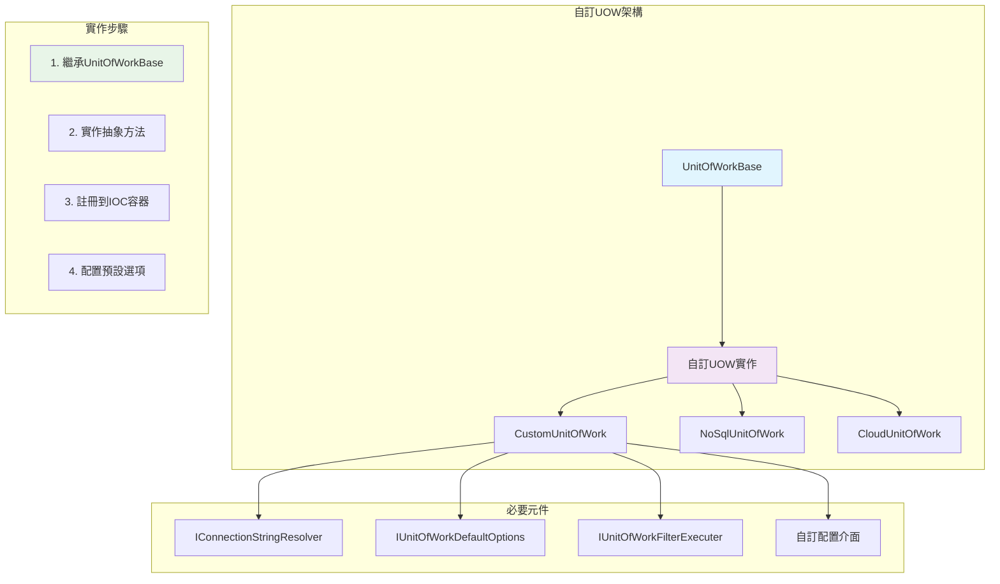

# 18 - 自訂UOW實作

## 🔧 自訂UOW實作概述

ASP.NET Boilerplate提供了強大的UOW擴展機制，讓開發者可以為特定的資料存取技術或業務需求實作自訂的UOW。透過繼承`UnitOfWorkBase`類別並實作必要的抽象方法，開發者可以建立符合特定需求的UOW實作。

### 核心架構



## 📋 必須實作的抽象方法

### 核心生命週期方法

```csharp
public abstract class CustomUnitOfWork : UnitOfWorkBase, ITransientDependency
{
    // 必須實作的抽象方法
    protected override void BeginUow()
    {
        // 初始化UOW，建立連線等
    }

    protected override void CompleteUow()
    {
        // 提交變更，完成交易
    }

    protected override async Task CompleteUowAsync()
    {
        // 非同步完成UOW
    }

    protected override void DisposeUow()
    {
        // 清理資源，關閉連線
    }

    public override void SaveChanges()
    {
        // 儲存變更到資料庫
    }

    public override async Task SaveChangesAsync()
    {
        // 非同步儲存變更
    }
}
```

### 過濾器方法實作

```csharp
// 過濾器相關方法
protected override void ApplyDisableFilter(string filterName)
{
    // 停用指定的資料過濾器
    switch (filterName)
    {
        case AbpDataFilters.SoftDelete:
            // 停用軟刪除過濾器
            break;
        case AbpDataFilters.MustHaveTenant:
            // 停用多租戶過濾器
            break;
    }
}

protected override void ApplyEnableFilter(string filterName)
{
    // 啟用指定的資料過濾器
    switch (filterName)
    {
        case AbpDataFilters.SoftDelete:
            // 啟用軟刪除過濾器
            break;
        case AbpDataFilters.MustHaveTenant:
            // 啟用多租戶過濾器
            break;
    }
}

protected override void ApplyFilterParameterValue(string filterName, string parameterName, object value)
{
    // 設定過濾器參數值
    if (filterName == AbpDataFilters.MustHaveTenant && parameterName == "tenantId")
    {
        // 設定租戶ID過濾器參數
    }
}
```

## 🏗️ 完整自訂UOW範例

### 1. NoSQL文件資料庫UOW實作

```csharp
using System;
using System.Collections.Generic;
using System.Threading.Tasks;
using Abp.Dependency;
using Abp.Domain.Uow;

namespace MyApp.CustomUow
{
    /// <summary>
    /// NoSQL文件資料庫的UOW實作
    /// </summary>
    public class DocumentDbUnitOfWork : UnitOfWorkBase, ITransientDependency
    {
        private readonly IDocumentDatabase _database;
        private readonly IDocumentTransaction _transaction;
        private readonly List<IDocumentOperation> _operations;

        public DocumentDbUnitOfWork(
            IDocumentDatabase database,
            IConnectionStringResolver connectionStringResolver,
            IUnitOfWorkDefaultOptions defaultOptions,
            IUnitOfWorkFilterExecuter filterExecuter)
            : base(connectionStringResolver, defaultOptions, filterExecuter)
        {
            _database = database;
            _operations = new List<IDocumentOperation>();
        }

        protected override void BeginUow()
        {
            var connectionString = ResolveConnectionString(
                new ConnectionStringResolveArgs("DocumentDb"));
            
            _database.Connect(connectionString);
            
            if (Options.IsTransactional == true)
            {
                _transaction = _database.BeginTransaction(
                    ConvertIsolationLevel(Options.IsolationLevel));
            }
        }

        public override void SaveChanges()
        {
            if (_operations.Count == 0) return;

            try
            {
                // 執行所有累積的操作
                foreach (var operation in _operations)
                {
                    operation.Execute(_database);
                }
                
                _operations.Clear();
            }
            catch (Exception)
            {
                _operations.Clear();
                throw;
            }
        }

        public override async Task SaveChangesAsync()
        {
            if (_operations.Count == 0) return;

            try
            {
                // 非同步執行所有累積的操作
                foreach (var operation in _operations)
                {
                    await operation.ExecuteAsync(_database);
                }
                
                _operations.Clear();
            }
            catch (Exception)
            {
                _operations.Clear();
                throw;
            }
        }

        protected override void CompleteUow()
        {
            SaveChanges();
            _transaction?.Commit();
        }

        protected override async Task CompleteUowAsync()
        {
            await SaveChangesAsync();
            if (_transaction != null)
            {
                await _transaction.CommitAsync();
            }
        }

        protected override void DisposeUow()
        {
            try
            {
                if (_transaction != null && _transaction.IsActive)
                {
                    _transaction.Rollback();
                }
            }
            finally
            {
                _transaction?.Dispose();
                _database?.Disconnect();
            }
        }

        // 自訂方法：新增操作到佇列
        public void AddOperation(IDocumentOperation operation)
        {
            _operations.Add(operation);
        }

        // 過濾器實作
        protected override void ApplyDisableFilter(string filterName)
        {
            switch (filterName)
            {
                case AbpDataFilters.SoftDelete:
                    _database.Configuration.IncludeSoftDeleted = true;
                    break;
                case AbpDataFilters.MustHaveTenant:
                    _database.Configuration.DisableTenantFilter = true;
                    break;
            }
        }

        protected override void ApplyEnableFilter(string filterName)
        {
            switch (filterName)
            {
                case AbpDataFilters.SoftDelete:
                    _database.Configuration.IncludeSoftDeleted = false;
                    break;
                case AbpDataFilters.MustHaveTenant:
                    _database.Configuration.DisableTenantFilter = false;
                    break;
            }
        }

        protected override void ApplyFilterParameterValue(string filterName, string parameterName, object value)
        {
            if (filterName == AbpDataFilters.MustHaveTenant && parameterName == "tenantId")
            {
                _database.Configuration.CurrentTenantId = (int?)value;
            }
        }

        private DocumentIsolationLevel ConvertIsolationLevel(IsolationLevel isolationLevel)
        {
            return isolationLevel switch
            {
                IsolationLevel.ReadCommitted => DocumentIsolationLevel.ReadCommitted,
                IsolationLevel.ReadUncommitted => DocumentIsolationLevel.ReadUncommitted,
                IsolationLevel.RepeatableRead => DocumentIsolationLevel.RepeatableRead,
                IsolationLevel.Serializable => DocumentIsolationLevel.Serializable,
                _ => DocumentIsolationLevel.ReadCommitted
            };
        }
    }
}
```

### 2. 雲端儲存UOW實作

```csharp
namespace MyApp.CloudStorage
{
    /// <summary>
    /// 雲端儲存服務的UOW實作
    /// </summary>
    public class CloudStorageUnitOfWork : UnitOfWorkBase, ITransientDependency
    {
        private readonly ICloudStorageClient _client;
        private readonly IBatchOperationBuilder _batchBuilder;
        private readonly ILogger _logger;

        public CloudStorageUnitOfWork(
            ICloudStorageClient client,
            IBatchOperationBuilder batchBuilder,
            IConnectionStringResolver connectionStringResolver,
            IUnitOfWorkDefaultOptions defaultOptions,
            IUnitOfWorkFilterExecuter filterExecuter,
            ILogger logger)
            : base(connectionStringResolver, defaultOptions, filterExecuter)
        {
            _client = client;
            _batchBuilder = batchBuilder;
            _logger = logger;
        }

        protected override void BeginUow()
        {
            var connectionString = ResolveConnectionString(
                new ConnectionStringResolveArgs("CloudStorage"));
            
            _client.Initialize(connectionString);
            _batchBuilder.BeginBatch();

            _logger.Debug("CloudStorage UOW started");
        }

        public override void SaveChanges()
        {
            var operations = _batchBuilder.GetOperations();
            if (operations.Count == 0) return;

            try
            {
                var result = _client.ExecuteBatch(operations);
                if (!result.IsSuccessful)
                {
                    throw new AbpException($"Cloud storage batch operation failed: {result.ErrorMessage}");
                }

                _batchBuilder.ClearOperations();
                _logger.Debug($"Executed {operations.Count} cloud storage operations");
            }
            catch (Exception ex)
            {
                _logger.Error("Error executing cloud storage operations", ex);
                throw;
            }
        }

        public override async Task SaveChangesAsync()
        {
            var operations = _batchBuilder.GetOperations();
            if (operations.Count == 0) return;

            try
            {
                var result = await _client.ExecuteBatchAsync(operations);
                if (!result.IsSuccessful)
                {
                    throw new AbpException($"Cloud storage batch operation failed: {result.ErrorMessage}");
                }

                _batchBuilder.ClearOperations();
                _logger.Debug($"Executed {operations.Count} cloud storage operations asynchronously");
            }
            catch (Exception ex)
            {
                _logger.Error("Error executing cloud storage operations asynchronously", ex);
                throw;
            }
        }

        protected override void CompleteUow()
        {
            SaveChanges();
            _logger.Debug("CloudStorage UOW completed");
        }

        protected override async Task CompleteUowAsync()
        {
            await SaveChangesAsync();
            _logger.Debug("CloudStorage UOW completed asynchronously");
        }

        protected override void DisposeUow()
        {
            try
            {
                _batchBuilder.ClearOperations();
                _client?.Dispose();
                _logger.Debug("CloudStorage UOW disposed");
            }
            catch (Exception ex)
            {
                _logger.Error("Error disposing CloudStorage UOW", ex);
            }
        }

        // 自訂方法
        public void AddCreateOperation<T>(T entity, string partition = null)
        {
            _batchBuilder.AddCreate(entity, partition);
        }

        public void AddUpdateOperation<T>(T entity, string partition = null)
        {
            _batchBuilder.AddUpdate(entity, partition);
        }

        public void AddDeleteOperation<T>(string id, string partition = null)
        {
            _batchBuilder.AddDelete<T>(id, partition);
        }

        // 簡化的過濾器實作（雲端儲存通常不需要複雜過濾）
        protected override void ApplyDisableFilter(string filterName)
        {
            // 雲端儲存過濾器處理
        }

        protected override void ApplyEnableFilter(string filterName)
        {
            // 雲端儲存過濾器處理
        }

        protected override void ApplyFilterParameterValue(string filterName, string parameterName, object value)
        {
            // 雲端儲存過濾器參數處理
        }
    }
}
```

## ⚙️ UOW註冊與配置

### 1. IOC容器註冊

```csharp
public class CustomUowModule : AbpModule
{
    public override void PreInitialize()
    {
        // 註冊自訂UOW實作
        IocManager.Register<DocumentDbUnitOfWork>(DependencyLifeStyle.Transient);
        IocManager.Register<CloudStorageUnitOfWork>(DependencyLifeStyle.Transient);
        
        // 註冊相關服務
        IocManager.Register<IDocumentDatabase, DocumentDatabase>(DependencyLifeStyle.Singleton);
        IocManager.Register<ICloudStorageClient, CloudStorageClient>(DependencyLifeStyle.Singleton);
    }

    public override void Initialize()
    {
        IocManager.RegisterAssemblyByConvention(typeof(CustomUowModule).GetAssembly());
    }
}
```

### 2. UOW選擇器實作

```csharp
public class CustomUnitOfWorkSelector : IUnitOfWorkSelector
{
    public bool IsUnitOfWorkMethod(MethodInfo methodInfo, out UnitOfWorkAttribute unitOfWorkAttribute)
    {
        unitOfWorkAttribute = null;
        
        // 檢查方法是否需要特定的UOW類型
        var customUowAttribute = methodInfo.GetCustomAttribute<CustomUowAttribute>();
        if (customUowAttribute != null)
        {
            unitOfWorkAttribute = new UnitOfWorkAttribute();
            // 根據自訂屬性設定UOW選項
            return true;
        }

        // 預設邏輯
        return false;
    }
}

[AttributeUsage(AttributeTargets.Method | AttributeTargets.Class)]
public class CustomUowAttribute : Attribute
{
    public Type UowType { get; set; }
    public bool IsTransactional { get; set; } = true;
    
    public CustomUowAttribute(Type uowType)
    {
        UowType = uowType;
    }
}
```

### 3. 條件式UOW工廠

```csharp
public class ConditionalUnitOfWorkFactory : ITransientDependency
{
    private readonly IIocResolver _iocResolver;
    private readonly IAbpSession _session;

    public ConditionalUnitOfWorkFactory(IIocResolver iocResolver, IAbpSession session)
    {
        _iocResolver = iocResolver;
        _session = session;
    }

    public IUnitOfWork CreateUnitOfWork(Type requestedType, UnitOfWorkOptions options)
    {
        // 根據條件選擇UOW實作
        if (IsCloudStorageRequest(requestedType))
        {
            return _iocResolver.Resolve<CloudStorageUnitOfWork>();
        }
        
        if (IsDocumentDbRequest(requestedType))
        {
            return _iocResolver.Resolve<DocumentDbUnitOfWork>();
        }

        // 預設回到EF Core UOW
        return _iocResolver.Resolve<EfCoreUnitOfWork>();
    }

    private bool IsCloudStorageRequest(Type type)
    {
        // 檢查是否為雲端儲存相關的請求
        return type.Namespace?.Contains("CloudStorage") == true;
    }

    private bool IsDocumentDbRequest(Type type)
    {
        // 檢查是否為文件資料庫相關的請求
        return type.GetCustomAttribute<DocumentDbEntityAttribute>() != null;
    }
}
```

## 🔄 UOW攔截器自訂

### 自訂UOW攔截器

```csharp
public class CustomUnitOfWorkInterceptor : IInterceptor
{
    private readonly IUnitOfWorkManager _unitOfWorkManager;
    private readonly ICustomUowSelector _customUowSelector;

    public CustomUnitOfWorkInterceptor(
        IUnitOfWorkManager unitOfWorkManager,
        ICustomUowSelector customUowSelector)
    {
        _unitOfWorkManager = unitOfWorkManager;
        _customUowSelector = customUowSelector;
    }

    public void Intercept(IInvocation invocation)
    {
        var methodInfo = invocation.Method ?? invocation.MethodInvocationTarget;
        
        // 檢查是否需要自訂UOW
        var customUowInfo = _customUowSelector.GetCustomUowInfo(methodInfo);
        if (customUowInfo == null)
        {
            invocation.Proceed();
            return;
        }

        // 使用自訂UOW執行方法
        ExecuteWithCustomUow(invocation, customUowInfo);
    }

    private void ExecuteWithCustomUow(IInvocation invocation, CustomUowInfo uowInfo)
    {
        if (MethodReturnTypeHelper.IsAsyncMethod(invocation.Method))
        {
            ExecuteAsyncWithCustomUow(invocation, uowInfo);
        }
        else
        {
            ExecuteSyncWithCustomUow(invocation, uowInfo);
        }
    }

    private void ExecuteSyncWithCustomUow(IInvocation invocation, CustomUowInfo uowInfo)
    {
        using (var uow = CreateCustomUow(uowInfo))
        {
            invocation.Proceed();
            uow.Complete();
        }
    }

    private void ExecuteAsyncWithCustomUow(IInvocation invocation, CustomUowInfo uowInfo)
    {
        var task = InternalExecuteAsyncWithCustomUow(invocation, uowInfo);
        invocation.ReturnValue = task;
    }

    private async Task InternalExecuteAsyncWithCustomUow(IInvocation invocation, CustomUowInfo uowInfo)
    {
        using (var uow = CreateCustomUow(uowInfo))
        {
            invocation.Proceed();
            
            if (invocation.ReturnValue is Task task)
            {
                await task;
            }
            
            await uow.CompleteAsync();
        }
    }

    private IUnitOfWorkCompleteHandle CreateCustomUow(CustomUowInfo uowInfo)
    {
        var options = new UnitOfWorkOptions
        {
            IsTransactional = uowInfo.IsTransactional,
            IsolationLevel = uowInfo.IsolationLevel
        };

        return _unitOfWorkManager.Begin(options);
    }
}
```

## 📊 自訂UOW監控與診斷

### UOW效能監控

```csharp
public class MonitoringUnitOfWorkDecorator : UnitOfWorkBase, ITransientDependency
{
    private readonly IUnitOfWork _innerUow;
    private readonly IPerformanceCounter _performanceCounter;
    private readonly ILogger _logger;
    private readonly Stopwatch _stopwatch;

    public MonitoringUnitOfWorkDecorator(
        IUnitOfWork innerUow,
        IPerformanceCounter performanceCounter,
        ILogger logger,
        IConnectionStringResolver connectionStringResolver,
        IUnitOfWorkDefaultOptions defaultOptions,
        IUnitOfWorkFilterExecuter filterExecuter)
        : base(connectionStringResolver, defaultOptions, filterExecuter)
    {
        _innerUow = innerUow;
        _performanceCounter = performanceCounter;
        _logger = logger;
        _stopwatch = new Stopwatch();
    }

    protected override void BeginUow()
    {
        _stopwatch.Start();
        _performanceCounter.Increment("UOW.Started");
        _logger.Debug($"UOW Begin: {GetType().Name}");
        
        _innerUow.Begin(Options);
    }

    public override void SaveChanges()
    {
        var saveStopwatch = Stopwatch.StartNew();
        try
        {
            _innerUow.SaveChanges();
            _performanceCounter.Increment("UOW.SaveChanges.Success");
        }
        catch (Exception ex)
        {
            _performanceCounter.Increment("UOW.SaveChanges.Error");
            _logger.Error("SaveChanges failed", ex);
            throw;
        }
        finally
        {
            saveStopwatch.Stop();
            _performanceCounter.AddValue("UOW.SaveChanges.Duration", saveStopwatch.ElapsedMilliseconds);
        }
    }

    protected override void CompleteUow()
    {
        try
        {
            _innerUow.Complete();
            _performanceCounter.Increment("UOW.Completed.Success");
        }
        catch (Exception ex)
        {
            _performanceCounter.Increment("UOW.Completed.Error");
            _logger.Error("UOW Complete failed", ex);
            throw;
        }
        finally
        {
            _stopwatch.Stop();
            _performanceCounter.AddValue("UOW.Total.Duration", _stopwatch.ElapsedMilliseconds);
            _logger.Debug($"UOW Completed in {_stopwatch.ElapsedMilliseconds}ms");
        }
    }

    protected override void DisposeUow()
    {
        try
        {
            _innerUow.Dispose();
        }
        finally
        {
            _performanceCounter.Increment("UOW.Disposed");
            _stopwatch.Stop();
        }
    }

    // 委派其他方法到內部UOW
    public override Task SaveChangesAsync() => _innerUow.SaveChangesAsync();
    protected override Task CompleteUowAsync() => ((UnitOfWorkBase)_innerUow).CompleteAsync();
}
```

## 🎯 最佳實務與注意事項

### 1. 設計原則

- **單一職責**：每個UOW實作應該專注於特定的資料存取技術
- **可測試性**：提供適當的抽象和介面，便於單元測試
- **錯誤處理**：實作適當的異常處理和資源清理
- **效能考量**：避免在UOW中執行昂貴的操作

### 2. 常見陷阱

```csharp
// ❌ 錯誤：在BeginUow中執行昂貴操作
protected override void BeginUow()
{
    // 不要在這裡執行大量資料載入
    LoadAllDataFromDatabase(); // 錯誤
}

// ✅ 正確：延遲載入
protected override void BeginUow()
{
    // 只做必要的初始化
    InitializeConnection();
}

// ❌ 錯誤：忘記處理異常
public override void SaveChanges()
{
    ExecuteOperations(); // 可能拋出異常但未處理
}

// ✅ 正確：適當的異常處理
public override void SaveChanges()
{
    try
    {
        ExecuteOperations();
    }
    catch (Exception ex)
    {
        Logger.Error("SaveChanges failed", ex);
        RollbackOperations();
        throw;
    }
}
```

### 3. 測試策略

```csharp
[Fact]
public void CustomUow_Should_Handle_Transaction_Properly()
{
    // Arrange
    var mockDatabase = new Mock<IDocumentDatabase>();
    var uow = new DocumentDbUnitOfWork(
        mockDatabase.Object,
        Mock.Of<IConnectionStringResolver>(),
        Mock.Of<IUnitOfWorkDefaultOptions>(),
        Mock.Of<IUnitOfWorkFilterExecuter>());

    // Act & Assert
    using (uow.Begin(new UnitOfWorkOptions { IsTransactional = true }))
    {
        // 測試UOW行為
        uow.SaveChanges();
        uow.Complete();
    }

    // 驗證資料庫交互
    mockDatabase.Verify(x => x.BeginTransaction(It.IsAny<DocumentIsolationLevel>()), Times.Once);
    mockDatabase.Verify(x => x.Commit(), Times.Once);
}
```

自訂UOW實作為ASP.NET Boilerplate提供了強大的擴展能力，讓開發者可以整合各種資料存取技術，同時保持一致的程式設計模式和交易語義。
