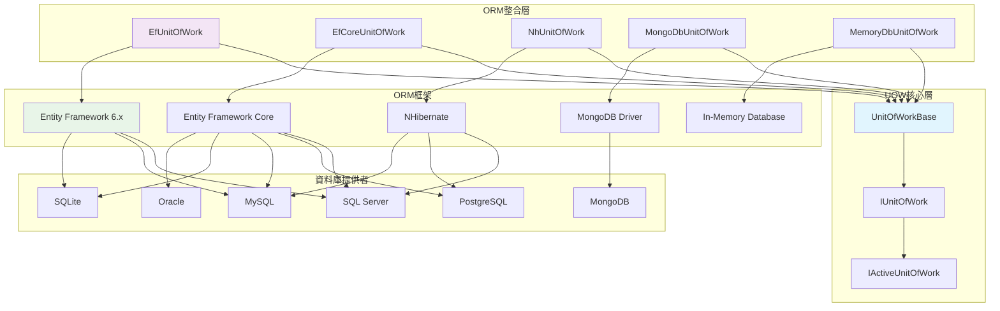
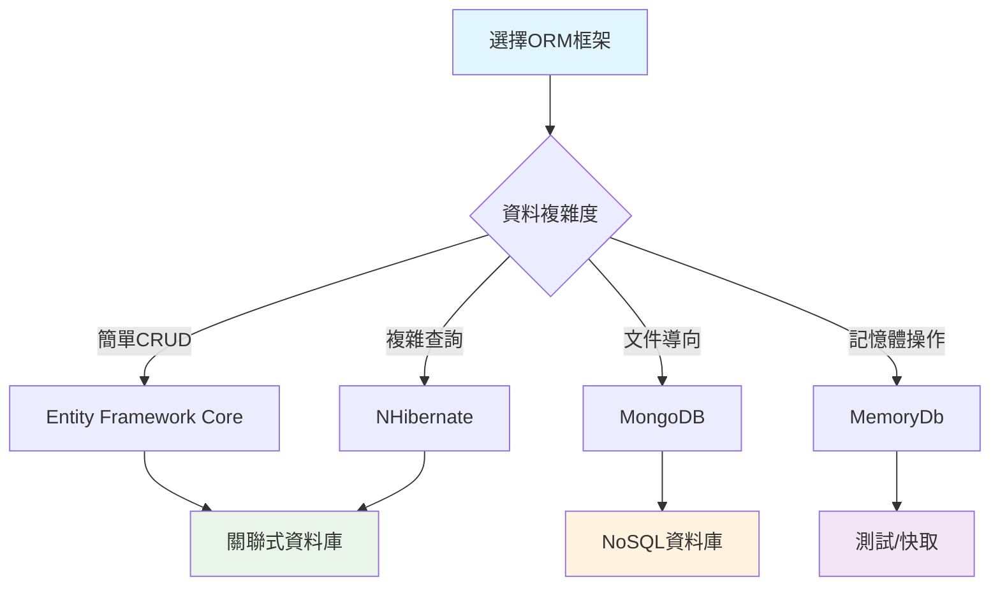

# 19 - 與ORM框架整合

## 🗄️ ORM框架整合概述

ASP.NET Boilerplate的UOW系統設計為與多種ORM框架無縫整合，提供統一的資料存取抽象層。框架內建支援Entity Framework、Entity Framework Core、NHibernate等主流ORM，同時提供擴展機制支援其他ORM框架。

### 支援的ORM框架架構



## 🔧 Entity Framework Core 整合

### EfCoreUnitOfWork 實際實作

Entity Framework Core的UOW實作是框架中最複雜的部分，涉及DbContext管理、交易策略、連線字串解析等：

```csharp
public class EfCoreUnitOfWork : UnitOfWorkBase, ITransientDependency
{
    protected IDictionary<string, DbContext> ActiveDbContexts { get; }
    protected IIocResolver IocResolver { get; }

    private readonly IDbContextResolver _dbContextResolver;
    private readonly IDbContextTypeMatcher _dbContextTypeMatcher;
    private readonly IEfCoreTransactionStrategy _transactionStrategy;

    public EfCoreUnitOfWork(
        IIocResolver iocResolver,
        IConnectionStringResolver connectionStringResolver,
        IUnitOfWorkFilterExecuter filterExecuter,
        IDbContextResolver dbContextResolver,
        IUnitOfWorkDefaultOptions defaultOptions,
        IDbContextTypeMatcher dbContextTypeMatcher,
        IEfCoreTransactionStrategy transactionStrategy)
        : base(connectionStringResolver, defaultOptions, filterExecuter)
    {
        IocResolver = iocResolver;
        _dbContextResolver = dbContextResolver;
        _dbContextTypeMatcher = dbContextTypeMatcher;
        _transactionStrategy = transactionStrategy;
        ActiveDbContexts = new Dictionary<string, DbContext>(StringComparer.OrdinalIgnoreCase);
    }

    /// <summary>
    /// 複雜的DbContext取得或建立邏輯
    /// </summary>
    public virtual async Task<TDbContext> GetOrCreateDbContextAsync<TDbContext>(
        MultiTenancySides? multiTenancySide = null, 
        string name = null)
        where TDbContext : DbContext
    {
        var concreteDbContextType = _dbContextTypeMatcher.GetConcreteType(typeof(TDbContext));

        var connectionStringResolveArgs = new ConnectionStringResolveArgs(multiTenancySide)
        {
            ["DbContextType"] = typeof(TDbContext),
            ["DbContextConcreteType"] = concreteDbContextType
        };

        var connectionString = await ResolveConnectionStringAsync(connectionStringResolveArgs);

        // 建立唯一的DbContext鍵值
        var dbContextKey = concreteDbContextType.FullName + "#" + connectionString;
        if (name != null)
        {
            dbContextKey += "#" + name;
        }

        // 檢查是否已存在
        if (ActiveDbContexts.TryGetValue(dbContextKey, out var dbContext))
        {
            return (TDbContext)dbContext;
        }

        // 根據交易模式建立DbContext
        if (Options.IsTransactional == true)
        {
            dbContext = await _transactionStrategy
                .CreateDbContextAsync<TDbContext>(connectionString, _dbContextResolver);
        }
        else
        {
            dbContext = _dbContextResolver.Resolve<TDbContext>(connectionString, null);
        }

        // 初始化AbpDbContext
        if (dbContext is IShouldInitializeDcontext abpDbContext)
        {
            abpDbContext.Initialize(new AbpEfDbContextInitializationContext(this));
        }

        ActiveDbContexts[dbContextKey] = dbContext;
        return (TDbContext)dbContext;
    }

    protected override void BeginUow()
    {
        if (Options.IsTransactional == true)
        {
            _transactionStrategy.InitOptions(Options);
        }
    }

    protected override void CompleteUow()
    {
        SaveChanges();
        CommitTransaction();
    }

    protected override async Task CompleteUowAsync()
    {
        await SaveChangesAsync();
        CommitTransaction();
    }

    public override void SaveChanges()
    {
        foreach (var dbContext in GetAllActiveDbContexts())
        {
            SaveChangesInDbContext(dbContext);
        }
    }

    public override async Task SaveChangesAsync()
    {
        foreach (var dbContext in GetAllActiveDbContexts())
        {
            await SaveChangesInDbContextAsync(dbContext);
        }
    }

    private void CommitTransaction()
    {
        if (Options.IsTransactional == true)
        {
            _transactionStrategy.Commit();
        }
    }

    protected override void DisposeUow()
    {
        if (Options.IsTransactional == true)
        {
            _transactionStrategy.Dispose();
        }

        foreach (var activeDbContext in ActiveDbContexts.Values)
        {
            Release(activeDbContext);
        }

        ActiveDbContexts.Clear();
    }
}
```

### 關鍵技術要點

#### 1. DbContext生命週期管理
- **複用機制**: 相同連線字串的DbContext會被複用
- **鍵值策略**: 使用 `DbContextType#ConnectionString#Name` 作為唯一鍵
- **自動釋放**: UOW結束時自動釋放所有DbContext

#### 2. 交易策略整合
- **條件建立**: 只有在交易模式下才使用交易策略
- **策略模式**: 支援不同的交易實作策略
- **生命週期**: 與UOW生命週期緊密綁定

#### 3. 多租戶支援
- **連線字串解析**: 根據租戶資訊解析不同的連線字串
- **DbContext隔離**: 不同租戶使用不同的DbContext實例
- **參數傳遞**: 透過`MultiTenancySides`參數控制行為

        protected override void BeginUow()
        {
            if (Options.IsTransactional == true)
            {
                _transactionStrategy.InitOptions(Options);
            }
        }

        public override void SaveChanges()
        {
            foreach (var dbContext in GetAllActiveDbContexts())
            {
                SaveChangesInDbContext(dbContext);
            }
        }

        public override async Task SaveChangesAsync()
        {
            foreach (var dbContext in GetAllActiveDbContexts())
            {
                await SaveChangesInDbContextAsync(dbContext);
            }
        }

        protected override void CompleteUow()
        {
            SaveChanges();
            CommitTransaction();
        }

        protected override async Task CompleteUowAsync()
        {
            await SaveChangesAsync();
            CommitTransaction();
        }

        private void CommitTransaction()
        {
            if (Options.IsTransactional == true)
            {
                _transactionStrategy.Commit();
            }
        }

        public virtual TDbContext GetOrCreateDbContext<TDbContext>(
            MultiTenancySides? multiTenancySide = null, string name = null)
            where TDbContext : DbContext
        {
            var concreteDbContextType = _dbContextTypeMatcher.GetConcreteType(typeof(TDbContext));
            var connectionStringResolveArgs = new ConnectionStringResolveArgs(multiTenancySide);
            connectionStringResolveArgs["DbContextType"] = typeof(TDbContext);
            connectionStringResolveArgs["DbContextConcreteType"] = concreteDbContextType;

            var connectionString = ResolveConnectionString(connectionStringResolveArgs);
            var dbContextKey = concreteDbContextType.FullName + "#" + connectionString + "#" + (name ?? "");

            if (!ActiveDbContexts.TryGetValue(dbContextKey, out var dbContext))
            {
                if (Options.IsTransactional == true)
                {
                    dbContext = _transactionStrategy.CreateDbContext<TDbContext>(connectionString, _dbContextResolver);
                }
                else
                {
                    dbContext = _dbContextResolver.Resolve<TDbContext>(connectionString, null);
                }

                SuppressFilter(dbContext, AbpDataFilters.SoftDelete);
                SuppressFilter(dbContext, AbpDataFilters.MustHaveTenant);
                SuppressFilter(dbContext, AbpDataFilters.MayHaveTenant);

                ApplyConventions(dbContext);
                ActiveDbContexts[dbContextKey] = dbContext;
            }

            return (TDbContext)dbContext;
        }

        private void ApplyConventions(DbContext dbContext)
        {
            foreach (var filter in Filters)
            {
                if (filter.IsEnabled)
                {
                    dbContext.EnableFilter(filter.FilterName);
                    foreach (var filterParameter in filter.FilterParameters)
                    {
                        dbContext.SetFilterParameter(filter.FilterName, filterParameter.Key, filterParameter.Value);
                    }
                }
                else
                {
                    dbContext.DisableFilter(filter.FilterName);
                }
            }
        }

        protected virtual void SaveChangesInDbContext(DbContext dbContext)
        {
            dbContext.SaveChanges();
        }

        protected virtual async Task SaveChangesInDbContextAsync(DbContext dbContext)
        {
            await dbContext.SaveChangesAsync();
        }
    }
}
```

### DbContext提供者

```csharp
/// <summary>
/// 從UOW取得DbContext的提供者
/// </summary>
public class UnitOfWorkDbContextProvider<TDbContext> : IDbContextProvider<TDbContext>
    where TDbContext : DbContext
{
    private readonly ICurrentUnitOfWorkProvider _currentUnitOfWorkProvider;

    public UnitOfWorkDbContextProvider(ICurrentUnitOfWorkProvider currentUnitOfWorkProvider)
    {
        _currentUnitOfWorkProvider = currentUnitOfWorkProvider;
    }

    public TDbContext GetDbContext()
    {
        return GetDbContext(null);
    }

    public TDbContext GetDbContext(MultiTenancySides? multiTenancySide)
    {
        return _currentUnitOfWorkProvider.Current.GetDbContext<TDbContext>(multiTenancySide);
    }

    public Task<TDbContext> GetDbContextAsync()
    {
        return GetDbContextAsync(null);
    }

    public Task<TDbContext> GetDbContextAsync(MultiTenancySides? multiTenancySide)
    {
        return _currentUnitOfWorkProvider.Current.GetDbContextAsync<TDbContext>(multiTenancySide);
    }
}
```

### 交易策略

```csharp
/// <summary>
/// EF Core交易策略介面
/// </summary>
public interface IEfCoreTransactionStrategy
{
    void InitOptions(UnitOfWorkOptions options);
    DbContext CreateDbContext<TDbContext>(string connectionString, IDbContextResolver dbContextResolver)
        where TDbContext : DbContext;
    void Commit();
    void Dispose();
}

/// <summary>
/// 資料庫交易策略實作
/// </summary>
public class DbContextEfCoreTransactionStrategy : IEfCoreTransactionStrategy, ITransientDependency
{
    protected UnitOfWorkOptions Options { get; private set; }
    protected IDictionary<string, ActiveTransactionInfo> ActiveTransactions { get; }

    public DbContextEfCoreTransactionStrategy()
    {
        ActiveTransactions = new Dictionary<string, ActiveTransactionInfo>();
    }

    public virtual void InitOptions(UnitOfWorkOptions options)
    {
        Options = options;
    }

    public virtual DbContext CreateDbContext<TDbContext>(string connectionString, IDbContextResolver dbContextResolver)
        where TDbContext : DbContext
    {
        var dbContext = dbContextResolver.Resolve<TDbContext>(connectionString, null);

        var activeTransaction = ActiveTransactions.GetOrDefault(connectionString);
        if (activeTransaction == null)
        {
            var dbTransaction = dbContext.Database.BeginTransaction(
                (System.Data.IsolationLevel)Options.IsolationLevel.GetValueOrDefault(IsolationLevel.ReadCommitted)
            );

            activeTransaction = new ActiveTransactionInfo(dbTransaction, dbContext);
            ActiveTransactions[connectionString] = activeTransaction;
        }
        else
        {
            if (dbContext.HasRelationalTransactionManager())
            {
                dbContext.Database.UseTransaction(activeTransaction.DbContextTransaction.GetDbTransaction());
            }
            else
            {
                dbContext.Database.BeginTransaction();
            }

            activeTransaction.AttendedDbContexts.Add(dbContext);
        }

        return dbContext;
    }

    public virtual void Commit()
    {
        foreach (var activeTransaction in ActiveTransactions.Values)
        {
            foreach (var dbContext in activeTransaction.AttendedDbContexts)
            {
                if (dbContext.HasRelationalTransactionManager())
                {
                    continue; // 會由主要交易處理
                }

                dbContext.Database.CommitTransaction();
            }

            activeTransaction.DbContextTransaction.Commit();
        }
    }

    public virtual void Dispose()
    {
        foreach (var activeTransaction in ActiveTransactions.Values)
        {
            activeTransaction.DbContextTransaction.Dispose();

            foreach (var attendedDbContext in activeTransaction.AttendedDbContexts)
            {
                attendedDbContext.Dispose();
            }

            activeTransaction.StarterDbContext.Dispose();
        }

        ActiveTransactions.Clear();
    }

    protected class ActiveTransactionInfo
    {
        public IDbContextTransaction DbContextTransaction { get; }
        public DbContext StarterDbContext { get; }
        public List<DbContext> AttendedDbContexts { get; }

        public ActiveTransactionInfo(IDbContextTransaction dbContextTransaction, DbContext starterDbContext)
        {
            DbContextTransaction = dbContextTransaction;
            StarterDbContext = starterDbContext;
            AttendedDbContexts = new List<DbContext>();
        }
    }
}
```

## 🏗️ NHibernate 整合

### NHibernate UOW實作

```csharp
namespace Abp.NHibernate.Uow
{
    /// <summary>
    /// NHibernate UOW實作
    /// </summary>
    public class NhUnitOfWork : UnitOfWorkBase, ITransientDependency
    {
        /// <summary>
        /// 取得NHibernate Session
        /// </summary>
        public ISession Session { get; private set; }

        private readonly ISessionFactory _sessionFactory;
        private ITransaction _transaction;

        public NhUnitOfWork(
            ISessionFactory sessionFactory,
            IConnectionStringResolver connectionStringResolver,
            IUnitOfWorkDefaultOptions defaultOptions,
            IUnitOfWorkFilterExecuter filterExecuter)
            : base(connectionStringResolver, defaultOptions, filterExecuter)
        {
            _sessionFactory = sessionFactory;
        }

        protected override void BeginUow()
        {
            Session = _sessionFactory.OpenSession();

            if (Options.IsTransactional == true)
            {
                _transaction = Options.IsolationLevel.HasValue
                    ? Session.BeginTransaction(ConvertIsolationLevel(Options.IsolationLevel.Value))
                    : Session.BeginTransaction();
            }

            CheckAndSetSoftDelete();
            CheckAndSetMustHaveTenant();
            CheckAndSetMayHaveTenant();
        }

        protected override void ApplyEnableFilter(string filterName)
        {
            base.ApplyEnableFilter(filterName);

            var parameters = Filters.Single(p => p.FilterName == filterName).FilterParameters;

            foreach (var param in parameters)
            {
                ApplyFilterParameterValue(filterName, param.Key, param.Value);
            }
        }

        protected override void ApplyDisableFilter(string filterName)
        {
            Session.DisableFilter(filterName);
        }

        protected override void ApplyFilterParameterValue(string filterName, string parameterName, object value)
        {
            Session.EnableFilter(filterName).SetParameter(parameterName, value);
        }

        protected virtual void CheckAndSetSoftDelete()
        {
            if (IsFilterEnabled(AbpDataFilters.SoftDelete))
            {
                ApplyEnableFilter(AbpDataFilters.SoftDelete);
            }
            else
            {
                ApplyDisableFilter(AbpDataFilters.SoftDelete);
            }
        }

        protected virtual void CheckAndSetMustHaveTenant()
        {
            if (AbpSession.TenantId != null && IsFilterEnabled(AbpDataFilters.MustHaveTenant))
            {
                ApplyEnableFilter(AbpDataFilters.MustHaveTenant);
                ApplyFilterParameterValue(AbpDataFilters.MustHaveTenant, AbpDataFilters.Parameters.TenantId, AbpSession.GetTenantId());
            }
            else
            {
                ApplyDisableFilter(AbpDataFilters.MustHaveTenant);
            }
        }

        protected virtual void CheckAndSetMayHaveTenant()
        {
            if (AbpSession.TenantId != null && IsFilterEnabled(AbpDataFilters.MayHaveTenant))
            {
                ApplyEnableFilter(AbpDataFilters.MayHaveTenant);
                ApplyFilterParameterValue(AbpDataFilters.MayHaveTenant, AbpDataFilters.Parameters.TenantId, AbpSession.TenantId);
            }
            else
            {
                ApplyDisableFilter(AbpDataFilters.MayHaveTenant);
            }
        }

        public override void SaveChanges()
        {
            Session.Flush();
        }

        public override Task SaveChangesAsync()
        {
            return Session.FlushAsync();
        }

        protected override void CompleteUow()
        {
            SaveChanges();
            if (_transaction != null)
            {
                _transaction.Commit();
            }
        }

        protected override async Task CompleteUowAsync()
        {
            await SaveChangesAsync();
            if (_transaction != null)
            {
                await _transaction.CommitAsync();
            }
        }

        protected override void DisposeUow()
        {
            if (_transaction != null)
            {
                _transaction.Dispose();
                _transaction = null;
            }

            Session.Dispose();
        }

        private static System.Data.IsolationLevel ConvertIsolationLevel(IsolationLevel isolationLevel)
        {
            switch (isolationLevel)
            {
                case IsolationLevel.Chaos:
                    return System.Data.IsolationLevel.Chaos;
                case IsolationLevel.ReadCommitted:
                    return System.Data.IsolationLevel.ReadCommitted;
                case IsolationLevel.ReadUncommitted:
                    return System.Data.IsolationLevel.ReadUncommitted;
                case IsolationLevel.RepeatableRead:
                    return System.Data.IsolationLevel.RepeatableRead;
                case IsolationLevel.Serializable:
                    return System.Data.IsolationLevel.Serializable;
                case IsolationLevel.Snapshot:
                    return System.Data.IsolationLevel.Snapshot;
                case IsolationLevel.Unspecified:
                    return System.Data.IsolationLevel.Unspecified;
                default:
                    throw new ArgumentOutOfRangeException(nameof(isolationLevel), isolationLevel, null);
            }
        }
    }
}
```

### NHibernate Session提供者

```csharp
/// <summary>
/// 從UOW取得NHibernate Session的提供者
/// </summary>
public class UnitOfWorkSessionProvider : ISessionProvider, ITransientDependency
{
    public ISession Session
    {
        get { return _unitOfWorkProvider.Current.GetSession(); }
    }
    
    private readonly ICurrentUnitOfWorkProvider _unitOfWorkProvider;

    public UnitOfWorkSessionProvider(ICurrentUnitOfWorkProvider unitOfWorkProvider)
    {
        _unitOfWorkProvider = unitOfWorkProvider;
    }
}

/// <summary>
/// UOW擴展方法，用於取得NHibernate Session
/// </summary>
internal static class UnitOfWorkExtensions
{
    public static ISession GetSession(this IActiveUnitOfWork unitOfWork)
    {
        if (unitOfWork == null)
        {
            throw new ArgumentNullException(nameof(unitOfWork));
        }

        if (!(unitOfWork is NhUnitOfWork))
        {
            throw new ArgumentException("unitOfWork is not type of " + typeof(NhUnitOfWork).FullName, nameof(unitOfWork));
        }

        return (unitOfWork as NhUnitOfWork).Session;
    }
}
```

## 📊 MongoDB 整合

### MongoDB UOW實作

```csharp
namespace Abp.MongoDb.Uow
{
    /// <summary>
    /// MongoDB UOW實作
    /// </summary>
    public class MongoDbUnitOfWork : UnitOfWorkBase, ITransientDependency
    {
        /// <summary>
        /// MongoDB資料庫參考
        /// </summary>
        public MongoDatabase Database { get; private set; }

        private readonly IMongoDatabaseProvider _databaseProvider;

        public MongoDbUnitOfWork(
            IMongoDatabaseProvider databaseProvider,
            IConnectionStringResolver connectionStringResolver,
            IUnitOfWorkDefaultOptions defaultOptions,
            IUnitOfWorkFilterExecuter filterExecuter)
            : base(connectionStringResolver, defaultOptions, filterExecuter)
        {
            _databaseProvider = databaseProvider;
        }

        protected override void BeginUow()
        {
            Database = _databaseProvider.Database;
        }

        public override void SaveChanges()
        {
            // MongoDB通常不需要明確的SaveChanges操作
            // 寫入操作立即持久化
        }

        public override Task SaveChangesAsync()
        {
            // MongoDB通常不需要明確的SaveChanges操作
            return Task.CompletedTask;
        }

        protected override void CompleteUow()
        {
            // MongoDB中的交易管理較為簡單
            SaveChanges();
        }

        protected override Task CompleteUowAsync()
        {
            return SaveChangesAsync();
        }

        protected override void DisposeUow()
        {
            // MongoDB連線通常由連線池管理，無需明確釋放
        }

        protected override void ApplyDisableFilter(string filterName)
        {
            // MongoDB過濾器實作
            switch (filterName)
            {
                case AbpDataFilters.SoftDelete:
                    // 在查詢時不過濾軟刪除的文件
                    break;
                case AbpDataFilters.MustHaveTenant:
                    // 不過濾租戶資料
                    break;
            }
        }

        protected override void ApplyEnableFilter(string filterName)
        {
            // MongoDB過濾器實作
            switch (filterName)
            {
                case AbpDataFilters.SoftDelete:
                    // 在查詢時過濾軟刪除的文件
                    break;
                case AbpDataFilters.MustHaveTenant:
                    // 過濾租戶資料
                    break;
            }
        }

        protected override void ApplyFilterParameterValue(string filterName, string parameterName, object value)
        {
            // MongoDB過濾器參數設定
            if (filterName == AbpDataFilters.MustHaveTenant && parameterName == "tenantId")
            {
                // 設定租戶ID過濾參數
            }
        }
    }
}

/// <summary>
/// MongoDB資料庫提供者
/// </summary>
public class UnitOfWorkMongoDatabaseProvider : IMongoDatabaseProvider, ITransientDependency
{
    public MongoDatabase Database 
    { 
        get { return ((MongoDbUnitOfWork)_currentUnitOfWork.Current).Database; } 
    }

    private readonly ICurrentUnitOfWorkProvider _currentUnitOfWork;

    public UnitOfWorkMongoDatabaseProvider(ICurrentUnitOfWorkProvider currentUnitOfWork)
    {
        _currentUnitOfWork = currentUnitOfWork;
    }
}
```

## 🔄 混合ORM環境支援

### 多ORM UOW管理器

在複雜的企業應用中，可能需要同時使用多種ORM框架。ASP.NET Boilerplate支援在單一UOW中管理多個ORM。

```csharp
/// <summary>
/// 混合ORM的UOW實作
/// </summary>
public class HybridUnitOfWork : UnitOfWorkBase, ITransientDependency
{
    private readonly List<IUnitOfWork> _childUnitOfWorks;
    private readonly IUnitOfWorkFactory _uowFactory;

    public HybridUnitOfWork(
        IUnitOfWorkFactory uowFactory,
        IConnectionStringResolver connectionStringResolver,
        IUnitOfWorkDefaultOptions defaultOptions,
        IUnitOfWorkFilterExecuter filterExecuter)
        : base(connectionStringResolver, defaultOptions, filterExecuter)
    {
        _uowFactory = uowFactory;
        _childUnitOfWorks = new List<IUnitOfWork>();
    }

    protected override void BeginUow()
    {
        // 根據配置啟動不同的UOW
        if (ShouldUseEntityFramework())
        {
            var efUow = _uowFactory.Create<EfCoreUnitOfWork>();
            efUow.Begin(Options);
            _childUnitOfWorks.Add(efUow);
        }

        if (ShouldUseNHibernate())
        {
            var nhUow = _uowFactory.Create<NhUnitOfWork>();
            nhUow.Begin(Options);
            _childUnitOfWorks.Add(nhUow);
        }

        if (ShouldUseMongoDB())
        {
            var mongoUow = _uowFactory.Create<MongoDbUnitOfWork>();
            mongoUow.Begin(Options);
            _childUnitOfWorks.Add(mongoUow);
        }
    }

    public override void SaveChanges()
    {
        foreach (var uow in _childUnitOfWorks)
        {
            uow.SaveChanges();
        }
    }

    public override async Task SaveChangesAsync()
    {
        foreach (var uow in _childUnitOfWorks)
        {
            await uow.SaveChangesAsync();
        }
    }

    protected override void CompleteUow()
    {
        var exceptions = new List<Exception>();

        foreach (var uow in _childUnitOfWorks)
        {
            try
            {
                uow.Complete();
            }
            catch (Exception ex)
            {
                exceptions.Add(ex);
            }
        }

        if (exceptions.Any())
        {
            throw new AggregateException("一個或多個UOW完成失敗", exceptions);
        }
    }

    protected override async Task CompleteUowAsync()
    {
        var exceptions = new List<Exception>();

        foreach (var uow in _childUnitOfWorks)
        {
            try
            {
                await uow.CompleteAsync();
            }
            catch (Exception ex)
            {
                exceptions.Add(ex);
            }
        }

        if (exceptions.Any())
        {
            throw new AggregateException("一個或多個UOW完成失敗", exceptions);
        }
    }

    protected override void DisposeUow()
    {
        foreach (var uow in _childUnitOfWorks)
        {
            try
            {
                uow.Dispose();
            }
            catch (Exception ex)
            {
                // 記錄但不拋出異常
                Logger.Error("UOW釋放錯誤", ex);
            }
        }

        _childUnitOfWorks.Clear();
    }

    private bool ShouldUseEntityFramework()
    {
        // 根據配置或上下文決定是否使用EF
        return Options.DataAccessTypes?.Contains("EntityFramework") == true;
    }

    private bool ShouldUseNHibernate()
    {
        // 根據配置或上下文決定是否使用NHibernate
        return Options.DataAccessTypes?.Contains("NHibernate") == true;
    }

    private bool ShouldUseMongoDB()
    {
        // 根據配置或上下文決定是否使用MongoDB
        return Options.DataAccessTypes?.Contains("MongoDB") == true;
    }

    // 擴展UnitOfWorkOptions來支援多ORM
    public class HybridUnitOfWorkOptions : UnitOfWorkOptions
    {
        public List<string> DataAccessTypes { get; set; } = new List<string>();
    }
}
```

### ORM選擇策略

```csharp
/// <summary>
/// ORM選擇策略介面
/// </summary>
public interface IOrmSelector
{
    Type SelectUnitOfWorkType(Type serviceType, MethodInfo method);
    bool ShouldUseOrm(Type ormType, Type serviceType, MethodInfo method);
}

/// <summary>
/// 基於屬性的ORM選擇策略
/// </summary>
public class AttributeBasedOrmSelector : IOrmSelector
{
    public Type SelectUnitOfWorkType(Type serviceType, MethodInfo method)
    {
        // 檢查方法級別的ORM屬性
        var methodOrmAttribute = method.GetCustomAttribute<UseOrmAttribute>();
        if (methodOrmAttribute != null)
        {
            return GetUowTypeByOrm(methodOrmAttribute.OrmType);
        }

        // 檢查類別級別的ORM屬性
        var classOrmAttribute = serviceType.GetCustomAttribute<UseOrmAttribute>();
        if (classOrmAttribute != null)
        {
            return GetUowTypeByOrm(classOrmAttribute.OrmType);
        }

        // 預設使用Entity Framework Core
        return typeof(EfCoreUnitOfWork);
    }

    public bool ShouldUseOrm(Type ormType, Type serviceType, MethodInfo method)
    {
        var selectedUowType = SelectUnitOfWorkType(serviceType, method);
        return GetUowTypeByOrm(ormType) == selectedUowType;
    }

    private Type GetUowTypeByOrm(OrmType ormType)
    {
        return ormType switch
        {
            OrmType.EntityFramework => typeof(EfUnitOfWork),
            OrmType.EntityFrameworkCore => typeof(EfCoreUnitOfWork),
            OrmType.NHibernate => typeof(NhUnitOfWork),
            OrmType.MongoDB => typeof(MongoDbUnitOfWork),
            OrmType.MemoryDb => typeof(MemoryDbUnitOfWork),
            _ => typeof(EfCoreUnitOfWork)
        };
    }
}

/// <summary>
/// ORM類型枚舉
/// </summary>
public enum OrmType
{
    EntityFramework,
    EntityFrameworkCore,
    NHibernate,
    MongoDB,
    MemoryDb
}

/// <summary>
/// 指定使用特定ORM的屬性
/// </summary>
[AttributeUsage(AttributeTargets.Class | AttributeTargets.Method)]
public class UseOrmAttribute : Attribute
{
    public OrmType OrmType { get; }

    public UseOrmAttribute(OrmType ormType)
    {
        OrmType = ormType;
    }
}
```

## 📋 ORM整合配置

### 模組配置

```csharp
/// <summary>
/// 多ORM支援模組
/// </summary>
[DependsOn(
    typeof(AbpEntityFrameworkCoreModule),
    typeof(AbpNHibernateModule),
    typeof(AbpMongoDbModule))]
public class MultiOrmModule : AbpModule
{
    public override void PreInitialize()
    {
        // 註冊ORM選擇器
        IocManager.Register<IOrmSelector, AttributeBasedOrmSelector>(DependencyLifeStyle.Singleton);
        
        // 註冊UOW工廠
        IocManager.Register<IUnitOfWorkFactory, MultiOrmUnitOfWorkFactory>(DependencyLifeStyle.Singleton);

        // 配置Entity Framework Core
        Configuration.Modules.AbpEfCore().AddDbContext<MyDbContext>(options =>
        {
            options.DbContextOptions.UseSqlServer("EF_ConnectionString");
        });

        // 配置NHibernate
        Configuration.Modules.AbpNHibernate().FluentConfiguration
            .Database(MsSqlConfiguration.MsSql2012.ConnectionString("NH_ConnectionString"))
            .Mappings(m => m.FluentMappings.AddFromAssembly(Assembly.GetExecutingAssembly()));

        // 配置MongoDB
        Configuration.Modules.AbpMongoDb().ConnectionString = "MongoDB_ConnectionString";
    }

    public override void Initialize()
    {
        IocManager.RegisterAssemblyByConvention(typeof(MultiOrmModule).GetAssembly());
    }
}
```

### 連線字串解析器

```csharp
/// <summary>
/// 多ORM連線字串解析器
/// </summary>
public class MultiOrmConnectionStringResolver : DefaultConnectionStringResolver
{
    public MultiOrmConnectionStringResolver(IAbpStartupConfiguration configuration) 
        : base(configuration)
    {
    }

    public override string GetNameOrConnectionString(ConnectionStringResolveArgs args)
    {
        // 根據DbContext類型選擇對應的連線字串
        if (args.ContainsKey("DbContextType"))
        {
            var dbContextType = (Type)args["DbContextType"];
            
            if (typeof(DbContext).IsAssignableFrom(dbContextType))
            {
                return GetEntityFrameworkConnectionString(dbContextType);
            }
            
            if (dbContextType.Name.Contains("MongoDb"))
            {
                return GetMongoDbConnectionString();
            }
        }

        return base.GetNameOrConnectionString(args);
    }

    private string GetEntityFrameworkConnectionString(Type dbContextType)
    {
        var connectionStringName = dbContextType.Name.Replace("DbContext", "");
        return Configuration.DefaultNameOrConnectionString ?? $"Server=.;Database={connectionStringName};Trusted_Connection=true;";
    }

    private string GetMongoDbConnectionString()
    {
        return Configuration.DefaultNameOrConnectionString ?? "mongodb://localhost:27017/MyApp";
    }
}
```

## 🎯 最佳實務與注意事項

### 1. ORM選擇指導原則



### 2. 效能考量

```csharp
// ✅ 正確：為不同場景選擇合適的ORM
[UseOrm(OrmType.EntityFrameworkCore)]
public class UserService : ApplicationService
{
    // 適合簡單CRUD操作
    public async Task<UserDto> GetUserAsync(int id)
    {
        // EF Core的簡潔語法
    }
}

[UseOrm(OrmType.NHibernate)]
public class ReportService : ApplicationService
{
    // 適合複雜查詢和批次處理
    public async Task<List<ReportDto>> GenerateComplexReportAsync()
    {
        // NHibernate的強大查詢能力
    }
}

[UseOrm(OrmType.MongoDB)]
public class DocumentService : ApplicationService
{
    // 適合文件儲存和靈活的結構
    public async Task SaveDocumentAsync(DocumentDto document)
    {
        // MongoDB的文件操作
    }
}

// ❌ 錯誤：在單一方法中混用不相容的ORM
[UnitOfWork]
public async Task BadMixedOrmMethod()
{
    // 不應該在同一個UOW中混用不相容的操作
    var efResult = await _efRepository.GetListAsync();
    var mongoResult = await _mongoRepository.GetListAsync();
    // 這可能導致交易不一致
}
```

### 3. 交易一致性處理

```csharp
/// <summary>
/// 分散式交易處理
/// </summary>
public class DistributedTransactionService : ApplicationService
{
    [UnitOfWork(IsTransactional = true)]
    public virtual async Task ProcessDistributedTransactionAsync()
    {
        using (var scope = new TransactionScope(TransactionScopeAsyncFlowOption.Enabled))
        {
            // SQL Server操作（支援分散式交易）
            await _sqlRepository.UpdateAsync(entity);
            
            // 另一個SQL Server操作
            await _anotherSqlRepository.InsertAsync(anotherEntity);
            
            // MongoDB操作（不支援分散式交易，需要補償機制）
            try
            {
                await _mongoRepository.InsertAsync(mongoEntity);
            }
            catch (Exception)
            {
                // 實作補償邏輯
                await CompensateMongoOperationAsync();
                throw;
            }
            
            scope.Complete();
        }
    }

    private async Task CompensateMongoOperationAsync()
    {
        // 實作MongoDB操作的補償邏輯
    }
}
```

透過完善的ORM整合機制，ASP.NET Boilerplate提供了靈活且強大的資料存取解決方案，讓開發者可以根據具體需求選擇最適合的ORM框架，同時保持一致的程式設計體驗。
