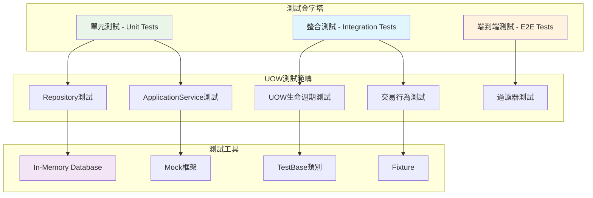

# 20 - 測試策略與Mock

## 🧪 UOW測試策略概述

在ASP.NET Boilerplate應用程式中，UOW的測試是確保資料一致性和業務邏輯正確性的關鍵環節。本章探討如何有效地測試UOW相關功能，包括單元測試、整合測試、以及Mock策略。

### 測試層級架構



## 🧪 實用的UOW測試指南

### 📋 Demo專案實際測試基底類別

以下是Demo專案中`DemoTestBase`的實際實作，展示了完整的UOW測試基礎設施：

```csharp
public abstract class DemoTestBase : AbpIntegratedTestBase<DemoTestModule>
{
    protected DemoTestBase()
    {
        void NormalizeDbContext(DemoDbContext context)
        {
            context.EntityChangeEventHelper = NullEntityChangeEventHelper.Instance;
            context.EventBus = NullEventBus.Instance;
            context.SuppressAutoSetTenantId = true;
        }

        // 為Host種子資料
        AbpSession.TenantId = null;
        UsingDbContext(context =>
        {
            NormalizeDbContext(context);
            new InitialHostDbBuilder(context).Create();
            new DefaultTenantBuilder(context).Create();
        });

        // 為預設租戶種子資料
        AbpSession.TenantId = 1;
        UsingDbContext(context =>
        {
            NormalizeDbContext(context);
            new TenantRoleAndUserBuilder(context, 1).Create();
        });

        LoginAsDefaultTenantAdmin();
    }

    #region UsingDbContext 實用方法

    protected IDisposable UsingTenantId(int? tenantId)
    {
        var previousTenantId = AbpSession.TenantId;
        AbpSession.TenantId = tenantId;
        return new DisposeAction(() => AbpSession.TenantId = previousTenantId);
    }

    protected void UsingDbContext(Action<DemoDbContext> action)
    {
        UsingDbContext(AbpSession.TenantId, action);
    }

    protected Task UsingDbContextAsync(Func<DemoDbContext, Task> action)
    {
        return UsingDbContextAsync(AbpSession.TenantId, action);
    }

    protected T UsingDbContext<T>(Func<DemoDbContext, T> func)
    {
        return UsingDbContext(AbpSession.TenantId, func);
    }

    protected void UsingDbContext(int? tenantId, Action<DemoDbContext> action)
    {
        using (UsingTenantId(tenantId))
        {
            using (var context = LocalIocManager.Resolve<DemoDbContext>())
            {
                action(context);
                context.SaveChanges();
            }
        }
    }

    protected async Task UsingDbContextAsync(int? tenantId, Func<DemoDbContext, Task> action)
    {
        using (UsingTenantId(tenantId))
        {
            using (var context = LocalIocManager.Resolve<DemoDbContext>())
            {
                await action(context);
                await context.SaveChangesAsync();
            }
        }
    }

    protected T UsingDbContext<T>(int? tenantId, Func<DemoDbContext, T> func)
    {
        T result;
        using (UsingTenantId(tenantId))
        {
            using (var context = LocalIocManager.Resolve<DemoDbContext>())
            {
                result = func(context);
                context.SaveChanges();
            }
        }
        return result;
    }

    #endregion

    #region 登入輔助方法

    protected void LoginAsHostAdmin()
    {
        LoginAsHost(AbpUserBase.AdminUserName);
    }

    protected void LoginAsDefaultTenantAdmin()
    {
        LoginAsTenant(AbpTenantBase.DefaultTenantName, AbpUserBase.AdminUserName);
    }

    protected void LoginAsHost(string userName)
    {
        AbpSession.TenantId = null;
        
        var user = UsingDbContext(context =>
            context.Users.FirstOrDefault(u => u.TenantId == AbpSession.TenantId && u.UserName == userName));
            
        if (user == null)
        {
            throw new Exception("There is no user: " + userName + " for host.");
        }

        AbpSession.UserId = user.Id;
    }

    protected void LoginAsTenant(string tenancyName, string userName)
    {
        var tenant = UsingDbContext(context => context.Tenants.FirstOrDefault(t => t.TenancyName == tenancyName));
        if (tenant == null)
        {
            throw new Exception("There is no tenant: " + tenancyName);
        }

        AbpSession.TenantId = tenant.Id;

        var user = UsingDbContext(context =>
            context.Users.FirstOrDefault(u => u.TenantId == AbpSession.TenantId && u.UserName == userName));
            
        if (user == null)
        {
            throw new Exception($"There is no user: {userName} for tenant: {tenancyName}");
        }

        AbpSession.UserId = user.Id;
    }

    #endregion
}
```

## 🧪 實際可運行的測試範例

### 1. UserAppService 整合測試

```csharp
public class UserAppService_Tests : DemoTestBase
{
    private readonly IUserAppService _userAppService;

    public UserAppService_Tests()
    {
        _userAppService = Resolve<IUserAppService>();
    }

    [Fact]
    public async Task CreateUser_Should_Create_User_With_Roles()
    {
        // Arrange
        var input = new CreateUserDto
        {
            EmailAddress = "john@test.com",
            Name = "John",
            Surname = "Doe",
            UserName = "john.doe",
            Password = "123qwe",
            RoleNames = new[] { "Admin" }
        };

        // Act
        var result = await _userAppService.CreateAsync(input);

        // Assert
        result.ShouldNotBeNull();
        result.EmailAddress.ShouldBe("john@test.com");
        result.UserName.ShouldBe("john.doe");

        // 驗證資料庫中的實際資料
        await UsingDbContextAsync(async context =>
        {
            var user = await context.Users
                .Include(u => u.Roles)
                .FirstOrDefaultAsync(u => u.UserName == "john.doe");
                
            user.ShouldNotBeNull();
            user.TenantId.ShouldBe(AbpSession.TenantId);
            user.Roles.Count.ShouldBe(1);
        });
    }

    [Fact]
    public async Task UpdateUser_Should_Update_User_And_Roles()
    {
        // Arrange - 先建立使用者
        var createInput = new CreateUserDto
        {
            EmailAddress = "jane@test.com",
            Name = "Jane",
            Surname = "Smith",
            UserName = "jane.smith",
            Password = "123qwe",
            RoleNames = new[] { "User" }
        };

        var createdUser = await _userAppService.CreateAsync(createInput);

        var updateInput = new UserDto
        {
            Id = createdUser.Id,
            EmailAddress = "jane.updated@test.com",
            Name = "Jane Updated",
            Surname = "Smith Updated",
            UserName = "jane.smith.updated",
            RoleNames = new[] { "Admin", "User" }
        };

        // Act
        var result = await _userAppService.UpdateAsync(updateInput);

        // Assert
        result.ShouldNotBeNull();
        result.EmailAddress.ShouldBe("jane.updated@test.com");
        result.Name.ShouldBe("Jane Updated");

        // 驗證角色更新
        await UsingDbContextAsync(async context =>
        {
            var user = await context.Users
                .Include(u => u.Roles)
                .FirstOrDefaultAsync(u => u.Id == createdUser.Id);
                
            user.ShouldNotBeNull();
            user.Roles.Count.ShouldBe(2);
        });
    }

    [Fact]
    public async Task Activate_Should_Set_User_Active()
    {
        // Arrange
        var userId = await UsingDbContextAsync(async context =>
        {
            var user = new User
            {
                TenantId = AbpSession.TenantId,
                UserName = "test.user",
                Name = "Test",
                Surname = "User",
                EmailAddress = "test@test.com",
                IsActive = false
            };
            
            context.Users.Add(user);
            await context.SaveChangesAsync();
            return user.Id;
        });

        // Act
        await _userAppService.Activate(new EntityDto<long>(userId));

        // Assert
        await UsingDbContextAsync(async context =>
        {
            var user = await context.Users.FindAsync(userId);
            user.ShouldNotBeNull();
            user.IsActive.ShouldBeTrue();
        });
    }
}
```

### 2. Repository 測試範例

```csharp
public class UserRepository_Tests : DemoTestBase
{
    private readonly IRepository<User, long> _userRepository;

    public UserRepository_Tests()
    {
        _userRepository = Resolve<IRepository<User, long>>();
    }

    [Fact]
    public async Task Insert_Should_Auto_Set_TenantId()
    {
        // Arrange
        LoginAsDefaultTenantAdmin(); // TenantId = 1

        var user = new User
        {
            UserName = "test.user",
            Name = "Test",
            Surname = "User",
            EmailAddress = "test@test.com"
        };

        // Act
        var insertedUser = await _userRepository.InsertAsync(user);
        await CurrentUnitOfWork.SaveChangesAsync();

        // Assert
        insertedUser.TenantId.ShouldBe(1);
        
        // 驗證資料庫
        await UsingDbContextAsync(async context =>
        {
            var dbUser = await context.Users.FindAsync(insertedUser.Id);
            dbUser.TenantId.ShouldBe(1);
        });
    }

    [Fact]
    public async Task GetAll_Should_Filter_By_Tenant()
    {
        // Arrange - 建立多租戶測試資料
        await UsingDbContextAsync(1, async context => // Tenant 1
        {
            context.Users.Add(new User
            {
                TenantId = 1,
                UserName = "tenant1.user",
                Name = "Tenant1",
                Surname = "User",
                EmailAddress = "tenant1@test.com"
            });
            await context.SaveChangesAsync();
        });

        await UsingDbContextAsync(null, async context => // Host
        {
            context.Users.Add(new User
            {
                TenantId = null,
                UserName = "host.user",
                Name = "Host",
                Surname = "User",
                EmailAddress = "host@test.com"
            });
            await context.SaveChangesAsync();
        });

        // Act & Assert - Tenant 1 user
        using (UsingTenantId(1))
        {
            var tenant1Users = await _userRepository.GetAllListAsync();
            tenant1Users.ShouldContain(u => u.UserName == "tenant1.user");
            tenant1Users.ShouldNotContain(u => u.UserName == "host.user");
        }

        // Act & Assert - Host user
        using (UsingTenantId(null))
        {
            var hostUsers = await _userRepository.GetAllListAsync();
            hostUsers.ShouldContain(u => u.UserName == "host.user");
            hostUsers.ShouldNotContain(u => u.UserName == "tenant1.user");
        }
    }
}
```

### 3. UOW交易行為測試

```csharp
public class UnitOfWork_Transaction_Tests : DemoTestBase
{
    [Fact]
    public async Task Should_Rollback_On_Exception()
    {
        // Arrange
        var userCountBefore = await UsingDbContextAsync(async context =>
            await context.Users.CountAsync());

        // Act & Assert
        var exception = await Assert.ThrowsAsync<UserFriendlyException>(async () =>
        {
            using (var uow = Resolve<IUnitOfWorkManager>().Begin())
            {
                var user = new User
                {
                    TenantId = AbpSession.TenantId,
                    UserName = "will.be.rollback",
                    Name = "Will",
                    Surname = "Rollback",
                    EmailAddress = "rollback@test.com"
                };

                await Resolve<IRepository<User, long>>().InsertAsync(user);
                
                // 故意拋出異常
                throw new UserFriendlyException("Test exception for rollback");
            }
        });

        // Assert - 確認資料沒有被儲存
        var userCountAfter = await UsingDbContextAsync(async context =>
            await context.Users.CountAsync());
            
        userCountAfter.ShouldBe(userCountBefore);
    }

    [Fact]
    public async Task Should_Commit_On_Success()
    {
        // Arrange
        var userCountBefore = await UsingDbContextAsync(async context =>
            await context.Users.CountAsync());

        // Act
        using (var uow = Resolve<IUnitOfWorkManager>().Begin())
        {
            var user = new User
            {
                TenantId = AbpSession.TenantId,
                UserName = "will.be.committed",
                Name = "Will",
                Surname = "Commit",
                EmailAddress = "commit@test.com"
            };

            await Resolve<IRepository<User, long>>().InsertAsync(user);
            await uow.CompleteAsync();
        }

        // Assert
        var userCountAfter = await UsingDbContextAsync(async context =>
            await context.Users.CountAsync());
            
        userCountAfter.ShouldBe(userCountBefore + 1);
        
        // 驗證具體資料
        await UsingDbContextAsync(async context =>
        {
            var user = await context.Users
                .FirstOrDefaultAsync(u => u.UserName == "will.be.committed");
            user.ShouldNotBeNull();
        });
    }
}
```

## 🏗️ 測試基礎設施
            context.SaveChanges();
        }
        return result;
    }

    protected virtual async Task UsingDbContextAsync(Func<MyAppDbContext, Task> func)
    {
        using (var context = LocalIocManager.Resolve<MyAppDbContext>())
        {
            await func(context);
            await context.SaveChangesAsync();
        }
    }

    protected virtual async Task<T> UsingDbContextAsync<T>(Func<MyAppDbContext, Task<T>> func)
    {
        T result;
        using (var context = LocalIocManager.Resolve<MyAppDbContext>())
        {
            result = await func(context);
            await context.SaveChangesAsync();
        }
        return result;
    }
}

/// <summary>
/// 測試模組配置
/// </summary>
[DependsOn(typeof(MyAppApplicationModule), typeof(AbpTestBaseModule))]
public class MyAppTestModule : AbpModule
{
    public override void PreInitialize()
    {
        Configuration.UnitOfWork.IsTransactional = false;
        Configuration.UnitOfWork.Timeout = TimeSpan.FromMinutes(30);
    }

    public override void Initialize()
    {
        IocManager.RegisterAssemblyByConvention(typeof(MyAppTestModule).GetAssembly());
    }
}
```

### 專用UOW測試基底

```csharp
/// <summary>
/// UOW專用測試基底類別
/// </summary>
public abstract class UnitOfWorkTestBase : MyAppTestBase
{
    protected IUnitOfWorkManager UowManager { get; private set; }
    protected ICurrentUnitOfWorkProvider CurrentUowProvider { get; private set; }

    protected UnitOfWorkTestBase()
    {
        UowManager = Resolve<IUnitOfWorkManager>();
        CurrentUowProvider = Resolve<ICurrentUnitOfWorkProvider>();
    }

    /// <summary>
    /// 在UOW中執行測試動作
    /// </summary>
    protected void WithUnitOfWork(Action action, UnitOfWorkOptions options = null)
    {
        using (var uow = UowManager.Begin(options ?? new UnitOfWorkOptions()))
        {
            action();
            uow.Complete();
        }
    }

    /// <summary>
    /// 非同步在UOW中執行測試動作
    /// </summary>
    protected async Task WithUnitOfWorkAsync(Func<Task> action, UnitOfWorkOptions options = null)
    {
        using (var uow = UowManager.Begin(options ?? new UnitOfWorkOptions()))
        {
            await action();
            await uow.CompleteAsync();
        }
    }

    /// <summary>
    /// 在UOW中執行並回傳結果
    /// </summary>
    protected T WithUnitOfWork<T>(Func<T> func, UnitOfWorkOptions options = null)
    {
        T result;
        using (var uow = UowManager.Begin(options ?? new UnitOfWorkOptions()))
        {
            result = func();
            uow.Complete();
        }
        return result;
    }

    /// <summary>
    /// 非同步在UOW中執行並回傳結果
    /// </summary>
    protected async Task<T> WithUnitOfWorkAsync<T>(Func<Task<T>> func, UnitOfWorkOptions options = null)
    {
        T result;
        using (var uow = UowManager.Begin(options ?? new UnitOfWorkOptions()))
        {
            result = await func();
            await uow.CompleteAsync();
        }
        return result;
    }

    /// <summary>
    /// 驗證UOW狀態
    /// </summary>
    protected void AssertUowExists()
    {
        CurrentUowProvider.Current.ShouldNotBeNull();
    }

    /// <summary>
    /// 驗證UOW不存在
    /// </summary>
    protected void AssertUowNotExists()
    {
        CurrentUowProvider.Current.ShouldBeNull();
    }
}
```

## 🔧 Repository 測試

### Repository單元測試

```csharp
/// <summary>
/// Repository測試範例
/// </summary>
public class UserRepository_Tests : UnitOfWorkTestBase
{
    private readonly IRepository<User, long> _userRepository;

    public UserRepository_Tests()
    {
        _userRepository = Resolve<IRepository<User, long>>();
    }

    [Fact]
    public async Task Should_Insert_User()
    {
        // Arrange
        var user = new User
        {
            Name = "John Doe",
            EmailAddress = "john@example.com",
            IsActive = true
        };

        // Act & Assert
        await WithUnitOfWorkAsync(async () =>
        {
            var insertedUser = await _userRepository.InsertAsync(user);
            
            insertedUser.ShouldNotBeNull();
            insertedUser.Id.ShouldBeGreaterThan(0);
            insertedUser.Name.ShouldBe("John Doe");
        });
    }

    [Fact]
    public async Task Should_Get_User_By_Id()
    {
        // Arrange
        var userId = await WithUnitOfWorkAsync(async () =>
        {
            var user = new User { Name = "Test User", EmailAddress = "test@example.com" };
            var insertedUser = await _userRepository.InsertAsync(user);
            return insertedUser.Id;
        });

        // Act & Assert
        await WithUnitOfWorkAsync(async () =>
        {
            var user = await _userRepository.GetAsync(userId);
            
            user.ShouldNotBeNull();
            user.Name.ShouldBe("Test User");
        });
    }

    [Fact]
    public async Task Should_Update_User()
    {
        // Arrange
        var userId = await WithUnitOfWorkAsync(async () =>
        {
            var user = new User { Name = "Original Name", EmailAddress = "test@example.com" };
            var insertedUser = await _userRepository.InsertAsync(user);
            return insertedUser.Id;
        });

        // Act & Assert
        await WithUnitOfWorkAsync(async () =>
        {
            var user = await _userRepository.GetAsync(userId);
            user.Name = "Updated Name";
            
            await _userRepository.UpdateAsync(user);
            
            var updatedUser = await _userRepository.GetAsync(userId);
            updatedUser.Name.ShouldBe("Updated Name");
        });
    }

    [Fact]
    public async Task Should_Delete_User()
    {
        // Arrange
        var userId = await WithUnitOfWorkAsync(async () =>
        {
            var user = new User { Name = "To Delete", EmailAddress = "delete@example.com" };
            var insertedUser = await _userRepository.InsertAsync(user);
            return insertedUser.Id;
        });

        // Act & Assert
        await WithUnitOfWorkAsync(async () =>
        {
            await _userRepository.DeleteAsync(userId);
            
            var deletedUser = await _userRepository.FirstOrDefaultAsync(userId);
            deletedUser.ShouldBeNull();
        });
    }

    [Fact]
    public async Task Should_Apply_Soft_Delete_Filter()
    {
        // Arrange
        var userId = await WithUnitOfWorkAsync(async () =>
        {
            var user = new User { Name = "Soft Delete Test", EmailAddress = "soft@example.com" };
            var insertedUser = await _userRepository.InsertAsync(user);
            return insertedUser.Id;
        });

        // Soft delete the user
        await WithUnitOfWorkAsync(async () =>
        {
            var user = await _userRepository.GetAsync(userId);
            await _userRepository.DeleteAsync(user);
        });

        // Act & Assert - 預設應該過濾已刪除的使用者
        await WithUnitOfWorkAsync(async () =>
        {
            var users = await _userRepository.GetAllListAsync();
            users.Any(u => u.Id == userId).ShouldBeFalse();
        });

        // 停用軟刪除過濾器應該能找到已刪除的使用者
        await WithUnitOfWorkAsync(async () =>
        {
            using (CurrentUowProvider.Current.DisableFilter(AbpDataFilters.SoftDelete))
            {
                var users = await _userRepository.GetAllListAsync();
                users.Any(u => u.Id == userId).ShouldBeTrue();
            }
        });
    }
}
```

### Repository整合測試

```csharp
/// <summary>
/// Repository整合測試
/// </summary>
public class UserRepository_Integration_Tests : UnitOfWorkTestBase
{
    private readonly IRepository<User, long> _userRepository;
    private readonly IRepository<Role, int> _roleRepository;

    public UserRepository_Integration_Tests()
    {
        _userRepository = Resolve<IRepository<User, long>>();
        _roleRepository = Resolve<IRepository<Role, int>>();
    }

    [Fact]
    public async Task Should_Handle_Complex_Relationship_Operations()
    {
        // Arrange & Act & Assert
        await WithUnitOfWorkAsync(async () =>
        {
            // 建立角色
            var adminRole = new Role { Name = "Admin", DisplayName = "Administrator" };
            var userRole = new Role { Name = "User", DisplayName = "Standard User" };
            
            await _roleRepository.InsertAsync(adminRole);
            await _roleRepository.InsertAsync(userRole);

            // 建立使用者並指派角色
            var user = new User 
            { 
                Name = "John Admin", 
                EmailAddress = "admin@example.com" 
            };
            
            user.Roles.Add(new UserRole { User = user, Role = adminRole });
            user.Roles.Add(new UserRole { User = user, Role = userRole });

            await _userRepository.InsertAsync(user);

            // 驗證關聯
            var savedUser = await _userRepository.GetAllIncluding(u => u.Roles)
                .FirstOrDefaultAsync(u => u.Id == user.Id);
                
            savedUser.ShouldNotBeNull();
            savedUser.Roles.Count.ShouldBe(2);
            savedUser.Roles.Any(ur => ur.Role.Name == "Admin").ShouldBeTrue();
        });
    }

    [Fact]
    public async Task Should_Handle_Concurrent_Operations()
    {
        // Arrange
        var userId = await WithUnitOfWorkAsync(async () =>
        {
            var user = new User { Name = "Concurrent Test", EmailAddress = "concurrent@example.com" };
            var insertedUser = await _userRepository.InsertAsync(user);
            return insertedUser.Id;
        });

        // Act - 模擬並發更新
        var tasks = new List<Task>();
        for (int i = 0; i < 5; i++)
        {
            var taskIndex = i;
            tasks.Add(Task.Run(async () =>
            {
                await WithUnitOfWorkAsync(async () =>
                {
                    var user = await _userRepository.GetAsync(userId);
                    user.Name = $"Updated by Task {taskIndex}";
                    await _userRepository.UpdateAsync(user);
                });
            }));
        }

        // Assert
        await Task.WhenAll(tasks);

        await WithUnitOfWorkAsync(async () =>
        {
            var user = await _userRepository.GetAsync(userId);
            user.Name.ShouldStartWith("Updated by Task");
        });
    }
}
```

## 🎭 Application Service 測試

### Mock策略實作

```csharp
/// <summary>
/// Application Service測試使用Mock
/// </summary>
public class UserAppService_Tests : UnitOfWorkTestBase
{
    private readonly UserAppService _userAppService;
    private readonly Mock<IRepository<User, long>> _mockUserRepository;
    private readonly Mock<IRepository<Role, int>> _mockRoleRepository;

    public UserAppService_Tests()
    {
        _mockUserRepository = new Mock<IRepository<User, long>>();
        _mockRoleRepository = new Mock<IRepository<Role, int>>();

        // 註冊Mock物件
        LocalIocManager.IocContainer.Register(
            Component.For<IRepository<User, long>>().Instance(_mockUserRepository.Object).LifestyleSingleton()
        );
        LocalIocManager.IocContainer.Register(
            Component.For<IRepository<Role, int>>().Instance(_mockRoleRepository.Object).LifestyleSingleton()
        );

        _userAppService = Resolve<UserAppService>();
    }

    [Fact]
    public async Task CreateUser_Should_Create_User_Successfully()
    {
        // Arrange
        var input = new CreateUserDto
        {
            Name = "John Doe",
            EmailAddress = "john@example.com",
            RoleNames = new[] { "Admin", "User" }
        };

        var adminRole = new Role { Id = 1, Name = "Admin", DisplayName = "Administrator" };
        var userRole = new Role { Id = 2, Name = "User", DisplayName = "Standard User" };

        _mockRoleRepository.Setup(r => r.FirstOrDefaultAsync(It.IsAny<Expression<Func<Role, bool>>>()))
            .Returns((Expression<Func<Role, bool>> predicate) =>
            {
                var compiled = predicate.Compile();
                if (compiled(adminRole)) return Task.FromResult(adminRole);
                if (compiled(userRole)) return Task.FromResult(userRole);
                return Task.FromResult<Role>(null);
            });

        _mockUserRepository.Setup(r => r.InsertAsync(It.IsAny<User>()))
            .Returns((User user) =>
            {
                user.Id = 123;
                return Task.FromResult(user);
            });

        // Act
        var result = await WithUnitOfWorkAsync(async () =>
        {
            return await _userAppService.CreateAsync(input);
        });

        // Assert
        result.ShouldNotBeNull();
        result.Name.ShouldBe("John Doe");
        result.EmailAddress.ShouldBe("john@example.com");

        _mockUserRepository.Verify(r => r.InsertAsync(It.Is<User>(u => 
            u.Name == "John Doe" && 
            u.EmailAddress == "john@example.com")), Times.Once);
    }

    [Fact]
    public async Task CreateUser_Should_Throw_Exception_For_Duplicate_Email()
    {
        // Arrange
        var input = new CreateUserDto
        {
            Name = "Jane Doe",
            EmailAddress = "existing@example.com"
        };

        _mockUserRepository.Setup(r => r.FirstOrDefaultAsync(It.IsAny<Expression<Func<User, bool>>>()))
            .ReturnsAsync(new User { Id = 1, EmailAddress = "existing@example.com" });

        // Act & Assert
        await Assert.ThrowsAsync<UserFriendlyException>(async () =>
        {
            await WithUnitOfWorkAsync(async () =>
            {
                await _userAppService.CreateAsync(input);
            });
        });
    }

    [Fact]
    public async Task UpdateUser_Should_Update_User_Properties()
    {
        // Arrange
        var userId = 123L;
        var input = new UpdateUserDto
        {
            Name = "Updated Name",
            EmailAddress = "updated@example.com"
        };

        var existingUser = new User
        {
            Id = userId,
            Name = "Original Name",
            EmailAddress = "original@example.com"
        };

        _mockUserRepository.Setup(r => r.GetAsync(userId))
            .ReturnsAsync(existingUser);

        _mockUserRepository.Setup(r => r.UpdateAsync(It.IsAny<User>()))
            .Returns((User user) => Task.FromResult(user));

        // Act
        await WithUnitOfWorkAsync(async () =>
        {
            await _userAppService.UpdateAsync(userId, input);
        });

        // Assert
        _mockUserRepository.Verify(r => r.UpdateAsync(It.Is<User>(u => 
            u.Id == userId && 
            u.Name == "Updated Name" && 
            u.EmailAddress == "updated@example.com")), Times.Once);
    }
}
```

### Integration Test with Real Database

```csharp
/// <summary>
/// 使用真實資料庫的整合測試
/// </summary>
public class UserAppService_Integration_Tests : UnitOfWorkTestBase
{
    private readonly IUserAppService _userAppService;

    public UserAppService_Integration_Tests()
    {
        _userAppService = Resolve<IUserAppService>();
    }

    [Fact]
    public async Task Complete_User_Lifecycle_Should_Work()
    {
        // Create
        var createInput = new CreateUserDto
        {
            Name = "Integration Test User",
            EmailAddress = "integration@example.com",
            Password = "123456"
        };

        var createdUser = await WithUnitOfWorkAsync(async () =>
        {
            return await _userAppService.CreateAsync(createInput);
        });

        createdUser.ShouldNotBeNull();
        createdUser.Id.ShouldBeGreaterThan(0);

        // Read
        var fetchedUser = await WithUnitOfWorkAsync(async () =>
        {
            return await _userAppService.GetAsync(createdUser.Id);
        });

        fetchedUser.Name.ShouldBe(createInput.Name);
        fetchedUser.EmailAddress.ShouldBe(createInput.EmailAddress);

        // Update
        var updateInput = new UpdateUserDto
        {
            Name = "Updated Integration User",
            EmailAddress = "updated-integration@example.com"
        };

        await WithUnitOfWorkAsync(async () =>
        {
            await _userAppService.UpdateAsync(createdUser.Id, updateInput);
        });

        var updatedUser = await WithUnitOfWorkAsync(async () =>
        {
            return await _userAppService.GetAsync(createdUser.Id);
        });

        updatedUser.Name.ShouldBe(updateInput.Name);
        updatedUser.EmailAddress.ShouldBe(updateInput.EmailAddress);

        // Delete
        await WithUnitOfWorkAsync(async () =>
        {
            await _userAppService.DeleteAsync(createdUser.Id);
        });

        await Assert.ThrowsAsync<EntityNotFoundException>(async () =>
        {
            await WithUnitOfWorkAsync(async () =>
            {
                await _userAppService.GetAsync(createdUser.Id);
            });
        });
    }
}
```

## 🔄 UOW 生命週期測試

### UOW Manager測試

```csharp
/// <summary>
/// UOW Manager 測試
/// </summary>
public class UnitOfWorkManager_Tests : UnitOfWorkTestBase
{
    [Fact]
    public void Should_Begin_And_Complete_UOW()
    {
        // Arrange
        AssertUowNotExists();

        // Act & Assert
        using (var uow = UowManager.Begin())
        {
            AssertUowExists();
            CurrentUowProvider.Current.ShouldBe(uow);
            
            uow.Complete();
        }

        AssertUowNotExists();
    }

    [Fact]
    public async Task Should_Begin_And_Complete_UOW_Async()
    {
        // Arrange
        AssertUowNotExists();

        // Act & Assert
        using (var uow = UowManager.Begin())
        {
            AssertUowExists();
            
            await uow.CompleteAsync();
        }

        AssertUowNotExists();
    }

    [Fact]
    public void Should_Handle_Nested_UOW()
    {
        // Arrange & Act & Assert
        using (var outerUow = UowManager.Begin())
        {
            AssertUowExists();
            var outerUowRef = CurrentUowProvider.Current;

            using (var innerUow = UowManager.Begin())
            {
                AssertUowExists();
                // 巢狀UOW應該回傳同一個實例
                CurrentUowProvider.Current.ShouldBe(outerUowRef);
                
                innerUow.Complete();
            }

            // 外層UOW仍然存在
            AssertUowExists();
            CurrentUowProvider.Current.ShouldBe(outerUowRef);
            
            outerUow.Complete();
        }

        AssertUowNotExists();
    }

    [Fact]
    public void Should_Handle_RequiresNew_UOW()
    {
        // Arrange & Act & Assert
        using (var outerUow = UowManager.Begin())
        {
            var outerUowRef = CurrentUowProvider.Current;

            using (var innerUow = UowManager.Begin(TransactionScopeOption.RequiresNew))
            {
                // RequiresNew應該建立新的UOW
                CurrentUowProvider.Current.ShouldNotBe(outerUowRef);
                
                innerUow.Complete();
            }

            // 回到外層UOW
            CurrentUowProvider.Current.ShouldBe(outerUowRef);
            
            outerUow.Complete();
        }
    }

    [Fact]
    public void Should_Rollback_When_Exception_Occurs()
    {
        // Arrange
        var rollbackOccurred = false;
        
        // Act & Assert
        Assert.Throws<InvalidOperationException>(() =>
        {
            using (var uow = UowManager.Begin())
            {
                // 模擬UOW內部發生異常
                throw new InvalidOperationException("Test exception");
            }
        });

        // UOW應該已經被清理
        AssertUowNotExists();
    }
}
```

### Transaction 行為測試

```csharp
/// <summary>
/// 交易行為測試
/// </summary>
public class Transaction_Behavior_Tests : UnitOfWorkTestBase
{
    private readonly IRepository<User, long> _userRepository;

    public Transaction_Behavior_Tests()
    {
        _userRepository = Resolve<IRepository<User, long>>();
    }

    [Fact]
    public async Task Should_Rollback_Transaction_When_Exception_Occurs()
    {
        // Arrange
        var initialUserCount = await WithUnitOfWorkAsync(async () =>
        {
            return await _userRepository.CountAsync();
        });

        // Act & Assert
        await Assert.ThrowsAsync<InvalidOperationException>(async () =>
        {
            await WithUnitOfWorkAsync(async () =>
            {
                // 新增使用者
                await _userRepository.InsertAsync(new User 
                { 
                    Name = "Test User", 
                    EmailAddress = "test@example.com" 
                });

                // 模擬異常發生
                throw new InvalidOperationException("Simulated error");
            });
        });

        // 驗證交易已回滾
        var finalUserCount = await WithUnitOfWorkAsync(async () =>
        {
            return await _userRepository.CountAsync();
        });

        finalUserCount.ShouldBe(initialUserCount);
    }

    [Fact]
    public async Task Should_Support_Multiple_SaveChanges_In_Single_UOW()
    {
        // Act & Assert
        await WithUnitOfWorkAsync(async () =>
        {
            // 第一次儲存
            var user1 = await _userRepository.InsertAsync(new User 
            { 
                Name = "User 1", 
                EmailAddress = "user1@example.com" 
            });

            // 手動儲存變更
            await CurrentUowProvider.Current.SaveChangesAsync();

            // 第二次儲存
            var user2 = await _userRepository.InsertAsync(new User 
            { 
                Name = "User 2", 
                EmailAddress = "user2@example.com" 
            });

            // UOW完成時會自動儲存
        });

        // 驗證兩個使用者都已儲存
        await WithUnitOfWorkAsync(async () =>
        {
            var users = await _userRepository.GetAllListAsync();
            users.Count(u => u.Name.StartsWith("User")).ShouldBe(2);
        });
    }

    [Fact]
    public async Task Should_Handle_Isolation_Level()
    {
        // Arrange & Act & Assert
        await WithUnitOfWorkAsync(async () =>
        {
            var user = await _userRepository.InsertAsync(new User 
            { 
                Name = "Isolation Test", 
                EmailAddress = "isolation@example.com" 
            });

            // 在不同的隔離級別下驗證行為
            // 這個測試需要根據具體的資料庫實作調整
        }, new UnitOfWorkOptions 
        { 
            IsolationLevel = IsolationLevel.ReadCommitted 
        });
    }
}
```

## 🎯 Filter 測試

### Data Filter 測試

```csharp
/// <summary>
/// 資料過濾器測試
/// </summary>
public class DataFilter_Tests : UnitOfWorkTestBase
{
    private readonly IRepository<User, long> _userRepository;

    public DataFilter_Tests()
    {
        _userRepository = Resolve<IRepository<User, long>>();
    }

    [Fact]
    public async Task SoftDelete_Filter_Should_Work()
    {
        // Arrange - 建立並軟刪除一個使用者
        var userId = await WithUnitOfWorkAsync(async () =>
        {
            var user = new User 
            { 
                Name = "Soft Delete Test", 
                EmailAddress = "softdelete@example.com" 
            };
            var insertedUser = await _userRepository.InsertAsync(user);
            
            // 軟刪除
            await _userRepository.DeleteAsync(insertedUser);
            
            return insertedUser.Id;
        });

        // Act & Assert - 預設查詢不應該包含已刪除的記錄
        await WithUnitOfWorkAsync(async () =>
        {
            var users = await _userRepository.GetAllListAsync();
            users.Any(u => u.Id == userId).ShouldBeFalse();
        });

        // 停用軟刪除過濾器應該能找到已刪除的記錄
        await WithUnitOfWorkAsync(async () =>
        {
            using (CurrentUowProvider.Current.DisableFilter(AbpDataFilters.SoftDelete))
            {
                var users = await _userRepository.GetAllListAsync();
                users.Any(u => u.Id == userId).ShouldBeTrue();
                users.First(u => u.Id == userId).IsDeleted.ShouldBeTrue();
            }
        });
    }

    [Fact]
    public async Task MustHaveTenant_Filter_Should_Work()
    {
        // 這個測試需要多租戶環境
        // 設定當前租戶
        using (AbpSession.Use(1, null)) // 租戶ID = 1
        {
            // Arrange - 建立屬於不同租戶的使用者
            await WithUnitOfWorkAsync(async () =>
            {
                var tenant1User = new User 
                { 
                    Name = "Tenant 1 User", 
                    EmailAddress = "tenant1@example.com",
                    TenantId = 1
                };
                await _userRepository.InsertAsync(tenant1User);
            });
        }

        using (AbpSession.Use(2, null)) // 租戶ID = 2
        {
            await WithUnitOfWorkAsync(async () =>
            {
                var tenant2User = new User 
                { 
                    Name = "Tenant 2 User", 
                    EmailAddress = "tenant2@example.com",
                    TenantId = 2
                };
                await _userRepository.InsertAsync(tenant2User);
            });
        }

        // Act & Assert - 切換到租戶1，應該只能看到租戶1的資料
        using (AbpSession.Use(1, null))
        {
            await WithUnitOfWorkAsync(async () =>
            {
                var users = await _userRepository.GetAllListAsync();
                users.All(u => u.TenantId == 1).ShouldBeTrue();
                users.Any(u => u.Name == "Tenant 1 User").ShouldBeTrue();
                users.Any(u => u.Name == "Tenant 2 User").ShouldBeFalse();
            });
        }

        // 切換到租戶2
        using (AbpSession.Use(2, null))
        {
            await WithUnitOfWorkAsync(async () =>
            {
                var users = await _userRepository.GetAllListAsync();
                users.All(u => u.TenantId == 2).ShouldBeTrue();
                users.Any(u => u.Name == "Tenant 2 User").ShouldBeTrue();
                users.Any(u => u.Name == "Tenant 1 User").ShouldBeFalse();
            });
        }
    }

    [Fact]
    public async Task Custom_Filter_Should_Work()
    {
        // 假設有自訂的過濾器
        await WithUnitOfWorkAsync(async () =>
        {
            // 建立測試資料
            await _userRepository.InsertAsync(new User 
            { 
                Name = "Active User", 
                EmailAddress = "active@example.com",
                IsActive = true 
            });

            await _userRepository.InsertAsync(new User 
            { 
                Name = "Inactive User", 
                EmailAddress = "inactive@example.com",
                IsActive = false 
            });
        });

        // 啟用自訂過濾器
        await WithUnitOfWorkAsync(async () =>
        {
            CurrentUowProvider.Current.EnableFilter("ActiveUsers");
            
            var users = await _userRepository.GetAllListAsync();
            users.All(u => u.IsActive).ShouldBeTrue();
            users.Any(u => u.Name == "Active User").ShouldBeTrue();
            users.Any(u => u.Name == "Inactive User").ShouldBeFalse();
        });

        // 停用自訂過濾器
        await WithUnitOfWorkAsync(async () =>
        {
            CurrentUowProvider.Current.DisableFilter("ActiveUsers");
            
            var users = await _userRepository.GetAllListAsync();
            users.Any(u => u.Name == "Active User").ShouldBeTrue();
            users.Any(u => u.Name == "Inactive User").ShouldBeTrue();
        });
    }
}
```

## 🎭 Mock 策略與工具

### Repository Mock

```csharp
/// <summary>
/// Repository Mock 協助工具
/// </summary>
public static class RepositoryMockHelper
{
    public static Mock<IRepository<TEntity, TPrimaryKey>> CreateMockRepository<TEntity, TPrimaryKey>()
        where TEntity : class, IEntity<TPrimaryKey>
    {
        var mockRepository = new Mock<IRepository<TEntity, TPrimaryKey>>();
        var entities = new List<TEntity>();
        var idCounter = 1;

        // Mock Insert
        mockRepository.Setup(r => r.InsertAsync(It.IsAny<TEntity>()))
            .Returns((TEntity entity) =>
            {
                if (entity is IEntity<int> intEntity && intEntity.Id == 0)
                {
                    intEntity.Id = idCounter++;
                }
                else if (entity is IEntity<long> longEntity && longEntity.Id == 0)
                {
                    longEntity.Id = idCounter++;
                }

                entities.Add(entity);
                return Task.FromResult(entity);
            });

        // Mock GetAsync
        mockRepository.Setup(r => r.GetAsync(It.IsAny<TPrimaryKey>()))
            .Returns((TPrimaryKey id) =>
            {
                var entity = entities.FirstOrDefault(e => e.Id.Equals(id));
                if (entity == null)
                {
                    throw new EntityNotFoundException(typeof(TEntity), id);
                }
                return Task.FromResult(entity);
            });

        // Mock GetAllListAsync
        mockRepository.Setup(r => r.GetAllListAsync())
            .ReturnsAsync(() => entities.ToList());

        // Mock UpdateAsync
        mockRepository.Setup(r => r.UpdateAsync(It.IsAny<TEntity>()))
            .Returns((TEntity entity) =>
            {
                var existingEntity = entities.FirstOrDefault(e => e.Id.Equals(entity.Id));
                if (existingEntity != null)
                {
                    var index = entities.IndexOf(existingEntity);
                    entities[index] = entity;
                }
                return Task.FromResult(entity);
            });

        // Mock DeleteAsync
        mockRepository.Setup(r => r.DeleteAsync(It.IsAny<TPrimaryKey>()))
            .Returns((TPrimaryKey id) =>
            {
                var entity = entities.FirstOrDefault(e => e.Id.Equals(id));
                if (entity != null)
                {
                    entities.Remove(entity);
                }
                return Task.CompletedTask;
            });

        return mockRepository;
    }
}

/// <summary>
/// UOW Mock 協助工具
/// </summary>
public static class UnitOfWorkMockHelper
{
    public static Mock<IUnitOfWorkManager> CreateMockUnitOfWorkManager()
    {
        var mockManager = new Mock<IUnitOfWorkManager>();
        var mockUow = new Mock<IUnitOfWorkCompleteHandle>();

        mockUow.Setup(u => u.Complete()).Verifiable();
        mockUow.Setup(u => u.CompleteAsync()).Returns(Task.CompletedTask).Verifiable();

        mockManager.Setup(m => m.Begin(It.IsAny<UnitOfWorkOptions>()))
            .Returns(mockUow.Object);

        return mockManager;
    }

    public static Mock<ICurrentUnitOfWorkProvider> CreateMockCurrentUnitOfWorkProvider()
    {
        var mockProvider = new Mock<ICurrentUnitOfWorkProvider>();
        var mockUow = new Mock<IActiveUnitOfWork>();

        mockProvider.Setup(p => p.Current).Returns(mockUow.Object);

        return mockProvider;
    }
}
```

### 測試資料建構器

```csharp
/// <summary>
/// 測試資料建構器
/// </summary>
public class TestDataBuilder
{
    private readonly IServiceProvider _serviceProvider;

    public TestDataBuilder(IServiceProvider serviceProvider)
    {
        _serviceProvider = serviceProvider;
    }

    public async Task<User> CreateUserAsync(string name = "Test User", string email = null)
    {
        var userRepository = _serviceProvider.GetRequiredService<IRepository<User, long>>();
        
        var user = new User
        {
            Name = name,
            EmailAddress = email ?? $"{name.Replace(" ", "").ToLower()}@example.com",
            IsActive = true
        };

        return await userRepository.InsertAsync(user);
    }

    public async Task<Role> CreateRoleAsync(string name = "TestRole", string displayName = null)
    {
        var roleRepository = _serviceProvider.GetRequiredService<IRepository<Role, int>>();
        
        var role = new Role
        {
            Name = name,
            DisplayName = displayName ?? name
        };

        return await roleRepository.InsertAsync(role);
    }

    public async Task<User> CreateUserWithRolesAsync(string userName, params string[] roleNames)
    {
        var user = await CreateUserAsync(userName);
        
        foreach (var roleName in roleNames)
        {
            var role = await CreateRoleAsync(roleName);
            user.Roles.Add(new UserRole { User = user, Role = role });
        }

        var userRepository = _serviceProvider.GetRequiredService<IRepository<User, long>>();
        return await userRepository.UpdateAsync(user);
    }
}
```

## 🎯 測試最佳實務

### 1. 測試組織結構

```
Tests/
├── Unit/                   # 單元測試
│   ├── Services/
│   ├── Repositories/
│   └── Domain/
├── Integration/            # 整合測試
│   ├── AppServices/
│   ├── Database/
│   └── UnitOfWork/
├── Helpers/               # 測試協助工具
│   ├── Mocks/
│   ├── Builders/
│   └── Extensions/
└── Fixtures/              # 測試設備
    ├── DatabaseFixture.cs
    └── CommonTestData.cs
```

### 2. 測試命名慣例

```csharp
// ✅ 好的測試命名
[Fact]
public async Task CreateUser_Should_Create_User_Successfully_When_Valid_Input_Provided()

[Fact]
public async Task CreateUser_Should_Throw_ValidationException_When_Email_Already_Exists()

[Fact]
public async Task GetUsers_Should_Apply_SoftDelete_Filter_By_Default()

// ❌ 不好的測試命名
[Fact]
public async Task Test1()

[Fact]
public async Task UserTest()
```

### 3. 測試資料管理

```csharp
/// <summary>
/// 測試資料清理基底類別
/// </summary>
public abstract class DatabaseTestBase : UnitOfWorkTestBase, IDisposable
{
    protected List<IEntity> TestEntities { get; } = new List<IEntity>();

    protected async Task<T> CreateAndTrackEntityAsync<T>(T entity) where T : class, IEntity
    {
        TestEntities.Add(entity);
        return entity;
    }

    public virtual void Dispose()
    {
        // 清理測試資料
        WithUnitOfWork(() =>
        {
            foreach (var entity in TestEntities)
            {
                // 根據實體類型執行清理邏輯
            }
        });
    }
}
```

UOW測試策略的完善實作確保了應用程式的資料一致性和業務邏輯的正確性，為高品質的軟體開發提供了堅實的保障。
